<!--
author:   Don Calbreath, Ph.D.

email:    LiaScript@web.de

version:  0.0.1

language: en

narrator: US English Female

comment:  The CK-12 Chemistry Workbook complements the CK-12 Chemistry - Intermediate FlexBook® textbook. Lesson worksheets include the following types of questions: multiple choice, T/F, vocabulary, critical reading, and critical writing.

logo:     ../cover.jpg

tags:      chemistry, flexbook, science

-->

# CK-12 Chemistry - Intermediate Workbook

> This document was automatically translated to LiaScript from
>
> https://www.ck12.org/workbook/ck-12-chemistry-intermediate-workbook/

## 1.0 Introduction to Chemistry Worksheets

<article>

</article>

### 1.1 What is Chemistry?

<article>

Worksheet
---------

**Name \_\_\_\_\_\_\_\_\_\_\_\_\_\_\_\_\_\_\_\_\_ Class \_\_\_\_\_\_\_\_\_\_\_\_\_\_\_\_\_\_\_\_\_\_ Date \_\_\_\_\_\_\_\_\_\_\_\_\_\_\_\_**

_Answer each of the questions below to show your achievement of the lesson objectives._

**Lesson Objective: Define chemistry.**

1.  Chemistry is the study of
    1.  living systems
    2.  the stars and planets
    3.  all matter
    4.  reactions in a test tube

2.  All of the following are characteristics of matter except
    1.  matter can disappear and reappear
    2.  matter has mass
    3.  matter occupies space
    4.  all things are composed of matter

3.  Which of the following is not a chemistry topic?
    1.  the composition of ocean water
    2.  what ocean fish eat
    3.  the height of waves in surf
    4.  what a surf board is made of

4.  Which of the following was not a goal of the alchemists?
    1.  elixir of life
    2.  changing lead into rubies
    3.  philosophers stone
    4.  making gold from base metals

**Lesson Objective: Differentiate between the macroscopic and the microscopic as it relates to chemistry.**

5.  The tern used for materials we can see is
    1.  macrolitic
    2.  macrosteric
    3.  macrochemical
    4.  macroscopic

6.  True/False: “Microscopic” refers only to those materials we can see under a microscope.

7.  A brick is a form of \_\_\_\_\_\_\_\_\_\_\_\_\_\_\_\_ matter.
8.  True/False: Individual acetylsalicylic acid (aspirin) molecules are microscopic.
9.  True/False: Studying how the molecules change in the reaction between oxygen and methane is an example of a macroscopic process.

**Lesson Objective: Know the relationship between pure chemistry and applied chemistry.**

10. True/False: Pure chemistry is focused on understanding basic chemical processes.
11. True/False: Applied chemistry does not have a specific goal or application.
12. Research that develops a new type of fireproof fabric is (pure, applied) chemistry.
13. Studying the chemical processes involved in the formation of elements in the sun is an example of (pure, applied) chemistry.
14. The following is an example of pure chemistry
    1.  developing a new fertilizer
    2.  studying how pesticides kill harmful insects
    3.  measuring the effect of temperature on how fast a reaction occurs
    4.  finding new ways to lower cholesterol levels in the blood

15. Read the following passage and answer the questions:
16. The line between pure chemistry and applied chemistry is not always distinct. For example, in the early 1960s, chemists at DuPont were searching for a new lightweight and strong fiber that could be used in tires. Chemist Stephanie Kwolek discovered, somewhat by accident, that a certain solution she had made displayed unique characteristics that were unlike those of other previously developed substances. The rapid expansion in the field of polymer chemistry that has occurred over the past 50 years was partially due to the results of her research. Polymers are very, very large molecules comprised of smaller subunits that are repeated over and over again in extremely long chains. The polymer that was discovered at DuPont was eventually given the name Kevlar. It is used not only in tires but also in bulletproof body armor because of its high strength and light weight. Polymer chemistry continues to be an active and vibrant field of chemistry, as both a pure and an applied discipline.
    1.  Was the initial research that Stephanie Kwolek carried out an example of pure or applied chemistry?
    2.  When did the project become an example of applied chemistry?

**Lesson Objective: Identify and describe the five primary disciplines of chemistry.**

16. An analytical chemist is involved with
    1.  studies of what penguins eat
    2.  research to develop new rocket fuels
    3.  the synthesis of new carbon compounds
    4.  measurement of the amount of minerals in cereals

17. Making new compounds for high-speed tires is best done by the
    1.  physical chemist
    2.  organic chemist
    3.  inorganic chemist
    4.  biochemist

18. True/False: A biochemist studies chemical processes in cells.
19. True/False: A physical chemist would be the best person to determine the amount of gold in an ore sample.
20. Reactions involving carbon compounds are studied by an \_\_\_\_\_\_\_\_\_\_\_ chemist.
21. The \_\_\_\_\_\_\_\_\_\_\_ chemist would study how fast nitrogen and hydrogen form ammonia.
22. How the body uses food is best studied by a \_\_\_\_\_\_\_\_\_\_\_.
23. Chemical processes in rocks might best be studied by an \_\_\_\_\_\_\_\_\_\_\_ chemist.

**Lesson Objective: Describe some of the concerns of the modern world in which chemistry has played and will continue to play a role.**

24. One advantage of using nuclear energy instead of fossil fuels is
    1.  nuclear energy is safe
    2.  nuclear wastes are easy to store
    3.  it is easy to work with nuclear materials
    4.  more energy can be obtained from a given amount of nuclear material

25. Why was lead removed from gasoline?
    1.  it made cars run too fast
    2.  lead caused brain damage
    3.  lead became too expensive to put in gasoline
    4.  mercury is a better additive than lead

26. \_\_\_\_\_\_\_\_\_\_\_ is a field that involves the manipulation of DNA.
27. Diseased arteries can be replaced by \_\_\_\_\_\_\_\_\_\_\_ \_\_\_\_\_\_\_\_\_\_\_\_ to help patients.
28. True/False: Drugs work because of their effects on chemical processes in the body.
29. True/False: Superconductors are only 55% efficient.
30. Liquid crystals are found in displays in \_\_\_\_\_\_\_\_\_\_ and \_\_\_\_\_\_\_\_\_\_\_.
31. True/False: Excessive use of fertilizers can harm the water supply.
32. Why is it important for chemists to carry out research looking at materials that harm the environment?

</article>

### 1.2 The Scientific Method

<article>

Worksheet
---------

**Name \_\_\_\_\_\_\_\_\_\_\_\_\_\_\_\_\_\_\_\_\_ Class \_\_\_\_\_\_\_\_\_\_\_\_\_\_\_\_\_\_\_\_\_\_ Date \_\_\_\_\_\_\_\_\_\_\_\_\_\_\_\_**

_Answer each of the questions below to show your achievement of the lesson objectives._

**Lesson Objective: Describe how the Renaissance period in history changed the approach to science.**

1.  The Renaissance
    1.  occurred between the twelfth and thirteenth centuries
    2.  took place during the Middle Ages
    3.  was characterized by a dogmatic approach to learning
    4.  brought about new ways of thinking

2.  One new approach brought by the Renaissance was
    1.  new methods in painting
    2.  experimentation in science
    3.  the sun was believed to orbit around the earth
    4.  the use of leeches to treat disease

3.  True/False: Leonardo da Vinci developed the idea of astronomy.
4.  True/False: Copernicus studied movement of the earth.

**Lesson Objective: Identify the steps of the scientific method.**

5.  The scientific method
    1.  is a recipe for doing science
    2.  will always give the right answer
    3.  is a systematic approach to the study of phenomena
    4.  involves preconceived ideas

6.  The first step in the scientific method is
    1.  to ask a question
    2.  to set up lab equipment
    3.  to perform an experiment
    4.  to calculate your data

7.  A scientific experiment must be
    1.  inexpensive
    2.  repeatable
    3.  complicated
    4.  hard to explain

8.  True/False: A hypothesis is a “first-guess” explanation.
9.  True/False: A reproducible experiment means something is wrong with your hypothesis.
10. True/False: A law is always true.
11. A hypothesis is a \_\_\_\_\_\_\_\_that proposes an answer to a question.
12. To show that a hypothesis is valid, we must be able to \_\_\_\_\_\_\_\_ it.
13. We want to test the effect of adding salt to ice to study melting. The \_\_\_\_\_\_\_\_\_\_ group would have no salt added to the ice.
14. A hypothesis that cannot be proven by experiments must be either \_\_\_\_\_\_\_\_\_\_ or \_\_\_\_\_\_.
15. Read the following passage and answer the questions at the end:
16. If many experiments are performed and each and every one supports the hypothesis, it may be that the hypothesis can be accepted. A theory is an explanation that has been repeatedly tested and confirmed by multiple researchers and has gained wide acceptance. The term theory is one that is often misunderstood by people in the general population who are unfamiliar with the scientific method. Though a scientist may state that a theory cannot be proven correct, he or she is certainly not saying that it is in doubt. A scientific theory has generally been confirmed over and over and over again, although small details within a theory may be adjusted from time to time as new discoveries are made. In a later chapter, you will learn about atomic theory and how it has changed over the last few centuries. While the existence of atoms has not been in question for some time, new details about how the atom functions have resulted in many updates and alterations of the essential theory.
    1.  Why do many people misunderstand the definition of a theory?
    2.  Does a theory ever change?
    3.  Does a law ever change?

**Lesson Objective: Differentiate between the independent variable and the dependent variable in an experiment.**

16. The dependent variable in an experiment
    1.  never changes
    2.  will vary according to the temperature
    3.  shows changes during the experiment.
    4.  is always the larger value.

17. The independent variable in an experiment
    1.  is changed to see its effect on the experiment
    2.  never changes
    3.  changes as the dependent variable is altered
    4.  is not affected by the experiment

18. A control group
    1.  changes with the independent variable
    2.  changes with the dependent variable
    3.  is not exposed to the independent variable
    4.  is not exposed to the dependent variable

19. True/False: To study the effect of sunlight on different plants, I expose the plants to the same amount of sunlight. The independent variable is the sunlight.
20. True/False: A good control group for the plant/sunlight study described in the previous questions would be the same plants kept in the dark.
21. True/False: The independent variable is the one that is changed during the experiment.
22. I want to study the effect of different chemicals on how fast ice melts. I sprinkle five different chemicals in ice and measure the speed of melting. Which is the independent variable in the experiment?
23. Many drugs are used to lower blood cholesterol in order to prevent heart attacks. I want to study the effect of drug A on blood cholesterol concentrations. Patients who are not treated with either drug make up the \_\_\_\_\_\_\_\_ group. To study the effect of drug B on cholesterol levels, I give five groups of patients five different does of drug B and measure their blood cholesterol concentrations. Drug B is the \_\_\_\_\_\_\_\_\_\_\_\_\_\_\_ variable and the cholesterol concentration I measure is the \_\_\_\_\_\_\_\_\_ variable.

**Lesson Objective: Describe how scientists work in research groups and communicate their results.**

24. Scientists usually work
    1.  in teams
    2.  alone
    3.  in labs
    4.  by committee

25. One of the following is usually not paid for by a research grant
    1.  lab equipment
    2.  vacations
    3.  salaries
    4.  lab supplies

26. True/False: Research groups often have regular meetings to share results and ideas.
27. True/False: It is a good idea to keep your research a secret so that nobody else can steal your ideas.
28. Research progress usually occurs in \_\_\_\_\_\_\_ steps.
29. Many scientists work for a \_\_\_\_\_\_\_\_\_\_ .
30. The National Science \_\_\_\_\_\_\_\_\_\_ funds many grants.
31. Science journal articles are usually \_\_\_\_\_\_\_\_\_\_ and \_\_\_\_\_\_\_\_\_\_\_.
32. Why are journal articles important in the spread of scientific knowledge?

</article>

## 2.0 Matter and Change Worksheets

<article>

</article>

### 2.1 Properties of Matter

<article>

Worksheet
---------

**Name \_\_\_\_\_\_\_\_\_\_\_\_\_\_\_\_\_\_\_\_\_ Class \_\_\_\_\_\_\_\_\_\_\_\_\_\_\_\_\_\_\_\_\_\_ Date \_\_\_\_\_\_\_\_\_\_\_\_\_\_\_\_**

_Answer each of the questions below to show your achievement of the lesson objectives_

**Lesson Objective: Describe a substance according to its physical properties.**

1.  One of the following is not a physical property of a substance.
    1.  conductivity
    2.  reactivity with acids
    3.  degree of magnetism
    4.  melting point
2.  Which of the following is a pure substance?
    1.  ocean water
    2.  vanilla ice cream
    3.  a diamond
    4.  quartz crystals
3.  True or False: The identity of a pure substance will change when it is melted or frozen.
4.  True or False: A physical change does not alter the identity of the substance.
5.  The ability of copper to be made into sheets is called \_\_\_\_\_\_\_\_ .
6.  Not all metals are \_\_\_\_\_\_\_\_ .
7.  Sodium metal melts at 97°Celsius. The melting point is a \_\_\_\_\_\_\_\_\_\_\_ property.

**Lesson Objective: Distinguish between extensive and intensive properties.**

8.  An example of an intensive property would be
    1.  mass of the material
    2.  volume of the material
    3.  color of the material
    4.  length of the material
9.  How copper conducts electricity is an
    1.  intensive property
    2.  intangible property
    3.  extensive property
    4.  expansive property
10. True or False: The length of a copper cable is an extensive property.
11. True or False: Intensive properties depend on the color of the material.

**Lesson Objective: Describe the three states of matter.**

12. The state of matter that has a definite shape and volume is
    1.  a crystal of sodium chloride
    2.  neon gas in a tube
    3.  a quart of milk
    4.  carbon dioxide in air
13. Only one of the following items can be compressed.
    1.  sand
    2.  ice
    3.  steam
    4.  water
14. Which of the following is true about gases?
    1.  gas molecules are arranged in an orderly fashion
    2.  gas molecules are in constant motion
    3.  hydrogen and nitrogen are liquids at room temperature
    4.  a vapor is a solid at room temperature
15. Which of the following is not true of liquids?
    1.  liquids have a definite volume
    2.  liquids can form vapors at higher temperatures
    3.  the molecules of a liquid are not rigidly ordered
    4.  liquids are very compressible.
16. True or False: Solids are very compressible.
17. True or False: The particles in a solid are arranged in an orderly fashion.
18. True or False: There are large spaces between the molecules of a gas.

_Match the following answers to the definitions in Questions 19-22:_

1.  solid
2.  gas
3.  vapor
4.  liquid

19. \_\_\_\_\_\_\_ easily compressible
20. \_\_\_\_\_ gaseous state of a substance that is a solid or liquid at room temperature.
21. \_\_\_\_\_ a form of matter with a definite volume, but an indefinite shape.
22. \_\_\_\_\_ the form of matter illustrated by a gold nugget.

**Lesson Objective: Identify physical changes to matter.**

23. Read the following passage and answer the questions.
24. As an ice cube melts and it acquires the ability to flow, its shape changes. However, its composition does not change. Melting is an example of a physical change. A physical change is a change to a sample of matter in which some properties of the material change, but the identity of the matter does not. Physical changes can further be classified as reversible or irreversible. The melted ice cube may be refrozen, so melting is a reversible physical change. Physical changes that involve a change of state are all reversible. Other changes of state include vaporization (liquid to gas), freezing (liquid to solid), and condensation (gas to liquid). Dissolving is also a reversible physical change. When salt is dissolved in water, the salt is said to have entered the aqueous state. Boiling off the water will cause the salt to reform in its solid state. An example of an irreversible physical change would be grinding a piece of wood into sawdust. Such a change is irreversible because the sawdust cannot be reconstituted into the same piece of wood that it was before. Cutting the grass or pulverizing a rock would be other irreversible physical changes.
    1.  Would boiling water be reversible if the water vapor goes off into the atmosphere?
    2.  Is burning gasoline in a car engine a physical change?
25. One of the following is not a physical change
    1.  burning wood
    2.  chopping wood up
    3.  making furniture from wood
    4.  stacking wood
26. All of the following except one are reversible physical changes
    1.  boiling water
    2.  making ice cubes
    3.  bagging corn kernels
    4.  making popcorn
27. True or False: A physical change involves a change in the identity of the sample.
28. True or False: Making earrings from a gold nugget is an irreversible physical change.
29. True or False: Bending aluminum sheets is an irreversible physical change.
30. You cook an egg on the stove and heat your coffee in the microwave. Which process is a physical change? Explain your answer.

</article>

### 2.2 Classification Of Matter

<article>

Worksheet
---------

{{Teachers |body=

**Name \_\_\_\_\_\_\_\_\_\_\_\_\_\_\_\_\_\_\_\_\_ Class \_\_\_\_\_\_\_\_\_\_\_\_\_\_\_\_\_\_\_\_\_\_ Date \_\_\_\_\_\_\_\_\_\_\_\_\_\_\_\_**

_Answer each of the questions below to show your achievement of the lesson objectives._

**Lesson Objective: Define a mixture and understand why mixtures are different than pure substances.**

1.  Which of the following is a pure substance
    1.  oxygen
    2.  air
    3.  salt water
    4.  maple syrup
2.  One of the following is not a property of a mixture
    1.  always has the same composition
    2.  is a physical blend of two or more substances
    3.  each component retains its own identity
    4.  can be separated into components
3.  True or False: Sodium chloride is a mixture of two elements.
4.  True or False: A mixture can have more than two components.
5.  Classify each of the following as either a mixture or a pure substance:
    1.  orange juice \_\_\_\_\_\_\_\_\_\_\_
    2.  paper \_\_\_\_\_\_\_\_\_\_\_\_
    3.  nitrogen \_\_\_\_\_\_\_\_\_\_\_\_\_\_\_
    4.  blood \_\_\_\_\_\_\_\_\_\_\_\_\_\_\_\_\_\_

**Lesson Objective: Classify mixtures as homogeneous or heterogeneous.**

6.  Which of the following is a homogeneous mixture?
    1.  crunchy peanut butter
    2.  pepperoni and mushroom pizza
    3.  a glass of root beer
    4.  macaroni and cheese
7.  A phase has all of the following characteristics except one
    1.  uniform composition
    2.  properties are the same throughout
    3.  is always a pure substance
    4.  can be a gas or a liquid
8.  Only one of the following is a characteristic of a heterogeneous mixture
    1.  composition is uniform throughout the mixture
    2.  contains two or more phases
    3.  is a pure substance
    4.  the mixture composition is always the same
9.  True or False: Oil and water always mix evenly.
10. True or False: A heterogeneous mixture consists of two or more phases
11. Identify each of the following as either a homogeneous or a heterogeneous mixture.
    1.  motor oil \_\_\_\_\_\_\_\_\_\_\_\_\_\_\_
    2.  sand \_\_\_\_\_\_\_\_\_\_\_\_\_\_\_\_\_\_
    3.  sawdust \_\_\_\_\_\_\_\_\_\_\_\_\_\_\_\_\_
    4.  milk \_\_\_\_\_\_\_\_\_\_\_\_\_\_\_\_\_\_

**Lesson Objective: Describe several ways to separate mixtures.**

12. Distillation could not be used to separate one of the following:
    1.  rubbing alcohol and water
    2.  motor oil and brake fluid
    3.  sand and gold
    4.  gasoline fractions
13. The best way to separate lead pellets from ginger ale is
    1.  hand-pick all the pellets
    2.  distillation
    3.  filtration
    4.  melt the lead
14. True or False: Distillation separates materials based on melting point.
15. True or False: Hot water is used to cool a distillation column.
16. Read the passage below and answer the following questions
17. Sand does not dissolve in water. In order to separate sand from water, the mixture can be poured through a filter. The tiny holes of a filter, called pores, allow the water to pass through while trapping the sand grains behind. Filtration is a technique that separates solids from liquids in a heterogeneous mixture. Distillation is a method of separating a mixture based on differences in boiling points. A small-scale laboratory distillation apparatus is used to separate substances based on differences in their boiling points. For example, the impure liquid could be a mixture of alcohol and water. As the mixture is heated, the alcohol begins to boil before the water does because of its lower boiling point. The alcohol vapors rise up in the flask and into the long cylindrical tube, which is called a condenser. Cold water is continually pumped into the outside of the condenser, which causes the alcohol vapors to condense back into the liquid state. The purified alcohol then drips into the flask labeled “distilled liquid,” while the water is left behind in the original flask. Distillation is commonly used to purify water by separating it from the various dissolved minerals that are found in natural water sources.
    1.  Distillation is based on what physical property? \_\_\_\_\_\_\_\_\_\_\_\_\_
    2.  In a mixture of acetone (boiling point 132°C) and ethanol (78°C), which component will distill off first? \_\_\_\_\_\_\_\_\_\_\_\_\_\_\_
    3.  What will happen to the components if the mixture is placed in an oven at 200°C?

**Lesson Objective: Distinguish between elements and compounds.**

17. Only one of the following is not a characteristic of a compound
    1.  composed of two or more elements
    2.  cannot be broken down into simpler substances
    3.  an undergo chemical changes
    4.  elements are combined in fixed proportions
18. The symbol Cu designates the element
    1.  copper
    2.  lead
    3.  mercury
    4.  cobalt
19. Antimony has the following chemical symbol:
    1.  Au
    2.  Ag
    3.  Sb
    4.  Sn
20. The Latin name for tin is
    1.  natrium
    2.  kalium
    3.  stibium
    4.  stannum
21. True or False: The chemical symbol for potassium is K.
22. True or False: The symbol Fe is used to represent the element lead.
23. True or False: A chemical symbol for an element can have one or two letters.
24. True or False: A specific chemical symbol can be used to designate more than one element.
25. Would you rather have jewelry made of argentum or natrium? \_\_\_\_\_\_\_\_\_\_\_\_
26. The two elements found in a mixture of aurum and plumbum are \_\_\_\_\_\_\_\_\_\_\_\_\_\_\_\_ and \_\_\_\_\_\_\_\_\_\_\_\_\_\_\_.
27. You have a mixture of potassium chloride, water, and olive oil. How would you separate these materials from one another?

</article>

### 2.3 Changes in Matter

<article>

Worksheet
---------

**Name \_\_\_\_\_\_\_\_\_\_\_\_\_\_\_\_\_\_\_\_\_ Class \_\_\_\_\_\_\_\_\_\_\_\_\_\_\_\_\_\_\_\_\_\_ Date \_\_\_\_\_\_\_\_\_\_\_\_\_\_\_\_**

_Answer each of the questions below to show your achievement of the lesson objectives._

**Lesson Objective: Identify the chemical properties of a substance.**

1.  Chemical properties can only be observed
    1.  in the dark
    2.  as the substance is being changed
    3.  before materials are mixed together
    4.  when materials are frozen
2.  A chemical property describes
    1.  the behavior of material when heated
    2.  the color of the product
    3.  the ability of a substance to undergo chemical change
    4.  the amount of material used
3.  True or False: A chemical property is the same as a physical property.
4.  True or False: Change is necessary in order to identify a chemical property.
5.  True or False: Rust formation is not a chemical property of iron.

**Lesson Objective: Describe chemical changes and differentiate them from physical changes.**

6.  In a physical change
    1.  a new material is created
    2.  the color will change
    3.  the composition of the material is altered
    4.  the identity of the substance does not change
7.  One of the following terms is not used to describe a chemical change
    1.  transmutation
    2.  fermentation
    3.  decomposition
    4.  combination
8.  Which of the following terms is used to describe a material on the left-hand side of the arrow in a chemical reaction?
    1.  product
    2.  reagent
    3.  resultant
    4.  reactant
9.  Rusting is an example of what kind of change?
    1.  chemical
    2.  physical
    3.  decomposition
    4.  biological
10. True or False: Chemical reactions are usually written left to right.
11. True or False: The product is a starting material in a chemical reaction.
12. True or False: The rusting of iron is a chemical reaction between tin and iron.
13. True or False: Zinc does not react with sulfur at room temperature.
14. One or more \_\_\_\_\_\_\_ \_\_\_\_\_\_\_\_\_ must be formed if a chemical reaction has taken place.
15. What is the product of the reaction between zinc and sulfur? \_\_\_\_\_\_\_\_\_\_\_\_\_\_
16. Write the chemical formula for the above product \_\_\_\_\_\_\_\_\_\_\_\_\_\_\_\_\_
17. Read the passage below and answer the following questions:
18. The reaction between zinc and sulfur can be depicted in something called a chemical equation. In words, we could write the reaction as: zinc + sulfur → zinc sulfide A more convenient way to express a chemical reaction is to use the symbols and formulas of the substances involved: Zn + S → ZnS The substance(s) to the left of the arrow in a chemical equation are called reactants. A reactant is a substance that is present at the start of a chemical reaction. The substance(s) to the right of the arrow are called products. A product is a substance that is present at the end of a chemical reaction. In the equation above, zinc and sulfur are the reactants that chemically combine to form zinc sulfide as a product.
    1.  How do we recognize a reactant in a chemical equation?
    2.  How do we recognize a product in a chemical reaction?
    3.  What does the arrow stand for?
    4.  What is an advantage of using chemical symbols?

**Lesson Objective: Use various visual clues to identify whether a chemical reaction is taking place.**

18. When heated, mercuric oxide produces
    1.  mercuric nitride
    2.  oxynitride
    3.  oxygen
    4.  nitrogen oxides
19. The reaction of zinc with hydrochloric acid produces
    1.  hydrogen
    2.  chlorine
    3.  oxygen
    4.  nitrogen
20. The reaction of zinc and hydrochloric acid produces
    1.  a cold test tube
    2.  a yellow color
    3.  a warm test tube
    4.  a bad smell
21. The best way to know that a chemical reaction has taken place is to
    1.  look at the shape of the materials
    2.  see if the color has changed
    3.  test the composition of the material after change has taken place
    4.  look at the equation that was written before the reaction was run.
22. True or False: All chemical changes involve a transfer of energy.
23. True or False: A precipitate is not a sign that a chemical reaction has occurred.
24. True or False: When a gas condenses, it releases energy.
25. The metal formed in the decomposition of mercuric oxide is \_\_\_\_\_\_\_\_.
26. Lead iodide produces a \_\_\_\_\_\_\_\_\_\_\_\_\_\_ when it is formed from solutions of lead nitrate and potassium iodide.
27. The process of heated magnesium reacting with oxygen is called \_\_\_\_\_\_\_\_\_\_\_\_\_\_.
28. Many reactions display a change in \_\_\_\_\_\_\_\_\_\_ to show that a reaction has occurred.
29. Lead iodide produces a \_\_\_\_\_\_\_ color when lead nitrate and potassium iodide are mixed.
30. \_\_\_\_\_\_\_\_\_\_\_\_ gas would be expected to be released during the reaction of hydrochloric acid with iron since this metal behaves the same way zinc does.
31. One visible form of energy transfer in a chemical reaction is \_\_\_\_\_\_\_\_\_\_\_\_\_\_.
32. What is the product of the reaction between magnesium and oxygen ? \_\_\_\_\_\_\_\_\_\_\_\_\_\_\_\_\_
33. You have two bottles of colorless solutions that could be potassium iodide (bottle one), and hydrochloric acid (bottle two). Unfortunately, the labels cannot be read. How would you clearly demonstrate the identity of both bottles? You can make use of any other chemicals you need for the testing.

</article>

## 3.0 Measurements Worksheets

<article>

</article>

### 3.1 The International System of Units

<article>

Worksheet
---------

**Name \_\_\_\_\_\_\_\_\_\_\_\_\_\_\_\_\_\_\_\_\_ Class \_\_\_\_\_\_\_\_\_\_\_\_\_\_\_\_\_\_\_\_\_\_ Date \_\_\_\_\_\_\_\_\_\_\_\_\_\_\_\_**

_Answer each of the questions below to show your achievement of the lesson objectives_

**Lesson Objective: Identify the seven base units of the International System of Units.**

1.  The abbreviation for the base unit for length is the
    1.  Km
    2.  m
    3.  M
    4.  K
2.  The abbreviation kg stands for
    1.  kilometer
    2.  kilomole
    3.  kilogram
    4.  kiloliter
3.  True or False: SI is the abbreviation for the Spanish term Le Système International d’Unités.
4.  True or False: All metric units are based on multiples of ten.

**Lesson Objective: Know the commonly used metric prefixes.**

5.  An 8 gigabyte computer memory chip can be purchased for $73.99. This memory capacity is equivalent to
    1.  800 megabytes
    2.  8000 megabytes
    3.  80 megabytes
    4.  80,000 megabytes
6.  The SI prefix kilo has an exponential factor of
    1.  $1 \times 10^3$
    2.  $1 \times 10^4$
    3.  $1 \times 10^5$
    4.  $1 \times 10^2$
7.  It takes \_\_\_\_\_\_\_\_\_ mL to make 2.5 L.
    1.  250
    2.  0.25
    3.  2500
    4.  25
8.  True or False: One decaliter = ten liters.
9.  True or False: It takes one hundred kilometers to make one megameter.
10. True or False: A convenient unit measuring very small volumes is the microliter.
11. Give the decimal or scientific notation for the following:
    1.  10240 \_\_\_\_\_\_\_\_\_\_\_
    2.  $4.98 \times 10^2$ \_\_\_\_\_\_\_\_\_\_\_

**Lesson Objective: Convert between the Celsius and Kelvin temperature scales.**

12. Which temperature scale is typically not used for scientific measurements?
    1.  Celsius
    2.  Fahrenheit
    3.  Centigrade
    4.  Kelvin
13. The Celsius scale has \_\_\_\_ degrees between the freezing point and the boiling point of water.
    1.  75
    2.  271
    3.  200
    4.  100
14. True or False: The Celsius scale was developed by the Scottish physician and mathematician Anders Celsius.
15. True or False: There is no molecular motion at 0 K.
16. An object’s \_\_\_\_\_\_\_\_\_\_\_\_\_\_\_\_ energy is the energy due to motion.
17. Temperature is a measure of the average \_\_\_\_\_\_ \_\_\_\_\_\_ of the \_\_\_\_\_\_\_\_ in motion.
18. The boiling point of water on the Kelvin scale is \_\_\_\_\_\_\_\_\_\_.
19. Fill in the following table:

| Condition | Temperature (K) | Temperature (°C) |
| --- | --- | --- |
| freezing point of water |     |     |
| convert | 496 K |     |
| convert |     | 318°C |
| convert | 212 K |     |
| convert |     | \-43°C |

**Lesson Objective: Understand volume and energy as combinations of SI Units.**

20. The units of volume are derived from units of
    1.  sound
    2.  length
    3.  mass
    4.  weight
21. The SI unit of volume is the cubic
    1.  meter
    2.  liter
    3.  gram
    4.  candela
22. True or False: The particles in a hot object move faster than those in a cold object.
23. True or False: Temperature determines the direction of heat transfer.
24. \_\_\_\_\_\_\_\_\_\_\_\_\_\_\_ energy is the type of energy stored in matter.
25. The English physicist \_\_\_\_\_\_\_\_\_\_ \_\_\_\_\_\_\_\_\_\_ developed the idea of the SI unit of energy, which is called the \_\_\_\_\_\_\_\_\_\_\_\_\_\_\_\_\_.

**Lesson Objective: Distinguish between mass and weight.**

26. Weight measures the effect of \_\_\_\_\_\_\_\_\_\_ on an object
    1.  temperature
    2.  pressure
    3.  sunlight
    4.  gravity
27. True or False: Mass changes with location.
28. Read the passage below and then answer the questions:
29. Energy is defined as the capacity to do work or to produce heat. As discussed previously, kinetic energy is one type of energy and is associated with motion. Another frequently encountered form of energy is potential energy, which is a type of energy that is stored in matter. The joule (J) is the SI unit of energy and is named after English physicist James Prescott Joule (1818-1889). In terms of SI base units, a joule is equal to a kilogram times a meter squared divided by a second squared
30. $(kg \cdot m^2/s^2)$
31. . How do the units for the joule incorporate the idea of motion? Why is mass a part of the units for the joule?
32. A non-SI unit of energy is the calorie – another way of indicating the amount of chemical energy in a material. One medium potato has 110,000 calories as determined by laboratory measurement (the potato is completely burned with oxygen and the energy released is measured). However, if an internet search is carried out, one potato producer’s web site shows this potato to contain 110 Calories (equivalent to the 110,000 “regular” calories). Why would they list the smaller number instead of the scientifically correct one?

| Condition | Temperature (K) | Temperature (°C) |
| --- | --- | --- |
| freezing point of water | 273.15 | 0   |
| convert | 496 | 223 |
| convert | 591 | 318 |
| convert | 212 | \-61 |
| convert | 230 | \-43 |

</article>

### 3.2 Unit Conversions

<article>

Worksheet
---------

**Name \_\_\_\_\_\_\_\_\_\_\_\_\_\_\_\_\_\_\_\_\_ Class \_\_\_\_\_\_\_\_\_\_\_\_\_\_\_\_\_\_\_\_\_\_ Date \_\_\_\_\_\_\_\_\_\_\_\_\_\_\_\_**

_Answer each of the questions below to show your achievement of the lesson objectives_

**Lesson Objective: Identify and use conversion factors.**

1.  In order to convert mL to liters, the following conversion factor should be used:
    1.  100 mL/liter
    2.  1 L/1000 mL
    3.  1 L/100 mL
    4.  10 mL/L
2.  The following conversion factor will allow conversion of m to cm.
    1.  1 m/1000 cm
    2.  10 cm/1 m
    3.  100 cm/m
    4.  10 m/1 cm
3.  Which conversion factor will convert grams to kilograms
    1.  g/1000 kg
    2.  kg/1000 g
    3.  kg/100 g
    4.  g/10 kg
4.  True or False: 800 grams is equivalent to 0.8 kilograms.
5.  True or False: 40 meters is equivalent to 400 centimeters.

**Lesson Objective: Use the method of dimensional analysis to convert between units.**

6.  True or False: When using dimensional analysis, the actual size of the quantity changes as well as the numbers involved.
7.  True or False: Dimensional analysis uses units to solve problems correctly.
8.  You are driving on a road in Mazatlan, Mexico that has a speed limit of 60 km/hour. Your speedometer reads 52 miles/hour. One km = 5/8 mile. Will you get a speeding ticket?
9.  A procedure for the analysis of gold ore requires 35 grams of ore. There are 22 students in the class that need to carry out the analysis. How much gold ore is needed for this class?
10. An experiment requires 50 mL of solution A for each student and you have 34 students in the class. The student worker prepares 1.5 liters of solution A for the class. Will there be enough solution A for this experiment?
11. There are 25 veeblfletzers (vb) to a flexer(fl). Forty fl have a mass of 56 grams. What is the mass in grams of 335 vb?

**Lesson Objective: Understand density as a physical property of matter.**

12. The SI units for density are
    1.  gm/L
    2.  kg/dl
    3.  kg/m_3_
    4.  kg/cm_3_
13. The density of carbon dioxide is
    1.  greater than that of water
    2.  less than that of air
    3.  greater than that of radon
    4.  less than that of helium
14. Diiodomethane has a density of 3.325 g/cm_3_. Which of the following will float on this liquid?
    1.  copper
    2.  lead
    3.  aluminum
    4.  gold
15. True or False: Density is an intensive property.
16. True or False: Ethanol is more dense than corn syrup.
17. True or False: Helium is lighter than air.
18. Density is defined as \_\_\_\_\_\_\_\_\_\_ divided by \_\_\_\_\_\_\_\_\_\_ .

**Lesson Objective: Perform calculations with derived units, including density.**

19. The units for area are \_\_\_\_\_\_\_\_\_\_.
20. Moles/L is a way to express \_\_\_\_\_\_\_\_\_\_\_\_\_\_\_.
21. Volume is measured in \_\_\_\_\_\_.
22. The surface of a table measures $360 \ cm \times 2.4 \ m$. What is the area in $m^2$?
23. A metal sample has a mass of 24.5 grams and occupies a volume of 2.16 mL. What is the metal?
24. A sample of radon gas occupies a volume of 358 mL at 20°C. What is the mass of the gas?
25. A container holds 24.3 L of a solution containing 0.5 moles/L sodium chloride. How many moles of sodium chloride are there in the solution?
26. The SI units of density are kilograms per cubic meter (kg/m_3_), because the kg and the m are the SI units for mass and length, respectively. Unfortunately, this unit is awkwardly large for everyday usage in the laboratory. Most solids and liquids have densities that are conveniently expressed in grams per cubic centimeter (g/cm_3_). Since a cubic centimeter is equal to a milliliter, density units can also be expressed as g/mL. Gases are much less dense than solids and liquids, so their densities are often reported in g/L. Densities of some common substances at 20°C are listed below (Table 1.4). Since most materials expand as temperature increases, the density of a substance is temperature-dependent and usually decreases as temperature increases.
27. Why would the density of a substance decrease as the temperature increases?
28. A student wants to convert cm/sec to miles/hour. He sets up the following conversions:
29. $$
    \left ( \frac{cm}{sec} \right ) \left ( \frac{60 \ seconds}{hour} \right )\left ( \frac{m}{100 \ cm} \right )\left ( \frac{km}{100 \ m} \right )\left ( \frac{mile}{1.6 \ km} \right ) = \left ( \frac{miles}{hour} \right )
    $$
    
30. Will these conversion factors give him the correct answer? Explain your reasoning.

</article>

### 3.3 Uncertainty in Measurements

<article>

Worksheet
---------

**Name \_\_\_\_\_\_\_\_\_\_\_\_\_\_\_\_\_\_\_\_\_ Class \_\_\_\_\_\_\_\_\_\_\_\_\_\_\_\_\_\_\_\_\_\_ Date \_\_\_\_\_\_\_\_\_\_\_\_\_\_\_\_**

_Answer each of the questions below to show your achievement of the lesson objectives_

**Lesson Objective: Distinguish between accuracy and precision in measurements.**

1.  A basketball player shoots ten free throws and makes every one of them. Her shooting is
    1.  accurate but not precise
    2.  precise but not accurate
    3.  both accurate and precise
    4.  neither accurate nor precise
2.  Another basketball player shoots ten free throws. Some go off to the left of the basket, some go off to the right, a couple don’t reach the basket and three go over the top of the backboard. This player’s shooting is
    1.  accurate but not precise
    2.  precise but not accurate
    3.  both accurate and precise
    4.  neither accurate nor precise
3.  A third basketball player shoots ten free throws. All the shots hit the edge of the backboard on the left side of the basket. This player’s shooting is
    1.  accurate but not precise
    2.  precise but not accurate
    3.  both accurate and precise
    4.  neither accurate nor precise
4.  True or False: Precision is a measure of how close the series of measurements are to one another.
5.  True or False: A systematic error is never due to sloppy lab technique.
6.  True or False: The best way to find the accepted value for the density of aluminum is to look it up in a table of densities.
7.  \_\_\_\_\_\_\_\_\_\_\_\_\_\_\_ precision with low accuracy often results from a \_\_\_\_\_\_\_\_\_\_\_\_\_\_error.
8.  Scientists try to maximize both \_\_\_\_\_\_\_\_\_\_\_ and \_\_\_\_\_\_\_\_\_ in their measurements.

**Lesson Objective: Calculate the percent error of a measured quantity.**

9.  The percent error is \_\_\_\_\_\_\_\_ if the accepted value and the experimental value are the same.
    1.  100%
    2.  0%
    3.  cannot be calculated
    4.  increased
10. The accepted value for the density of aluminum is \_\_\_\_\_\_ g/cm_3_.
    1.  2.45
    2.  2.42
    3.  2.87
    4.  2.70
11. When calculating percent error, the denominator in the expression is the
    1.  accepted value
    2.  experimental value
    3.  100
    4.  experimental value – accepted value
12. True or False: The error of an experiment is the difference between the experimental and accepted values.
13. True or False: The percent error of a measurement decreases as the measurement accuracy increases.
14. Fill in the following table:

| Experiment | Accepted Value | Experimental Value | Percent Error |
| --- | --- | --- | --- |
| a.  | 7.98 | 6.87 |     |
| b.  | 7.98 | 8.05 |     |
| c.  | 7.98 |     | +0.13 |

**Lesson Objective: Report measured values to the correct number of significant figures based on the measuring tool.**

15. The significant figures in a measurement consist of all the certain digits in that measurement plus \_\_\_ uncertain or estimated digit.
    1.  no
    2.  two
    3.  one
    4.  three
16. Numbers used in unit conversions always have \_\_\_\_\_\_ significant digits.
    1.  one
    2.  infinite
    3.  negligible
    4.  two
17. Insignificant digits
    1.  are not important
    2.  can be ignored
    3.  are factors of ten
    4.  are placeholders for decimals
18. True or False: Insignificant digits are never reported.
19. True or False: There are no firm rules about reporting significant digits.
20. True or False: All nonzero digits in a number are significant.
21. Fill in the following table:

|     | Number | How Many Significant Figures? | Rule Number |
| --- | --- | --- | --- |
| a.  | 32.01 |     |     |
| b.  | 1.98 x 10_3_ |     |     |
| c.  | 84720 |     |     |
| d.  | 0.00356 |     |     |

**Lesson Objective: Perform calculations with measured quantities, rounding the answers to the correct number of significant figures.**

22. In rounding numbers in addition and subtraction problems, use \_\_\_\_\_\_\_\_\_ in deciding how to round.
    1.  the number of decimal places.
    2.  the rule of 5
    3.  the average of significant figures
    4.  the number of significant figures
23. True or False: When 5.67 is multiplied by 24, the answer will be rounded to two significant figures.
24. True or False: The rounding rules are the same for all four mathematical operations.
25. Give the answer (with the correct number of significant figures) for the following calculations:
    1.  $24 \times 932 =$
    2.  $\frac{65012}{335.0} =$
    3.  $892 + 7.4 =$
    4.  $612.24 - 23.7 =$

| Experiment | Accepted Value | Experimental Value | Percent Error |
| --- | --- | --- | --- |
| a.  | 7.98 | 6.87 | 13.9 |
| b.  | 7.98 | 8.05 | 0.88 |
| c.  | 7.98 | 8.11 | +0.13 |

|     | Number | How Many Significant Figures? | Rule Number |
| --- | --- | --- | --- |
| a.  | 32.01 | four | two |
| b.  | 1.98 x 10_3_ | three | one |
| c.  | 84720 | four | four |
| d.  | 0.00356 | three | three |

</article>

## 4.0 Atomic Structure Worksheets

<article>

</article>

### 4.1 Atoms

<article>

Worksheet
---------

**Name \_\_\_\_\_\_\_\_\_\_\_\_\_\_\_\_\_\_\_\_\_ Class \_\_\_\_\_\_\_\_\_\_\_\_\_\_\_\_\_\_\_\_\_\_ Date \_\_\_\_\_\_\_\_\_\_\_\_\_\_\_\_**

_Answer each of the questions below to show your achievement of the lesson objectives_

**Lesson Objective: Explain the law of conservation of mass, the law of definite proportions, and the law of multiple proportions.**

1.  One of the following is not true about Democritus
    1.  he was a Greek philosopher
    2.  he suggested that atoms were the basic units of matter
    3.  his ideas were quickly accepted
    4.  his approach was philosophical, not experimental
2.  By the 1700s chemists had accepted the idea of
    1.  an element
    2.  atomic structure
    3.  existence of electrons
    4.  element sub-particles
3.  Carbon and oxygen can combine to form
    1.  only one compound
    2.  many different compounds
    3.  two different compounds
    4.  three different compounds
4.  Elements can combine to form
    1.  other elements
    2.  gold
    3.  reactants
    4.  compounds
5.  The law of definite proportions means that
    1.  all compounds have similar compositions
    2.  all samples of the same compound have the same composition
    3.  sample of a compound from different sources can have different compositions
    4.  a compound might have different amounts of atoms
6.  True or False: If 125 grams of reactants are used in a reaction, only 50 grams of product are expected.
7.  True or False: Some elements can combine to form more than one compound.
8.  True or False: The idea of the atom did not develop until the Renaissance.
9.  True or False: Atoms combine is small whole-number ratios to form compounds.
10. True or False: Copper can form three different compounds with chlorine.
11. An \_\_\_\_\_\_\_ is a substance that cannot be broken down into simpler substances by ordinary chemical means.
12. Compounds are more \_\_\_\_\_ than the elements from which they are formed.
13. Carbon monoxide has a carbon/oxygen ratio of \_\_\_\_\_\_\_\_\_\_\_.
14. “Atomos” is a Greek word that means \_\_\_\_\_\_\_\_\_\_\_\_\_ .
15. The ideas of Democritus were not useful in his day because there was no \_\_\_\_\_\_\_\_\_\_ evidence to support them.
16. H2O (water) has a composition which is 2 grams H to 16 grams O. In H2O2 (hydrogen peroxide), the composition is 2 grams H to 32 grams O. What is the mass ratio for O in the two compounds?

**Lesson Objective: Describe John Dalton's atomic theory.**

17. John Dalton proposed that all matter was composed of
    1.  elements
    2.  atoms
    3.  compounds
    4.  particles
18. All atoms of a specific element must have all but one of the following
    1.  same size
    2.  same mass
    3.  same color
    4.  same reactivity
19. Chemical reactions do not involve the \_\_\_\_\_\_\_\_\_ of atoms.
    1.  transmutation
    2.  separation
    3.  combination
    4.  rearrangement
20. John Dalton was a chemist and a
    1.  farmer
    2.  college professor
    3.  schoolteacher
    4.  physician
21. Dalton’s atomic theory was based on all of the following except
    1.  law of conservation of mass
    2.  law of definite proportions
    3.  law of multiple proportions
    4.  law of conservation of energy
22. True or False: Dalton proposed his atomic theory in 1808.
23. True or False: Atoms of one element may the same as atoms of a different element.
24. True or False: Atoms of different elements can combine in fractional ratios to form compounds.
25. True or False: A scanning tunneling microscope is needed to see atoms.
26. True or False: Chemical reactions can change atoms of one element into atoms of a different element.
27. All \_\_\_\_\_\_\_ is composed of extremely small particles called atoms.
28. An \_\_\_\_\_ is the smallest particle of an element that retains the properties of that element.
29. Atoms of one element are \_\_\_\_\_\_\_ from atoms of another element.
30. Democritus was a Greek philosopher who lived from 460 B.C. until 370 B.C. He was among the first known individuals to suggest the idea of the atom as the basic unit of matter. The word atom comes from the Greek word _atomos_, meaning “indivisible”. Democritus ( Figure 1.1) was indeed ahead of his time, but his ideas were not useful at that time in describing chemical behavior because there was no experimental evidence to support it. His approach was a philosophical one rather than a truly scientific one. Many centuries would pass before the notion of atoms was merged with modern scientific experimentation and thought.
    1.  Would the ideas of Democritus be considered a hypothesis or a theory?
    2.  Why is Dalton’s atomic theory still referred to as a theory?

</article>

### 4.2 The Nuclear Model of the Atom

<article>

Worksheet
---------

**Name \_\_\_\_\_\_\_\_\_\_\_\_\_\_\_\_\_\_\_\_\_ Class \_\_\_\_\_\_\_\_\_\_\_\_\_\_\_\_\_\_\_\_\_\_ Date \_\_\_\_\_\_\_\_\_\_\_\_\_\_\_\_**

_Answer each of the questions below to show your achievement of the lesson objectives_

**Lesson Objective: Distinguish between the three main subatomic particles.**

1.  One of the following is not a main subatomic particle
    1.  proton
    2.  positron
    3.  electron
    4.  neutron
2.  True or False: Dalton assumed that atoms could not be broken down further.
3.  Investigations in the late \_\_\_\_\_\_ proved that atoms can indeed be broken down into smaller particles.

**Lesson Objective: Understand the contributions of J. J. Thomson, Robert Millikan, and Ernest Rutherford to atomic theory.**

4.  J.J. Thomson carried out experiments with
    1.  an X-ray tube
    2.  a test tube
    3.  a cathode ray tube
    4.  a fluorescent tube
5.  Cathode rays were shown to be streams of \_\_\_\_\_\_\_\_\_\_ particles.
    1.  positively charge particles
    2.  electrically neutral particles
    3.  a mixed of charged particles
    4.  negatively charged particles
6.  Millikan’s oil drop experiment determined the mass of the
    1.  electron
    2.  neutron
    3.  proton
    4.  atomic nucleus
7.  Complete atoms are electrically
    1.  positive
    2.  negative
    3.  neutral
    4.  complex
8.  \_\_\_\_\_\_\_\_\_ discovered the proton in 1886.
    1.  Ernest Rutherford
    2.  Eugene Goldstein
    3.  James Chadwick
    4.  Robert Millikan
9.  True or False: The cathode ray was composed of particles.
10. True or False: The cathode rays were deflected towards a negatively charged metal plate.
11. True or False: The value for the charge on the electron depends on the gas used in the cathode ray tube.
12. True or False: The neutron has approximately the same mass as the proton.
13. True or False: The proton was first called a canal ray.
14. The electron weighs about \_\_\_\_\_\_ the mass of the hydrogen atom.
15. The \_\_\_\_\_ is the positively charged electrode in the cathode ray tube.
16. The cathode ray deflection in a \_\_\_\_\_ field showed it was a \_\_\_\_\_\_\_\_\_ charged particle.

**Lesson Objective: Describe the structure of the nuclear atom.**

17. J.J. Thomson developed the \_\_\_\_\_\_\_\_\_\_ model of the atom
    1.  apple pie
    2.  rice pudding
    3.  cherry pie
    4.  plum pudding
18. Rutherford performed the \_\_\_\_\_\_\_\_\_ foil experiment to study atomic structure.
    1.  alpha
    2.  beta
    3.  silver
    4.  gold
19. Rutherford’s experiment used \_\_\_\_\_\_\_\_\_ to bombard the foil.
    1.  alpha particles
    2.  beta particles
    3.  gamma particles
    4.  delta particles
20. The nucleus of the atom is composed of
    1.  protons and electrons
    2.  protons and neutrons
    3.  neutrons and electrons
    4.  protons and positrons
21. True or False: Rutherford felt that all the atom’s positive charge was in the nucleus.
22. True or False: Rutherford’s experiments showed the location of the electron.
23. True or False: In Rutherford’s experiment, most of the particles passed through the gold foil.
24. True or False: None of the particles in Rutherford’s experiment bounced back toward the source.

| Particle | Relative Charge | Relative Mass |
| --- | --- | --- |
| proton |     |     |
|     | 0   |     |
|     |     | 1/1840 |

26. Rutherford’s experiment showed that most of the atom was \_\_\_\_\_\_ \_\_\_\_\_\_\_ .
27. The particles used in Rutherford’s experiment were about \_\_\_\_\_ times the size of the hydrogen atom and were \_\_\_\_\_\_\_\_\_\_\_ charged.
28. Rutherford’s atomic model became known as the nuclear model. In this model, the protons and neutrons, which comprise nearly all of the mass of the atom, are located in a nucleus at the center of the atom. The electrons are distributed around the nucleus and occupy most of the volume of the atom. It is worth emphasizing just how small the nucleus is compared to the rest of the atom. If we could blow up an atom to be the size of a large professional football stadium, the nucleus would be about the size of a marble.
    1.  What data from Rutherford’s experiment suggested the atom was mostly empty space?
    2.  Describe Rutherford’s model of the atom. Why was it incomplete?

| Particle | Relative Charge | Relative Mass |
| --- | --- | --- |
| proton | +1  | 1   |
| neutron | 0   | 1   |
| electron | \-1 | 1/1840 |

</article>

### 4.3 Isotopes and Atomic Mass

<article>

Worksheet
---------

**Name \_\_\_\_\_\_\_\_\_\_\_\_\_\_\_\_\_\_\_\_\_ Class \_\_\_\_\_\_\_\_\_\_\_\_\_\_\_\_\_\_\_\_\_\_ Date \_\_\_\_\_\_\_\_\_\_\_\_\_\_\_\_**

_Answer each of the questions below to show your achievement of the lesson objectives_

**Lesson Objective: Define atomic number.**

1.  The atomic number for an element indicates the number of
    1.  protons
    2.  neutrons
    3.  electrons
    4.  muons
2.  An atom can be classified as a particular element based on
    1.  atomic mass
    2.  number of neutrons
    3.  molar mass
    4.  number of protons
3.  True or False: The number of positively charged protons must equal the number of negatively charged electrons.
4.  True or False: All atoms of the same element must have the same atomic number.
5.  The atomic number for nickel (Ni) is \_\_\_\_\_\_\_\_\_\_\_\_ .
6.  Scandium (Sc) has \_\_\_\_\_ protons in its nucleus.

**Lesson Objective: Define mass number.**

7.  The mass number for an element is the
    1.  total number of subatomic particles
    2.  total number of protons and electrons
    3.  total number of protons and neutrons
    4.  total number of neutrons and electrons
8.  The number of neutrons in an atom equals
    1.  mass number – number of electrons
    2.  number of protons – mass number
    3.  number of protons
    4.  mass number – number of protons
9.  True or False: $^{42}_{20} Ca$ The subscript always stands for the number of neutrons in the atom.
10. True or False: The number of neutrons will not always equal the number of electrons in the atom.
11. True or False: Electrons contribute a large amount to the atomic mass of an element.

| Element | Symbol | Protons | Neutrons | Electrons | Atomic Number | Atomic Mass |
| --- | --- | --- | --- | --- | --- | --- |
| chromium | Cr  | 24  |     |     |     | 51  |
| sodium | Na  |     | 12  | 11  |     | 23  |
| silicon | Si  |     |     |     | 14  | 30  |
| indium | In  |     |     | 49  |     | 99  |

**Lesson Objective: Understand how isotopes differ from one another and be able to designate them by various methods.**

13. Isotopes of an element differ only by
    1.  number of electrons
    2.  number of neutrons
    3.  number of protons
    4.  number of neurons + electrons
14. Chemical behavior is determined by the number of
    1.  protons + neutrons
    2.  protons + electrons
    3.  neutrons + electrons
    4.  protons alone
15. Only one of the following is an appropriate way to indicate an isotope of iodine (I) with an atomic mass of 131
    1.  I
    2.  131I
    3.  131-I
    4.  I-131
16. Naturally occurring carbon has \_\_\_\_\_ isotopes.
    1.  one
    2.  four
    3.  three
    4.  two
17. True or False: All atoms of a given element are identical.
18. True or False: The presence of isotopes does not affect chemical reactivity for an element.
19. True or False: Isotopes of a given element have the same number of electrons.
20. True or False: Most elements do not have isotopes.
21. The term \_\_\_\_\_\_ refers to the nucleus of a given isotope of an element.
22. Not all atoms of a given element are \_\_\_\_\_\_\_\_\_\_ .

**Lesson Objective: Be able to calculate the average atomic mass of an element.**

23. An atomic mass unit is defined in relation to the \_\_\_\_\_\_ atom.
    1.  hydrogen
    2.  fluorine
    3.  carbon
    4.  nitrogen
24. Masses of individual atoms can be determined by
    1.  mass spectrometer
    2.  atomic balance
    3.  mass fluorometer
    4.  fluorescence radiation
25. True or False: The reference standard for atomic masses is C-12.
26. Calculate the average atomic mass of the following elements:
27. _6_
28. Li = 7.59%, 6.015 amu
29. _7_
30. Li = 92.41% , 7.016 amu
31. _63_
32. Cu = 69.17% 62.29 amu
33. _65_
34. Cu = 30.83% 64.927 amu.
35. Atoms are the fundamental building blocks of all matter and are composed of protons, neutrons, and electrons. Because atoms are electrically neutral, the number of positively charged protons must be equal to the number of negatively charged electrons. One of Dalton’s points in his atomic theory was that all atoms of a given element are identical. In this section, we will see how this is not strictly true, thanks to variability in the number of neutrons that an atom may contain.
36. How would the atomic theory be different if Dalton knew about neutrons?
37. Some isotopes are very unstable and will break down (decay). What do you think happens in a nuclear decay process?

| Element | Symbol | Protons | Neutrons | Electrons | Atomic Number | Atomic Mass |
| --- | --- | --- | --- | --- | --- | --- |
| chromium | Cr  | 24  | 27  | 24  | 24  | 51  |
| sodium | Na  | 11  | 12  | 11  | 11  | 23  |
| silicon | Si  | 14  | 16  | 14  | 14  | 30  |
| indium | In  | 49  | 50  | 49  | 49  | 99  |

</article>

## 5.0 Electrons in Atoms Worksheets

<article>

</article>

### 5.1 Light

<article>

Worksheet
---------

**Name \_\_\_\_\_\_\_\_\_\_\_\_\_\_\_\_\_\_\_\_\_ Class \_\_\_\_\_\_\_\_\_\_\_\_\_\_\_\_\_\_\_\_\_\_ Date \_\_\_\_\_\_\_\_\_\_\_\_\_\_\_\_**

_Answer each of the questions below to show your achievement of the lesson objectives_

**Lesson Objective: Describe the relationships between speed, wavelength, and frequency of light.**

1.  Light travels at a speed of \_\_\_\_\_\_\_\_ m/s
    1.  $2.998 \times 10^5$
    2.  $3 \times 10^8$
    3.  $3 \times 10^6$
    4.  $2.998 \times 10^7$
2.  One of the following is not true of a wave
    1.  a wave with a short wavelength has a high frequency
    2.  frequency is usually measured in cycles/second
    3.  the amplitude is the width of the wave
    4.  $c = \lambda v$
3.  True or False: Electromagnetic radiation is a form of energy that exhibits wavelike behavior.
4.  True or False: The wavelengths of visible light are longer than those of infrared light.
5.  Waves are characterized by their \_\_\_\_\_\_\_\_ motion.
6.  A \_\_\_\_\_\_\_\_\_\_ is characterized as the distance between any two corresponding points on adjacent waves.
7.  Blue light in the visible spectrum has a frequency of approximately 630 THerz (1 THerz = 10_12_ cycles/sec). What is the wavelength of this light?

**Lesson Objective: Understand the photoelectric effect and how it is related to the wave-particle duality of light.**

8.  Light from a heated body is emitted
    1.  at all wavelengths
    2.  at only one or two wavelengths
    3.  at certain specific wavelengths
    4.  in no discernible pattern
9.  A \_\_\_\_\_\_\_ is the minimum amount of energy that can be gained or lost by an electron.
    1.  qualim
    2.  quanta
    3.  quentum
    4.  quantum
10. True or False: A photon has the mass of one electron.
11. True or False: Einstein proposed that light could behave as a particle.
12. Light shined onto a \_\_\_\_\_ surface causes the ejection of \_\_\_\_\_ from that metal.
13. The \_\_\_\_\_\_\_\_\_ frequency needed to cause the ejection of electrons is referred to as the \_\_\_\_\_\_\_ frequency.
14. What is the energy of a photon of light with a frequency of 690 THerz?
15. What is the frequency of a photon with a E of $3.51 \times 10^{-19}$J?

**Lesson Objective: Describe how changes in electron energies lead to atomic emission spectra.**

16. Energy levels of electrons in an atom are
    1.  equal
    2.  quantumized
    3.  continuous
    4.  quantized
17. There are \_\_\_\_\_\_\_ visible lines in the hydrogen atomic emission spectrum.
    1.  four
    2.  three
    3.  two
    4.  one
18. True or False: Electrons move to higher energy levels when they absorb energy.
19. True or False: Light emitted from electrons is composed of continuous wavelengths.
20. Light is emitted when electrons \_\_\_\_\_\_\_\_ to \_\_\_\_\_\_\_\_ energy levels.
21. White light viewed through a prism give a \_\_\_\_\_\_\_\_\_\_ spectrum.
22. Atomic emission spectra led a new \_\_\_\_\_\_ of the atom based on \_\_\_\_\_\_ \_\_\_\_\_\_\_.

**Lesson Objective: Describe the Bohr model of the atom.**

23. The Balmer series of hydrogen emission lines appear in the \_\_\_\_\_\_ region.
    1.  infrared
    2.  visible
    3.  ultraviolet
    4.  far infrared
24. The Bohr model of the atom is sometimes referred to as the \_\_\_\_\_\_\_model.
    1.  orbital
    2.  quantum
    3.  planetary
    4.  solar system
25. The Lyman series has \_\_\_\_\_\_ different possible electron transitions.
    1.  seven
    2.  three
    3.  four
    4.  six
26. True or False: All the lines of the hydrogen emission spectrum appear in the visible range.
27. True or False: The Bohr model of the atom only works for the hydrogen atom.
28. True or False: The Brackett series of hydrogen electron transitions drop electrons from higher energy levels to energy level 4.
29. The series of emission lines from transitions of hydrogen electrons to energy level three are called the \_\_\_\_\_\_\_\_\_ series.
30. The hydrogen emission lines indicate that the electrons were arranged into specific \_\_\_\_\_\_\_ levels.
31. Low frequency light (red) is unable to cause ejection of electrons from the metal surface. At or above the threshold frequency (green), electrons are ejected. Incoming light that has the same intensity but a higher frequency (blue) causes the ejection of the same number of electrons, but the ejected electrons move at a greater speed.
32. Why would higher frequency light cause ejected electrons to move at a greater speed?
33. Why are there more emission lines for helium than for hydrogen? Why is the emission spectrum of iron so complex?

</article>

### 5.2 The Quantum Mechanical Model

<article>

Worksheet
---------

**Name \_\_\_\_\_\_\_\_\_\_\_\_\_\_\_\_\_\_\_\_\_ Class \_\_\_\_\_\_\_\_\_\_\_\_\_\_\_\_\_\_\_\_\_\_ Date \_\_\_\_\_\_\_\_\_\_\_\_\_\_\_\_**

_Answer each of the questions below to show your achievement of the lesson objectives_

**Lesson Objective: Understand the de Broglie wave equation and how it illustrates the wave nature of the electron.**

1.  The de Broglie wave equation showed that the wavelength of any moving object is equal to
    1.  $\frac{hν}{m}$
    2.  $\frac{h}{mν}$
    3.  $\frac{hm}{ν}$
    4.  $\frac{m}{hν}$
2.  One of the following statements will not be true if quantum mechanics are used in explanations of particle behavior
    1.  sub-atomic particles display quantum behavior
    2.  wave-particle duality must exist
    3.  some quantum behavior can be observed visually
    4.  discrete energy levels must be shown
3.  True or False: The Bohr model of the electron clearly explained why atomic energy states were quantized.
4.  True or False: Electrons can only exist in an atom at specific energies.
5.  Acceptance of the \_\_\_\_\_ nature of the electron allowed a new way of understanding how electrons functioned.
6.  The Heisenberg Uncertainty Principal states that the \_\_\_\_\_\_\_ and \_\_\_\_\_\_\_\_\_\_ of a particle cannot be determined simultaneously.
7.  In an eight-ball pool game, the cue ball can travel 5m/sec. If the cue ball has a mass of 160 g, what is the wavelength it demonstrates?

**Lesson Objective: Explain the difference between quantum mechanics and classical mechanics.**

8.  All of the following statements about classical mechanics are true except one.
    1.  all objects move with wavelike motion
    2.  objects gain or lose energy in any amount
    3.  the materials demonstrate wave-particle duality
    4.  size and mass of objects obscures any quantum effects
9.  The Heisenberg Uncertainty Principle states
    1.  velocity and position can both be determined at the same time
    2.  a beam of light can interfere with the path and speed of an electron
    3.  photons do not affect the position of an electron
    4.  the velocity of a car cannot accurately be measured by a radar beam
10. True or False: Particles described by quantum theory can only lose or gain energy in discrete units.
11. True or False: The Heisenberg Uncertainty Principle says that we can never measure the position and velocity of the moon accurately.
12. Particles whose motions are better described by quantum mechanics can only gain or lose energy in discrete units called \_\_\_\_\_\_\_\_\_.
13. The study of motion in large objects is called \_\_\_\_\_\_\_ \_\_\_\_\_\_\_\_\_ .

**Lesson Objective: Understand how the Heisenberg uncertainty principle and Schrödinger's wave equation led to the idea of atomic orbitals.**

14. Which of the following statements about the Schrödinger wave equation is not true?
    1.  the quantum mechanical model of the electron comes from this equation
    2.  this equation supports the Bohr model of electron orbits
    3.  solutions to this equation are called wave functions
    4.  quantization of electron energies is required to solve the equation
15. An electron cloud
    1.  represents a 50% probability of finding an electron
    2.  has uniform density
    3.  can be called an orbital
    4.  can only show where the electron is not located
16. True or False: An orbital represents a three-dimensional area of space.
17. True or False: Electrons travel around the nucleus in circular orbits.
18. The electron cloud represents an area of space where there is a \_\_\_\_\_% probability of finding an electron.
19. The \_\_\_\_\_\_\_\_\_\_\_ wave equation accurately described the behavior of the electron in a hydrogen atom.

**Lesson Objective: Know the four quantum numbers and how they are related to the arrangement of electrons in an atom.**

20. Each electron can be described by \_\_\_\_\_\_\_\_\_\_\_ quantum numbers.
    1.  4
    2.  3
    3.  2
    4.  1
21. The quantum numbers describe all the characteristics of an electron except
    1.  velocity
    2.  magnetic spin
    3.  energy level
    4.  orbital shape
22. True or False: The principal quantum number describes the magnetic spin of an electron.
23. True or False: The magnetic quantum number describes the orientation of an orbital.
24. Each orbital can hold a maximum of \_\_\_\_ electrons.
25. The possible values for the spin quantum number are \_\_\_ and \_\_\_\_ .

**Lesson Objective: Describe the interrelationships between principal energy level, sublevel, orbital and electron spin and how they relate to the number of electrons of an atom.**

26. One of the following is not an allowable sublevel for n = 3
    1.  p
    2.  d
    3.  f
    4.  s
27. For n = 2, the number of orbitals per principal energy level is
    1.  3
    2.  6
    3.  1
    4.  2
28. True or False: The p orbitals are dumbbell-shaped.
29. True or False: All s orbitals have complex shapes.
30. The following image represents a \_\_\_\_\_ orbital.

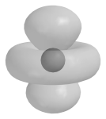

31. The total number of allowable orbitals for n = 2 is \_\_\_\_\_\_\_\_.
32. The Heisenberg Uncertainty Principle states that it is impossible to determine simultaneously both the position and the velocity of a particle. The detection of an electron, for example, would be made by way of its interaction with photons of light. Since photons and electrons have nearly the same energy, any attempt to locate an electron with a photon will knock the electron off course, resulting in uncertainty about where the electron is headed.
33. A running back collides with a defensive tackle and is knocked down. Explain how the Heisenberg Uncertainty Principle applies to this situation.
34. Do a unit analysis of the de Broglie equation to show how an increase in mass affects the wavelength of the moving object.

</article>

### 5.3 Electron Arrangements in Atoms

<article>

Worksheet
---------

**Name \_\_\_\_\_\_\_\_\_\_\_\_\_\_\_\_\_\_\_\_\_ Class \_\_\_\_\_\_\_\_\_\_\_\_\_\_\_\_\_\_\_\_\_\_ Date \_\_\_\_\_\_\_\_\_\_\_\_\_\_\_\_**

_Answer each of the questions below to show your achievement of the lesson objectives_

**Lesson Objective: Understand how to apply the Aufbau principle, the Pauli exclusion principle, and Hund's rule to determine ground state electron configurations.**

1.  An atom’s electron configuration describes
    1.  the shape of the electrons
    2.  the arrangement of electrons
    3.  the shape of electrons
    4.  the shape of the orbitals
2.  The Aufbau principle states
    1.  lower orbitals are filled last
    2.  orbitals are filled in random order
    3.  lower orbitals are filled before upper orbitals
    4.  no lower energy orbitals are filled
3.  The Pauli exclusion principle states that
    1.  all electrons have four quantum numbers
    2.  quantum numbers are excluded for some elements
    3.  two electrons in an element may have identical quantum numbers
    4.  no two electrons in an element can have the same four quantum numbers
4.  Hund’s rule states that
    1.  orbitals of equal energy must all have one electron before further filling.
    2.  all orbitals must first fill with one electron
    3.  energy levels will change as orbitals are filled
    4.  orbital filling is a random process
5.  True or False: Each element has a unique electron configuration.
6.  True or False: The 4f orbital fills just after the 4d orbital./li>
7.  True or False: There is one element whose electrons all have the same spin quantum number.
8.  True or False: Carbon has one empty 2p orbital.
9.  True or False: Nitrogen has one 2p orbital that contains two electrons.
10. The 2p orbital must be filled before the \_\_\_\_ orbital can be filled.
11. The \_\_\_\_\_\_ orbital is filled just before the 3p orbital is allowed to fill.
12. Each orbital can contain up to \_\_\_\_\_\_\_ electrons.
13. Boron has \_\_\_\_ empty 2p orbitals.

**Lesson Objective: Be able to write correct orbital filling diagrams and electron configurations for all elements.**

14. The arrows in orbital filling diagrams indicate
    1.  orbital rotation of the electrons
    2.  electron spin
    3.  magnetic rotation
    4.  orientation of orbital
15. Electron configuration superscripts indicate all of the following except
    1.  number of electrons
    2.  number of protons
    3.  atomic number
    4.  orbital shapes
16. The electron configuration 1s_2_2s_2_2p is the electron configuration for
    1.  carbon
    2.  oxygen
    3.  boron
    4.  beryllium
17. True or False: The electron configuration for lithium is 1s_2_2s_2_.
18. True or False: Oxygen will have one paired set of 2p electrons.
19. True or False: The orbital filling diagram for He is ↑ ↑ .
20. The orbital filling diagram for sodium (atomic number 11) is \_\_\_\_\_\_\_\_\_\_\_\_.
21. 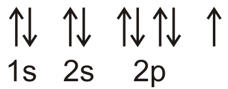 is the orbital filling diagram for \_\_\_\_\_\_\_\_\_\_\_.
22. The electron configuration for Al is \_\_\_\_\_\_\_\_\_\_\_.
23. 1s_2_2s_2_2p_6_ is the electron configuration for \_\_\_\_\_\_\_\_\_.

**Lesson Objective: Know how to use the noble gas notation shorthand method.**

24. The noble gas shorthand method
    1.  indicates reactivity
    2.  requires writing all the electrons in the diagram
    3.  allows abbreviation of the electron configuration
    4.  shows relationships among the noble gases
25. True or False: The noble gas configuration for calcium is \[Kr\]4s_2_ .

| **Element** | **Atomic Number** | **Electron Configuration** |
| --- | --- | --- |
| Ni  |     | \[Ar\]3d_8_4s_2_ |
| Mg  | 12  |     |
| Be  | 4   |     |

**Lesson Objective: Be able to determine the number of valence electrons and the number of unpaired electrons in any atom.**

27. Valence electrons are
    1.  unpaired electrons in the outermost principal energy level
    2.  all electrons in the outermost orbital
    3.  electrons in the outermost principal energy level
    4.  electrons with paired spin in the outermost principal energy level
28. _Note: You may use the electron configuration tables for questions 28-30._
29. Sc (atomic number 21) has \_\_\_\_\_ valence electrons.
30. Chlorine (atomic number 17) would be expected to have \_\_\_\_\_ unpaired electrons.
31. Nitrogen (atomic number 7) has \_\_\_\_\_ valence electrons and \_\_\_\_ unpaired electrons.

**Lesson Objective: Understand that some electron configurations are exceptions to the normal Aufbau process.**

31. The first element to show an exception to the Aufbau process is
    1.  Cr
    2.  Pt
    3.  Nb
    4.  Cs
32. The last of the three rules for determining ground state electron configurations gives information on how to arrange electrons in a set of orbitals that are all within the same sublevel. Hund’s rule states that orbitals of equal energy are each occupied by one electron before any orbital is occupied by a second electron, and all of the unpaired electrons must have the same spin. A slight preference for keeping electrons in separate orbitals helps minimize the natural repulsive forces that exist between any two electrons.
33. Why do all unpaired electrons need to have the same spin?
34. Develop a method using only the electron configuration tables for determining how many unpaired electrons a given atom has. Confine your discussion to elements 1-20.

| **Element** | **Atomic Number** | **Electron Configuration** |
| --- | --- | --- |
| Ni  | 28  | \[Ar\]3d_8_4s_2_ |
| Mg  | 12  | \[Ne\]3s_2_ |
| Be  | 4   | 1s_2_2s_2_ |

</article>

## 6.0 The Periodic Table Worksheets

<article>

</article>

### 6.1 History of the Periodic Table

<article>

Worksheet
---------

**Name \_\_\_\_\_\_\_\_\_\_\_\_\_\_\_\_\_\_\_\_\_ Class \_\_\_\_\_\_\_\_\_\_\_\_\_\_\_\_\_\_\_\_\_\_ Date \_\_\_\_\_\_\_\_\_\_\_\_\_\_\_\_**

_Answer each of the questions below to show your achievement of the lesson objectives_

**Lesson Objective: Describe some of the early attempts to organize the chemical elements.**

_Multiple Choice_

1.  One of the following metals was known since ancient times.
    1.  gallium
    2.  tungsten
    3.  copper
    4.  cadmium
2.  The triad system was based on all of the following except
    1.  similar chemical reactivity
    2.  equal numbers of protons in the nucleus
    3.  pattern of atomic masses
    4.  reactivity with other triads

3.  True or False: John Newlands developed a system for organizing elements known as the Law of Octaves.
4.  True or False: Zinc (Zn) was discovered between 1844-1886.
5.  Newland noticed that every \_\_\_\_\_ element exhibited similar properties.
6.  Newland’s law did not seem to hold for elements heavier than \_\_\_\_\_\_\_\_.

**Lesson Objective: Understand how Mendeleev organized his periodic table.**

7.  Mendeleev noticed a trend in elements when organized in order of
    1.  increasing atomic mass
    2.  increasing atomic number
    3.  increasing electron number
    4.  increasing reactivity
8.  Mendeleev placed \_\_\_\_\_ before iodine based on chemical properties.
    1.  bromine
    2.  selenium
    3.  tellurium
    4.  sulfur

9.  True or False: There are three missing elements between zinc and arsenic.
10. True or False: Lothar Meyer published the first periodic table.
11. Similarities in chemical behavior show a pattern known as \_\_\_\_\_\_\_\_\_ .
12. Mendeleev arranged his table so that atomic mass increases from \_\_\_\_\_ to \_\_\_\_\_\_ .
13. The element \_\_\_\_\_\_ was discovered four years after Mendeleev published his table.

**Lesson Objective: Know the improvements that Moseley made to Mendeleev’s table.**

14. Moseley based his periodic table modifications on data obtained from
    1.  X-ray spectra
    2.  atomic emission spectra
    3.  atomic absorption spectra
    4.  atomic X-ray spectra
15. Moseley defined atomic number as
    1.  number of neutrons in the nucleus
    2.  number of neutrons plus protons
    3.  number of protons
    4.  number of electrons

16. True or False: Rutherford was the first to propose modifications of Mendeleev’s periodic table.
17. True or False: Moseley used atomic number for his modifications of the periodic table.
18. Moseley defined atomic \_\_\_\_\_\_ as the number of protons in the nucleus of an atom.

**Lesson Objective: Know the periodic law.**

19. Tellurium is placed before iodine in the periodic table because
    1.  it has a larger atomic mass
    2.  it has more protons
    3.  it has a lower atomic number
    4.  it has more electrons

20. True or False: The periodic law describes the arrangement of elements based on atomic number.
21. When elements are arranged in order of \_\_\_\_\_\_\_ atomic number, there is a \_\_\_\_\_\_\_ repetition of their \_\_\_\_\_\_\_\_ and \_\_\_\_\_\_\_\_\_\_\_\_ properties.

**Lesson Objective: Describe various components of the modern periodic table, including periods, groups, metals, nonmetals, and metalloids.**

22. Some chemical symbols are based on \_\_\_\_\_\_\_ for the elements.
    1.  Latin names
    2.  trivial names
    3.  Greek names
    4.  Chinese names
23. A period is a
    1.  horizontal column
    2.  vertical column
    3.  vertical row
    4.  horizontal row
24. The current numbering system for groups was developed by the
    1.  American Chemical Society
    2.  European Union of Scientists
    3.  International Union of Pure and Applied Chemistry
    4.  International Association of Chemistry

25. True or False: A metal is a good conductor of heat and electricity.
26. True or False: Aluminum is considered a metalloid.
27. True or False: Nonmetals can exist in all three states of matter at room temperature.
28. A \_\_\_\_\_ is generally a poor conductor of heat and electricity.
29. A \_\_\_\_\_\_\_ has properties \_\_\_\_\_\_\_\_\_\_\_\_\_ between those of a metal and a nonmetal.
30. A \_\_\_\_\_\_\_\_ is a horizontal row of the periodic table.
31. A group is a vertical \_\_\_\_\_\_\_\_\_\_\_\_\_ of the periodic table.
32. In the solid state \_\_\_\_\_\_\_\_\_\_\_\_\_ are brittle.
33. Approximately \_\_\_\_\_\_% of the elements are metals.
34. English chemist John Newlands (1838-1898) arranged the elements in increasing order of atomic mass and noticed that every eighth element exhibited similar properties. He called this relationship the _Law of Octaves_. Unfortunately, some elements were missing, and the law did not seem to hold for elements that were heavier than calcium. Newlands’ work was largely ignored and even ridiculed by the scientific community in his day. It was not until years later that another more extensive effort to construct a periodic table would gain much greater acceptance, and the pioneering work of John Newlands would be appreciated.
35. Why was Newland ridiculed by his scientific colleagues?
36. Why is the organization of the periodic table by physical properties not very useful?

</article>

### 6.2 Electron Configuration and the Periodic Table

<article>

Worksheet
---------

**Name \_\_\_\_\_\_\_\_\_\_\_\_\_\_\_\_\_\_\_\_\_ Class \_\_\_\_\_\_\_\_\_\_\_\_\_\_\_\_\_\_\_\_\_\_ Date \_\_\_\_\_\_\_\_\_\_\_\_\_\_\_\_**

_Answer each of the questions below to show your achievement of the lesson objectives_

**Lesson Objective: Understand the relationship between the number of orbitals in various energy sublevels and the length of the periods in the periodic table.**

1.  Period 3 has \_\_\_\_\_\_\_ elements
    1.  6
    2.  8
    3.  18
    4.  32
2.  The 6p orbitals begin in period \_\_\_\_\_ .
    1.  2
    2.  4
    3.  6
    4.  8

3.  True or False: All the seventh period elements have been found in nature.
4.  True or False: 3s and 3p sublevels are being filled in the third period.
5.  The electron configuration for barium is \[Xe\]6s_2_. Barium will be found in the \_\_\_\_\_ period.
6.  An element is found in period four. Is this element Be (atomic number 2) or Mn (atomic number 25)? The element is \_\_\_\_\_\_\_\_\_ .

**Lesson Objective: Identify each block of the periodic table and be able to determine which block each element belongs to based on its electron configuration.**

7.  The d sublevel is always \_\_\_\_\_\_behind the period in which the sublevel occurs.
    1.  two principal sublevels
    2.  one principal level
    3.  four principal sublevels
    4.  three principal sublevels
8.  The 4f sublevel belongs in the \_\_\_\_\_ period.
    1.  second
    2.  fourth
    3.  sixth
    4.  eighth

9.  True or False: With one exception, all the s sublevels being filled are in groups 1 and 2.
10. True or False: The d block is comprised of elements in groups 4-9.
11. Elements in groups 13-18 are primarily filling \_\_\_\_ orbitals.
12. The f orbitals ae primarily filled in periods \_\_\_\_ and \_\_\_\_ .

**Lesson Objective: Describe the relationship between outer electron configuration and group number. Be able to determine the number of valence electrons for any element.**

13. The number of valence electrons in p-block elements is
    1.  group number - 6
    2.  group number - 8
    3.  group number - 10
    4.  group number - 12
14. Alkaline earth metals have \_\_\_\_ valence electrons.
    1.  1
    2.  2
    3.  3
    4.  4

15. True or False: Strontium has the electron configuration \[Kr\]5s_2_, giving it two valence electrons.
16. True or False: The noble gases all have s_2_p_5_ electron configurations.
17. Polonium has the electron configuration \[Hg\]6p_4_, which gives it \_\_\_\_ valence electrons.
18. O is in group \_\_\_\_ and has six valence electrons.
19. Iron has the electron configuration \[Ar\]3d_6_4s_2_, putting it in group \_\_\_\_\_

**Lesson Objective: Locate the following groups on the periodic table: alkali metals, alkaline earth metals, halogens, and noble gases.**

20. The halogens are found in group \_\_\_\_ .
    1.  fifteen
    2.  sixteen
    3.  seventeen
    4.  eighteen
21. The period 4 group 1 element is
    1.  Li
    2.  K
    3.  Ca
    4.  Rb

22. True or False: Radon is a noble gas.
23. True or False: Atomic number 34 is a halogen.
24. Radium is located in group two and is considered to be an \_\_\_\_\_\_ \_\_\_\_\_\_ metal.
25. Cesium is in group 1 and has \_\_\_ electron(s) in its outer orbital.
26. Xenon (atomic number 54) is classified as group \_\_\_\_\_ element.
27. The transition element 28Ni is in group
    1.  10
    2.  9
    3.  8
    4.  7
28. The actinides are all located in group \_\_\_\_\_ .
    1.  1
    2.  2
    3.  3
    4.  4

29. True or False: Tungsten (atomic number) 74 is a transition element.
30. True or False: The lanthanide element samarium (atomic number 62) is found in group 4.

| **Element** | **Atomic Number** | **Group** | **Period** | **Category** |
| --- | --- | --- | --- | --- |
| Palladium (Pd) | 46  |     |     | transition |
| Neodynium (Nd) |     |     |     |     |
|     | 92  |     |     |     |

32. Looking at the block diagram, you may be wondering why hydrogen and helium were not included in our discussion of the alkali metal and alkaline earth metal groups. Though hydrogen, with its 1s_1_ configuration, appears as though it should be similar to the rest of Group 1, it does not share the properties of that group. Hydrogen is a unique element that cannot be reasonably included in any single group of the periodic table. Some periodic tables even separate hydrogen’s square from the rest of Group 1 to indicate its solitary status.
33. Do hydrogen and helium have anything in common?
34. How do we know where to put astatine in the periodic table if most of its properties are unknown?

| **Element** | **Atomic Number** | **Group** | **Period** | **Category** |
| --- | --- | --- | --- | --- |
| Palladium (Pd) | 46  | 10  | 5   | transition |
| Neodynium (Nd) | 60  | 3   | 6   | lanthanide |
| Uranium (U) | 92  | 3   | 7   | actinide |

</article>

### 6.3 Periodic Trends

<article>

Worksheet
---------

**Name \_\_\_\_\_\_\_\_\_\_\_\_\_\_\_\_\_\_\_\_\_ Class \_\_\_\_\_\_\_\_\_\_\_\_\_\_\_\_\_\_\_\_\_\_ Date \_\_\_\_\_\_\_\_\_\_\_\_\_\_\_\_**

_Answer each of the questions below to show your achievement of the lesson objectives_

**Lesson Objective: Learn the periodic trends for atomic radius.**

1.  The atomic radius is determined by measuring the
    1.  circumference of the atomic cloud
    2.  radius of the atomic cloud
    3.  distance between two nuclei
    4.  distance from nucleus to outer edge of cloud
2.  The atomic radius increases when
    1.  a new principal energy level is added
    2.  the atomic number increases within a group
    3.  more protons are added to the nucleus
    4.  electrons are lost
3.  True or False: Ionic radius increases from right to left in a period.
4.  True or False: Ionic radius decreases from top to bottom in a group.
5.  The distance between two H atoms is 74 pm. The ionic radius is \_\_\_\_\_ pm.
6.  The abbreviation pm stands for \_\_\_\_\_\_\_\_\_, which is $1 \times 10$ \_\_\_\_\_ meters.

**Lesson Objective: Know the relationship between group number and valence electrons.**

7.  The maximum number of valence electrons for an atom in its ground state is
    1.  10
    2.  8
    3.  6
    4.  4
8.  The outer electron configuration for group 16 is
    1.  ns_2_
    2.  ns_2_np_6_
    3.  ns_2_np_4_
    4.  ns_2_np_1_

9.  True or False: Valence electrons are those in the outermost occupied principal energy level.
10. True or False: Group number 13 has three valence electrons.
11. Valence electrons will always be in the \_\_\_ and \_\_\_ orbitals.
12. The number of valence electrons and the outer electron configuration is constant within a \_\_\_\_.

**Lesson Objective: Describe how ions are formed.**

13. Ions are formed by the gain or loss of
    1.  protons
    2.  electrons
    3.  neutrons
    4.  protons + electrons
14. Names of monoatomic anions end with
    1.  id
    2.  ic
    3.  ide
    4.  ied

15. True or False: The proper superscript for an ion with a single unit of charge is +1.
16. True or False: When an atom gains one or more electrons, it becomes negatively charged.
17. A positively charged ion is called \_\_\_\_\_\_\_\_ .
18. A negatively charged ion is called \_\_\_\_\_\_\_\_ .

**Lesson Objective: Learn the periodic trends for ionization energy.**

19. Ionization energies are measured in
    1.  $kJ/mol$
    2.  $J \times sec/kg$
    3.  $J/mol$
    4.  $kJ/gram$

20. True or False: Ionization energy tend to decrease from left to right across a period.
21. Ionization energy is the energy required to \_\_\_\_\_\_ an \_\_\_\_\_\_ .
22. An \_\_\_\_\_ in ionization energy results from an increase in nuclear charge.

**Lesson Objective: Explain how multiple ionization energies are related to noble gas electron configurations.**

23. Why is the second ionization energy for sodium so much higher than its first ionization energy?

**Lesson Objective: Describe electron affinity.**

24. The elements of the \_\_\_\_\_\_\_\_ group gain electrons most readily.
    1.  alkali metals
    2.  alkaline earth metals
    3.  transition elements
    4.  halogens

25. True or False: Electron affinities increase from top to bottom down a group
26. When energy is released in a chemical reaction or process, the energy is expressed as a \_\_\_\_\_\_ number.
27. Addition of one more electron to a halogen results in a \_\_\_\_\_ \_\_\_\_\_\_ electron configuration.

**Lesson Objective: Predict the effect that ion formation has on the size of an atom.**

28. Removal of valence electrons form an atom results in
    1.  increase in ionic radius
    2.  increase in occupied principal energy levels
    3.  decrease in ionic radius
    4.  formation of anions

29. True or False: The radius of selenium increases when it forms an ion.

**Lesson Objective: Learn the periodic trends for electronegativity.**

30. The most electronegative element is
    1.  O
    2.  F
    3.  Br
    4.  Si

31. True or False: Electronegativity deals with the ability to repel electrons.
32. The least electronegative element is \_\_\_\_.
33. Another anomaly can be found between Groups 15 and 16. Atoms of Group 16 (O, S, etc.) often have lower ionization energies than atoms of Group 15 (N, P, etc.). This can be explained in terms of Hund’s rule. In a nitrogen atom, there are three unpaired electrons in the 2p sublevel. In an oxygen atom, there are four electrons in the 2p sublevel, so one orbital must contain a pair of electrons. One electron from this pair will be removed first during the ionization of an oxygen atom. Since electrons repel each other, it is slightly easier to remove an electron from a doubly occupied orbital than to remove an unpaired electron. Consequently, removing a paired electron from oxygen requires slightly less energy than removing an unpaired electron from the nitrogen atom.
34. Why is it easier to remove an electron from a paired orbital?
35. What problems could exist with the current way of determining atomic radii?

</article>

## 7.0 Chemical Nomenclature Worksheets

<article>

</article>

### 7.1 Ionic Compounds

<article>

Worksheets
----------

**Name \_\_\_\_\_\_\_\_\_\_\_\_\_\_\_\_\_\_\_\_\_ Class \_\_\_\_\_\_\_\_\_\_\_\_\_\_\_\_\_\_\_\_\_\_ Date \_\_\_\_\_\_\_\_\_\_\_\_\_\_\_\_**

_Answer each of the questions below to show your achievement of the lesson objectives_

**Lesson Objective: Distinguish between inorganic and organic chemistry.**

1.  Naming of organic compounds is
    1.  easy because there are so few of them
    2.  complex because there are so many of them
    3.  based on exceptions to the rules
    4.  the same as rules for inorganic compounds
2.  True/False: All compounds containing carbon are organic compounds.

**Lesson Objective: Interpret a molecular formula.**

3.  One of the following statements about the molecule shown below is incorrect CH3CH2CH2OCH2COOH
    1.  the molecule contains five carbons
    2.  the molecule contains ten hydrogens
    3.  the molecule contains four oxygens
    4.  the molecule contains eighteen atoms
4.  True/False: If there is no subscript below a symbol, that means there is only one of that element being represented.
5.  The molecule serotonin (C10H12N2O) contains \_\_\_\_ nitrogen atoms and \_\_\_\_\_ hydrogen atoms.

**Lesson Objective: Explain why an ionic compound is represented by an empirical formula.**

6.  An empirical formula represents
    1.  the three-dimensional structure of the molecule.
    2.  the small whole-number ratio among the atoms
    3.  the actual number of atoms in the three-dimensional array
    4.  the crystal structure made up of the different atoms
7.  True/False: Ionic compounds exist as discrete molecular units.

**Lesson Objective: Be able to determine the charges of monatomic ions formed by the representative elements from the position of each element on the periodic table.**

8.  Monatomic cations are formed by
    1.  adding electrons
    2.  losing protons
    3.  losing electrons
    4.  adding protons
9.  True/False: A monatomic anion is an atom with a -2 charge.
10. Fill in the missing information in the table below:

| **Atom** | **Ion** | **Name** |
| --- | --- | --- |
| Na  | Na_+_ | sodium |
| Sr  |     |     |
|     |     | bromide |
|     | Ga_3+_ |     |
| S   |     |     |

**Lesson Objective: Use the Stock system to identify the charge of transition metal ions.**

11. The Stock system uses \_\_\_\_\_\_\_ to indicate ionic charge
    1.  Roman numerals
    2.  \+ and – to show cations and anions
    3.  \-ic and –ous to show charge
    4.  Arabic numerals
12. True/False: The Stock system is only used for cations.
13. True/False: Cd(II) is used to designate a cadmium 2+ compound.
14. Fill in the missing information in the table below:

| **Element** | **Ion** | **Stock Name** |
| --- | --- | --- |
| Fe  | Fe_3+_ | iron(III) |
|     | Ni_2+_ |     |
| Ag  |     |     |
|     |     | chromium(II) |
|     | Sn_4+_ |     |

**Lesson Objective: Name an ionic compound given its formula.**

15. A binary compound
    1.  contains two types of atoms
    2.  contains atoms combined in ratios of two
    3.  can be a compound made of two metals
    4.  can be a compound made of two nonmetals
16. The Stock system is used in naming
    1.  all compounds containing cations
    2.  only group 2 cations
    3.  compounds containing transition metals
    4.  compounds containing transition nonmetals
17. True/False: The overall charge of a binary ionic compound can vary.
18. Name the following compounds:
    1.  KBr
    2.  CaI2
    3.  Na2S
    4.  CoCl2
    5.  Pt3P2
    6.  (NH4)3PO4

**Lesson Objective: Write the correct formula for an ionic compound given its name.**

19. The criss-cross method is useful for
    1.  balancing equations
    2.  assigning charges
    3.  determining the ratio of ions
    4.  naming complicated compounds
20. The proper formula for potassium oxide is
    1.  K2O
    2.  KO
    3.  KO2
    4.  K2O3
21. The correct name for the CN_\-_ ion is
    1.  cyanate
    2.  cyanous
    3.  cyanic
    4.  cyanide
22. True/False: The CO3_2-_ ion is known as the bicarbonate ion.
23. True/False: A polyatomic ion is composed of more than one atom.
24. True/False: FeCl3 is a ternary ionic compound
25. Write the formulas for the following compounds:
    1.  copper(II) oxide
    2.  magnesium bromide
    3.  potassium dichromate
    4.  magnesium phosphate
    5.  iron(III) bromate

| **Atom** | **Ion** | **Name** |
| --- | --- | --- |
| Na  | Na_+_ | sodium |
| Sr  | Sr_2+_ | strontium |
| Br  | Br_\-_ | bromide |
| Ga  | Ga_3+_ | gallium |
| S   | S_2-_ | sulfide |

| **Element** | **Ion** | **Stock Name** |
| --- | --- | --- |
| Fe  | Fe_3+_ | iron(III) |
| Ni  | Ni_2+_ | nickel(II) |
| Ag  | Ag_+_ | no Stock number |
| Cr  | Cr_2+_ | chromium(II) |
| Sn  | Sn_4+_ | tin(IV) |

</article>

### 7.2 Molecular Compounds

<article>

Worksheet
---------

**Name \_\_\_\_\_\_\_\_\_\_\_\_\_\_\_\_\_\_\_\_\_ Class \_\_\_\_\_\_\_\_\_\_\_\_\_\_\_\_\_\_\_\_\_\_ Date \_\_\_\_\_\_\_\_\_\_\_\_\_\_\_\_**

_Answer each of the questions below to show your achievement of the lesson objectives_

**Lesson Objective: Describe the difference between an ionic compound and a molecular compound.**

1.  One of the following statements about ionic compounds is not correct.
    1.  ionic compounds are represented by empirical formulas
    2.  ionic compounds take the form of individual molecules
    3.  ionic compounds exists in extended arrays
    4.  ionic compounds are made up of alternating positive and negative ions
2.  One of the following statements about molecular compounds is not true
    1.  molecular compounds share valence electrons
    2.  molecular compounds form bonds between pairs of atoms
    3.  molecular compounds lose electrons to nonmetal atoms
    4.  all the molecules in a sample of a given molecular compound are identical
3.  True/False: Carbon dioxide consists of a central carbon atom bonded to two oxygen atoms.
4.  True/False: Water is an ionic compound.

**Lesson Objective: Name a molecular compound given its formula.**

5.  Binary molecular compounds are usually composed of
    1.  two metals
    2.  a metal and a non-metal
    3.  two nonmetals
    4.  three or more different elements
6.  The prefix \_\_\_\_\_ could be used to indicate a molecule with eight carbon atoms
    1.  penta
    2.  hexa
    3.  hepta
    4.  octa
7.  The compound ethane pentabromide would contain \_\_\_\_\_ bromine atoms.
    1.  five
    2.  three
    3.  seven
    4.  four
8.  The nonmetal \_\_\_ would follow S when writing binary compound formulas
    1.  Cl
    2.  I
    3.  H
    4.  P
9.  True/False: P2O5 is named phosphorus pentaoxide.
10. True/False: N and O can combine with each other in a variety of ratios.
11. True/False: CO would be named carbon monoxide.
12. True/False: CCl4 is the formula for carbon trichloride.
13. Name the following compounds
    1.  NO
    2.  N2O5
    3.  H2O (the technical name)
    4.  C2F6
    5.  SiO2
    6.  NH3 (the technical name)

**Lesson Objective: Write the correct formula for a molecular compound given its name.**

14. The formula for xenon hexachloride is
    1.  XeCl4
    2.  XeCl6
    3.  XeCl8
    4.  XeCl5
15. The formula for carbon tetrachloride is
    1.  CCl
    2.  CCl2
    3.  CCl3
    4.  CCl4
16. Boron trihydride has the following formula
    1.  BH3
    2.  B2H3
    3.  B2H6
    4.  B3H6
17. True/False: The formula for dinitrogen tetroxide is N2O2
18. True/False: The formula for sulfur trioxide is SO3.
19. True/False: The formula for selenium tetrahydride is SeH5.
20. Write formulas for the following compounds
    1.  bromochloride
    2.  arsenic triiodide
    3.  disilicon tetroxide
    4.  tellurium difluoride
    5.  diboron hexahydride.
    6.  triphosphorus octoxide
21. Recall that a molecular formula shows the number of atoms of each element that a molecule contains. A molecule of water contains two hydrogen atoms and one oxygen atom, so its formula is H2O. A molecule of octane, which is a component of gasoline, contains eight atoms of carbon and 18 atoms of hydrogen. The molecular formula of octane is C8H18.
22. Does the name octane follow the rules that are discussed in this section? Why would the shorter name be used?
23. Would you expect ionic compounds and molecular compounds to react differently? Explain your answer.

</article>

### 7.3 Acids and Bases

<article>

Worksheet
---------

{{Teachers |body= **Name \_\_\_\_\_\_\_\_\_\_\_\_\_\_\_\_\_\_\_\_\_ Class \_\_\_\_\_\_\_\_\_\_\_\_\_\_\_\_\_\_\_\_\_\_ Date \_\_\_\_\_\_\_\_\_\_\_\_\_\_\_\_**

_Answer each of the questions below to show your achievement of the lesson objectives_

**Lesson Objective: Define acids and bases in terms of the ions that are produced when each type of compound is dissolved in water.**

1.  An acid produces \_\_\_\_\_\_ when dissolved in water.
    1.  OH_\-_
    2.  hydrogen ions
    3.  electrons
    4.  hydroxide ions
2.  An acid contains one or more \_\_\_\_\_\_ atoms.
    1.  oxygen
    2.  halogen
    3.  hydrogen
    4.  chlorine
3.  A base produces \_\_\_\_\_\_ when dissolved in water.
    1.  H_+_
    2.  Cl_\-_
    3.  hydronium ions
    4.  hydroxide ions
4.  True/False: The bonds in an acid are ionic bonds.
5.  True/False: A base is an ionic compound.
6.  True/False: A binary acid consists of hydrogen and two other elements.
7.  Label each compound as acid (A), base (B), or other (O).
    1.  HCl
    2.  CH3CH3
    3.  KOH
    4.  HOH
    5.  HNO3

**Lesson Objective: Be able to name acids when given their chemical formulas.**

8.  One of the following suffixes is not used in naming acids
    1.  ite
    2.  ote
    3.  ate
    4.  ide
9.  Which of the following is the correct name for H2CO3?
    1.  carbonic acid
    2.  carbolic acid
    3.  carbonatic acid
    4.  hydrocarbonic acid
10. What is the name for the PO4_3-_ ion?
    1.  phosphite
    2.  phosphorous
    3.  phosphate
    4.  phosphoric
11. True/False: The suffix of the anion determines how the acid is named.
12. True/False: All monoatomic anions end in ite.
13. True/False: The name of an acid is determined by the anion.
14. Name the following acids:
    1.  HCN
    2.  HNO3
    3.  HMnO4
    4.  HClO3
    5.  H2CrO4

**Lesson Objective: Write the correct formula for an acid when given its name.**

15. The acid prefix for an anion ending in _ide_ is
    1.  hypo-
    2.  hydric-
    3.  hydro-
    4.  hydra-
16. If the anion ends in _ite_, the acid name ends in \_\_\_\_\_\_.
    1.  ic acid
    2.  ate acid
    3.  ite acid
    4.  ous acid
17. True/False: The names of all monoatomic anions end in _–ite_.
18. True/False: NO2_\-_ is the nitrite anion.
19. Write the formulas for the following acids:
    1.  phosphoric acid
    2.  nitrous acid
    3.  hydroiodic acid
    4.  arsenic acid
    5.  perchloric acid

**Lesson Objective: Name and write formulas for bases.**

20. Bases exist as
    1.  extended three-dimensional arrays
    2.  molecular compounds
    3.  discrete molecules
    4.  molecular arrays
21. The names of all bases end in
    1.  hydroxyl
    2.  hydroxide
    3.  hydride
    4.  hydronium
22. True/False: OH_+_ is the hydroxide ion.
23. True/False: Hydroxide ions are formed from oxygen and hydrogen atoms that have bonded together.
24. Name the following bases
    1.  Ca(OH)2
    2.  LiOH
    3.  Cu(OH)2
    4.  Fe(OH)3
25. Write the formulas for the following bases
    1.  potassium hydroxide
    2.  iron(II) hydroxide
    3.  magnesium hydroxide
    4.  lead (IV) hydroxide
26. Acids and bases are two very important classes of chemicals that you probably use every day. Many foods and beverages contain acids, such as citrus fruits and juices, soda, and vinegar. Bases are very prevalent in cleaners such as ammonia, and most drain cleaners use a strong base as their active ingredient.
27. How does our knowledge of chemistry affect our understanding of acids and bases?
28. Why do we need to develop special naming for acids instead of just naming them as cations?

</article>

## 8.0 Ionic and Metallic Bonding Worksheets

<article>

</article>

### 8.1 Ions

<article>

Worksheets
----------

**Name \_\_\_\_\_\_\_\_\_\_\_\_\_\_\_\_\_\_\_\_\_ Class \_\_\_\_\_\_\_\_\_\_\_\_\_\_\_\_\_\_\_\_\_\_ Date \_\_\_\_\_\_\_\_\_\_\_\_\_\_\_\_**

_Answer each of the questions below to show your achievement of the lesson objectives_

**Lesson Objective: Be able to determine the number of valence electrons for any element and draw an electron dot diagram for any atom.**

1.  The number of valence electrons for p-block elements is
    1.  group number minus 8
    2.  group number minus 10
    3.  group number minus 12
    4.  group number minus 6
2.  An electron dot diagram for an element shows
    1.  all electrons
    2.  p-sublevel electrons
    3.  valence electrons
    4.  bondable electrons
3.  True/False: Beryllium has two valence electrons.
4.  True/False: The number of valence electrons for carbon is three.
5.  Draw the electron dot diagram for
    1.  calcium
    2.  phosphorus
    3.  xenon
    4.  potassium

**Lesson Objective: Use the octet rule to predict the charges of the most common ions formed by the representative elements.**

6.  In order to achieve a full octet, the silicon atom will most likely
    1.  lose two electrons
    2.  lose four electrons
    3.  gain two electrons
    4.  gain four electrons
7.  Atoms of \_\_\_\_\_ elements tend to lose valence electrons to satisfy the octet rule.
    1.  gases
    2.  halogens
    3.  metals
    4.  noble gases
8.  True/False: Gilbert Lewis first proposed the octet rule.
9.  True/False: All elements obtain eight valence electrons, either by electron loss or electron gain.
10. For each of the following elements, indicate whether they will gain or lose electrons to satisfy the octet rule:
    1.  cesium
    2.  arsenic
    3.  astatine
    4.  radium
    5.  magnesium

**Lesson Objective: Write electron configurations for ions.**

11. Cations are formed when
    1.  atoms lose an electron
    2.  atoms lose all their valence electrons
    3.  atoms add one electron
    4.  atoms add electrons to fill the valence level
12. Phosphorus has the electron configuration of \[Ne\]3s_2_p_3_. This atom will most likely achieve a complete outer principal energy level by
    1.  losing 3 electrons
    2.  losing 5 electrons
    3.  gaining 1 electron
    4.  gaining 3 electrons
13. True/False: The halogens each need to add one electron to achieve an outermost principal energy level.
14. True/False: Beryllium can achieve a complete outermost principal energy level by losing four electrons.
15. Write electron configurations for the following ions:
    1.  carbon 4+
    2.  magnesium 2+
    3.  oxygen 2-
    4.  chloride 1-
    5.  manganese 2+

**Lesson Objective: Identify other atoms or ions that are isoelectronic with a particular ion.**

16. The Sr_2+_ ion is isoelectronic with
    1.  krypton
    2.  argon
    3.  xenon
    4.  rubidium
17. Isoelectronic ions have the following characteristic
    1.  they react the same
    2.  they have the same number of electrons
    3.  they have the same electron configuration
    4.  they have the same number of protons
18. True/False: Na_+_ and Cl_\-_ are isoelectronic.
19. True/False: Mg_2+_ and S_2-_ are isoelectronic.
20. The Ba_2+_ ion is isoelectronic with the 1- \_\_\_\_\_ ion
21. Which cation would be isoelectronic with O_2-_? \_\_\_\_\_\_\_

**Lesson Objective: Know that transition metal ions with either half-filled or completely filled** **_d_** **sublevels are particularly stable.**

22. Transition metals form 2+ ions by
    1.  losing s electrons
    2.  filling incomplete d levels
    3.  gaining p electrons
    4.  losing d electrons
23. The pseudo noble gas electron configuration for some transition elements has \_\_\_\_ electrons in the outermost principal energy level.
    1.  12
    2.  8
    3.  10
    4.  18
24. True/False: Zinc and copper ions have full d sublevels.
25. True/False: Scandium achieves a noble gas electron configuration by losing its two 4s electrons.
26. Explain why the following ions would be particularly stable.
27. a. Mn
28. _2+_
29. b. Cd
30. _2+_
31. There are two ways in which atoms can satisfy the octet rule. One way is by sharing their valence electrons with other atoms, which will be covered in the next chapter, _Covalent Bonding_. The second way is by transferring valence electrons from one atom to another. Atoms of metallic elements tend to lose all of their valence electrons, which leaves them with an octet from the next lowest principal energy level. Atoms of nonmetallic elements tend to gain electrons in order to fill their outermost principal energy level with an octet.
32. Why would metallic elements tend to lose electrons and nonmetallic elements gain electrons to form ions?
33. What is the benefit of having a rule such as the octet rule?

</article>

### 8.2 Ionic Bonds and Ionic Compounds

<article>

Worksheets
----------

**Name \_\_\_\_\_\_\_\_\_\_\_\_\_\_\_\_\_\_\_\_\_ Class \_\_\_\_\_\_\_\_\_\_\_\_\_\_\_\_\_\_\_\_\_\_ Date \_\_\_\_\_\_\_\_\_\_\_\_\_\_\_\_**

_Answer each of the questions below to show your achievement of the lesson objectives_

**Lesson Objective: Explain how an ionic bond is formed when electrons are transferred from one atom to another in terms of the resulting electrostatic attraction. Draw diagrams showing this process.**

1.  The strength of an ionic bond is directly dependent on
    1.  the size of the ion
    2.  the magnitude of the charges
    3.  the distance between the ions
    4.  the ionic polarities
2.  In describing ions, the cation is shown without dots because
    1.  electrons have filled the outer principal energy level
    2.  the valence electrons have added more electrons to make a full octet
    3.  the energy level that contained the original valence electrons is now empty.
    4.  no change has taken place in the electron distribution pattern
3.  In order for sulfur to form a cation. It needs to
    1.  lose two protons
    2.  lose four electrons
    3.  gain two electrons
    4.  gain one electron
4.  True/False: A larger ion will form a stronger bond than a smaller ion.
5.  True/False: The chlorine atom gains one electron to become an anion.
6.  True/False: Calcium needs to lose two valence electrons to form an ion.
7.  Use diagrams to show the formation of the following ion pairs:
8.  a. K and Br
9.  b. Mg and O

**Lesson Objective: Describe the structural arrangements of ions in a crystal, including coordination number and its relationship to a given compound’s formula unit.**

8.  The formula unit for an ionic compound is
    1.  an indication of the number of individual ions in the crystal
    2.  an empirical formula
    3.  a molecular formula
    4.  a diagram of the crystal structure
9.  The coordination number for an ionic compound is
    1.  the number of ions in the crystal
    2.  the number of ions in the molecule
    3.  the number of ions immediately surrounding an ion of opposite charge
    4.  the number of ions immediately surrounding an ion of like charge
10. Cs and Na have different coordination numbers because
    1.  the ion sizes are very different
    2.  the ionic charges are different
    3.  the chloride ion changes shape in contact with the two cations
    4.  solubilities of the two compounds are different
11. True/False: One formula unit of FeCl3 contains three Cl_\-_ for every Fe_3+_.
12. True/False: Coordination numbers are determined by ionic combinations.
13. True/False: All group one cations will have the same packing arrangement.
14. What type of bonds exist between ions in an ionic compound?
15. Would you expect rubidium chloride to have a coordination number more like Na or more like Cs? Explain your answer.

**Lesson Objective: Explain how various physical properties result from the ionic crystal lattice, such as strength, hardness, high melting points, brittleness, and electrical conductivity.**

16. Amethyst is
    1.  a copper-containing mineral
    2.  the common name for mercury (II) sulfide
    3.  a form of quartz
    4.  a vanadium-containing mineral
17. High melting points of ionic compounds are due to
    1.  the presence of many ionic bonds
    2.  the ordered crystal structure
    3.  various shapes of the crystals
    4.  mixtures of metals in the crystals
18. Addition of NaCl to distilled water
    1.  decreases the electrical conductivity
    2.  generated electricity
    3.  increases negative ion movement
    4.  causes conduction of an electrical current
19. Ionic crystals break when struck because
    1.  the hammer forces all the ions together
    2.  ions of like charge are forced closer together and repel one another
    3.  ions of opposite charge set up an electrical current
    4.  a chemical reaction is initiated due to the pressure of the hammer
20. True/False: Distilled water can conduct an electric current.
21. True/False: Azurite is a blue-purple mineral.
22. True/False: Solid NaCl at room temperature will conduct electricity
23. True/False: Transition metal ions are responsible for the color of minerals.
24. The \_\_\_\_\_\_\_\_\_ force between ions of the \_\_\_\_\_\_ charge cause a crystal to shatter when struck with a hammer.
25. An electric current is conducted when \_\_\_\_\_\_\_ and \_\_\_\_\_\_\_\_ions can \_\_\_\_\_ .
26. The figure below shows two different ways of representing the ionic crystal lattice. A ball and stick model makes it easier to see how individual ions are oriented with respect to one another. A space filling diagram is a more accurate representation of how the ions pack together in the crystal.
27. How does a model help us understand chemical processes?
28. How do you think the d orbitals might affect the interactions between Ti and Cl as compared to Na and Cl?

</article>

### 8.3 Metallic Bonds

<article>

Worksheets
----------

**Name \_\_\_\_\_\_\_\_\_\_\_\_\_\_\_\_\_\_\_\_\_ Class \_\_\_\_\_\_\_\_\_\_\_\_\_\_\_\_\_\_\_\_\_\_ Date \_\_\_\_\_\_\_\_\_\_\_\_\_\_\_\_**

_Answer each of the questions below to show your achievement of the lesson objectives_

**Lesson Objective: Describe the electron-sea model of metallic bonding.**

1.  The points in a metal crystal lattice are occupied by
    1.  anions
    2.  cations
    3.  metal atoms
    4.  metal array
2.  Electrons moving through the empty orbitals of the metal are called
    1.  mobile
    2.  delocalized
    3.  degenerate
    4.  displaced
3.  True/False: All the atoms in a metallic crystal are identical.
4.  True/False: In a metal, the positive ions migrate from one place to another.
5.  Electrons in the \_\_\_\_\_ energy levels are mobile.
6.  A metal can be described as an array of \_\_\_\_\_\_ ions surrounded by a sea of \_\_\_\_\_ electrons.

**Lesson Objective: Explain how metallic bonding is responsible for the conductivity and luster of metals.**

7.  Metals conduct electricity well because
    1.  there are large spaces between atoms
    2.  electrons flow freely through the metal
    3.  the metal cations channel electrons
    4.  electrons cluster together
8.  The process that gives rise to luster in a metal is called
    1.  photoelectric effect
    2.  photolysis
    3.  photochromatic effect
    4.  photometry
9.  True/False: Luster of a metal is due to electrons emitting light when they move to higher energy levels.
10. True/False: Metals are good conductors of heat.
11. When electrons flow into one end of a metal, an \_\_\_\_\_\_\_\_\_\_\_ number flow out the other end.

**Lesson Objective: Explain why metals are malleable and ductile, while crystalline ionic compounds are not.**

12. Ionic crystals are brittle because
    1.  ionic bonds are weak
    2.  like charges come too close together under force
    3.  electron flow increases under force
    4.  ions separate further under force
13. The malleability of a metal is due to
    1.  positive ions repelling one another
    2.  negative electrons repelling one another
    3.  electrons blocking contact between adjacent cations
    4.  attraction between cations and anions
14. True/False: Metals are malleable because the cations can move
15. True/False: Metals can be rolled into thin sheets.
16. A \_\_\_\_\_\_ material can easily be drawn into thin wires.
17. A \_\_\_\_\_\_ can easily be hammered into thin sheets.

**Lesson Objective: Describe how metal atoms are arranged, including the three most common packing systems.**

18. \_\_\_\_\_\_\_\_\_\_ is the most efficient way to pack spherical objects
    1.  hexagonal packing
    2.  linear packing
    3.  closest packing
    4.  body-centered packing
19. One of the following is not a metallic crystal structure
    1.  cubic body centered
    2.  cubic face centered
    3.  hexagonal
    4.  hexagonal faced
20. True/False: The purpose for packing is to minimize empty space between atoms.
21. True/False: The coordination number for atoms in the fcc structure is 10.
22. Metallic atoms are arranged in \_\_\_\_\_\_\_\_ structures.
23. The coordination number for atoms in the bcc structure is \_\_\_\_\_.

**Lesson Objective: Identify some common alloys and explain their importance.**

24. Bronze is an alloy of
    1.  tin and gold
    2.  copper and tin
    3.  copper and zinc
    4.  tin and aluminum
25. One of the following is not a constituent of steel
    1.  molybdenum
    2.  manganese
    3.  magnesium
    4.  cobalt
26. True/False: The major constituent of steel is iron.
27. True/False: Bronze is used to make many musical instruments
28. Steels are used in building construction because of their \_\_\_\_\_\_\_ , \_\_\_\_\_\_\_ and resistance to \_\_\_\_\_\_\_\_ .
29. In a \_\_\_\_\_\_ alloy, various atoms just replace each other in the crystal structure.
30. In an \_\_\_\_\_\_ alloy, carbon atoms fit in between other atoms.
31. When light is shone onto the surface of a metal, its electrons absorb small amounts of energy and become excited into one of its many empty orbitals. The electrons immediately fall back down to lower energy levels and emit light. This process is responsible for the high luster of metals.
32. What does this process tell us about the properties of light?
33. What would be a benefit of incorporating a small atom like carbon into the crystal structure of iron metal?

</article>

## 9.0 Covalent Bonding Worksheets

<article>

</article>

### 9.1 Lewis Electron Dot Structures

<article>

Worksheets
----------

**Name \_\_\_\_\_\_\_\_\_\_\_\_\_\_\_\_\_\_\_\_\_ Class \_\_\_\_\_\_\_\_\_\_\_\_\_\_\_\_\_\_\_\_\_\_ Date \_\_\_\_\_\_\_\_\_\_\_\_\_\_\_\_**

_Answer each of the questions below to show your achievement of the lesson objectives_

**Lesson Objective: Describe how a covalent bond forms, including the energy change involved in the process.**

1.  One of the following is not a covalent compound
    1.  NH3
    2.  MgBr2
    3.  CO2
    4.  H2O
2.  A covalent bond occurs when
    1.  an atom donates an electron to another atom
    2.  two atoms donate electrons
    3.  two atoms share electrons
    4.  two atoms lose an electron
3.  True/False: A lower potential energy indicates a more stable system.
4.  True/False: When two atoms approach, their electron clouds begin to repel each other.
5.  A \_\_\_\_\_\_\_\_\_ molecule is one that contains only two atoms.

**Lesson Objective: Use the octet rule to draw Lewis electron dot structures for simple molecules. Know how and when to incorporate double and triple bonds into the structures.**

6.  A covalent bond forms when
    1.  two pairs of electrons are shared
    2.  two electrons of the same spin overlap
    3.  two full orbitals overlap
    4.  two singly occupied orbitals overlap
7.  A lone pair is a pair of electrons that are
    1.  not shared between atoms
    2.  shared equally between two atoms
    3.  shared more with one atom than the other
    4.  alternate between one atom and another
8.  True/False: A double covalent bond is a bond shared between two pairs of atoms.
9.  Draw the Lewis dot structures for the following compounds:
    1.  hydrofluoric acid
    2.  CH3OH
    3.  nitrogen trifluoride
10. Draw the structural formulas for the following Lewis dot structures:
    1.  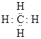
    2.  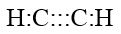
    3.  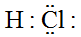

**Lesson Objective: Understand how a coordinate covalent bond differs from other covalent bonds.**

11. In a coordinate covalent bond
    1.  no electrons are shared
    2.  a double set of electrons are shared
    3.  one atom provides both electrons
    4.  the electrons alternate between the two atoms
12. True/False: A coordinate covalent bond is stronger than a regular covalent bond.
13. What structural feature is needed for an atom to provide the electrons for a coordinate covalent bond?

**Lesson Objective: Be able to draw Lewis structures for polyatomic ions.**

14. A polyatomic ion
    1.  has more than one electrical charge.
    2.  is a group of covalently bonded atoms with an overall charge
    3.  is a group of covalently bonded atoms with a distributed charge
    4.  is a group of ions held together by an electrical charge
15. One of the following is not a polyatomic ion
    1.  NH4_+_
    2.  SO3_\-_
    3.  SO4_2-_
    4.  O_2-_
16. True/False: The electrical charge in a polyatomic ion is not localized.
17. True/False: Coordinate covalent bonds are never seen in polyatomic ions.
18. In a polyatomic ion, the charge can be determined by counting the total number of \_\_\_\_\_ electrons in the structure.
19. Determine the number of valence electrons in the polyatomic ion OH_\-_.

**Lesson Objective: Understand the concept of resonance.**

20. A resonance structure
    1.  represents electron shifts among atoms
    2.  shows multiple structures of the same compound
    3.  gives a partial idea of the actual structure
    4.  violates the octet rule
21. True/False: a “half-bond” in a resonance structure is shown by a dotted line.
22. How do we know that the electrons in ozone do not rapidly shift back and forth among the three O atoms?

**Lesson Objective: Know some common exceptions to the octet rule.**

23. One of the following is not an exception to the octet rule.
    1.  even-electron molecules
    2.  odd-electron molecules
    3.  incomplete octet
    4.  expanded octet
24. True/False: The d sublevel becomes important in covalent bonds for elements of the third period and beyond.
25. Nitrous oxide (N-O) is a covalently bonded compound that is an exception to the octet rule. Which exception? Explain your answer.

**Lesson Objective: Relate bond energy to the stability and reactivity of molecules.**

26. One of the following has the highest bond energy:
    1.  H-H
    2.  C=C
    3.  Cl-Cl
    4.  C-H
27. True/False: A high-energy bond is more reactive than a low-energy bond.
28. True/False: Bond energy is the energy required to break a covalent bond.
29. Why would a triple bond be stronger than a single bond?
30. Resonance is the use of two or more Lewis structures to represent the covalent bonding in a molecule. Each of the valid structures is referred to as a resonance structure. It is now understood that the true structure of a molecule that displays resonance is an average or a hybrid of all the resonance structure.
31. Why is it difficult to represent resonance structures on paper?
32. Why do boron and aluminum not form complete octets of valence electrons when forming covalent compounds?

</article>

### 9.2 Molecular Geometry

<article>

Worksheets
----------

**Name \_\_\_\_\_\_\_\_\_\_\_\_\_\_\_\_\_\_\_\_\_ Class \_\_\_\_\_\_\_\_\_\_\_\_\_\_\_\_\_\_\_\_\_\_ Date \_\_\_\_\_\_\_\_\_\_\_\_\_\_\_\_**

_Answer each of the questions below to show your achievement of the lesson objectives_

**Lesson Objective: Explain the basis of VSEPR theory.**

1.  Molecular geometry deals with
    1.  the size of a molecule
    2.  the shape of a molecule
    3.  the formula mass of a molecule
    4.  the electrical charge on the molecule
2.  The VSEPR model states that
    1.  electrons will cluster in orbitals
    2.  valence electrons can form covalent bonds
    3.  valence electron pairs stay far apart
    4.  valence electrons bring atoms closer together
3.  True/False: Double and triple bonds are no different in repulsion than single bonds.
4.  True/False: Valence bond electrons are shown in Lewis structures.
5.  VSEPR stands for \_\_\_\_\_\_-\_\_\_\_\_\_\_\_\_ \_\_\_\_\_\_\_\_\_ \_\_\_\_\_\_\_\_.
6.  For VSEPR purposes, molecules are classified according to the number of \_\_\_\_\_ \_\_\_\_\_ and the number of \_\_\_\_\_ \_\_\_\_\_\_ around the \_\_\_\_\_\_\_\_ atom.

**Lesson Objective: Predict the shapes of molecules and polyatomic ions using VSEPR theory.**

7.  The AB2 VSEPR configuration is
    1.  planar
    2.  tetrahedral
    3.  linear
    4.  polygonal
8.  PCl5 contains two Cl atoms with an \_\_\_\_\_\_\_\_ orientation.
    1.  equilateral
    2.  equidistant
    3.  equimetric
    4.  equatorial
9.  The molecular geometry of methane is
    1.  tetrahedral
    2.  trigonal
    3.  pyramidal
    4.  equilateral
10. True/False: Dotted line bonds project out of the page.
11. True/False: In PCl5, three of the Cl atoms are in the same plane.
12. True/False: An octahedral shape would have seven sides.
13. Name the following VSEPR shape
    1.  
    2.  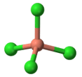
    3.  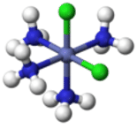

**Lesson Objective: Account for variations in bond angles based on the relative repulsive forces exerted by lone pairs and bonding pairs of electrons.**

14. Lone pair electrons are \_\_\_\_\_\_ repulsive than bonding pair electrons.
    1.  slightly more
    2.  much more
    3.  slightly less
    4.  much less
15. The molecular geometry of the water molecule is
    1.  crooked
    2.  bent
    3.  trigonal
    4.  tetrahedral
16. A distorted tetrahedron configuration is seen in the \_\_\_\_\_\_\_ molecule.
    1.  SF5
    2.  ClF3
    3.  SF4
    4.  Cl2F5
17. True/False: The H-O-H bond angle is 104.5°.
18. True/False: The ammonia molecule contains two lone pairs.
19. True/False: VSEPR treats double and single bonds in different ways.
20. Why is the shape of the ammonia molecule trigonal instead of tetrahedral?
21. Use the diagram below to explain how the lone pair electrons influence the shape of the water molecule.
22. 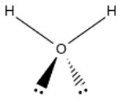

**Lesson Objective: Describe the relationship between molecular geometry and electron domain geometry.**

22. Electron domain geometry deals with
    1.  both bonding electrons and lone pair electrons
    2.  lone pair electrons only
    3.  bonding electrons only
    4.  resonance electrons
23. Lone pair electrons use \_\_\_\_\_\_ than bonding pair electrons
    1.  more space
    2.  the same amount of space
    3.  less space
    4.  variable space
24. True/False: Lone pairs on the atoms surrounding the central atom do not affect the geometry.
25. True/False: Lone pairs on the central atom are not considered in determining geometry.
26. The water molecule has a \_\_\_\_\_ molecular geometry and a \_\_\_\_\_\_\_ electron domain geometry.
27. Why is the electron domain geometry of ozone called trigonal planar?
28. In XeF4, two of the atoms are replaced by lone pairs, forming a \_\_\_\_\_\_ \_\_\_\_\_\_\_ geometry.
29. The bromine pentafluoride molecule (**Figure** [below](#x-ck12-Q2hlbS1XQi0wOS0xNA..)) has a central bromine atom, five single bonds to fluorine atoms, and one lone pair.
30. 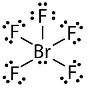
    
31. The six groups of electrons around the central atom give it an octahedral domain geometry. Since all of the peripheral atoms in an octahedral molecule are equivalent, any one of them could equally be replaced by the lone pair. The resulting geometry is called
32. _square pyramidal_
33. . A surface covering a square pyramidal molecule is a four sided pyramid on a flat base.
34. What would be the expected molecular geometry of BrF4? Explain your answer.
35. What is the major difference in the molecular geometry and the electron domain geometry in terms of assigning shapes to molecules?

</article>

### 9.3 Polarity and Intermolecular Forces

<article>

Worksheets
----------

**Name \_\_\_\_\_\_\_\_\_\_\_\_\_\_\_\_\_\_\_\_\_ Class \_\_\_\_\_\_\_\_\_\_\_\_\_\_\_\_\_\_\_\_\_\_ Date \_\_\_\_\_\_\_\_\_\_\_\_\_\_\_\_**

_Answer each of the questions below to show your achievement of the lesson objectives_

**Lesson Objective: Describe how the electronegativity difference between two atoms in a covalent bond results in the formation of a nonpolar covalent, polar covalent, or ionic bond.**

1.  Electronegativity is the
    1.  number of positive charges on an ion
    2.  relative ability of an atom to attract electrons
    3.  ability of a cation to attract anions
    4.  conductivity of a molecule
2.  A non-polar covalent bond involves
    1.  equal sharing of electrons
    2.  strong attraction of electrons by one atom
    3.  balanced charge distribution in the bond
    4.  unpaired electrons in orbitals
3.  The Greek letter $\delta$ represents
    1.  change in state
    2.  rate of reaction
    3.  partial charge
    4.  partial bond energy
4.  The C-I bond is
    1.  mostly ionic
    2.  partially covalent
    3.  polar covalent
    4.  mostly covalent
5.  True/False: A difference in electronegativity greater than 1.8 indicates a mainly ionic bond.
6.  True/False: The Si-Cl bond is mostly covalent
7.  True/False: The bond between Cl and Br is non-polar covalent.
8.  True/False: Bonds between a metal atom and a non-metal atom are usually ionic in nature.
9.  Define the following terms:
10. a. non-covalent polar bond
11. b. diatomic element
12. c. polar covalent bond
13. The atom with the highest electronegativity is \_\_\_\_\_\_.
14. The atom with the lowest electronegativity is \_\_\_\_\_\_ .
15. Arrange the following bonds in terms of increasing polarity, beginning with the lowest polarity:
    1.  Ni-P
    2.  Si-Cl
    3.  Al-Cl
    4.  Cu-Br
    5.  Pb-I

**Lesson Objective: Describe how molecular geometry plays a role in determining whether a molecule is polar or nonpolar**

13. A polar molecule has
    1.  two negative poles
    2.  two positive poles
    3.  one end is slightly negative
    4.  no charge distribution
14. A dipole has
    1.  two like charges
    2.  two diffuse charges
    3.  two poles
    4.  two negative poles
15. True/False: Carbon tetrachloride is a non-polar molecule.
16. True/False: The dipoles in the water molecule cancel each other out.
17. Why is BF3 non-polar?
18. What would be the effect on the polarity of the molecule formed when CCl4 has one Cl replaced by an H?

**Lesson Objective: Distinguish between the following three types of intermolecular forces: dipole-dipole forces, London dispersion forces, and hydrogen bonds.**

19. London dispersion forces
    1.  are seen between polar atoms
    2.  are a result of differing electronegativities between two atoms
    3.  are due to random motions of molecules
    4.  are due to random motions of electrons
20. Hydrogen bonds involve
    1.  H covalently bonding to carbon
    2.  H interacting with halogens
    3.  H attached to an electronegative atom attracted to a lone pair of electrons
    4.  H attached to an electronegative atom attracted to an electronegative atom
21. True/False: A H attached to a Si atom can form a hydrogen bond.
22. True/False: Dispersion forces are a form of van der Waals interactions.
23. \_\_\_\_\_\_\_\_\_\_\_\_ \_\_\_\_\_\_\_\_\_\_\_\_\_\_ are attractions between molecules.
24. Why would London dispersion forces be so weak?

**Lesson Objective: Describe how chemical bonding and intermolecular forces influence the properties of various compounds.**

25. One of the statements below about water solubility of molecular compounds is not correct
    1.  molecules that form hydrogen bonds are usually soluble
    2.  molecules that form dispersion forces are usually soluble
    3.  molecules that form dipole-dipole forces are usually soluble
    4.  molecules that form ions are usually soluble
26. When heated, diamond
    1.  melts at high temperature
    2.  vaporizes to a gas
    3.  does not change
    4.  converts to graphite
27. True/False: At room temperature, molecular compounds can be solid, liquid, or gas.
28. True/False: HBr has a higher boiling point than HF.
29. Melting and boiling points of molecular compounds are \_\_\_\_\_ in comparison with ionic compounds.
30. Why are lone pair electrons needed to form H bonds?
31. The degree to which a given bond is ionic or covalent is determined by calculating the difference in electronegativity between the two atoms involved in the bond. As an example, consider the bond that occurs between an atom of potassium and an atom of fluorine. Using the table, the difference in electronegativity is $4.0-0.8=3.2$. Because the difference in electronegativity is relatively large, the bond between the two atoms is primarily ionic. Since the fluorine atom has a much larger attraction for electrons than the potassium atom does, the valence electron from the potassium atom is considered to have completely transferred to the fluorine atom. The figure below shows how the difference in electronegativity relates to the ionic or covalent character of a chemical bond.
32. Is there a clear difference between an ionic bond and a covalent bond?
33. Offer one reason why a knowledge of bond polarity might be useful in predicting chemical reactions.

</article>

### 9.4 Hybridization of Atomic Orbitals

<article>

Worksheets
----------

**Name \_\_\_\_\_\_\_\_\_\_\_\_\_\_\_\_\_\_\_\_\_ Class \_\_\_\_\_\_\_\_\_\_\_\_\_\_\_\_\_\_\_\_\_\_ Date \_\_\_\_\_\_\_\_\_\_\_\_\_\_\_\_**

_Answer each of the questions below to show your achievement of the lesson objectives_

**Lesson Objective: Describe valence bond theory as it pertains to the formation of a covalent bond between atoms.**

1.  Valence bonds are formed between \_\_\_\_\_\_ electrons in two atoms
    1.  matched
    2.  equal spin
    3.  unpaired
    4.  matched
2.  The bond length is
    1.  the distance between two radii
    2.  twice the distance of the atomic nuclei
    3.  the optimum distance between the two nuclei
    4.  the distance between outer energy levels
3.  True/False: At the bond length, the potential energy becomes a minimum.
4.  True/False: Overlapping orbitals must be of the same type.
5.  State the valence bond theory.
6.  Would group one atoms be likely to form covalent bonds? Explain your answer.

**Lesson Objective: Describe the process of electron promotion and hybridization during the formation of hybrid orbitals.**

7.  The H-C-H bond angle in methane is
    1.  1070
    2.  900
    3.  109.50
    4.  106.50
8.  The symbol $\uparrow$ indicates
    1.  electron magnetic field
    2.  unpaired electron
    3.  electron orbital shape
    4.  electron principal energy level
9.  Hybrid orbitals
    1.  form as a result of electron repulsion
    2.  act to stabilize orbitals
    3.  form in preparation for bond formation
    4.  act to reorient bonds
10. True/False: The process of bond formation is accompanied by a decrease in energy.
11. True/False: Oxygen in compounds has one lone pair of hybridized electrons.
12. True/False: The molecular geometry of ammonia is tetrahedral.
13. Carbon forms a set of hybrid orbitals called \_\_\_\_\_\_\_\_.
14. Why does helium not form covalent bonds?
15. Explain how oxygen in compounds gets two lone pairs of electrons.

**Lesson Objective: Explain the relationship between electron domain geometry and the various types of hybrid orbitals.**

16. The geometry of $sp$ orbitals is
    1.  tetrahedral
    2.  trigonal planar
    3.  linear
    4.  trigonal pyramidal
17. Trigonal bipyramidal hybridization involves \_\_\_\_\_\_ orbitals
    1.  two
    2.  three
    3.  four
    4.  five
18. VSEPR can be used for all of the following except
    1.  predicting reactivity
    2.  predicting molecular geometry
    3.  predicting electron domain geometry
    4.  hybridization
19. True/False: Hybridization can involve d-orbitals.
20. True/False: Trigonal bipyramidal geometry is associated with sp_3_ hybridization.
21. True/False: The sp_2_ hybridization is seen in BF3.
22. Predict the hybridization expected in AlH3
23. What type of hybridization would you expect for SiCl4?
24. Does phosphorus have $d$ electrons to use in bonding for PCl5?

**Lesson Objective: Distinguish between sigma and pi bonding.**

25. A triple bond consists of
    1.  three sigma bonds
    2.  two sigma bonds and one pi bond
    3.  one sigma bond and two pi bonds
    4.  three pi bonds
26. A double bond is formed from
    1.  two $s$ orbitals
    2.  one $s$ orbital and one $p$ orbital
    3.  two $p$ orbitals
    4.  one $p$ orbital and one $d$ orbital
27. True/False: The electron domain geometry around each carbon in a double bond is trigonal biplanar.
28. True/False: A sigma bond is formed by orbitals overlapping end-to-end.
29. How is the unhybridized $2p$ orbital in a carbon-carbon double bond oriented?
30. In a triple bond, how are the sets of unhybridized $p$ orbitals oriented with relation to one another?

Elements in the third period and beyond are capable of expanding their octet to form molecules with either trigonal bipyramidal or octahedral electron domain geometries. In order to accomplish this, the previously unoccupied orbitals in the $d$ sublevel of the central atom are involved in the hybridization process. For phosphorus pentachloride (PCl5), the electron domain and molecular geometries are trigonal bipyramidal. The electron promotion is from the $3s$ orbital to an empty $3d$ orbital.

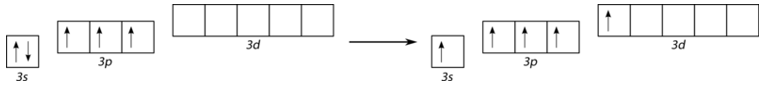

The hybridization then occurs with a single $s$ orbital, three $p$ orbitals, and a single $d$ orbital. The set of five hybrid orbitals are called $sp^3d$ hybrids.

&nbsp;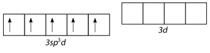

The overlap of the five hybrid $sp^3d$ orbitals with the $3p$ orbital of each chlorine atom results in the five covalent bonds of PCl5. Other molecular geometries derived from trigonal bipyramidal electron domain geometry (seesaw, T-shaped, linear) also display the same hybridization. Is the promotion of an $s$ orbital electron to a $d$ orbital a violation of the Aufbau principle.

31. Would you expect a bond formed by overlapping $p$ orbitals to be more reactive than a sigma bond on the same carbon? Explain your answer.

</article>

## 10.0 The Mole Worksheets

<article>

</article>

### 10.1 The Mole Concept

<article>

Worksheet
---------

**Name \_\_\_\_\_\_\_\_\_\_\_\_\_\_\_\_\_\_\_\_\_ Class \_\_\_\_\_\_\_\_\_\_\_\_\_\_\_\_\_\_\_\_\_\_ Date \_\_\_\_\_\_\_\_\_\_\_\_\_\_\_\_**

_Answer each of the questions below to show your achievement of the lesson objectives_

**Lesson Objective: Identify three methods for measuring the amount of matter in a sample.**

1.  One of the following is not a way to determine the amount of a material.
    1.  determine the mass
    2.  determine the molecular structure
    3.  determine the volume
    4.  determine the number of molecules
2.  An exact quantity
    1.  is an approximation
    2.  can vary from one place to another
    3.  has unlimited significant figures
    4.  has ten significant figures
3.  True/False: Dimensional analysis involves measuring the size of a material.
4.  True/False: Conversion factors allow us to determine the amount of a material in different units.
5.  A box of 56 candy bars is purchased. They are to be shared among eight students. How many candy bars does each student get?
6.  Two cups of oil are needed for baking. If there are 237 mL/cup, will a 30-ounce bottle of oil be sufficient for the recipe (30 mL/ounce)?

**Lesson Objective: Define the mole and its relationship to Avogadro’s number.**

7.  The mole is the SI unit for
    1.  volume of a gas
    2.  mass of material
    3.  number of representative particles
    4.  volume of liquid
8.  One of the following cannot serve as a representative particle
    1.  formula unit
    2.  ion
    3.  atom
    4.  molecule
9.  True/False: The representative particle for KBr is the formula unit.
10. True/False: A representative particle can vary depending on the size of the sample.
11. State Avogadro’s number
12. Define representative particle.

**Lesson Objective: Use Avogadro’s number to convert between moles and the number of representative particles of a substance.**

13. The molecule CH3CH2CHBrCH2(CH3)2CCH3 contains \_\_\_\_ carbon atoms
    1.  seven
    2.  nine
    3.  ten
    4.  eight
14. True/False: A mole of the above compound contains 18 moles of H atoms.
15. How many particles are there in 2.4 moles of CO2?
16. How many moles of NaCl are there in $1.14 \times 10^{24}$ particles?
17. Nitric acid has the formula HNO3. If there are $3.55 \times 10^{23}$ atoms of O in the sample, how many moles of nitric acid are there?

**Lesson Objective: Relate the atomic mass of an element to its molar mass.**

18. The atomic mass unit is based on
    1.  C-13
    2.  C-9
    3.  C-12
    4.  C-11
19. One of the following is not true about the atomic mass of an element
    1.  is affected by the number of isotopes
    2.  is a weighted average of all the isotopes
    3.  does not count the unstable isotopes
    4.  considers each isotope to be important
20. True/False: Atomic masses are generally not whole numbers.
21. True/False: The atomic mass of an element is usually expressed in grams.
22. How many moles of gold are there in $14.2 \times 10^{23}$ atoms of gold?
23. There are 4.7 moles of helium in a container. How many atoms of He does the container hold?

**Lesson Objective: Calculate the molar mass of a given compound.**

24. The molecular mass of a compound is
    1.  the mass of one molecule
    2.  the mass of $6.02 \times 10^{23}$ molecules
    3.  the mass of the central atom
    4.  the mass of one ion
25. True/False: The term “formula mass” only applies to ions.
26. True/False: Ionic compounds exist in an extended three-dimensional lattice.
27. Calculate the formula masses of the following compounds
    1.  KBr
    2.  NaMnO4
    3.  CH3CH2CH2Cl
    4.  (NH4)2SO4

</article>

### 10.2 Mass, Volume and the Mole

<article>

Worksheet
---------

**Name \_\_\_\_\_\_\_\_\_\_\_\_\_\_\_\_\_\_\_\_\_ Class \_\_\_\_\_\_\_\_\_\_\_\_\_\_\_\_\_\_\_\_\_\_ Date \_\_\_\_\_\_\_\_\_\_\_\_\_\_\_\_**

_Answer each of the questions below to show your achievement of the lesson objectives_

**Lesson Vocabulary**

* Avogadro’s hypothesis
* molar volume
* standard temperature and pressure (STP)

**Lesson Objective: Use molar mass to make conversions between mass and moles of a substance.**

1.  The molar mass of NaCl is \_\_\_\_\_\_\_ g/mol
    1.  58.5
    2.  74.6
    3.  42.0
    4.  42.4
2.  The compound whose molar mass is 133.5 is
    1.  MgCl2
    2.  AlCl3
    3.  TiBr2
    4.  CsI
3.  True/False: The number of moles of product can be determined by measuring the mass of the product.
4.  Find the mass of the following materials:
    1.  0.45 moles Au
    2.  1.33 moles Mn.
    3.  3.7 moles Fe2O3
    4.  2.9 moles CuCl2
5.  Determine the number of moles in each of the following:
    1.  224 grams IrI
    2.  748 grams NaNO3
    3.  136 grams CH3CHClCH2CH3
    4.  12.7 grams C6H2(NO2)3CH3

**Lesson Objective: Explain Avogadro’s hypothesis and how it relates to the volume of a gas at standard temperature and pressure.**

6.  All of the following except one are properties of gases.
    1.  compressible
    2.  expands when heated
    3.  little space between molecules
    4.  actual size of gas particles negligible
7.  Conditions for standard temperature and pressure of a gas are
    1.  0°C and 1 atm
    2.  0°K and 1 atm
    3.  32°C and 2 atm
    4.  273°K and 2 atm
8.  True/False: At STP, one mole of any gas occupies 22.4 L.
9.  True/False: As the temperature increases, the gas volume decreases.

**Lesson Objective: Convert between moles and volume of a gas at STP.**

10. True/False: one mole of gas = 22.4 liters at any temperature.
    1.  How many moles are there in 45.7 L of gas at STP?
    2.  A reaction produced 235 moles of gas. What volume did the gas occupy?
11. Why must conditions be at STP in order for the 22.4 L conversion factor to be used?

**Lesson Objective: Calculate the density of gases at STP.**

13. One of the following statements about gas density is not true. The density of a gas is affected by
    1.  molar mass
    2.  temperature
    3.  pressure
    4.  reactivity
14. Gas density can be calculated using the formula
    1.  $D = \frac{\text{molar mass}}{22.4}$
    2.  $D = \text{molar mass} \times 22.4$
    3.  $D = \frac{22.4}{\text{molar mass}}$
    4.  $D = \frac{\text{molar mass}}{ \text{volume}}$
15. True/False: Units for gas density are grams/L
16. True/False: The density of helium is less than the density of air
17. Calculate the densities of the following gases at STP:
    1.  N2
    2.  SO2
    3.  CH4
18. Calculate the molar mass of the gases when given the density at STP:
    1.  1.43 g/L
    2.  1.25 g/L
    3.  5.40 g/L

**Lesson Objective: Use the mole road map to make two-step conversions between mass, number of particles, and gas volume.**

19. The \_\_\_\_ is at the center of any calculations in the road map
    1.  mole
    2.  mass
    3.  density
    4.  volume
20. What is the molar mass of a gas that has a mass of 6.5 grams at a volume of 12.4 L at STP?
21. What volume will be occupied by 3.2 moles of O2 at STP?
22. How many particles are in a 45.7 L volume of gas at STP?

</article>

### 10.3 Chemical Formulas

<article>

Worksheet
---------

**Name \_\_\_\_\_\_\_\_\_\_\_\_\_\_\_\_\_\_\_\_\_ Class \_\_\_\_\_\_\_\_\_\_\_\_\_\_\_\_\_\_\_\_\_\_ Date \_\_\_\_\_\_\_\_\_\_\_\_\_\_\_\_**

_Answer each of the questions below to show your achievement of the lesson objectives_

**Lesson Objective: Calculate the percent composition of a compound either from mass data or from the chemical formula. Use percent composition to calculate the mass of an element in a certain sample of a compound.**

1.  The percent composition is defined as percent by \_\_\_\_\_\_ .
    1.  volume
    2.  mass
    3.  ions
    4.  molecular weight
2.  In determining percent composition, it is assumed that
    1.  analytical methods are variable
    2.  different answers are acceptable
    3.  the composition will vary
    4.  the material is pure
3.  True/False: Percent mass = mass of compound/mass of element.
4.  True/False: The sum of percent masses of the elements must equal 100%.
5.  Determine the percent composition of the following compounds:
    1.  NaOH
    2.  CuBr2
    3.  N2S2
6.  Determine the percent composition from the following analytical data:
    1.  Analysis shows that 2.56 grams of iron reacts with 1.08 grams oxygen.
    2.  An experiment was performed in which 6.1 g table salt produced 2.6 g Cl in the sample.
    3.  A reaction uses 18.06 grams Mg to react completely with 6.96 grams N

**Lesson Objective: Calculate the percentage of a hydrate's mass that is due to water.**

7.  A hydrate is
    1.  a molecule containing H and O
    2.  a molecule that dissolves in water
    3.  a molecule with one or more water molecules as part of the structure
    4.  a molecule that produces water when reacted with acids
8.  Anhydrous CoCl2 has a \_\_\_\_\_ color
    1.  red
    2.  pink
    3.  blue
    4.  green
9.  True/False: Many ionic compounds contain water as part of the crystal lattice.
10. True/False: Cobalt (II) chloride hexahydrate contains seven molecules of water.
11. Calculate the percent by mass of water in the following compounds:
    1.  $SnCl_5\cdot 5H_2O$
    2.  $FeCl_3\cdot 6H_2O$
    3.  $Ba(OH)_2\cdot 8H_2O$

**Lesson Objective: Determine the empirical formula of a compound from percent composition data.**

12. Glucose has the molecular formula of C6H12O6. The correct empirical formula for glucose is
    1.  C3H6O3
    2.  C2H4O2
    3.  CH2O
    4.  C2HO
13. True/False: Only empirical formulas are used to describe ionic compounds.
14. True/False: Elemental analysis tells us the atomic masses of the elements in the compound.
15. Calculate the empirical formula of each compound from the data listed below:
    1.  39.9% C, 6.7% H, 53.4% O
    2.  65.5% C, 5.5% H, 29.0% O
    3.  34.95% C, 6.844% H, 46.56% O, 13.59% N

**Lesson Objective: Determine the molecular formula of a compound from the empirical formula and the molar mass.**

16. The molar mass of a compound can be determined using a
    1.  mass spectrometer
    2.  atomic absorption spectrometer
    3.  X-ray spectrometer
    4.  infrared spectrometer
17. True/False: The molecular formula and the empirical formula for a compound may be the same.
18. Determine the molecular formula from the following data:
    1.  empirical formula C2OH4 molar mass 88 g/mol
    2.  empirical formula C4H4O molar mass 136 g/mol
    3.  empirical formula CFBrO molar mass 254.7 g/mol

</article>

## 11.0 Chemical Reactions Worksheets

<article>

</article>

### 11.1 Chemical Equations

<article>

Worksheet
---------

**Name \_\_\_\_\_\_\_\_\_\_\_\_\_\_\_\_\_\_\_\_\_ Class \_\_\_\_\_\_\_\_\_\_\_\_\_\_\_\_\_\_\_\_\_\_ Date \_\_\_\_\_\_\_\_\_\_\_\_\_\_\_\_**

_Answer each of the questions below to show your achievement of the lesson objectives._

**Lesson Objective: Describe chemical reactions using word equations.**

1.  In a chemical equation, the arrow stands for
    1.  yields
    2.  comes from
    3.  equals
    4.  is

2.  Which of the following is not a word equation?
    1.  silver + sulfur → silver sulfide
    2.  burning wood → carbon dioxide and water
    3.  drive north → turn left at the light
    4.  water forms hydrogen and oxygen

3.  A reactant is
    1.  the material formed in the reaction
    2.  produced in the reaction
    3.  the material acted upon
    4.  the process of reacting

4.  True/False: Burning is a chemical reaction.
5.  True/False: Tarnish is formed when silver sulfide reacts with air.
6.  True/False: Some chemical equations use an equal sign to show products.

7.  The generic chemical equation: \_\_\_\_\_\_\_\_\_\_\_ → \_\_\_\_\_\_\_\_\_\_\_\_\_\_ .
8.  Methane + \_\_\_\_\_\_\_\_\_ → \_\_\_\_\_\_\_\_ + \_\_\_\_\_\_\_\_\_\_.

**Lesson Objective: Know the correct symbols to use in order to write skeleton equations for chemical reactions.**

9.  A skeleton equation shows
    1.  formulas of reactants
    2.  formulas of products
    3.  formulas of reactants and products
    4.  the process of the reaction

10. One of the following is not used to describe the physical state of a material in a reaction
    1.  s
    2.  l
    3.  g
    4.  w

11. Only one of the following is true: In a skeleton equation, all the formulas must
    1.  be written correctly
    2.  have balanced structures
    3.  use names of materials
    4.  use arrows to show direction

12. True/False: A chemical equation is a presentation of a chemical reaction.
13. True/False: The abbreviation (s) stands for “solution”.
14. True/False: Skeleton equations show the relative amounts of materials to be used.

15. Comment on the following equations
    1.  $CH_4 \leftarrow CO_2 + H_2O$
    2.  $H_2O_{(s)} \rightarrow H_{2(s)} + O_2(l)$

16. What symbols could be written above the arrow and what do they represent?

**Lesson Objective: Use coefficients to balance chemical equations so that the law of conservation of mass is followed.**

17. A balanced equation assumes all of the following except
    1.  the law of conservation of mass is true
    2.  amount of reactants does not equal amount of product
    3.  matter can neither be created nor destroyed
    4.  equal numbers of atoms of each kind exist on both sides of the arrow

18. One of the following is not used in balancing equations
    1.  change subscripts on formulas
    2.  change coefficients
    3.  double-check accuracy of formulas
    4.  make sure correct products are produced in the reaction

19. If more than one reactant or product are present, they are separated with
    1.  dash
    2.  comma
    3.  plus
    4.  bracket

20. Which of the following represents the correct way to balance the equation for the formation of methane from carbon and hydrogen?
    1.  $C + H_2 \rightarrow CH_4$
    2.  $C + 2H_2 \rightarrow CH_4$
    3.  $2C + H_2 \rightarrow C_2H_2$
    4.  $2C + 4H_2 \rightarrow C_2H_8$

21. True/False: Mass does not need to be conserved in a chemical reaction.
22. True/False: A coefficient is used in front of a chemical to indicate number of atoms in balanced equation.
23. True/False: Subscripts can be changed in order to balance an equation.
24. True/False: If a polyatomic ion is unchanged, it can be treated as a unit.

25. What is the problem with each of the following equations?
    1.  $H_2O \rightarrow H_2 + O_2$
    2.  $1 N_2 + 3 H_2 \rightarrow 2 NH_3$

26. Balance the following equations:
    1.  $KClO_3 \rightarrow KCl + O_2$
    2.  $NaCl + F_2 \rightarrow NaF + Cl_2$
    3.  $Pb(OH)_2 + HCl \rightarrow H_2O + PbCl_2$
    4.  $AlBr_3 + K_2SO_4 \rightarrow KBr + Al_2(SO_4)_3$
    5.  $C_3H_8 + O_2 \rightarrow CO_2 + H_2O$

27. Write balanced equations from the word equations below.
    1.  sodium + water → sodium hydroxide + hydrogen
    2.  hydrochloric acid + calcium carbonate → calcium chloride + water + carbon dioxide
    3.  iron(III) chloride + sodium hydroxide → iron(III) hydroxide + sodium chloride
    4.  phosphorous + oxygen → phosphorus pentoxide
    5.  silver oxide → silver + oxygen

</article>

### 11.2 Types of Chemical Reactions

<article>

Worksheet
---------

**Name** \_\_\_\_\_\_\_\_\_\_\_\_\_\_\_\_\_\_\_\_\_ **Class** \_\_\_\_\_\_\_\_\_\_\_\_\_\_\_\_\_\_\_\_\_\_ **Date** \_\_\_\_\_\_\_\_\_\_\_\_\_\_\_\_

_Answer each of the questions below to show your achievement of the lesson objectives._

**Lesson Objective: Define and give general equations for combination, decomposition, single-replacement, and double-replacement reactions.**

1.  The general equation for a decomposition reaction is
    1.  A + B → AB
    2.  AB → A + B
    3.  A + BC → AC + B
    4.  AB + CD → AD + CB

2.  In a decomposition reaction, one of the products can be a
    1.  compound
    2.  element
    3.  atom
    4.  ion

3.  Zn reacts with HCl in a \_\_\_\_\_\_\_\_ reaction.
    1.  decomposition
    2.  halogen replacement
    3.  hydrogen replacement
    4.  combination

4.  True/False: There are five basic types of chemical reactions.
5.  True/False: In a single-replacement reaction, a non-metal can displace a metal.
6.  True/False: Many metals react easily with acids.

7.  Metal \_\_\_\_\_\_ decompose on heating to form \_\_\_\_\_ \_\_\_\_\_ and \_\_\_\_\_\_\_.
8.  The reaction of sulfur trioxide with water leads to the formation of \_\_\_\_\_\_ \_\_\_\_\_\_\_.
9.  Most decomposition reactions involve the input of \_\_\_\_\_\_\_ in the form of \_\_\_\_\_\_, \_\_\_\_\_, or \_\_\_\_\_\_\_.

**Lesson Objective: Classify a reaction as combination, decomposition, single-replacement, double-replacement, or combustion.**

10. Many metals react with acids to form
    1.  metal oxides
    2.  halogens
    3.  hydrogen gas
    4.  bases

11. A metal carbonate decomposes to form
    1.  metal oxide
    2.  metal oxide + oxygen
    3.  metal hydroxide
    4.  metal oxide + carbon dioxide

12. In a double displacement reaction, one product could be all of the following except
    1.  a gas
    2.  water
    3.  a precipitate
    4.  an element

13. True/False: Lead iodide forma a yellow precipitate.
14. True/False: Combustion reactions involve oxygen
15. True/False: One new compound is formed in a double-replacement reaction.

16. Combination reactions can occur when an \_\_\_\_\_\_ reacts with a compound to form a compound with a \_\_\_\_\_\_\_ number of atoms.
17. The products of hydrocarbon combustion are \_\_\_\_\_\_\_\_ and \_\_\_\_\_\_\_.
18. One type of double-displacement reaction leads to the formation of a \_\_\_\_\_\_\_ compound.

**Lesson Objective: Use the activity series to correctly predict whether a given reaction will occur.**

19. The activity series
    1.  is a list of possible chemical reactions
    2.  ranks metals in terms of reactivity with water
    3.  tells which metals will ionize in solution
    4.  shows which metals displace halogens

20. Only one of the metals below will react with cold water
    1.  Fe
    2.  Ca
    3.  Co
    4.  Mg

21. True/False: The activity series can be used to predict the likelihood of a single-replacement reaction taking place.
22. True/False: Copper reacts with water, but not with acids.

23. In the following equations, indicate “reaction” or “no reaction”. Do not list a product
    1.  $Mg + Co(NO_3)_2 \rightarrow$
    2.  $Cu + Co(NO_3)_2 \rightarrow$
    3.  $Pb + Ni(NO_3)_2 \rightarrow$

**Lesson Objective: Predict the products of simple reactions, given only the reactants.**

24. Zn does not react with one of the following:
    1.  steam
    2.  acids
    3.  $Sr(NO_3)_2$
    4.  $Fe(NO_3)_2$

25. The activity series allows the prediction of products of \_\_\_\_\_\_\_\_ reactions.
    1.  decomposition
    2.  single-replacement reactions
    3.  combustion
    4.  combination

26. True/False: Silver reacts with acids.
27. True/False: Two new compounds are formed in double-replacement reactions.

28. Write the formulas for the products of the following reactions:
    1.  $Li + Cr(NO_3)_2 \rightarrow$
    2.  $NaCl + AgNO_3 \rightarrow$
    3.  $CH_3CH_2CH_2OH + O_2 \overset{\Delta}{\rightarrow}$
    4.  $Mn + O_2 \rightarrow$
    5.  $CaCO_3 \overset{\Delta}{\rightarrow}$
    6.  $Ba + HCl \rightarrow$

</article>

## 12.0 Stoichiometry Worksheets

<article>

</article>

### 12.1 Mole Ratios

<article>

Worksheet
---------

**Name \_\_\_\_\_\_\_\_\_\_\_\_\_\_\_\_\_\_\_\_\_ Class \_\_\_\_\_\_\_\_\_\_\_\_\_\_\_\_\_\_\_\_\_\_ Date \_\_\_\_\_\_\_\_\_\_\_\_\_\_\_\_**

_Answer each of the questions below to show your achievement of the lesson objectives_

**Lesson Objective: Relate balanced chemical equations to everyday analogies, such as a recipe.**

1.  A recipe for lasagna that serves four requires $\frac{1}{4}$ cup grated Parmesan cheese. You have eight people coming for dinner and want to expand the recipe to feed them. How much Parmesan cheese do you need?
    1.  $\frac{1}{4}$ cup
    2.  $\frac{3}{4}$ cup
    3.  $\frac{1}{2}$ cup
    4.  $\frac{2}{3}$ cup
2.  If four extra people show up for dinner, how much more Parmesan cheese do you need in addition to what you used in problem one?
    1.  $\frac{1}{2}$ cup
    2.  $\frac{1}{4}$ cup
    3.  $\frac{3}{4}$ cup
    4.  $\frac{1}{3}$ cup
3.  A peanut butter and jelly sandwich (PBJ) requires two slices of bread (B), one serving of peanut butter (PB), and one serving of jelly (J). Write the equation for this sandwich.

**Lesson Objective: Define stoichiometry.**

4.  Stoichiometry requires the use of $a(n)$
    1.  balanced equation
    2.  unbalanced equation
    3.  skeleton equation
    4.  word equation
5.  True/False: \_\_\_\_\_ Stoichiometry allows calculations of needed amounts of chemicals in a reaction.
6.  You have fifteen slices of bread and five servings of peanut butter. How many sandwiches can you make?
7.  Each morning for breakfast, you have two slices of toast, one bowl of Crunchy Puffs (30 g), one glass of milk (8 oz), and one banana. You have twelve slices of bread, a full box of cereal (250 g), 36 oz milk, and four bananas. How many full servings of breakfast do you have?
8.  An acoustic guitar has six strings, six tuning pegs, twenty frets, and one pick guard. A guitar maker has 90 frets to use. How many guitars can be made?
9.  For each of the following reactions, determine the mass of reactants and products:
    1.  $8 CO + 17 H_2 \rightarrow C_8H_{18} + 8 H_2O$
    2.  $4 NH_3 + 5 O_2 \rightarrow 4 NO + 6 H_2O$
    3.  $TiCl_4 + 2 H_2O \rightarrow TiO_2 + 4 HCl$

**Lesson Objective: Use mole ratios to convert between amounts of substances in a chemical reaction.**

10. In a laboratory situation, it is common to express the amounts of materials in all of the ways below except
    1.  mL
    2.  moles
    3.  grams
    4.  number of particles
11. Mole ratio is a conversion factor that converts
    1.  moles to grams
    2.  grams to moles
    3.  ratio of one material to another
    4.  ratio of atoms in the equation
12. True/False: Chemical equations express the relative amounts of reactants and products in a reaction.
13. True/False: In a chemical reaction, the number of moles of reactants will equal the number of moles of product.
14. True/False: In a mole ratio problem, the given amount is written first.

15. $C_2H_6O + 3 O_2 \rightarrow 2 CO_2 + 3 H_2O$
16. Write the mole ratios of
    1.  $O_2 \rightarrow CO_2$
    2.  $C_2H_6O \rightarrow CO_2$
    3.  $C_2H_6O \rightarrow O_2$

16. $12 HClO_4 + P_4O_{10} \rightarrow 4 H_3PO_4 + 6 Cl_2O_7$
17. Write the mole ratios of
    1.  $HClO_4 \rightarrow H_3PO_4$
    2.  $HClO_4 \rightarrow Cl_2O_7$
    3.  $P_4O_{10} \rightarrow H_3PO_4$

17. $2 NaCl + F_2 \rightarrow 2 NaF + Cl_2$
    1.  How many moles of $NaF$ will be produced from 1.2 moles $F_2$?
    2.  How many moles of $NaCl$ are needed to form 3.7 moles $Cl_2$?

18. $2 C_3H_8 + 5 O_2 \rightarrow 3 CO_2 + 4 H_2O$
    1.  How many moles of $C_3 H_8$ are needed to produce 4.9 moles $CO_2$
    2.  How many moles $O_2$ are needed for the complete combustion of 4.2 moles $C_3 H_8$?

19. $Pb(OH)_2 + 2 HCl \rightarrow 2 H_2O + PbCl_2$
    1.  How much $Pb(OH)_2$ is required to form 3.6 moles of $PbCl_2$
    2.  How much $HCl$ is needed for that reaction?
    3.  4.7 moles $Pb(OH)_2$ will require how many moles $HCl$?

20. $4 NH_3 + 5 O_2 \rightarrow 4 NO + 6 H_2O$
    1.  How much ammonia is needed to produce 3.2 moles $NO$?
    2.  How much oxygen is needed for this process?
    3.  6.9 moles ammonia will produce how much $H_2O$?

</article>

### 12.2 Stoichiometric Calculations

<article>

Worksheet
---------

**Name \_\_\_\_\_\_\_\_\_\_\_\_\_\_\_\_\_\_\_\_\_ Class \_\_\_\_\_\_\_\_\_\_\_\_\_\_\_\_\_\_\_\_\_\_ Date \_\_\_\_\_\_\_\_\_\_\_\_\_\_\_\_**

_Answer each of the questions below to show your achievement of the lesson objectives_

**Lesson Objective: Calculate the amount in moles of a reactant or product from the mass of another reactant or product. Calculate the mass of a reactant or product from the moles of another reactant or product.**

**Lesson Objective: Calculate the mass of a reactant or product from the mass of another reactant or product.**

3.  76 g $SnO_2$ are used in the following reaction: $SnO_2 + 2 H_2 \rightarrow Sn + 2 H_2O$
4.  How any grams of
5.  $Sn$
6.  are formed?

4.  The following reaction produces 35.1 g of $NaCl: Na_3PO_4 + 3 HCl \rightarrow 3 NaCl + H_3PO_4$
    1.  How many grams of $Na_3PO_4$ are needed?
    2.  How many grams $H_3PO_4$ are formed?

**Lesson Objective: Create volume ratios from a balanced chemical equation.**

5.  The combustion of methane gas is described by the equation $CH_4 + 2 O_2 \rightarrow CO_2 + 2 H_2O$.
    1.  What volume of oxygen is needed at STP to combust 4.7 L methane?
    2.  How much carbon dioxide will be formed?

6.  Carbon monoxide can be converted to carbon dioxide in the presence of oxygen as seen in the equation $2CO + O_2 \rightarrow 2CO_2$.
    1.  How many liters of oxygen at STP are needed to react with 17.3 L CO?
    2.  How much carbon dioxide will be formed?

**Lesson Objective: Use volume ratios and other stoichiometric principles to solve problems involving mass, molar amounts, or volumes of gases.**

8.  In the reaction $Ba_3N_2 + 6 H_2O \rightarrow 3 Ba(OH)_2 + 2 NH_3$, there are 84.3 grams $Ba(OH)_2$ formed.
    1.  What is the volume of ammonia produced at STP?
    2.  How many moles of $Ba_3N_2$ are needed?

</article>

### 12.3 Limiting Reactant and Percent Yield

<article>

Worksheet
---------

**Name \_\_\_\_\_\_\_\_\_\_\_\_\_\_\_\_\_\_\_\_\_ Class \_\_\_\_\_\_\_\_\_\_\_\_\_\_\_\_\_\_\_\_\_\_ Date \_\_\_\_\_\_\_\_\_\_\_\_\_\_\_\_**

_Answer each of the questions below to show your achievement of the lesson objectives_

**Lesson Objective: Analyze a chemical reaction in order to determine which reactant is the limiting reactant and which is the excess reactant.**

1.  The reagent which determines how much product will be made is the \_\_\_\_\_\_\_ reagent
    1.  deficient
    2.  rate-limiting
    3.  limiting
    4.  restricted
2.  The excess reagent is the material that is
    1.  used up in the reaction
    2.  left over
    3.  brings stoichiometric balance
    4.  makes extra product
3.  A balanced equation tells us
    1.  the masses of materials needed
    2.  the masses of the products
    3.  the mole ratio needed for the reaction to occur
    4.  the number of representative units of the products
4.  True/False: All reactions need an excess reagent.
5.  True/False: Limiting reagents produce multiple products.
6.  You find six frozen pizza crusts in the freezer and decide to make pizza. For each pizza, you need 8oz pizza sauce, $\frac{1}{2}$ cup sliced pepperoni, and 4 oz shredded mozarella cheese. You check your available ingredients and find you have 64 oz pizza sauce, 2.5 cups sliced pepperoni and 30 oz mozarella cheese. What is the limiting reagent and how many pizzas can you actually make?
7.  In the reaction $2 Al + 3 I_2 \rightarrow 2 AlI_3$, determine the limiting reagent if 1.6 mol $Al$ and 2.9 mol $I_2$ are used
8.  Propane burns in oxygen according to the following reaction: $C_3H_8 + 5 O_2 \rightarrow 3 CO_2 + 4 H_2O$
9.  If 14.g grams propane reacts with 3.44 grams oxygen, identify the limiting reagent.
10. The reaction shown below uses 30 g ammonium nitrate and 50 g sodium phosphate. Determine the limiting reagent
11. $3 NH_4NO_3 + Na_3PO_4 \rightarrow (NH_4)_3PO_4 + 3 NaNO_3$

**Lesson Objective: Calculate the amount of excess reactant remaining after a reaction is complete.**

10. To identify the excess reagent, all data must be in \_\_\_\_\_\_ quantities
    1.  molal
    2.  molecular
    3.  mass
    4.  molar
11. True/False: A balanced equation allows us to determine the excess reagent.
12. Iron reacts with sulfur in the following process: $Fe(s) + S(l) \rightarrow FeS(s)$. If 7.5 g iron reacts with 9.1 g sulfur, what is the excess reagent and how much of that reagent is left at the end of the reaction?
13. Calcium carbonate and iron(III) phosphate react as shown in the equation below:
14. $3 CaCO_3 + 2 FePO_4 \rightarrow Ca_3(PO_4)_2 + Fe_2(CO_3)_3$
15. In one experiment, 95.5 g calcium carbonate are combined with 43.2 g iron(III) phosphate. What is the excess reagent in the process and how much of that reagent remains when the reaction is completed?

**Lesson Objective: Calculate the theoretical yield of a reaction when the available amounts of each reactant are known.**

14. The theoretical yield is
    1.  the amount you hope to get
    2.  the maximum amount that can be formed from the given amounts of reactants
    3.  The amount you need for the next reaction
    4.  the actual amount you obtain in the reaction
15. True/False: The theoretical yield is often below 90%.

16. Calculate the theoretical yield in each of the following situations:
    1.  $C_6H_6 + Cl_2 \rightarrow C_6H_5Cl + HCl$ calculate the yield of $C_6H_5Cl$ from 40.7 g benzene.
    2.  $CS_2 + 3 O_2 \rightarrow CO_2 + 2 SO_2$ calculate the yield of $SO_2$ from 27 g carbon disulfide.
    3.  $H_3PO_4 + 3 KOH \rightarrow K_3PO_4 + 3 H_2O$ calculate the yield of $K_3PO_4$ from 86.3 g $KOH$.

**Lesson Objective: Calculate the percent yield of a reaction based on the theoretical and actual yields.**

17. Actual yield is
    1.  the amount you obtain in the reaction
    2.  the amount you want to obtain in the reaction
    3.  the amount of product using excess reagent
    4.  the amount of product before purification
18. Percent yield can be determined using
    1.  the fraction you actually obtain
    2.  actual yield minus theoretical yield
    3.  theoretical yield divided by actual yield
    4.  actual yield divided by theoretical yield
19. One of the following is not a cause for percent yield being less than 100%
    1.  incomplete reaction
    2.  uncalibrated balance
    3.  side reactions
    4.  impure product
20. True/False: Actual yield can be affected by products that are not dry.
21. True/False: Impurities should be calculated as part of actual yield.
22. True/False: A high percent yield indicates a more efficient and economical reaction

23. Carry out the percent yield calculations in the following situations:
    1.  Theoretical yield: 14.7 g
    2.  Actual yield: 12.9 g Percent yield: ?
    3.  Theoretical yield: 89.5 g
    4.  Actual yield: ? Percent yield: 56.4%
    5.  Theoretical yield: ?
    6.  Actual yield: 27.4 g Percent yield: 68.3%

</article>

## 13.0 States of Matter Worksheets

<article>

</article>

### 13.1 Kinetic - Molecular Theory and Gases

<article>

Worksheet
---------

**Name \_\_\_\_\_\_\_\_\_\_\_\_\_\_\_\_\_\_\_\_\_ Class \_\_\_\_\_\_\_\_\_\_\_\_\_\_\_\_\_\_\_\_\_\_ Date \_\_\_\_\_\_\_\_\_\_\_\_\_\_\_\_**

_Answer each of the questions below to show your achievement of the lesson objectives_

**Lesson Objective: State the main points of the kinetic molecular theory, and describe how it relates to the properties of an ideal gas.**

1.  All of the following except one are forms of matter
    1.  gas
    2.  solid
    3.  electronegativity
    4.  liquid

2.  Which of the following is the correct statement about the effects of temperature (T) on the average kinetic energy of gas particles (KE)?
    1.  increase in T $\rightarrow$ decrease in KE
    2.  increase in T $\rightarrow$ no effect on KE
    3.  decrease in T $\rightarrow$ increase in KE
    4.  decrease in T $\rightarrow$ decrease in KE

3.  The forces of attraction between molecules of an ideal gas are
    1.  ionic
    2.  non-existent
    3.  dipole-dipole
    4.  electrostatic

4.  The kinetic-molecular theory assumes that
    1.  molecules are always in motion
    2.  above room temperature, molecules are in motion
    3.  molecules are not in motion at temperatures below freezing
    4.  temperature has no effect on molecular motion

5.  True/False: Gas molecules are far apart.
6.  True/False: An ideal gas is an imaginary gas.
7.  True/False: The kinetic-molecular theory only applies to gases.
8.  True/False: Collisions between gas molecules result in loss of kinetic energy.

9.  Gas particles are in constant \_\_\_\_\_\_\_ motion in \_\_\_\_\_\_\_ directions.
10. There are no forces of \_\_\_\_\_\_\_\_\_or \_\_\_\_\_\_\_\_\_ between gas particles.
11. The kinetic-molecular theory as applied to gases has \_\_\_\_\_ basic assumptions.

**Lesson Objective: Define pressure and describe how gases exert pressure.**

12. Pressure equals
    1.  $\frac{\text{force}}{\text{area}}$
    2.  $\frac{\text{area}}{\text{force}}$
    3.  $\text{force} \times \text{area}$
    4.  $\text{force} + \text{area}$

13. The earth’s atmosphere exerts pressure because
    1.  high temperatures increase gas motions
    2.  gravity pulls gas molecules down
    3.  more gas molecules = more pressure
    4.  higher altitude = higher pressure

14. True/False: A heavier rock exerts more pressure on the ground than a lighter rock.
15. True/False: Gas pressure results from collisions of gas molecules with the sides of a container.

16. Pressure is defined as the \_\_\_\_\_ per unit area on a \_\_\_\_\_\_.

**Lesson Objective: Understand the barometer and how it measures atmospheric pressure. Convert between units of gas pressure.**

17. A barometer is used to measure
    1.  gas pressure for experiments
    2.  atmospheric pressure
    3.  vacuum pressure
    4.  gas pressure in enclosed systems

18. Only one of the following is not used to measure air pressure
    1.  manometer
    2.  aneroid barometer
    3.  mercury barometer
    4.  sphygmomanometer

19. True/False: Evangelsista Torricelli invented the barometer.
20. True/False: The mm Hg is the standard unit of pressure.

21. Perform the following conversions:
    1.  698 torr to kPa
    2.  107 kPa to atm
    3.  0.9 atm to mm Hg
    4.  93.2 kPa to mm Hg

**Lesson Objective: Relate temperature to average kinetic energy.**

22. One of the following statements about absolute zero is not true
    1.  absolute zero = zero degrees K
    2.  absolute zero is the temperature at which there is no electron movement
    3.  absolute zero is the temperature at which there is no molecular motion
    4.  absolute zero is based on a theoretical limit

23. The kinetic energy of particles in a sample of NaCl
    1.  increase with an increase in temperature
    2.  decrease with an increase in temperature
    3.  increase with a decrease in temperature
    4.  is not affected by a change in temperature

24. True/False: At room temperature, the average kinetic energy of ice is the same as the average kinetic energy of steam.
25. True/False: Absolute zero has been reached in the laboratory.

26. As temperature \_\_\_\_\_\_\_, the range of kinetic energies increases and the distribution curve \_\_\_\_\_\_\_\_\_\_\_\_.

27. When a person stands on the floor, his feet exert pressure on the surface. That pressure is related to both the mass of the person and the surface area of his feet. If the person were holding a heavy object, the pressure would increase because of a greater force. Alternatively, if the person stands on his toes, the pressure also increases because of a decrease in the surface area.
28. A ballerina has a mass of 54.5 kg. Her feet occupy a space of 220 cm
29. _2_
30. . Calculate the pressure exerted on the floor when she is standing flat-footed. When dancing
31. _en pointe_
32. (on the tips of her toes), her shoes occupy a space of 30 cm
33. _2_
34. . Calculate the new pressure.
35. One drop of water has a volume of about 0.05 mL. How many atoms of helium at STP would occupy that volume?

</article>

### 13.2 Liquids

<article>

Worksheet
---------

**Name \_\_\_\_\_\_\_\_\_\_\_\_\_\_\_\_\_\_\_\_\_ Class \_\_\_\_\_\_\_\_\_\_\_\_\_\_\_\_\_\_\_\_\_\_ Date \_\_\_\_\_\_\_\_\_\_\_\_\_\_\_\_**

_Answer each of the questions below to show your achievement of the lesson objectives_

**Lesson Objective: Describe a liquid according to the kinetic-molecular theory.**

1.  One of the following statements about gases is incorrect
    1.  gas particles are very far apart
    2.  gases cannot be compressed
    3.  gas particles do not interact with one another
    4.  intermolecular forces can be ignored for gases
2.  One of the following statements about liquids is false
    1.  intermolecular forces hold liquid particles together
    2.  liquids and gases are fluids
    3.  liquids can be compressed
    4.  there is very little empty space between particles of a liquid
3.  True/False: Liquids are much more dense than gases
4.  True/False: A liquid has a defined shape.
5.  A \_\_\_\_\_\_ is a substance that is capable of \_\_\_\_\_\_\_\_\_ from one place to another.

**Lesson Objective: Describe how a liquid exhibits surface tension.**

6.  One of the following statements about liquids is not true
    1.  particles at the surface are pulled downward
    2.  particles at the surface are pulled upward
    3.  particles at the surface are pulled sideways
    4.  particles at the surface are pulled into the liquid
7.  Only one of the following effects is produced in water because of its surface tension
    1.  floating of rock
    2.  floating of paper clip
    3.  floating of rowboat
    4.  floating of carbon dioxide
8.  True/False: Liquids with strong intermolecular forces show high surface tensions.
9.  True/False: Surface tension is a measure of the elastic force on the surface of the liquid.
10. The \_\_\_\_\_\_\_\_\_\_ of a liquid is a measure of the \_\_\_\_\_ force in the liquid’s surface.
11. Which of the molecules shown below will exhibit the highest surface tension? Explain your answer.
    1.  CH3CH2CH3
    2.  CH3\-O-CH3
    3.  CH3CH2OH

**Lesson Objective: Describe the evaporation of a liquid and its relationship to the kinetic energy of the evaporating particles.**

12. During the process of evaporation
    1.  molecules with lower kinetic energy escape first
    2.  as evaporation proceeds, the temperature of the liquid increases
    3.  an increase in temperature of the liquid will increase the rate of evaporation
    4.  liquid in a closed container will evaporate more rapidly than liquid in an open container.
13. Evaporation of a liquid requires all of the following except
    1.  high enough temperatures
    2.  high enough kinetic energy so that particles can escape the surface
    3.  an open system
    4.  very high atmospheric pressure
14. True/False: A liquid whose particles have higher kinetic energies will evaporate more slowly than a liquid whose particles have a lower kinetic energy.
15. Define the following terms
    1.  vaporization
    2.  evaporation
    3.  condensation

**Lesson Objective: Define vapor pressure and understand its relationship to intermolecular forces and to the temperature of the liquid.**

16. Liquid in a closed container behaves in the following way:
    1.  rate of evaporation equals rate of condensation
    2.  rate of condensation is greater than rate of evaporation
    3.  collisions with the side of the container increases the kinetic energy of the liquid
    4.  rate of evaporation is greater than rate of condensation
17. One of the following statements about vapor pressure is not true
    1.  based on strength of intermolecular forces
    2.  constant for a given substance at a set temperature
    3.  can be measured using a manometer
    4.  a liquid with weak intermolecular forces has a low vapor pressure
18. True/False: Liquid in a closed system demonstrates a dynamic equilibrium between vapor and liquid.
19. True/False: A given liquid will evaporate less quickly when it is heated.
20. True/False: The temperature dependence of vapor pressure for a liquid is linear.

**Lesson Objective: Describe the process of boiling and differentiate between boiling point and normal boiling point.**

21. In the four settings below, the boiling point of water is highest at
    1.  Mauna Kea, Hawaii (13,803 fett above sea level)
    2.  Denver, Colorado (5183 feet above sea level)
    3.  New Orleans, Louisiana (4 feet above sea level)
    4.  Death Valley, California (282 feet below sea level)
22. The standard pressure for measuring boiling points is
    1.  750 torr
    2.  760 mm Hg
    3.  725 torr
    4.  745 mm Hg
23. True/False: At the boiling point of a liquid, all molecules in the liquid have enough kinetic energy to vaporize.
24. True/False: Evaporation of a liquid does not occur below the boiling point.
25. The \_\_\_\_\_\_\_\_\_ is the temperature at which the vapor pressure of a liquid is equal to the \_\_\_\_\_\_\_ pressure.

**Lesson Objective: Use a vapor pressure curve to determine boiling points at different atmospheric pressures.**

26. The vapor pressure curve shows all of the following except
    1.  an increase in temperature produces an increase in pressure
    2.  water has the highest boiling point
    3.  diethyl ether has stronger intermolecular forces than water
    4.  at 200 mm Hg, the boiling point of ethanol is less than that of ether at 760 mm Hg
27. True/False: Pressure cookers increase the boiling point of water because the water vapor cannot escape.
28. Predict the boiling point of the following materials at a pressure of 400 mm
    1.  diethyl ether
    2.  ethyl alcohol
    3.  water
29. Liquids and solids are referred to as the condensed states of matter. One way in which liquids and gases are similar is that they are both fluids. A **fluid** _is a substance that is capable of flowing from one place to another and takes the shape of its container._
30. Give an example of a gas flowing from one place to another.
31. Would you be able to brew a decent cup of coffee on top of Mt. Everest?

</article>

### 13.3 Solids

<article>

Worksheet
---------

**Name \_\_\_\_\_\_\_\_\_\_\_\_\_\_\_\_\_\_\_\_\_ Class \_\_\_\_\_\_\_\_\_\_\_\_\_\_\_\_\_\_\_\_\_\_ Date \_\_\_\_\_\_\_\_\_\_\_\_\_\_\_\_**

_Answer each of the questions below to show your achievement of the lesson objectives_

**Lesson Objective: Describe a solid according to the kinetic-molecular theory.**

1.  One of the following is not a characteristic of a solid
    1.  particles packed tightly
    2.  properties of a fluid
    3.  densest of three states of matter
    4.  almost completely incompressible
2.  One of the following is not true about melting point of a solid
    1.  same as freezing point of corresponding liquid
    2.  dependent upon strength of attractive forces
    3.  at melting point, solid and liquid are in equilibrium
    4.  ionic bonds contribute to low melting points
3.  True/False: Vibrational forces disrupt attractive forces at melting point.
4.  True/False: Solid particles are organized in orderly arrangements.
5.  The melting point is the temperature at which a \_\_\_\_\_\_\_\_ changes into a \_\_\_\_\_\_\_.

**Lesson Objective: Understand that a solid also has a vapor pressure, and describe the relationship between the vapor pressure of a solid and sublimation.**

6.  One of the following does not undergo sublimation
    1.  iodine crystals
    2.  solid carbon dioxide
    3.  gold nuggets
    4.  ice cubes
7.  \_\_\_\_\_\_\_ is the term used for the change of state from a gas to a solid.
    1.  freezing
    2.  crystallization
    3.  deposition
    4.  precipitation
8.  True/False: Dry ice is not a good coolant because it readily melts into liquid slush.
9.  True/False: Iodine can sublimate at room temperature.
10. Sublimation is the change of state from a \_\_\_\_\_ to a \_\_\_\_\_ without passing through the \_\_\_\_\_\_ state.

**Lesson Objective: Describe the features of the seven basic crystal systems.**

11. One of the following is not a crystal system
    1.  pyramidal
    2.  monoclinic
    3.  tetragonal
    4.  hexagonal
12. In the cubic crystal structure
    1.  $a \neq b=c$
    2.  $a=b=c$
    3.  $a \neq b \neq c$
    4.  $a=b \neq c$
13. True/False: In the orthorhombic crystal, the angles between the faces are all 90°.
14. True/False: Particles of a solid crystal are either ions or molecules.
15. A crystal is a substance in which the particles are arranged in an \_\_\_\_\_, repeating, \_\_\_\_\_\_ \_\_\_\_\_\_\_\_\_\_\_ pattern.
16. Name the crystal systems illustrated below.
    1.  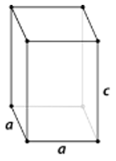
    2.  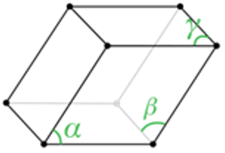
    3.  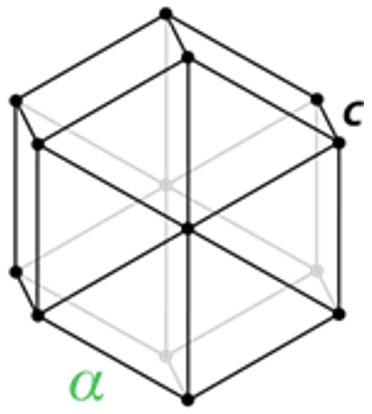

**Lesson Objective: Define a unit cell.**

17. One of the following is not a cubic crystal system unit cell
    1.  simple cubic
    2.  rhombic cubic
    3.  face-centered cubic
    4.  body-centered cubic
18. True/False: A crystal is a unit cell repeated over and over again in three dimensions.
19. A \_\_\_\_\_ \_\_\_\_\_\_ is the smallest portion of a crystal lattice that shows the three-dimensional pattern of the entire crystal.

**Lesson Objective: List the four classes of crystalline solids and describe the properties of each.**

20. Molecular crystals are held together by all the following forces except
    1.  hydrogen bonds
    2.  dispersion forces
    3.  ionic forces
    4.  dipole-dipole forces
21. Only one of the following solids is an example of a covalent network crystal
    1.  NaCl
    2.  SiO2
    3.  Na
    4.  NH3
22. True/False: Ionic crystals may be composed of either monatomic or polyatomic ions.
23. True/False: Metallic crystals are poor conductors of electricity.
24. List two examples of covalent network crystals.
25. Why do covalent network crystals have very high melting points?

**Lesson Objective: Describe an amorphous solid.**

26. All of the following are characteristics of glass except
    1.  distinct melting point
    2.  shatters in an irregular way
    3.  made by cooling a mixture of materials
    4.  soften when heated
27. True/False: Rubber and plastic are two examples of amorphous solids.
28. Define an amorphous solid.

29. When one of the noble gases is cooled and solidified, the lattice points are individual atoms rather than molecules. However, because the atoms are held together by dispersion forces and not by covalent or metallic bonds, the properties of such a crystal are most similar to the crystals of molecular substances.
30. What properties would you expect to see in the noble gas crystals?
31. Why would metallic crystals not be classified as ionic crystals?

</article>

### 13.4 Changes of State

<article>

Worksheet
---------

**Name \_\_\_\_\_\_\_\_\_\_\_\_\_\_\_\_\_\_\_\_\_ Class \_\_\_\_\_\_\_\_\_\_\_\_\_\_\_\_\_\_\_\_\_\_ Date \_\_\_\_\_\_\_\_\_\_\_\_\_\_\_\_**

_Answer each of the questions below to show your achievement of the lesson objectives_

**Lesson Objective: Interpret heating and cooling curves.**

1.  Water molecules in a block of ice that is being heated
    1.  absorb energy and vibrate faster
    2.  absorb energy and vibrate slower
    3.  release energy and vibrate faster
    4.  release energy and vibrate slower
2.  During the melting process, the solid and liquid states
    1.  lose energy
    2.  are in equilibrium with one another
    3.  are constantly changing
    4.  exist independently of one another
3.  \_\_\_\_\_ bonds keep the water molecules together in the solid and liquid states
    1.  dipole-dipole
    2.  covalent
    3.  van derWaals
    4.  hydrogen
4.  The transition from liquid water to ice involves
    1.  addition of energy
    2.  breaking of hydrogen bonds
    3.  loss of energy
    4.  breaking of covalent bonds
5.  True/False: The plateau portions of a heating curve indicate melting and boiling points for the material.
6.  True/False: The heating curve for carbon dioxide has two plateaus.
7.  True/False: An increase in kinetic energy of water molecules produces the phase changes in a heating curve.
8.  True/False: At the boiling point, the temperature will continue to increase as the liquid water changes into steam.
9.  The melting point of mercury is 234.3 K and the boiling point is 629.7 K.
    1.  Draw the heating curve for mercury
    2.  Why were K temperature units used instead of Celsius?
10. Draw a heating curve for carbon dioxide.

**Lesson Objective: Know the terms for the six different changes of state.**

11. At 100°C, water undergoes \_\_\_\_\_\_\_ to become steam
    1.  melting
    2.  condensation
    3.  vaporization
    4.  sublimation
12. Ice undergoes \_\_\_\_\_\_ at 273 K.
    1.  deposition
    2.  condensation
    3.  melting
    4.  vaporization
13. At 373 K, steam undergoes \_\_\_\_\_to become liquid.
    1.  condensation
    2.  deposition
    3.  freezing
    4.  sublimation
14. For water, the transition from liquid to solid occurs at \_\_\_\_\_\_\_ .
    1.  32°C
    2.  279 K
    3.  0°C
    4.  0 K
15. True/False: The transition from solid to liquid is called melting.
16. True/False: Carbon dioxide only transitions from solid to liquid.
17. True/False: The transition from liquid to vapor is called condensation.
18. True/False: Water undergoes three transition processes.
19. Define the following terms:
    1.  sublimation
    2.  melting
    3.  evaporation
    4.  condensation
    5.  freezing
    6.  deposition

**Lesson Objective: Describe the general features of a phase diagram, including the triple point and the critical point.**

20. If the pressure on a gas is increased, all of the following can happen except
    1.  the gas can form a liquid
    2.  the gas molecules are closer together
    3.  the gas will sublimate
    4.  a solid can form
21. If the pressure on liquid water at 100° is increased,
    1.  the water converts more easily to gas
    2.  the water remains in the liquid form
    3.  more solid water is formed
    4.  density of the water decreases
22. True/False: The solid state for water is less dense than the liquid state.
23. True/False: At a high enough pressure, a gas can be converted to a solid
24. Define the following terms:
    1.  phase diagram
    2.  triple point
    3.  critical temperature
    4.  critical pressure
25. At 373.99°C, particles of water in the gas phase are moving very, very rapidly. At any temperature higher than that, the gas phase cannot be made to liquefy, no matter how much pressure is applied to the gas.
26. Why can’t water condense at temperatures higher than this?
27. When solid water melts, energy must be put into the system until that process is complete. Why does the temperature remain constant during this process even though additional energy is being added?

</article>

## 14.0 The Behavior of Gases Worksheets

<article>

</article>

### 14.1 Gas Properties

<article>

Worksheet
---------

**Name \_\_\_\_\_\_\_\_\_\_\_\_\_\_\_\_\_\_\_\_\_ Class \_\_\_\_\_\_\_\_\_\_\_\_\_\_\_\_\_\_\_\_\_\_ Date \_\_\_\_\_\_\_\_\_\_\_\_\_\_\_\_**

_Answer each of the questions below to show your achievement of the lesson objectives._

**Lesson Objective: Describe how a gas can be compressed.**

1.  The pressure in a typical scuba tank is
    1.  700-800 atm
    2.  700-800 torr
    3.  200-300 atm
    4.  200-300 kPa

2.  At STP, the typical scuba tank will hold approximately \_\_\_\_\_\_.
    1.  2500 L
    2.  3500 L
    3.  2500 mL
    4.  3500 mL

3.  Gases can be compressed because
    1.  gas molecules are more flexible
    2.  gas molecules are farther apart
    3.  gas molecules have less energy
    4.  gas molecules move more slowly

4.  True/False: Gases are more compressible than liquids and solids.
5.  True/False: A given volume of gas has a definite shape.
6.  True/False: When gases are compressed, the particles are forced closer together.
7.  Gases are unlike other states of matter in that a gas \_\_\_\_\_\_ to fill the \_\_\_\_\_ and \_\_\_\_\_\_ of its container.
8.  Compressibility is a measure of how much a given \_\_\_\_\_ of matter \_\_\_\_\_\_ when placed under \_\_\_\_\_\_\_\_.

**Lesson Objective: Identify three factors that affect gas pressure. Describe the effects according to the kinetic-molecular theory.**

9.  Gas pressure is affected by all of the following except
    1.  molecular structure of gas
    2.  temperature
    3.  volume of container
    4.  amount of gas

10. If the amount of gas in a rigid container is increased,
    1.  the temperature will decrease
    2.  the pressure will increase
    3.  the pressure will decrease
    4.  the pressure will not change

11. If the volume of the container is decreased,
    1.  the pressure will decrease
    2.  there will be fewer gas collisions with the walls of the container
    3.  the pressure will increase
    4.  the pressure will not be affected

12. Increasing the volume of a container has the same effect on pressure as
    1.  decreasing the number of particles
    2.  increasing the temperature
    3.  increasing the number of particles
    4.  changing the container structure

13. An unvented can placed in a fire will
    1.  freeze
    2.  explode
    3.  ignite
    4.  collapse

14. An increase in temperature causes air molecules to
    1.  increase in velocity
    2.  decrease in velocity
    3.  react with their surroundings
    4.  become converted to other structures

15. One of the following does not produce an increase in pressure
    1.  increase in temperature
    2.  decrease in volume
    3.  increase in number of particles
    4.  increase in volume

16. True/False: Basketballs are checked for pressure before a game.
17. True/False: Adding more gas particles to a rigid container will lower the pressure.
18. True/False: The air in a fully inflated car tire is at a higher pressure than the outside air.
19. True/False: A decrease in the volume of a container causes gas particles to collide less frequently with the container wall.
20. True/False: An increase in temperature increases the kinetic energy of gas particles.
21. True/False: Doubling the Kelvin temperature doubles the pressure on a container.
22. True/False: Doubling the number of particles in a container decreases the number of collisions with the vessel walls.
23. Gas particles move \_\_\_\_\_\_ and in \_\_\_\_\_ lines until they \_\_\_\_\_\_\_ collide with other gas particles or with one of the walls of their container.
24. The collisions with the walls of the container define the \_\_\_\_\_\_\_ of the gas.
25. List the four variables used to describe the condition of a gas.
26. Gases are compressible because most of the volume of a gas is composed of the large amounts of empty space between the gas particles. At room temperature and standard pressure, the average distance between gas molecules is about ten times the diameter of the molecules themselves. When a gas is compressed, as when the scuba tank is being filled, the gas particles are forced closer together.
27. If the gas pressure is doubled, what would be the distance between gas molecules?
28. Summarize the behavior of a gas as a function of the rate of collision with the container walls.

</article>

### 14.2 Gas Laws

<article>

Worksheet
---------

**Name \_\_\_\_\_\_\_\_\_\_\_\_\_\_\_\_\_\_\_\_\_ Class \_\_\_\_\_\_\_\_\_\_\_\_\_\_\_\_\_\_\_\_\_\_ Date \_\_\_\_\_\_\_\_\_\_\_\_\_\_\_\_**

_Answer each of the questions below to show your achievement of the lesson objectives._

**Lesson Objective: Use Boyle’s law to calculate pressure-volume changes at constant temperature.**

1.  One of the following statements about the kinetic-molecular theory is incorrect
    1.  the volume of gas particles is negligible
    2.  attractive forces between gas molecules can be ignored
    3.  there is little space between gas particles
    4.  gas particles have elastic collisions with container walls

2.  Robert Boyle
    1.  developed many gas laws
    2.  is considered a founder of the science of chemistry
    3.  was a French scientist
    4.  studied the relationship between temperature and amount of gas

3.  Boyle’s Law deals with the relationship between
    1.  pressure and temperature
    2.  volume and temperature
    3.  pressure and volume
    4.  temperature and amount of gas

4.  True/False: In an inverse relationship, as one variable increases, the other variable decreases.
5.  True/False: Temperature is a variable when using Boyle’s Law.
6.  True/False: A plot of data for Boyle’s Law gives a straight line.
7.  The volume of a given mass of gas varies \_\_\_\_\_\_\_ with the \_\_\_\_\_\_\_ when the \_\_\_\_\_\_\_\_\_\_ is kept constant.
8.  Perform the following calculations:
    1.  What is the new volume of 500 mL of gas when the pressure changes from 750 torr to 980 torr? Assume a constant temperature.
    2.  A constant T, a 650 mL container of helium at 500 torr expands to 900 mL. What is the new pressure?

**Lesson Objective: Use Charles’s law to calculate volume-temperature changes at constant pressure.**

9.  The temperature scale used for Charles’ Law calculation is
    1.  Celsius
    2.  Fahrenheit
    3.  Kelvin
    4.  Centigrade

10. A gas brought to extremely low temperatures will
    1.  become liquid
    2.  increase in volume
    3.  lose molecules
    4.  remain a gas

11. True/False: As temperature increases at constant pressure, the volume decreases.
12. True/False: A plot of data for Charles’ Law gives a straight line.
13. Charles’ Law states that the volume of a given mass of gas varies directly with the \_\_\_\_\_\_temperature of the gas when the \_\_\_\_\_\_ is kept constant
14. Make the following calculations:
    1.  At constant pressure, the temperature of 350 mL of hydrogen is increased from 345K to 525K. What is the new volume?
    2.  At constant pressure, the volume of nitrogen gas decreases from 980 mL at 350K to 670 mL when the temperature is changed. What is the new temperature for the gas?

**Lesson Objective: Use Gay-Lussac’s law to calculate pressure-temperature changes at constant volume.**

15. Gay-Lussac’s Law requires a \_\_\_\_\_\_ container
    1.  flexible
    2.  expanding
    3.  rigid
    4.  variable

16. Gay-Lussac was a \_\_\_\_\_\_ chemist.
    1.  Belgian
    2.  Spanish
    3.  Italian
    4.  French

17. True/False: A plot of data for Gay-Lussac’s Law give a straight line.
18. True/False: An increase in temperature produces an increase in kinetic energy of gas particles.
19. As a gas is cooled at constant \_\_\_\_\_, its \_\_\_\_\_ continually decreases until the gas condenses to a liquid.
20. Make the following calculations:
    1.  A steel cylinder of oxygen gas shows a pressure of 3400 torr at $30^\circ C$. What is the pressure when the tank is at the top of Annapurna where the temperature is $-10^\circ C$.
    2.  A rigid cylinder of nitrogen shows a pressure of 4000 torr at $25^\circ C$. The cylinder is then transported to the desert where it shows a pressure of 4300 torr. What is the temperature in the desert?

**Lesson Objective: Use the combined gas law to solve problems in which pressure, volume, and temperature all change.**

21. In combined gas law problems, only the \_\_\_\_\_ is held constant.
    1.  volume of gas
    2.  amount of gas
    3.  pressure of gas
    4.  temperature of gas

22. In combined gas law calculations
    1.  pressures can only be in torr
    2.  volumes can only be in liters
    3.  temperatures can only be in Kelvin
    4.  pressures can only be in kPa

23. True/False: In the combined gas law expression, T is in the numerator.
24. True/False: In the combined gas law expression, V is in the numerator.
25. The combined gas law expresses the relationship between the \_\_\_\_\_, \_\_\_\_\_, and \_\_\_\_\_ temperature of a \_\_\_\_\_ amount of gas
26. Carry out the following calculations:
    1.  $P_1 = 230 \ torr \ \ T_1 = 473 \ K \ \ V_1 = 65 \ mL$
    2.  $P_2 = ? \ \ T_2 = 690 \ K \ \ V_2 = 37 \ mL$
    3.  $P_1 = 876 \ torr \ \ T_1 = 235 \ K \ \ V_1 = 450 \ mL$
    4.  $P_2 = 395 \ torr \ \ T_2 = 350 \ K \ \ V_2 ?$

**Lesson Objective: Use Avogadro’s law to calculate volume-number of moles changes at constant temperature and pressure.**

27. Avogadro’s Law relates volume and amount of gas at
    1.  constant temperature and pressure
    2.  constant temperature
    3.  constant pressure
    4.  constant velocity

28. True/False: Avogadro’s Law allows determination of the quantity of gas.
29. Perform the following calculations:
30. A 4.5 L balloon holds 2.5 mol of gas. If 1.6 mol of gas are added, what is the new volume of the balloon?

</article>

### 14.3 Ideal Gases

<article>

Worksheet
---------

**Name \_\_\_\_\_\_\_\_\_\_\_\_\_\_\_\_\_\_\_\_\_ Class \_\_\_\_\_\_\_\_\_\_\_\_\_\_\_\_\_\_\_\_\_\_ Date \_\_\_\_\_\_\_\_\_\_\_\_\_\_\_\_**

_Answer each of the questions below to show your achievement of the lesson objectives._

**Lesson Objective: Know the ideal gas law, and know which of the different values for the ideal gas constant to use in a given situation.**

1.  One of the following is not dealt with in the ideal gas law
    1.  pressure
    2.  number of moles
    3.  molecular mass
    4.  temperature

2.  The parameter $R$ in the ideal gas equation stands for
    1.  ideal gas variable
    2.  ideal gas constant
    3.  ideal gas value
    4.  ideal gas correction

3.  True/False: The ideal gas equation is $PV = mRT$.
4.  True/False: $R$ is the ideal gas constant.
5.  To evaluate the gas constant, it is necessary to use \_\_\_\_\_\_ for the temperature and it is conventional to use units of \_\_\_\_\_\_\_ for volume.
6.  When pressure is measured in kPa, the value for $R$ is \_\_\_\_\_\_\_\_\_\_.

**Lesson Objective: Use the ideal gas law to calculate the pressure, volume, temperature, or number of moles of an ideal gas when the other three quantities are known.**

7.  A joule equals
    1.  kPa/liter
    2.  $kPa \cdot L$
    3.  kPa/ml
    4.  $kPa \cdot mL$

8.  One of the following is not a value for R
    1.  $8.314 \ J/K \cdot mol$
    2.  $62.36 \ L \cdot mm \ Hg/K \cdot mol$
    3.  $5.34 \ L \cdot kPa/K \cdot mol$
    4.  $0.08206 \ L \cdot atm/K \cdot mol$

9.  True/False: Kelvin temperatures must be used in evaluating the gas constant.
10. True/False: All pressure units give the same value for $R$.
11. What volume is occupied by 23.4 mol hydrogen at a temperature of 317 K and a pressure of 719 mm Hg?
12. What is the pressure in atm of 16.7 mol helium that occupies a volume of 7.2 L at a temperature of 279 K?

**Lesson Objective: Use the ideal gas law to calculate the molar mass or the density of a gas.**

13. The molar mass of an unknown gas can be determined by
    1.  determining mass at STP
    2.  determining volume at STP
    3.  determining mass and volume at known temperature and pressure
    4.  determining mass and volume at STP

14. The number of moles of an unknown gas can be calculated using
    1.  $n = \frac{PV}{RT}$
    2.  $n = PVRT$
    3.  $n = \frac{RT}{PV}$
    4.  $n = \frac{PVR}{T}$

15. True/False: In calculating molar mass, it is assumed that the gas is ideal.
16. True/False: moles of gas/mass = molar mass.
17. A gas had a mass of 0.8396 g with a volume of 0.35 L at a pressure of 745 mm Hg and a temperature of 370 K. Calculate the molar mass.
18. What is the density of carbon tetrachloride vapor at 714 torr and 398 K?

**Lesson Objective: Use the ideal gas law in stoichiometry problems involving gases that are not at STP.**

19. One of the following is not needed to perform gas stoichiometry problems
    1.  a balanced equation
    2.  conditions of standard temperature and pressure
    3.  the amount of the starting material
    4.  the amount of product formed

20. Gas stoichiometry calculations require all of the following except
    1.  identity of reactants
    2.  formation of a gaseous product
    3.  formula mass of reactants
    4.  formula mass of products

21. True/False: Gas stoichiometry calculations can be performed using any set of conditions.
22. True/False: In combustion reactions, the products are carbon dioxide and water.
23. What volume of $CO_2$ is produced from the reaction of 36.7 g acetone at $76^ \circ C$ and a pressure of 645 mm Hg?.
24. 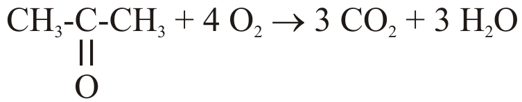
25. What volume of $O_2$ is needed to produce 112 g $CO_2$ from the combustion of acetylene at 303 K and 695 torr?
26. $2 \ CH \equiv CH + 5 \ O_2 \rightarrow 4 \ CO_2 + 2 \ H_2 O$

**Lesson Objective: Explain the conditions under which real gases are most ideal or least ideal.**

25. A gas deviates from ideal behavior at
    1.  very low pressures
    2.  very high temperatures
    3.  very low concentrations of gas particles
    4.  very high pressures

26. The ideal gas
    1.  has a $\frac{PV}{RT}$ ratio very close to one at all temperatures
    2.  has strong intermolecular interactions
    3.  has gas particles crowded close together
    4.  has little empty space between gas particles

27. True/False: The gas particles of a truly ideal gas can occupy volume.
28. True/False: Continued cooling of a gas converts it to a liquid.
29. Gases whose attractive forces are \_\_\_\_\_ are more \_\_\_\_\_ than those with strong attractive forces.
30. An \_\_\_\_\_ gas is one that follows the gas laws at all conditions of \_\_\_\_\_ and \_\_\_\_\_\_.
31. If the particles are moving at slower \_\_\_\_\_, the \_\_\_\_\_ forces between them are more prominent.

</article>

### 14.4 Gas Mixtures and Molecular Speeds

<article>

Worksheet
---------

**Name \_\_\_\_\_\_\_\_\_\_\_\_\_\_\_\_\_\_\_\_\_ Class \_\_\_\_\_\_\_\_\_\_\_\_\_\_\_\_\_\_\_\_\_\_ Date \_\_\_\_\_\_\_\_\_\_\_\_\_\_\_\_**

_Answer each of the questions below to show your achievement of the lesson objectives_

**Lesson Objective: Use Dalton’s law and mole fraction to calculate the partial pressure of a gas in a mixture.**

1.  Gas pressure for a mixture of nitrogen and helium is determined by
    1.  the total number of particles present
    2.  the pressure of the gas in higher quantity
    3.  pressure of nitrogen/pressure of helium
    4.  pressure of helium/pressure of nitrogen

2.  Mole fraction is defined as
    1.  moles of one substance/grams of total material
    2.  moles of one substance/ total moles of mixture
    3.  total moles of mixture/moles of one substance
    4.  grams of one substance/total grams of mixture

3.  Gases in a mixture
    1.  exert pressure affected by the structure of other gases
    2.  exert pressure affected by the pressure of other gases
    3.  exert pressure independently of other gases
    4.  exert a lower pressure when other gases are present

4.  True/False: The pressure exerted by one gas in a mixture is called its individual pressure.
5.  True/False: Nitrogen exerts more pressure in air than does oxygen.
6.  True/False: Gas pressure is influenced by the number of particles in the container.
7.  Define partial pressure
8.  A mixture of gases contains 2.7 moles gas A and 4.1 moles gas B. What is the mole fraction of each gas?
9.  One liter volumes of two gases are mixed in a one-liter container. Gas A has a pressure of 175 mm Hg and the total pressure of the mixture is 890 mm Hg. What is the pressure of gas B?
10. A mixture of 34.5 moles nitrogen and 14.7 moles argon produce a combined pressure of 1420 mm Hg. What is the partial pressure of each gas?

**Lesson Objective: Calculate the pressure of a gas that has been collected by water displacement in order to determine the volume of the dry gas.**

11. Collecting a gas by water displacement involves
    1.  bubbling water through the gas
    2.  dissolving the gas in water
    3.  passing the gas through water to collect it
    4.  reacting the gas with water

12. The vapor pressure of water
    1.  increases with an increase in temperature
    2.  decreases with an increase in temperature
    3.  increases with a decrease in temperature
    4.  is not affected by temperature

13. The actual volume of a gas collected over water
    1.  is higher than the volume observed
    2.  is not affected by water vapor
    3.  is lower than the volume observed
    4.  depends on the gas

14. True/False: Water displacement is often used to collect gases in the lab.
15. True/False: The water vapor in a gas will be due to evaporation.
16. True/False: Water vapor can be ignored in calculating gas volumes.
17. \_\_\_\_\_\_\_\_ law can be used to calculate the amount of the desired gas by \_\_\_\_\_\_\_\_\_\_ the contribution of the water vapor.
18. A gas is collected over water at $25^\circ C$. The volume is 3.5 L and the pressure is 785 mm Hg. What is the corrected pressure of the gas?
19. An experiment generates 1.8 L chlorine gas over water at a temperature of $30^\circ C$ and 698 mm Hg. What is the volume of chlorine gas at STP?

**Lesson Objective: Define diffusion and effusion.**

20. One of the following statements about diffusion is not true
    1.  gases diffuse more rapidly than liquids and solids
    2.  gases diffuse less rapidly that liquids or solids
    3.  liquids diffuse less rapidly than gases
    4.  solids do not diffuse

21. A hydrogen balloon will stop floating
    1.  after heavier gases have effused into the balloon
    2.  after nitrogen replaces the hydrogen
    3.  after hydrogen has effused from the balloon
    4.  after hydrogen combines with oxygen to form water in the balloon

22. True/False: Solids diffuse fairly readily.
23. True/False: Effusion involves gas escaping through a tiny hole.
24. \_\_\_\_\_\_\_\_ is the tendency of molecules to move from an area of \_\_\_\_\_\_ concentration to an area of \_\_\_\_\_ concentration until the concentration is\_\_\_\_\_\_\_\_.
25. \_\_\_\_\_\_\_\_ is the process of a \_\_\_\_\_\_\_\_ gas escaping through a tiny hole in its container.

**Lesson Objective: Use Graham’s law to calculate the velocity ratios of two gases based on their molar masses.**

26. The rate of diffusion for a gas is a function of
    1.  the square of the molar mass
    2.  the square root of the molar mass
    3.  the square of the kinetic energy
    4.  the square root of the kinetic energy

27. Graham’s Law was developed by
    1.  The Welch chemist Thomas Graham
    2.  The British chemist Alexander Graham
    3.  the Scottish chemist Thomas Graham
    4.  the Scottish chemist Alexander Graham

28. True/False: Gases with lower molar masses diffuse more rapidly than gases with higher masses.
29. True/False: Graham’s Law applies only to diffusion of a gas.
30. Calculate the relative rates of diffusion of H2 and He at STP.
31. A gas diffuses 3.98 times slower than H2 at the same temperature and pressure. What is the molar mass of the gas?

</article>

## 15.0 Water Worksheets

<article>

</article>

### 15.1 Properties of Water

<article>

Worksheet
---------

**Name \_\_\_\_\_\_\_\_\_\_\_\_\_\_\_\_\_\_\_\_\_ Class \_\_\_\_\_\_\_\_\_\_\_\_\_\_\_\_\_\_\_\_\_\_ Date \_\_\_\_\_\_\_\_\_\_\_\_\_\_\_\_**

_Answer each of the questions below to show your achievement of the lesson objectives_

**Lesson Objective: Describe the structure and polarity of a water molecule.**

1.  Bonds in a water molecule are
    1.  polar
    2.  polar covalent
    3.  covalent
    4.  ionic
2.  One of the following statements about the structure of water molecules is not true
    1.  oxygen is more electronegative than hydrogen
    2.  one oxygen atom is connected to two hydrogen atoms
    3.  the oxygen atom has a $\delta^+$ charge
    4.  the H-O-H bond angle is 105°
3.  The three-dimensional configuration of the water molecule is due to
    1.  repulsions between the two H atoms
    2.  attractions between O and H
    3.  sp_3_ hybridization
    4.  two sets of lone pair O electrons
4.  True/False: In a water molecule, O has a $\delta^-$ charge.
5.  True/False: The water molecule has a bent shape.
6.  True/False: The water molecule as a whole is non-polar.
7.  Because of the \_\_\_\_\_\_ electronegativity of the oxygen atom, the bonds are \_\_\_\_\_ covalent.
8.  The \_\_\_\_ shape of the water molecule is critical because the \_\_\_\_\_ O-H bonds do not \_\_\_\_\_ one another.
9.  Polar molecules attract one another by \_\_\_\_\_\_\_\_\_\_ forces.

**Lesson Objective: Describe the hydrogen bonding that occurs in water and ice.**

10. In a water molecule, the hydrogen atoms
    1.  have little electron density
    2.  are attracted to each other
    3.  function as dipoles
    4.  are unreactive
11. The bent structure of the water molecule
    1.  puts strain on the H-O bonds
    2.  makes the molecule polar
    3.  decreases interactions with other molecules
    4.  makes the O atom polar
12. The geometry around each oxygen atom in water is approximately
    1.  tetrahedral
    2.  square planar
    3.  biplanar
    4.  octahedral
13. True/False: Hydrogen atoms are strongly attracted to lone pair O electrons on adjacent water molecules.
14. True/False: Hydrogen bonds are weaker than conventional dipole-dipole interactions.
15. True/False: Each O atom can form hydrogen bonds with one other water molecule.
16. The geometry around each oxygen atom consists of two \_\_\_\_\_\_ bonds and two \_\_\_\_\_\_\_ bonds.
17. The geometry of the water molecule shows bond angles of \_\_\_\_\_\_\_ around each O atom. The bond angle for a “pure” tetrahedron is \_\_\_\_\_\_\_ .

**Lesson Objective: Discuss the unique properties of water and ice.**

18. Water reaches its highest density at approximately
    1.  0°C
    2.  4°C
    3.  12°C
    4.  6°C
19. As water freezes, the hydrogen bonds gradually form a \_\_\_\_\_\_\_\_\_\_ network.
    1.  tetragonal
    2.  octahedral
    3.  hexagonal
    4.  tetrahedral
20. Hydrogen bonding is responsible for all the following properties of water except
    1.  high surface tension
    2.  high melting point
    3.  low vapor pressure
    4.  low boiling point
21. When ice forms, one of the following occurs
    1.  hydrogen bonds rearrange to produce molecules with less space between them
    2.  hydrogen bonds no longer exist
    3.  hydrogen bonds rearrange to produce molecules with more space between them
    4.  hydrogen bonds move closer together
22. True/False: Between 4°C and 0°C, the density of water gradually increases.
23. True/False: Most molecular compounds with a molar mass similar to water are gases at room temperature.
24. True/False: Water’s high vapor pressure keeps lakes and rivers from evaporating too fast.
25. True/False: The hydrogen bonds in liquid water constantly break and reform.
26. Liquid water at 0°C has a density of \_\_\_\_\_\_\_ g/cm_3_, while solid water (ice) at the same temperature has a density of \_\_\_\_\_\_\_ g/cm_3_.
27. A great deal of \_\_\_\_\_ is required to break apart the \_\_\_\_\_\_\_\_ network of \_\_\_\_ and return it to the \_\_\_\_\_ state.
28. Surface tension can be seen by the curved \_\_\_\_\_\_\_ that forms when water is in a thin \_\_\_\_\_, such as a graduated \_\_\_\_\_ or a \_\_\_\_\_\_.

</article>

### 15.2 Aqueous Solutions

<article>

Worksheet
---------

**Name \_\_\_\_\_\_\_\_\_\_\_\_\_\_\_\_\_\_\_\_\_ Class \_\_\_\_\_\_\_\_\_\_\_\_\_\_\_\_\_\_\_\_\_\_ Date \_\_\_\_\_\_\_\_\_\_\_\_\_\_\_\_**

_Answer each of the questions below to show your achievement of the lesson objectives_

**Lesson Objective: Define a solution and describe the parts of a solution.**

1.  A true solution has all of the following characteristics except one:
    1.  solute does not settle out of solution.
    2.  solute can be removed by filtration.
    3.  solute can be solid, liquid, or gas
    4.  solution is stable
2.  Solute particles are
    1.  limited to ions
    2.  very large, greater than 1 mm
    3.  too small to measure
    4.  usually less than 1 nm
3.  True/False: Aqueous solutions can be made only with solids.
4.  True/False: Solute particles can be atoms, ions, or molecules
5.  Define the following terms:
    1.  solution
    2.  solvent
    3.  solute

**Lesson Objective: Describe how an aqueous solution is formed from both ionic compounds and molecular compounds.**

6.  All of the following are true statements about aqueous solutions except
    1.  water is a polar material
    2.  water molecules are in continuous motion
    3.  polar water molecules surround the crystal lattice
    4.  water is attracted to the ions in NaCl
7.  When a sugar molecule dissolves in water
    1.  water forms hydrogen bonds with the sugar molecules
    2.  water interacts with the sugar ions
    3.  the sugar molecule bonds are broken
    4.  the intermolecular forces for the sugar molecules are not affected.
8.  True/False: The Na_+_ is attracted to the oxygen end of the water molecule.
9.  True/False: Solute particles surround the water molecules.
10. Hydration is the process of \_\_\_\_\_\_ particles being \_\_\_\_\_\_\_by water molecules arranged in a specific manner.
11. \_\_\_\_\_\_ helps to \_\_\_\_\_\_ aqueous solutions by preventing the \_\_\_\_\_\_\_ and \_\_\_\_\_\_\_\_\_ ions from coming back together and forming a \_\_\_\_\_\_\_\_.

**Lesson Objective: Explain the reasons why some compounds are insoluble in water.**

12. When a nonpolar liquid is mixed with water
    1.  the water molecules surround the nonpolar molecules
    2.  the two liquids mix together
    3.  two layers are formed
    4.  the nonpolar liquid dissolves in the water
13. Ethanol dissolves in water because
    1.  the ethanol molecule can ionize
    2.  ethanol is a polar molecule
    3.  ethanol can dissociate into smaller components
    4.  ethanol is light enough to dissolve
14. True/False: A nonpolar molecule dissolves in water by breaking up some of the hydrogen bonds between adjacent water molecules.
15. True/False: All ionic compounds are soluble in water.
16. Define the following terms
    1.  miscible
    2.  immiscible
17. Calcium carbonate and silver chloride are nearly insoluble in water because the attractions between the ions in the crystal \_\_\_\_\_\_are stronger than the \_\_\_\_\_\_ that the water molecules have for the ions.

**Lesson Objective: Write equations for the dissociation of ionic compounds in water.**

18. In writing equations for polyatomic ion dissociation
    1.  the subscripts always indicate the ions to be formed
    2.  all polyatomic ions dissociate into their components
    3.  polyatomic ions do not dissociate
    4.  compounds containing polyatomic ions do not dissociate
19. The equation for dissolving of a nonelectrolyte (NE) in water is
    1.  $NE \rightarrow NE(aq)$
    2.  $NE \rightarrow NE(s)$
    3.  $NE \rightarrow N+E$
    4.  $NE \rightarrow N(aq)+E(aq)$
20. True/False: When NO3_\-_ dissolves in water, it forms N and O ions.
21. True/False: Ammonium phosphate forms ammonium ions and phosphate ions in aqueous solution.
22. Write dissociation equations for the following strong electrolytes:
    1.  KBr
    2.  Li2SO4
    3.  NaOH
    4.  Ba(OH)2
    5.  MgCl2

**Lesson Objective: Distinguish between strong electrolytes, weak electrolytes, and nonelectrolytes.**

23. A strong electrolyte shows all of the following characteristics except
    1.  mostly ionized in water
    2.  solution conducts electricity well
    3.  can be a nonelectrolyte in the pure state
    4.  seen in all polar compounds
24. Aqueous nitrous acid is
    1.  a weak electrolyte, forming only 5% ions
    2.  a moderate electrolyte, forming 40% ions
    3.  a strong electrolyte, forming 95% ions
    4.  a nonelectrolyte
25. True/False: The equation for the ionization of a weak electrolyte includes a double arrow.
26. True/False: Some polar molecules become weak electrolytes when dissolved in water.
27. Define the following terms:
    1.  strong electrolyte
    2.  weak electrolyte
28. HCL is a \_\_\_\_\_\_\_\_\_\_\_\_ in the \_\_\_ phase, but becomes an \_\_\_\_\_\_\_\_\_ when dissolved in \_\_\_\_\_\_\_\_.

</article>

### 15.3 Colloids and Suspensions

<article>

Worksheet
---------

**Name \_\_\_\_\_\_\_\_\_\_\_\_\_\_\_\_\_\_\_\_\_ Class \_\_\_\_\_\_\_\_\_\_\_\_\_\_\_\_\_\_\_\_\_\_ Date \_\_\_\_\_\_\_\_\_\_\_\_\_\_\_\_**

_Answer each of the questions below to show your achievement of the lesson objectives_

**Lesson Objective: Describe the properties of a suspension.**

1.  Sand in ocean water is an example of
    1.  suspension
    2.  solution
    3.  colloid
    4.  emulsion
2.  Particles in a suspension are
    1.  smaller than those in a solution
    2.  smaller than colloid particles
    3.  about 100 times the size of a solution particle
    4.  about 1000 times the size of a solution particle
3.  Suspension particles are
    1.  molecules
    2.  large particles
    3.  large molecules
    4.  small molecules
4.  One of the following is not a property of a suspension
    1.  heterogeneous mixture
    2.  particles settle out
    3.  particles cannot be filtered out
    4.  particles scatter light
5.  True/False: A suspension is a homogeneous mixture.
6.  True/False: Suspensions require active mixing to stay suspended.
7.  True/False: Suspensions do not scatter light.
8.  True/False: Suspensions consist of large particles or aggregates.
9.  A \_\_\_\_\_\_ is a \_\_\_\_\_\_ mixture in which some of the particles settle out of the mixture upon standing.
10. The particles in a \_\_\_\_\_\_\_ are far larger than those of a \_\_\_\_\_\_\_\_, so \_\_\_\_\_\_\_\_ is able to pull them down out of the \_\_\_\_\_\_ \_\_\_\_\_\_\_\_(water).

**Lesson Objective: Describe the properties of a colloid and distinguish from a solution or a suspension.**

11. Colloids have all of the following properties except
    1.  particles do not separate on standing
    2.  particles can be filtered out
    3.  heterogeneous mixture
    4.  particles scatter light
12. All of the following are examples of colloids except
    1.  colorless solution
    2.  fog
    3.  smoke
    4.  milk
13. An emulsion is
    1.  a mixture of a suspension and a colloid
    2.  a colloidal dispersion of a gas in a solid
    3.  a colloidal dispersion of a solid in a liquid
    4.  a colloidal dispersion of a liquid in a liquid or a solid
14. The Tyndall effect is
    1.  the scattering of visible light by a solution
    2.  the scattering of visible light by a colloid
    3.  the scattering of visible light by a suspension
    4.  the scattering of visible light by a solid
15. One of the following is not a colloidal system
    1.  fog
    2.  clouds
    3.  smoke
    4.  snow
16. A liquid emulsion is a dispersion of
    1.  a liquid in a gas
    2.  a liquid in a solid
    3.  a liquid in a liquid
    4.  a solid in a liquid
17. True/False: The Tyndall effect is seen when light passes through dust particles in the air.
18. True/False: Suspensions exhibit Brownian motion.
19. True/False: Egg yolk is used to stabilize an oil-vinegar mixture.
20. True/False: Marshmallow is an example of a foam colloid.
21. True/False: Colloidal particles are larger than suspension particles.
22. True/False: Dissolved particles in a solution are too small to scatter light.
23. Define the following terms:
    1.  colloid
    2.  Tyndall effect
    3.  emulsion
24. What is Brownian motion? What causes it?
25. Fill in the table below:

| Class of Colloid | Dispersed Phase | Dispersion Medium | Examples |
| --- | --- | --- | --- |
| Sol and gel |     | liquid | paint, jellies, blood, gelatin, mud |
|     | solid | gas |     |
| Solid emulsion | liquid |     | cheese, butter |
| Liquid emulsion |     | liquid |     |
| Liquid aerosol | liquid | gas |     |
|     | gas | solid | marshmallow |
| Foam | gas |     | whipped cream, shaving cream |

| Class of Colloid | Dispersed Phase | Dispersion Medium | Examples |
| --- | --- | --- | --- |
| Sol and gel | solid | liquid | paint, jellies, blood, gelatin, mud |
| Solid aerosol | solid | gas | smoke, dust in air |
| Solid emulsion | liquid | solid | cheese, butter |
| Liquid emulsion | liquid | liquid | milk, mayonnaise |
| Liquid aerosol | liquid | gas | fog, mist, clouds, aerosol spray |
| Foam | gas | solid | marshmallow |
| Foam | gas | liquid | whipped cream, shaving cream |

</article>

## 16.0 Solutions Worksheets

<article>

</article>

### 16.1 Solubility

<article>

Worksheet
---------

**Name \_\_\_\_\_\_\_\_\_\_\_\_\_\_\_\_\_\_\_\_\_ Class \_\_\_\_\_\_\_\_\_\_\_\_\_\_\_\_\_\_\_\_\_\_ Date \_\_\_\_\_\_\_\_\_\_\_\_\_\_\_\_**

_Answer each of the questions below to show your achievement of the lesson objectives_

**Lesson Objective: List examples of solutions made from different solute-solvent combinations.**

1.  Alcohol dissolved in water is an example of a \_\_\_\_\_\_\_ solution.
    1.  solid in liquid
    2.  liquid in liquid
    3.  gas in liquid
    4.  liquid in gas
2.  An example of a liquid in solid solution is
    1.  water in air
    2.  zinc in copper
    3.  mercury in silver and tin
    4.  salt in water
3.  True/False: Carbon dioxide in water is an example of a liquid in gas solution.
4.  True/False: Many solutions do not involve water.
5.  Air is a \_\_\_\_\_\_\_\_\_\_ mixture of many different gases.
6.  Solid-solid solutions, such as brass, bronze, and \_\_\_\_\_\_ silver, are called \_\_\_\_\_\_\_\_.

**Lesson Objective: List and explain three factors that affect the rate of dissolving of a solid solute in a liquid solvent.**

7.  The rate at which a solute dissolves depends upon the \_\_\_\_\_ of the solute particles.
    1.  size
    2.  molecular mass
    3.  crystal structure
    4.  configuration
8.  Temperature affects all of the following parameters except
    1.  kinetic energy of the system
    2.  increased frequency of collision between solute and solvent
    3.  increased energy of collision
    4.  change in molecular configuration
9.  True/False: Stirring a solute affects the overall amount dissolved.
10. True/False: A greater surface area decreases the amount of material dissolved.
11. Dissolving is a \_\_\_\_\_\_ phenomenon, since it depends on \_\_\_\_\_\_ molecules colliding with the outer surface of the \_\_\_\_\_\_\_.
12. A temperature change not only affects the \_\_\_\_ of dissolving, but it also affects the \_\_\_\_\_ of solute that can be dissolved.

**Lesson Objective: Explain solution equilibrium and distinguish between saturated, unsaturated, and supersaturated solutions.**

13. The addition of NaCl to water
    1.  can be done indefinitely
    2.  will reach a saturation point
    3.  will reach an equilibrium
    4.  allows NaCl to redissolve
14. When NaCl is added to water, all of the follow occur except
    1.  ions break off from the salt crystal
    2.  ions are hydrated by water molecules
    3.  ions precipitate
    4.  ions recombine with the salt crystal
15. True/False: Some dissolved ions can recombine with the crystal.
16. True/False: More NaCl can dissolve if more water is added to the solution.
17. Define the following terms:
    1.  recrystallization
    2.  saturated solution
    3.  unsaturated solution

**Lesson Objective: Explain the effects of temperature on the solubility of solids and gases. Use a solubility curve to determine the solubilities of substances at various temperatures.**

18. The solubility of gases
    1.  increases as temperature increases
    2.  decreases as temperature increases
    3.  is not affected by temperature
    4.  varies depending on the gas
19. At 50°C, the solubility of KNO3 is approximately \_\_\_\_\_ g/100 g water.
    1.  82
    2.  108
    3.  62
    4.  75
20. True/False: The solubility of most solid substances increases as the temperature increases.
21. True/False: Recrystallization from a supersaturated solution is very slow.
22. Define the following terms:
    1.  solubility
    2.  supersaturated
23. When a solvent with a \_\_\_\_\_ dissolved in it is heated, the \_\_\_\_\_ energy of both the \_\_\_\_\_ and \_\_\_\_\_\_\_ increases.
24. The seed crystal provides a \_\_\_\_\_\_\_ site on which the \_\_\_\_\_\_ dissolved crystals can begin to grow.

**Lesson Objective: Use Henry’s law and explain the effect of pressure on the solubility of gases.**

25. The relationship between gas solubility and pressure was developed by
    1.  the French chemist Guillaume Henri
    2.  the German chemist Wilhelm Henry
    3.  the English chemist William Henry
    4.  the Scottish chemist Henry Williams
26. As pressure above the solvent \_\_\_\_\_\_\_, the amount of dissolved gas \_\_\_\_\_\_\_\_.
    1.  increases, decreases
    2.  increases, increases
    3.  decreases, increases
    4.  decreases, not affected
27. True/False: Pressure has very little effect on the solubility of solids or liquids.
28. True/False: Solubilities of gases are usually reported in grams/mL.
29. State Henry’s Law.
30. At 20°C, argon has a solubility in water of 62 mg/L at 760 torr. How much argon will dissolve at a pressure of 4180 torr at 20°C?
31. Two sealed soda pop cans contain a soft drink under pressure. One of the cans is placed in the refrigerator at 5°C. The other can is placed on the outdoor table at 32°C. After two hours, both of the cans are opened. Which one is more likely to have foam from the soft drink spill out? Explain your answer.

</article>

### 16.2 Solution Concentration

<article>

Worksheet
---------

**Name \_\_\_\_\_\_\_\_\_\_\_\_\_\_\_\_\_\_\_\_\_ Class \_\_\_\_\_\_\_\_\_\_\_\_\_\_\_\_\_\_\_\_\_\_ Date \_\_\_\_\_\_\_\_\_\_\_\_\_\_\_\_**

_Answer each of the questions below to show your achievement of the lesson objectives_

**Lesson Objective: Use the terms concentrated and dilute to describe the relative concentration of a solution.**

1.  A concentrated solution is one that
    1.  has a relatively small amount of solute
    2.  has an unknown amount of solute
    3.  has a relatively large amount of solute
    4.  thinks a lot
2.  A dilute solution is one that
    1.  has a relatively small amount of solute
    2.  has an unknown amount of solute
    3.  has a relatively large amount of solute
    4.  has had solvent removed
3.  True/False: A concentrated solution contains a specified amount of solute.
4.  True/False: Adding more water to a solution dilutes it.
5.  Define concentration
6.  If you were to \_\_\_\_\_\_ a solution, causing the solvent to evaporate, you would be \_\_\_\_\_\_ it, because the ratio of solute to solvent would be \_\_\_\_\_\_\_.

**Lesson Objective: Calculate the concentration of a solution as either a mass percent or a volume percent.**

7.  Mass percent is used when
    1.  the solute is a liquid
    2.  when the solvent is a solid
    3.  when the solute is a solid
    4.  when the solute is a gas
8.  Volume percent is calculated using the following formula
    1.  volume solute $\div$ volume solvent
    2.  volume solute $\div$ volume solution
    3.  volume solvent $\div$ volume solute
    4.  volume solution $\div$ volume solute
9.  True/False: Ingredients in medicines and foods are often expressed as percentages.
10. True/False: When adding liquid solute and solvent together, volume is always conserved.
11. Describe how to prepare 400 grams of a 15% (mass/mass) aqueous solution of KBr.
12. Describe how to prepare 500 mL of a 70% (volume/volume) aqueous solution of acetic acid.

**Lesson Objective: Calculate the molarity of a solution. Use molarity to calculate the mass of solute needed to prepare a particular solution.**

13. Molarity is determined by
    1.  mass of solute $\div$ volume of solvent
    2.  moles of solute $\div$ mL solvent
    3.  moles of solute $\div$ liters of solution
    4.  moles of solute $\div$ liters of solvent
14. The symbol for molarity is
    1.  m
    2.  mol
    3.  Mol
    4.  M
15. True/False: Hydrated ions take up space in a solution.
16. True/False: Solutions are best prepared in a calibrated beaker.
17. A solution is prepared by dissolving 22.7 g NaCN in enough water to make 250 mL of solution. What is the molarity?
18. Describe how to prepare 500 mL of 0.25 M KCl.

**Lesson Objective: Calculate the molarity of a diluted solution. Use the dilution equation to calculate the volume of a concentrated stock solution required for a particular dilution.**

19. Volume units for dilution calculations
    1.  must be in L
    2.  must be in mL
    3.  both sides of equation must have same units
    4.  units on both sides of equation do not need to agree
20. Use of a \_\_\_\_\_ solution is common in preparing dilutions of lower concentration.
    1.  base
    2.  stock
    3.  preparative
    4.  working
21. True/False: A calibrated pipet improves the accuracy of preparing dilutions.
22. True/False: The molarity of a diluted solution can be calculated using $\frac{M_1 V_2}{V_1} = M_2$
23. 150 mL of 0.05 M HCl is diluted to 750 mL. What is the new molarity?
24. A solution of 0.25 M NaOH is used to prepare 0.1 M NaOH. How much of the 0.25 M solution is needed to prepare 500 mL of the diluted NaOH?

**Lesson Objective: Calculate the molality of a solution and distinguish molality from molarity.**

25. Molality is defined as moles of solute divided by
    1.  kg solvent
    2.  kg solution
    3.  grams solvent
    4.  grams solution
26. The symbol for molality is
    1.  m
    2.  mol
    3.  m
    4.  mol
27. True/False: Molality values are not affected by temperature.
28. True/False: The choice of solvent has no effect on the value for the molality of a solution.
29. What is the molality of 35 g acetone dissolved in 0.85 kg water? The molar mass of acetone is 58.1 g.mol.
30. Calculate the molality of a solution of 75.4 g glucose (molar mass 180.1 g/mol) dissolved in 460 mL water.

</article>

### 16.3 Colligative Properties

<article>

Worksheet
---------

**Name \_\_\_\_\_\_\_\_\_\_\_\_\_\_\_\_\_\_\_\_\_ Class \_\_\_\_\_\_\_\_\_\_\_\_\_\_\_\_\_\_\_\_\_\_ Date \_\_\_\_\_\_\_\_\_\_\_\_\_\_\_\_**

_Answer each of the questions below to show your achievement of the lesson objectives_

**Lesson Objective: Define a colligative property and identify three colligative properties of solutions.**

1.  One of the following is not a colligative property of water
    1.  vapor pressure
    2.  freezing point
    3.  solubility
    4.  boiling point
2.  When a liquid evaporates readily, it has
    1.  a low vapor pressure
    2.  few molecules in the gas phase
    3.  a high boiling point
    4.  a high vapor pressure
3.  True/False: The vapor pressure of water depends on the number of particles dissolved in it.
4.  True/False: Nonvolatile solutes readily escape into the vapor phase.
5.  A \_\_\_\_\_\_\_\_\_ is a property of a solution that depends only on the \_\_\_\_\_\_ of solute particles dissolved in the solution and not on their \_\_\_\_\_\_\_\_.

**Lesson Objective: Differentiate between the effects that an electrolyte has on the colligative properties of a solution compared to a nonelectrolyte.**

6.  Vapor pressure lowering is best accomplished by a material that is all of the following except
    1.  nonvolatile
    2.  does not undergo chemical reaction
    3.  slightly soluble
    4.  does not escape into the gaseous phase
7.  Which of the following materials will have the greatest effect on colligative properties of a solution?
    1.  CH3Cl
    2.  NaCl
    3.  (NH4)2SO4
    4.  CH3CH2OH
8.  True/False: The lowering of vapor pressure depends on the number of dissolved solute particles.
9.  True/False: The chemical nature of the solute is an important influence on vapor pressure lowering.
10. Ionic compounds are strong \_\_\_\_\_\_\_ that \_\_\_\_\_\_\_ into ions when they dissolve.
11. Methanol (CH3OH) has a freezing point of -97.6°C. Would you expect methanol to be an effective material for lowering the freezing point of water? Explain your answer.
12. Methanol has a boiling point of 64.7°C. Would you expect methanol to be an effective material for raising the boiling point of water? Explain your answer.

**Lesson Objective: Calculate the freezing and boiling points of a solution of known molality.**

13. Molal solutions are used in freezing point and boiling point calculations because
    1.  they are easier to calculate than molar solutions
    2.  the concentration of molar solutions is affected by temperature
    3.  the concentration of molal solutions is affected by pressure
    4.  molal concentrations are more commonly used in chemistry than molar concentrations
14. The solvent with the highest freezing point depression constant is
    1.  water
    2.  naphthalene
    3.  camphor
    4.  phenol
15. A solute affects the freezing point of a solvent by
    1.  decreasing the kinetic energy of the solvent molecules
    2.  increasing the order of the solvent molecules
    3.  increasing the kinetic energy of the solvent molecules
    4.  disrupting the order of solvent molecules
16. True/False: Methylene glycol is used in many commercial antifreeze products.
17. True/False: NaCl and methanol provide the same degree of boiling point elevation.
18. True/False: Addition of a solute decreases the vapor pressure of the solvent.
19. Ethylene glycol has a freezing point of -12.9°C and a boiling point of 197.3°C. Explain why this material is used both to prevent radiator water from freezing in the winter and lower the possibility of overheating in the summer.
20. Calculate the freezing point of a solution of 125 g KBr in 450 g water.
21. Calculate the boiling point of the solution described in problem 20.
22. Since a solution of KBr would probably cause significant damage to the car radiator and engine, you decide to use 125 g of the nonelectrolyte octane (molar mass 114 g/mole). Will this have a greater or less effect on freezing point depression of the solution?

**Lesson Objective: Use freezing or boiling point information to calculate the molar mass of an unknown solute.**

23. In order to calculate molar mass from freezing or boiling point data, we need to know all of the following except
    1.  the $K_f$ or $K_b$ of the solvent
    2.  the molar mass of the solvent
    3.  the type of solute – electrolyte or not
    4.  the number of particles in solution
24. Once we measure the freezing point depression, the next step is to
    1.  calculate $K_f$
    2.  calculate molar mass
    3.  calculate molality of the solution
    4.  determine moles of solute
25. If the value for the number of ions formed is in error, then the molar mass will
    1.  be lower than the real value
    2.  be higher than the real value
    3.  not be affected by the real value
    4.  depends on whether the value used is higher or lower than the real value
26. True/False: The mass of the solute is needed in order to calculate molar mass.
27. True/False: Only freezing point data can be used to determine molar mass.
28. True/False: Moles of solute can be calculated using $m \times kg$ solvent.
29. The freezing point of a solution that contains 1.00 g of an unknown compound dissolved in 10.0 g of benzene is found to be 2.07 C°. The freezing point of pure benzene is 5.48 C°. The molal freezing point depression constant of benzene is 5.12 C°/molal. What is the molar mass of the unknown compound?
30. Boiling point elevation could be used for determinations of molar mass. What are two problems with using boiling point instead of freezing point?
31. Further investigation of the compound described in problem 30 shows that it is actually an electrolyte, although the number of particles formed is not yet known. What effect will this information have on acceptance of the calculated molar mass?

</article>

### 16.4 Net Ionic Equations

<article>

Worksheet
---------

**Name \_\_\_\_\_\_\_\_\_\_\_\_\_\_\_\_\_\_\_\_\_ Class \_\_\_\_\_\_\_\_\_\_\_\_\_\_\_\_\_\_\_\_\_\_ Date \_\_\_\_\_\_\_\_\_\_\_\_\_\_\_\_**

_Answer each of the questions below to show your achievement of the lesson objectives_

**Lesson Objective: Write net ionic equations for double-replacement reactions that produce precipitates, gases, or molecular compounds.**

1.  A molecular equation is one in which
    1.  only molecules react
    2.  molecules are formed from ions
    3.  the equation is written as if all substances exist as molecules
    4.  ions are formed from molecules
2.  A dissolved ionic compound is indicated by
    1.  (AQ)
    2.  (aq)
    3.  (hyd)
    4.  (a)
3.  A net ionic equation
    1.  shows all the ions involved
    2.  eliminates ions that form precipitates
    3.  shows only product ions
    4.  only shows ions actually involved in the reaction
4.  True/False: A spectator ion does not participate in the reaction.
5.  True/False: Net ionic equations must be balanced by both mass and charge.
6.  True/False: The abbreviation (s) stands for solution.
7.  Define the following:
    1.  molecular equation
    2.  ionic equation
    3.  net ionic equation
8.  Classify the following reactions as molecular, ionic, or net ionic equations:
    1.  $CH_2 = CH_2 + H_2 \xrightarrow{pt}CH_3CH_3$
    2.  $Ag^{+}(aq) + Cl^{-} (aq) \rightarrow AgCl(s)$
    3.  $Ag^+ _{(aq)}+NO_3^-{(aq)}+Rb^+_{(aq)}+Cl^-_{(aq)} \rightarrow AgCl_{(s)}+Rb^+_{(aq)}+NO_3^-{(aq)}$
9.  Write the molecular equation, the ionic equation, and the net ionic equation for the reaction between sodium phosphate and calcium chloride
10. Write the molecular equation, the ionic equation, and the net ionic equation for the reaction between ammonium carbonate and aluminum nitrate.
11. Write the molecular equation, the ionic equation, and the net ionic equation for the neutralization reaction between sodium hydroxide and sulfuric acid.

**Lesson Objective: Write net ionic equations for single-replacement reactions.**

12. A single replacement reaction involves a \_\_\_\_\_ as a reactant.
    1.  metal
    2.  gas
    3.  precipitate
    4.  vapor
13. All of the following are single-replacement reactions except
    1.  metal replacement
    2.  water replacement
    3.  hydrogen replacement
    4.  halogen replacement
14. The overall charge in a single-replacement reaction
    1.  is always zero
    2.  is always +2
    3.  depends on the reaction
    4.  will be different for reactants and products
15. True/False: A metal in a single-replacement reaction is always a spectator ion.
16. True/False: A neutral element does not carry a charge.
17. True/False: A metal is always replaced in a single-replacement reaction.
18. Complete the following single-replacement reactions and balance the equations:
    1.  $Al + Pb(NO_3)_2 \rightarrow$
    2.  $Br_2 + CaI_2 \rightarrow$
    3.  $Al + HCI \rightarrow$
    4.  $Zn + AgNO_3 \rightarrow$
    5.  $Zn + H_2SO_4 \rightarrow$

**Lesson Objective: Use the solubility rules to predict precipitate formation.**

19. One of the following is completely soluble in water
    1.  AgCl
    2.  AgNO3
    3.  AgS
    4.  Ag2SO4
20. All of the following compounds are fairly insoluble except
    1.  Na2S
    2.  BaS
    3.  CaS
    4.  Fe2S3
21. One of the following compounds is soluble in water
    1.  Fe(OH)3
    2.  Zr(OH)2
    3.  Ba(OH)2
    4.  Mn(OH)2
22. All of the following compounds are soluble except
    1.  NaBr
    2.  KBr
    3.  CaCl2
    4.  PbCl2
23. True/False: Calcium carbonate is mostly insoluble in water.
24. True/False: All alkali metal compounds ae soluble.
25. True/False: Mercury(I) chloride is fairly water-soluble.
26. True/False: Copper(II) carbonate dissolves readily in water.
27. Write the products of the following reactions and balance the equations. If an insoluble product is formed, indicate with (s):
    1.  $AlI_3 + HgCl_2 \rightarrow$
    2.  $AgNO_3 + K_3PO_4 \rightarrow$
    3.  $Ca(OH)_2 + H_3PO_4 \rightarrow$

</article>

## 17.0 Thermochemistry Worksheets

<article>

</article>

### 17.1 Heat Flow

<article>

Worksheet
---------

**Name \_\_\_\_\_\_\_\_\_\_\_\_\_\_\_\_\_\_\_\_\_ Class \_\_\_\_\_\_\_\_\_\_\_\_\_\_\_\_\_\_\_\_\_\_ Date \_\_\_\_\_\_\_\_\_\_\_\_\_\_\_\_**

_Answer each of the questions below to show your achievement of the lesson objectives_

**Lesson Objective: Describe how chemical potential energy relates to heat and work.**

1.  The release of chemical potential energy produces all of the following except
    1.  heat
    2.  work
    3.  motion
    4.  cooling
2.  Chemicals in gasoline contain a large amount of potential energy because
    1.  there are many chemical bonds present
    2.  gasoline is very volatile
    3.  gasoline components carry out several reactions
    4.  there are many compounds present in gasoline
3.  All of the following are examples of work except
    1.  moving a car
    2.  thinking about a problem
    3.  carrying a box
    4.  shoveling dirt
4.  True/False: Objects need to be in contact in order to transfer heat.
5.  True/False: Heat moves from an object at lower temperature to an object at higher temperature.
6.  True/False: The ability to monitor heat is important for an understanding of chemical processes.
7.  Define the following terms:
    1.  chemical potential energy
    2.  thermochemistry
    3.  heat
8.  Energy is the capacity for doing \_\_\_\_\_\_\_ or supplying \_\_\_\_\_\_\_\_.

**Lesson Objective: Describe the law of conservation of energy and how heat flows between system and surroundings during both endothermic and exothermic processes.**

9.  In carrying out a chemical reaction, all of the following are part of the system except
    1.  the chemicals in the reaction
    2.  the beaker holding the chemicals
    3.  the lab bench where the reaction is occurring
    4.  the heating device to warm the reaction
10. An example of an exothermic reaction is
    1.  baking a cake
    2.  burning a candle
    3.  warming a room
    4.  melting ice
11. An example of an endothermic reaction is
    1.  making coffee
    2.  solar flares
    3.  house fire
    4.  sodium in water
12. True/False: The wood in a fireplace is part of the system.
13. True/False: Endothermic reactions do not need heat from the surroundings.
14. True/False: Cooking is an endothermic process.
15. Define the following:
    1.  endothermic
    2.  exothermic
    3.  law of conservation of energy
16. When \_\_\_\_\_\_ or \_\_\_\_\_\_\_ changes occur, they are generally accompanied by a transfer of \_\_\_\_\_\_\_\_.

**Lesson Objective: Use the specific heat equation to perform calculations that relate mass, specific heat, change in temperature, and the amount of heat absorbed or released.**

17. A unit of heat is the \_\_\_\_\_\_\_\_
    1.  $joule/sec$
    2.  $joule/kg$
    3.  $joule$
    4.  $joule \cdot gram/sec$
18. If a piece of chocolate cake contains 350 Calories, that is the equivalent of
    1.  35 calories
    2.  3500 calories
    3.  35,000 calories
    4.  350,000 calories
19. One calorie equals \_\_\_\_\_\_\_ joules
    1.  4.184
    2.  3.789
    3.  4.254
    4.  3.850
20. Which of the following will absorb the most heat from the sun in one hour?
    1.  Lake Erie
    2.  Gulf of Mexico
    3.  Pacific Ocean
    4.  Mississippi River
21. True/False: The specific heat is the amount needed to raise one gram of material 1°C.
22. True/False: The specific heat of liquid water and of ice are the same.
23. True/False: Coastal climates are more moderate than climates inland.
24. True/False: Water is a poor coolant for engines.
25. How many joules are there in 145 calories?
26. A 150 g sample of water absorbs heat as the temperature increases from 14.7°C to 26.5°C. Calculate the number of joules of heat involved.
27. How much energy must be absorbed by 25.0 g of water to increase its temperature from 55°C to 96.0°C?
28. A sample of iron is heated from 15°C to 45°C and absorbs 1680 joules of energy. What is the mass of iron involved?

</article>

### 17.2 Thermochemical Equations

<article>

Worksheet
---------

**Name \_\_\_\_\_\_\_\_\_\_\_\_\_\_\_\_\_\_\_\_\_ Class \_\_\_\_\_\_\_\_\_\_\_\_\_\_\_\_\_\_\_\_\_\_ Date \_\_\_\_\_\_\_\_\_\_\_\_\_\_\_\_**

_Answer each of the questions below to show your achievement of the lesson objectives_

**Lesson Objective: Define enthalpy, and know the conditions under which the enthalpy change in a reaction is equal to the heat absorbed or released.**

1.  When doing thermochemical calculations, the pressure is
    1.  constant
    2.  lowered
    3.  increased
    4.  varied
2.  The enthalpy change is designated as
    1.  $\Delta G$
    2.  $\Delta E$
    3.  $\Delta H$
    4.  $\Delta T$
3.  The symbol $q$ stands for
    1.  temperature
    2.  heat
    3.  energy
    4.  work
4.  **True/False**: Chemical reactions in the laboratory are run with controlled pressure.
5.  **True/False**: Changes in enthalpy are measured as reactants are converted to products.
6.  **True/False**: Heat is released or absorbed in chemical reactions.
7.  Define enthalpy.
8.  Why do we measure changes in enthalpy instead of enthalpy?

**Lesson Objective: Describe the principles behind calorimetry, and be able to calculate the heat absorbed or released during a process that occurs in a calorimeter.**

9.  An inexpensive calorimeter can be made out of
    1.  soda pop cans
    2.  plastic cups
    3.  foam cups
    4.  aluminum foil
10. The easiest reactions to measure in an inexpensive calorimeter are
    1.  gases
    2.  solid-solid combinations
    3.  nonaqueous materials
    4.  liquids
11. Using a calorimeter, the property measured is
    1.  change of state
    2.  temperature change
    3.  formation of a gas
    4.  formation of a solid
12. **True/False**: A lid is used to limit heat exchange between materials in the cup and surrounding air.
13. **True/False**: The dissolved materials are the surroundings.
14. **True/False**: Temperatures of solutions are measured before they are mixed.
15. Define the following terms
    1.  calorimetry
    2.  calorimeter
16. Calculate $\Delta H$ if a piece of metal with a specific heat of $0.98 \ J/g \cdot ^\circ C$ and a mass of 20 g is heated from 22°C to 28°C.
17. A reaction was run between 50 mL of nitric acid and 50 mL of KOH, both at 0.5 M. A temperature change from 20°C to 34°C was observed. Assume the density of each solution is 1.00 g/mL and that the specific heat of each solution was that of pure water. Calculate the enthalpy change for this reaction.
18. A piece of metal is heated and dropped into a calorimeter holding 50.0 mL of water at 20°C. The temperature increases to 28.7°C. How many joules of energy were released?

**Lesson Objective: Write and solve problems with thermochemical equations.**

19. An exothermic reaction has all of the following except
    1.  heat is released
    2.  heat released is written on the product side of the reaction
    3.  energy is in kJ
    4.  energy goes from surroundings to system
20. A thermochemical equation includes
    1.  specific temperature change
    2.  enthalpy change for the reaction
    3.  pressure change
    4.  time of reaction
21. **True/False**: The enthalpy change for an exothermic reaction is negative.
22. **True/False**: Physical states of reactants and products do not affect enthalpy values.
23. Define the following:
    1.  thermochemical equation
    2.  heat of reaction
24. For the following reaction: $B_2H_6(g) + 3 O_2(g) \rightarrow B_2O_3(s) + 3 H_2O(g) \ , \ \Delta H = -2035 \ kJ$
    1.  One reaction formed 1.5 moles $B_{2}O_{3}$. What is the $\Delta H$ for that reaction? 
    2.  Another experiment used sufficient materials to form 46.7 g $B_{2}O_{3}$. What is the $\Delta H$ for that experiment?

25. For the following reaction: $NH_4NO_3(s) \rightarrow N_2O (g) + 2H_2O (g) \ , \ \Delta H = -99 \ kJ/mol$
    1.  One experiment used 145 grams of reactant. What is the $\Delta H$ for that experiment?

</article>

### 17.3 Heat and Changes of State

<article>

Worksheet
---------

**Name \_\_\_\_\_\_\_\_\_\_\_\_\_\_\_\_\_\_\_\_\_ Class \_\_\_\_\_\_\_\_\_\_\_\_\_\_\_\_\_\_\_\_\_\_ Date \_\_\_\_\_\_\_\_\_\_\_\_\_\_\_\_**

_Answer each of the questions below to show your achievement of the lesson objectives_

**Lesson Objective: Describe the enthalpy change that occurs as a substance changes between the solid and liquid states.**

1.  As an ice cube melts, the temperature of the ice
    1.  increases
    2.  decreases
    3.  does not change
    4.  fluctuates
2.  Heat of fusion is strongly influenced by
    1.  intermolecular forces
    2.  temperature
    3.  pressure
    4.  solvent
3.  The heat of fusion for water is
    1.  40.7 kJ/mol
    2.  6.01 kJ/mol
    3.  40.7 J/mol
    4.  6.01 J/mol
4.  The heat of fusion deals with the process of
    1.  liquid converting to solid
    2.  solid converting to gas
    3.  solid converting to liquid
    4.  liquid converting to gas
5.  True/False: Energy is released when ice melts.
6.  True/False: The total energy released or absorbed depends on the amount of material involved.
7.  True/False: The conversion of vapor directly to solid is known as vaporization.
8.  True/False: The temperature during a phase change remains constant.
9.  Define the following terms:
    1.  molar heat of fusion
    2.  molar heat of solidification
10. How much heat is absorbed when 25.7 grams of ice melts?
11. What mass of ice can be melted by the application of 745 J of heat?

**Lesson Objective: Describe the enthalpy change that occurs as a substance changes between the liquid and gas states.**

12. Change from the liquid to the vapor state involves all of the following except
    1.  absorption of energy
    2.  more space between particles in the vapor state
    3.  disruption of intermolecular forces
    4.  increase in temperature
13. Oxygen has a lower heat of vaporization than the other materials in the table because
    1.  oxygen is already a gas
    2.  oxygen has a lower molecular mass
    3.  oxygen does not have strong intermolecular interactions
    4.  oxygen atoms are covalently bonded
14. True/False: Energy is absorbed when a liquid is converted into a gas.
15. True/False: Conversion of a gas to a liquid involves a release of energy.
16. Define the following:
    1.  molar heat of vaporization
    2.  molar heat of condensation
17. What mass of ethanol is converted from a liquid to a gas when 35.2 kJ of energy are absorbed?
18. How much energy is released when 45 g steam is converted to water at 100°C?

**Lesson Objective: Calculate the enthalpy change involved in the change of state for any amount of a given substance.**

19. To calculate the amount of energy involved in heating water from 20°C to 50°C, use the
    1.  molar heat of fusion
    2.  specific heat of water
    3.  molar heat of vaporization
    4.  specific heat of steam
20. The process of converting ice at -20°C to steam at 140°C requires \_\_\_\_\_ steps.
    1.  three
    2.  four
    3.  five
    4.  six
21. True/False: The heat absorbed in melting is found using the molar heat of fusion.
22. True/False: The specific heat of water is used to determine the amount of energy need to convert water to steam.

**Note to reviewer - this type of problem requires five separate operations plus the final addition. I am counting it as five separate problems.**

23. Calculate the heat released when 150 g of steam at 125°C is converted to ice at -19°C

**Lesson Objective: Calculate the enthalpy changes involved as substances dissolve in water.**

24. The molar heat of solution for NaOH is -445.1 kJ/mol. This value tells us that NaOH will
    1.  dissolve slowly in water
    2.  generate a great deal of heat when dissolving
    3.  increase the specific heat of the solution
    4.  decrease temperature significantly while dissolving
25. True/False: Ammonium nitrate releases heat energy when it dissolves.
26. If 5.5 g of CaCl2 are dissolved in 250 mL of water at 22°C, what will be the final temperature of the water? Assume that the heat capacity of the solution is the same as that of pure water.

</article>

### 17.4 Hess’s Law

<article>

Worksheet
---------

**Name \_\_\_\_\_\_\_\_\_\_\_\_\_\_\_\_\_\_\_\_\_ Class \_\_\_\_\_\_\_\_\_\_\_\_\_\_\_\_\_\_\_\_\_\_ Date \_\_\_\_\_\_\_\_\_\_\_\_\_\_\_\_**

_Answer each of the questions below to show your achievement of the lesson objectives_

**Lesson Objective: Use Hess’s law of heat summation to add chemical reactions together in such a way as to produce a desired final equation. Calculate the enthalpy change for that final reaction.**

1.  Problems in measuring enthalpy change for a reaction include all of the following except
    1.  slow reaction
    2.  reaction is an intermediate step
    3.  fast reaction
    4.  side reactions
2.  Heats of combustion are given for \_\_\_\_\_ mole(s) of substance
    1.  two
    2.  one
    3.  four
    4.  three
3.  Some reactions need to be “balanced” by all of the following except
    1.  multiply it by a factor
    2.  subtract a component
    3.  reverse the direction of the equation
    4.  double the value of $\Delta H$ if coefficients are doubled.
4.  The law dealing with adding thermochemical equations is called
    1.  Hessian’s law
    2.  Hess’ law of heat summation
    3.  Heser’s Law
    4.  Hessian’s law of heat summation
5.  Heats of combustion are
    1.  for one mole of a substance
    2.  are for two or more moles of a substance
    3.  are in units of $kJ/mol$
    4.  are in units of $kJ \cdot mol$
6.  To determine the $\Delta H$ for acetylene synthesis, all of the following needed to be done except
    1.  write balanced equations for each process
    2.  reverse the reaction where acetylene is a reactant
    3.  assign coefficients
    4.  reverse the reaction where graphite is a reactant
7.  True/False: Production of acetylene is an endothermic process.
8.  True/False: When an equation is reversed, the sign for $\Delta H$ does not change.
9.  True/False: If the final reaction has a coefficient of two, the combustion reaction for that ingredient also must have a coefficient of two.
10. True/False: Fractional coefficients cannot be used in combustion reactions.
11. True/False: Enthalpy changes for combustion reactions are easy to measure.
12. True/False: Enthalpy changes for reactions can be determined by indirect methods.
13. State Hess’ law.
14. Define heat of combustion.
15. Calculate $\Delta H$ for each of the following reactions:
    1.  $2C(s) + H_2(g) \rightarrow C_2H_2(g)$
    2.  Given:
    3.  $C_2H_2(g) + \left(\frac{5}{2}\right)O_2(g) \rightarrow 2CO_2(g) + H_2O(l) \ \ \Delta H^\circ= -1299.5\ kJ$
    4.  $C(s) + O_2(g) \rightarrow CO_2(g)	\qquad \qquad \qquad \qquad \ \Delta H^\circ = -393.5\ kJ$
    5.  $H_2(g) + \left(\frac{1}{2}\right)O_2(g) \rightarrow H_2O(l)\qquad \qquad \qquad \Delta H^\circ = -285.8\ kJ$
    6.  $CS_2(l) + 3O_2(g) \rightarrow CO_2(g) + 2SO_2(g)$
    7.  Given:
    8.  $C(s) + O_2(g) \rightarrow CO_2(g); \Delta H = -393.5\ kJ/mol$
    9.  $S(s) + O_2(g) \rightarrow SO_2(g); \Delta H = -296.8\ kJ/mol$
    10. $C(s) + 2S(s) \rightarrow CS_2(l); \Delta H = +87.9\ kJ/mol$
    11. $C(s, gr) + O_2(g)\rightarrow CO_2(g)$
    12. Given:
    13. $SrO(s) + CO_2(g) \rightarrow SrCO_3(s)\qquad \qquad \quad \ \ \Delta H = -234\ kJ$
    14. $2SrO(s) \rightarrow 2Sr(s) + O_2(g)\qquad \qquad \qquad \quad \ \Delta H = +1184\ kJ$
    15. $2SrCO_3(s)\rightarrow 2Sr(s) + 2C(s, gr) + 3O_2(g) \ \ \Delta H = +2440\ kJ$
    16. $3NO_2(g) + H_2O(l) \rightarrow 2HNO_3(aq) + NO(g)$
    17. Given
    18. $2NO(g) + O_2(g) \rightarrow 2NO_2(g) \qquad \qquad \qquad \quad \Delta H = -116\ kJ$
    19. $2N_2(g) + 5O_2(g) + 2H_2O(l) \rightarrow 4HNO_3(aq) \ \ \Delta H = -256\ kJ$
    20. $N_2(g) + O_2(g)\rightarrow 2NO(g) \qquad \qquad \qquad \qquad \Delta H = +183\ kJ$

**Lesson Objective: Define the standard heat of formation of a compound.**

16. Standard conditions for thermochemistry are
    1.  20°C and 101.3 kPa
    2.  25°C and 101.3 kPa
    3.  25°C and 750 mmHg
    4.  20°C and 760 mm Hg
17. All of the following are true about standard states except
    1.  the standard state for hydrogen is H2
    2.  the standard state for iron is solid
    3.  the standard state for nitrogen is liquid
    4.  the standard state for ammonia is gas
18. True/False: The standard state for bromine is liquid.
19. True/False: The standard state for carbon is diamond.
20. Define standard heat of formation.
21. The standard heat of formation for an element is \_\_\_\_\_\_.

**Lesson Objective: Use known values for standard heats of formation to calculate a previously unknown standard heat of reaction.**

22. The standard enthalpy of reaction is represented by
    1.  $\Delta H$
    2.  $\Delta H_r$
    3.  $\Delta H^\circ$
    4.  $\Delta H^f$
23. The Greek letter $\sum$ stands for
    1.  standard
    2.  sum
    3.  significant
    4.  signify
24. True/False: Each heat of formation must be multiplied by its coefficient in the equation.
25. True/False: Monoclinic and rhombic sulfur have the same standard heat of formation.
26. Use the attached table to calculate the standard heat of reaction for each of the following:
    1.  $NaOH(s) + HCl(g) \rightarrow NaCl(s) + H_2O(g)$
    2.  $2CO(g) + O_2(g) \rightarrow 2 CO_2(g)$
    3.  $CH_4(g) + 2 O_2(g) \rightarrow CO_2(g) + 2 H_2O(l)$
    4.  $2 H_2S(g) + 3 O_2(g) \rightarrow 2 H_2O(l) + 2 SO_2(g)$
    5.  $2 NO(g) + O_2(g) \rightarrow 2 NO_2(g)$

| Compound | $\Delta H_f(kJ/mol)$ | Compound | $\Delta H_f(kJ/mol)$ |
| --- | --- | --- | --- |
| CH4(g) | \-74.8 | HCl(g) | \-92.3 |
| CO2(g) | \-393.5 | H2O(g) | \-241.8 |
| NaCl(s) | \-411.0 | SO2(g) | \-296.1 |
| H2O(l) | \-285.8 | NH4Cl(s) | \-315.4 |
| H2S(g) | \-20.1 | NO(g) | +90.4 |
| H2SO4(l) | \-811.3 | NO2(g) | +33.9 |
| MgSO4(s) | \-1278.2 | SnCl4(l) | \-545.2 |
| MnO(s) | \-384.9 | SnO(s) | \-286.2 |
| MnO2(s) | \-519.7 | SnO2(s) | \-580.7 |
| NaCl(s) | \-411.0 | SO2(g) | \-296.1 |
| NaF(s) | \-569.0 | SO3(g) | \-395.2 |
| NaOH(s) | \-426.7 | ZnO(s) | \-348.0 |
| NH3(g) | \-46.2 | ZnS(s) | \-202.9 |

</article>

## 18.0 Kinetics Worksheets

<article>

</article>

### 18.1 Rates of Reactions

<article>

Worksheet
---------

**Name \_\_\_\_\_\_\_\_\_\_\_\_\_\_\_\_\_\_\_\_\_ Class \_\_\_\_\_\_\_\_\_\_\_\_\_\_\_\_\_\_\_\_\_\_ Date \_\_\_\_\_\_\_\_\_\_\_\_\_\_\_\_**

_Answer each of the questions below to show your achievement of the lesson objectives_

**Lesson Objective: Be able to express the rate of a chemical reaction.**

1.  Speed is determined by
    1.  $\frac{\text{time}}{\text{distance}}$
    2.  $\frac{\text{distance}}{\text{time}}$
    3.  $\text{distance} \times \text{time}$
    4.  $\text{distance} + \text{time}$
2.  Chemical reaction rates are measured using
    1.  $\frac{\text{molarity}}{\text{minute}}$
    2.  $\frac{\text{moles}}{\text{second}}$
    3.  $\frac{\text{molals}}{\text{minute}}$
    4.  $\frac{\text{molarity}}{\text{second}}$
3.  True/False: \[A\] means the number of moles of A.
4.  True/False: The term $\Delta$ refers to a change in concentration.
5.  Define reaction rate
6.  For a given reaction, \[A\] is 0.45 M at 5 seconds and 0.23 M at 17 seconds. Calculate the rate of the reaction.

**Lesson Objective: Describe the collision theory as it relates to chemical reactions.**

7.  An ineffective collision is one in which
    1.  the wrong compound is formed
    2.  a smaller than expected amount of the desired compound is formed
    3.  no rearrangement of atoms occurs
    4.  a rearrangement of atoms occurs
8.  Reactants form products when all of the following occur except
    1.  collisions occur
    2.  collisions have random orientation
    3.  collisions have enough kinetic energy
    4.  collisions have correct orientation
9.  True/False: Bonds are more likely to break at higher vibrational energies
10. True/False: Some reactions can occur at room temperature
11. Define
    1.  collision theory
    2.  activation energy
12. Supplying reactant \_\_\_\_\_\_\_\_\_ with \_\_\_\_\_\_\_\_\_ causes the \_\_\_\_\_\_\_\_ between the atoms to \_\_\_\_\_\_\_\_\_ with a greater frequency.

**Lesson Objective: Draw and analyze a potential energy diagram for a reaction, including heat of reaction, activation energy, and the activated complex.**

13. One of the following statements about potential energy diagrams is not true
    1.  the potential energy of products is greater than reactants in an endothermic reaction
    2.  the potential energy of products is greater than reactants in an exothermic reaction
    3.  the potential energy of reactants is greater than products in an exothermic reaction
    4.  the $\Delta H$ of the system decreases for an exothermic reaction
14. The activated complex
    1.  represents the completed reaction
    2.  forms at the start of the reaction
    3.  indicates the energy needed for the reaction to occur
    4.  exists for several minutes
15. True/False: The structures of most activated complexes have been thoroughly studied.
16. True/False: Collisions between reactants always lead to products.
17. Define
    1.  potential energy diagram
    2.  activated complex
18. The activated complex is equally likely to either \_\_\_\_\_\_ the original \_\_\_\_\_\_\_\_ or go on to form the \_\_\_\_\_\_\_\_\_\_.
19. Draw a potential energy diagram with a reactant potential energy of 50 kJ/mol. An activated complex at 150 kJ/mol and a product at 100 kJ/mol. The reaction is
20. $X_2 + Y_2 \rightarrow X_2Y_2 \rightarrow 2 XY$
21. Is this reaction exothermic or endothermic?
22. Draw a potential energy diagram for an exothermic reaction
23. $AB + C \rightarrow ABC \rightarrow A + BC$

**Lesson Objective: Describe and explain various factors that influence the rates of reactions.**

21. When a catalyst is involved in a reaction, it is
    1.  written over the arrow
    2.  written as a reactant
    3.  written under the arrow
    4.  written as a product
22. Temperature affects the rate of reaction by all of the following except
    1.  increasing the collision rate
    2.  decreasing the collision rate
    3.  increasing the energy of collision
    4.  increasing the percentage of effective collisions
23. Granular sugar will react more rapidly with sulfuric acid than a sugar cube will because of
    1.  greater surface area
    2.  higher pressure
    3.  increased temperature
    4.  presence of granular catalyst
24. Catalysts operate by
    1.  forming different compounds
    2.  providing different reaction pathways
    3.  reacting with the starting materials
    4.  increasing the activation energy required
25. True/False: A catalyst is not involved in the reaction it catalyzes.
26. True/False: A decrease in temperature results in a higher rate of collision.
27. True/False: An increase in gas pressure is equivalent to increasing the concentration of the gas.
28. True/False: Collision theory does not explain factors that influence rate of reaction.
29. Define catalyst
30. When more \_\_\_\_\_\_\_ are present in a given amount of \_\_\_\_\_\_, a \_\_\_\_\_\_ number of \_\_\_\_\_\_ will naturally occur between those particles.
31. \_\_\_\_\_\_\_ gas pressure leads to a greater \_\_\_\_\_\_\_\_\_ of collisions between \_\_\_\_\_\_\_\_ particles.
32. Explain how finding better catalysts can help a chemical manufacturing company become more profitable.
33. We can express the rate of this reaction as the change in concentration of A divided by the time.
34. $rate = -\frac{\Delta [A]}{\Delta t}= -\frac{[A] final - [A] initial}{\Delta t}$
35. A bracket around a symbol or formula means the concentration in molarity of that substance. The change in concentration of A is its final concentration minus its initial concentration. Because the concentration of A is decreasing over time, the negative sign is used. Thus, the rate for the reaction is positive, and the units are molarity per second or M/s. How would we write the rate equation if we were measuring change in product concentration?
36. Would it be easier to measure an increase in the concentration of a product or a decrease in the concentration of a reactant?

</article>

### 18.2 Rate Laws

<article>

Worksheet
---------

**Name \_\_\_\_\_\_\_\_\_\_\_\_\_\_\_\_\_\_\_\_\_ Class \_\_\_\_\_\_\_\_\_\_\_\_\_\_\_\_\_\_\_\_\_\_ Date \_\_\_\_\_\_\_\_\_\_\_\_\_\_\_\_**

_Answer each of the questions below to show your achievement of the lesson objectives_

**Lesson Objective: Use a rate law to describe the concentration dependence of a reaction rate.**

1.  The symbol $\propto$ stands for
    1.  infinity
    2.  is less than
    3.  is proportional to
    4.  is greater than
2.  In a single-step reaction mechanism, all of the following are true except
    1.  as $[A]$ increases, rate increases
    2.  $\text{rate} = \frac{k}{[A]}$
    3.  as $[A]$ decreases, rate decreases
    4.  $\text{rate} = k[A]$
3.  In the reaction $A \rightarrow B$, the reaction is \_\_\_\_\_ - order.
    1.  second
    2.  third
    3.  zero
    4.  first
4.  In the reaction $A + B \rightarrow C$, if we reduce the amount of A by half,
    1.  the rate will be unchanged
    2.  the rate will decrease by half
    3.  the rate will be doubled
    4.  we cannot predict the rate with the available data
5.  In the reaction $A + B \rightarrow C$, the rate law is written as rate =
    1.  $k[A]$
    2.  $\frac{k[A]}{[B]}$
    3.  $k[A][B]$
    4.  $\frac{k[B]}{[A]}$
6.  The graphical plot of concentration versus time for a first-order reaction is a
    1.  curved line decreasing
    2.  a straight line decreasing
    3.  a curve line increasing
    4.  a straight line increasing
7.  True/False: The rate of a chemical reaction increases as the concentration of reactants increases.
8.  True/False: The rate of a reaction is independent of collision frequency.
9.  True/False: The rate law for an equation can be determined by looking at the equation.
10. True/False: The rate constant value is affected by temperature.
11. True/False: In the reaction $A + B \rightarrow C$, if we double $[B]$, we do not affect the rate of the reaction.
12. True/False: In real reactions, we cannot assume a single-step mechanism.
13. Define the following terms:
    1.  rate law
    2.  specific rate constant
    3.  first-order reaction
14. A large value for the rate constant means that the reaction is relatively \_\_\_\_\_\_\_, while a small value means that the reaction is relatively \_\_\_\_\_\_\_.
15. Determine the reaction rate at 4 seconds after initiation of the reaction.
16. 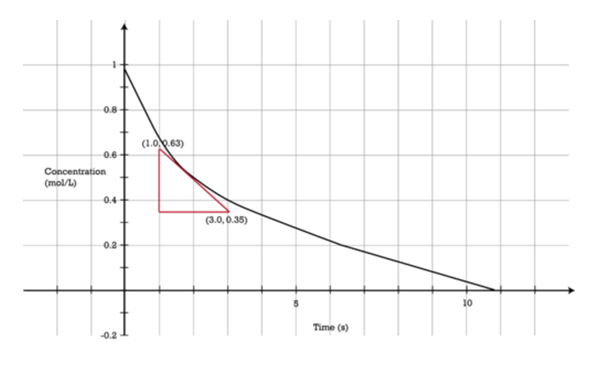

**Lesson Objective: Determine the rate law for a reaction by analysis of experimental data.**

16. In the reaction $A + B \rightarrow C + D$, we determine the rate law by measuring the rate under one of the following conditions:
    1.  hold \[A\] constant, measure rate at varying \[B\]
    2.  hold both constant
    3.  hold \[B\] constant and measure rate at varying \[A\]
    4.  hold each constant while varying the concentration of the other reactant.
17. Initial rates are determined because
    1.  the slope of the curve is easier to measure at the beginning
    2.  the rate slows down as the reaction proceeds
    3.  the rate might increase as the reaction takes place
    4.  it is more convenient
18. True/False: In the reaction between nitrogen monoxide and hydrogen, the reaction order for NO is two.
19. True/False: In the same reaction, the reaction order for hydrogen is one
20. Determine the reaction order and the rate law for each of the following reactions:

a. $C  +  D  \rightarrow  E$

| Exp # | \[C\] | \[D\] | Rate (M/sec) |
| --- | --- | --- | --- |
| 1   | 0.1 | 0.01 | 0.02 |
| 2   | 0.1 | 0.02 | 0.04 |
| 3   | 0.1 | 0.03 | 0.06 |
| 4   | 0.1 | 0.04 | 0.08 |
| 5   | 0.2 | 0.04 | 0.08 |
| 6   | 0.3 | 0.04 | 0.08 |

b. $C  +  D  \rightarrow  E$

| Exp # | \[C\] | \[D\] | Rate (M/sec) |
| --- | --- | --- | --- |
| 1   | 0.1 | 0.01 | 0.02 |
| 2   | 0.1 | 0.02 | 0.08 |
| 3   | 0.1 | 0.03 | 0.18 |
| 4   | 0.1 | 0.04 | 0.32 |
| 5   | 0.2 | 0.04 | 1.28 |
| 6   | 0.3 | 0.04 | 2.88 |

**Lesson Objective: Calculate the specific rate constant from experimental data.**

21. If the rate of a reaction does not vary as we change the reactant concentration, the reaction is \_\_\_\_\_\_\_\_\_ for that reactant.
    1.  first order
    2.  zero order
    3.  third order
    4.  second order
22. In the $NO + H_2$ reaction, if the rate had quadrupled when we doubled the hydrogen concentration, the reaction would have been \_\_\_\_\_\_\_\_\_\_\_\_ for hydrogen.
    1.  first order
    2.  zero order
    3.  third order
    4.  second order
23. True/False: In the $NO + H_2$ reaction, the rate tripled when the hydrogen gas concentration was doubled.
24. True/False: The units for the specific rate constant vary with the order of the reaction.
25. Calculate the specific rate constants for problem 20 reactions a and b above
26. Since the rate of a reaction generally depends upon collision frequency, it stands to reason that as the concentration of A increases, the reaction rate increases. Likewise, as the concentration of A decreases, the reaction rate decreases. How does this observation related to collision theory?
27. How does knowledge of a rate law help in the manufacture of a specific chemical?

</article>

### 18.3 Reaction Mechanisms

<article>

Worksheet
---------

**Name \_\_\_\_\_\_\_\_\_\_\_\_\_\_\_\_\_\_\_\_\_ Class \_\_\_\_\_\_\_\_\_\_\_\_\_\_\_\_\_\_\_\_\_\_ Date \_\_\_\_\_\_\_\_\_\_\_\_\_\_\_\_**

_Answer each of the questions below to show your achievement of the lesson objectives_

**Lesson Objective: Describe how the elementary steps of a chemical reaction combine to produce the overall reaction mechanism.**

1.  The overall reaction specifies all of the following except
    1.  the starting materials
    2.  specific steps of the reaction
    3.  final products
    4.  catalysts
2.  True/False: Most reactions occur in a single step.
3.  Define the following terms:
    1.  elementary step
    2.  reaction mechanism
4.  What is the reaction intermediate in the following process?
5.  $Cl + O_3 \rightarrow ClO + O_2$
6.  $ClO + O \rightarrow Cl + O_2$
7.  $---------$
8.  net result:
9.  $O_3 + O \rightarrow 2O_2$

**Lesson Objective: Be able to identify intermediates and catalysts when they appear in a reaction mechanism.**

5.  In the reaction between nitrogen monoxide and oxygen, the reaction intermediate is
    1.  $NO$
    2.  $NO_2$
    3.  $N_2O_2$
    4.  $O_2$
6.  The reaction intermediate in the above reaction was
    1.  identified experimentally
    2.  added to balance the equation
    3.  included as a hypothesis
    4.  added as a reasonable guess
7.  True/False: A reaction intermediate is shown as part of the overall equation.
8.  True/False: The presence of a reaction intermediate allows us to understand better the entre reaction process.
9.  Define intermediate
10. An intermediate is always formed in an \_\_\_\_\_\_\_ step of the mechanism and then \_\_\_\_\_\_\_\_\_ in a \_\_\_\_\_\_\_\_\_ step.

**Lesson Objective: Write a rate law for an elementary step, and identify the molecularity of the reaction.**

11. Termolecular reaction steps are rare for all the following reasons except
    1.  they require simultaneous collision of three molecules
    2.  the $\Delta H$ for these systems is very high
    3.  all molecules must be correctly oriented
    4.  all three collisions must be of sufficient energy
12. True/False: A bimolecular reaction can only be second order.
13. Define molecularity
14. How does the presence of a reaction intermediate in the reaction between nitrogen monoxide and oxygen affect the rate of the reaction?
15. A proposed mechanism for the conversion of ozone is
16. (1)
17. $O_3 \rightarrow O_2 + O$
18. (2)
19. $O_3 + O \rightarrow 2 O_2$
    1.  Identify the molecularity of each step.
    2.  Write a rate law for each step
20. Identify the molecularity of the following reactions:
    1.  $2NO + O_2 \rightarrow 2NO_2$
    2.  $N_2O_4 \rightarrow 2NO_2$
    3.  $CO + NO_3 \rightarrow NO_2 + CO_2$
    4.  $Zn + 2 HCl \rightarrow ZnCl_2 + H_2$

**Lesson Objective: Identify the rate-determining step of a reaction.**

17. In the decomposition of hydrogen peroxide, iodide ion functions as a
    1.  catalyst
    2.  reactant
    3.  product
    4.  intermediate
18. True/False: The decomposition of hydrogen peroxide is first-order with regard to iodide
19. Define rate-determining step
20. For the reaction $H_2 + 2 ICl \rightarrow I_2 + 2HCl$ (all in the gas phase), the experimentally determined rate law is $rate = k[H_2][ICl]$. A proposed two-step mechanism is
21. step 1:
22. $H_2 + ICl \rightarrow HI + HCl (slow)$
23. step 2:
24. $HI + ICl \rightarrow I_2 + HCl (fast)$
25. Is this a reasonable mechanism? Explain your answer. Why is step one considered to be the rate-determining step?

**Lesson Objective: Analyze the potential energy diagram for a multi-step reaction.**

21. All of the following statements about reaction intermediates are true except
    1.  they can be detected
    2.  they can be characterized
    3.  they exist between activated complexes
    4.  they are not included in rate law discussions
22. True/False: The overall enthalpy change is affected by the activated complexes.
23. Indicate the actual $\Delta H$ for the reaction below.

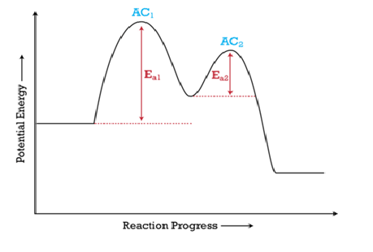

24. How many steps would you expect to be in any valid reaction mechanism for this potential energy diagram? Explain your answer.

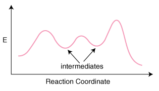

25. $IO^-$ is present as an intermediate in the reaction. The iodide ion catalyst also appears in the mechanism. It is a reactant in the first elementary step and a product in the second step. By definition, catalysts are not used up in a reaction, so if they are consumed by one step in a mechanism, they must be regenerated by a subsequent step.

26. How does this information affect our definition of a catalyst?

27. If a reaction mechanism is proposed that is based on an intermediate that has not been detected, is this a useful mechanism? Explain your answer.

</article>

## 19.0 Equilibrium Worksheets

<article>

</article>

### 19.1 The Nature of Equilibrium

<article>

Worksheet
---------

**Name \_\_\_\_\_\_\_\_\_\_\_\_\_\_\_\_\_\_\_\_\_ Class \_\_\_\_\_\_\_\_\_\_\_\_\_\_\_\_\_\_\_\_\_\_ Date \_\_\_\_\_\_\_\_\_\_\_\_\_\_\_\_**

_Answer each of the questions below to show your achievement of the lesson objectives_

**Lesson Objective: Describe the nature of a reversible reaction.**

1.  In a reversible reaction
    1.  all the reactants convert to products
    2.  all the products convert to reactants
    3.  the reaction proceeds in both directions simultaneously
    4.  the reaction goes in one direction and then reverses in the other direction
2.  Reversible reactions are indicated by
    1.  $\rightarrow \ \leftarrow$
    2.  $\leftarrow \ \rightarrow$
    3.  $\rightleftarrows$
    4.  $\Leftrightarrow$
3.  True/False: All reactions are reversible.
4.  True/False: Many chemical reactions do not proceed to completion.
5.  Define reversible reaction.

**Lesson Objective: Define chemical equilibrium.**

6.  The forward reaction rate \_\_\_\_\_\_\_\_ as the reverse reaction begins
    1.  increases
    2.  decreases
    3.  remains unchanged
    4.  varies with the rate of the reverse reaction
7.  Chemical equilibrium can be attained under all but one of the following conditions
    1.  beginning only with reactants
    2.  beginning only with products
    3.  beginning with a mix of reactants and products
    4.  removing products as the reaction proceeds
8.  All of the following are equilibrium situations except
    1.  phase equilibrium
    2.  dynamic equilibrium
    3.  solution equilibrium
    4.  reaction equilibrium
9.  True/False: Equilibrium is reached when all concentrations have become constant.
10. True/False: At equilibrium, the concentrations of all components are equal.
11. True/False: The equilibrium position depends on the initial concentrations of materials.
12. Define chemical equilibrium.
13. The equilibrium position is a property of the particular\_\_\_\_\_\_\_\_ reaction and does not depend upon the \_\_\_\_\_\_\_\_ concentrations of the \_\_\_\_\_\_\_\_\_ and \_\_\_\_\_\_\_\_\_.
14. List the conditions and properties of a system at equilibrium.

**Lesson Objective: Write chemical equilibrium expressions from balanced chemical equations.**

15. The concentrations of each substance in an equilibrium expression is measured in
    1.  moles/L
    2.  moles/sec
    3.  molal
    4.  L/mol
16. The value of the equilibrium constant is affected by
    1.  volume
    2.  reactant concentration
    3.  temperature
    4.  product concentration
17. The equilibrium constant symbol is
    1.  $k_{eq}$
    2.  $K_{eq}$
    3.  $K_{econst}$
    4.  $k_{const}$
18. For the reaction: $CaCO_3 (s) \rightleftharpoons CaO (s) + CO_2 (g)$, the equilibrium constant would be
    1.  $\frac{[CaO][CO_2]}{[CaCO_3]}$
    2.  $\frac{[CaCO_3]}{[CaO][CO_2]}$
    3.  $[CO_2]$
    4.  $\frac{[CaO]}{[CaCO_3]}$
19. True/False: A large equilibrium constant means that products are favored over reactants.
20. True/False: The units for the equilibrium constant vary depending on the reaction.
21. True/False: Balanced equations are needed before writing equilibrium constants.
22. At equilibrium, the concentrations of the substances are constant.
23. Define equilibrium constant.
24. Write equilibrium constants for the following reactions:
    1.  $CO (g) + 2 H_2 (g) \rightleftarrows CH_3 OH (g)$
    2.  $CO(g) + H_2O (g) \rightleftarrows CO_2 (g) + H_2 (g)$
    3.  $2 NaHCO_3 (s) \rightleftarrows Na_2 CO_3 (s) + H_2O (g) + CO_2 (g)$
    4.  $CaH_2 (s) + 2 H_2O (g) \rightleftarrows Ca (OH)_2 (s) + 2 H_2 (g)$

**Lesson Objective: Calculate the equilibrium constant for a reaction and perform calculations involving that constant**

25. At the equilibrium point in the decomposition of phosphorus pentachloride to chlorine and phosphorus trichloride, the following concentrations are obtained: 0.010 mol/L PCl5, 0.15 mol/L PCl3 and 0.37 mol/L Cl2. Determine the $K_{eq}$ for the reaction.

$$
PCl_5 (g) \rightleftharpoons PCl_3 (g) + Cl_2 (g)
$$

26. At a certain temperature, the equilibrium mixture of PCl5, PCl3 and Cl2 has the following concentrations:

$[PCl_3] = 0.035 \ M, [PCl_5] = 0.017 \ M, [Cl_2] = 0.074 \ M$

Calculate $K_{eq}$ for the reaction $PCl_3 (g) + Cl_2 (g) \rightleftarrows PCl_5 (g)$

27. Given the following reaction and the concentrations of 0.5 M for H2S and 0.2 M for HI, what is the value for $K_{eq}$?

$H_2S (g) + I_2 (s) \rightleftarrows 2 HI (g) + S (s)$

28. Calculate the equilibrium constant $(K_{eq})$ for the following reaction:

$H_2 + I_2 \rightleftarrows 2HI$

when the equilibrium concentrations at $25^\circ C$ were found to be:

$$
\begin{align*}
[H_2] & = 0.0505 \ M \\
[I_2] & = 0.0498 \ M \\
[HI] & = 0.389 \ M \\
\end{align*}
$$

The equilibrium expression only shows those substances whose concentrations are variable during the reaction. A pure solid or a pure liquid does not have a concentration that will vary during a reaction. Therefore, an equilibrium expression omits pure solids and liquids and only shows the concentrations of gases and aqueous solutions.

29. Would you expect an equilibrium constant to have a different value if we were able to incorporate information about pure solids or liquids?

30. Suggest one way we could incorporate information about changing amounts of solids during an equilibrium reaction.

</article>

### 19.2 Le Châtelier’s Principle

<article>

Worksheet
---------

**Name \_\_\_\_\_\_\_\_\_\_\_\_\_\_\_\_\_\_\_\_\_ Class \_\_\_\_\_\_\_\_\_\_\_\_\_\_\_\_\_\_\_\_\_\_ Date \_\_\_\_\_\_\_\_\_\_\_\_\_\_\_\_**

_Answer each of the questions below to show your achievement of the lesson objectives_

**Lesson Objective: Explain the factors that stress a system at equilibrium and use Le Châtelier’s principle to predict how the system will respond to each stress.**

1.  A chemical system in equilibrium can be disrupted by changes in all of the following except
    1.  temperature
    2.  time
    3.  concentration
    4.  pressure
2.  Chemical equilibrium was studied by \_\_\_\_\_\_\_\_\_ .
    1.  the French chemist Pierre Le Châtelier
    2.  the Belgian chemist Henri Le Châtelier
    3.  the English chemist Henri Le Châtelier
    4.  the French chemist Henri Le Châtelier
3.  Addition of a catalyst to a reaction in equilibrium.
    1.  increases the rate of the forward reaction
    2.  decreases the rate of the forward reaction
    3.  has no effect on the equilibrium
    4.  increases the rate of the reverse reaction
4.  In a gas-phase reaction $2A + 3B \rightleftarrows 4C + D$. an increase in pressure will.
    1.  favor the forward reaction
    2.  favor the reverse reaction
    3.  have no effect on the equilibrium
    4.  decrease the rates of both reactions
5.  In the equilibrium system $A \rightleftarrows B$, an increase in \[A\] will.
    1.  cause an increase in the forward reaction
    2.  cause an increase in the reverse reaction
    3.  cause a decrease in the forward reaction
    4.  have no effect on concentrations
6.  In the equlibrium reaction $CaCO_3 (s) \rightleftarrows CaO (s) + O_2 (g)$, a decrease in pressure produces.
    1.  an increase in CaCO3 formation
    2.  an increase in the rate of the forward reaction
    3.  a decrease in CaO formation
    4.  an increase in the rate of the reverse reaction
7.  In the equilibrium reaction $A + B \rightleftarrows C + D + 87.5 \ kJ$, an increase in temperature will produce
    1.  an increase in the forward reaction
    2.  an increase in the reverse reaction
    3.  an increase in the formation of C + D
    4.  no effect on $K_{eq}$
8.  True/False: After an equilibrium has been disturbed, the equilibrium position can be restored to its original position.
9.  True/False: A change in pressure will always affect equilibrium.
10. True/False: If more N2 is added to the Haber-Bosch process, the ammonia concentration will increase.
11. True/False: Continued removal of ammonia in the Haber-Bosch process will force the reaction to completion.
12. True/False: The forward Haber-Bosch reaction is endothermic.
13. True/False: A change in pressure on a liquid or solid does not stress the system.
14. True/False: An increase in pressure causes gas molecules to be forced closer together.
15. State Le Châtelier’s Principle
16. When the pressure is increased by \_\_\_\_\_\_\_\_ the available volume, the reaction that produces \_\_\_\_\_\_\_ total moles of gas becomes \_\_\_\_\_\_\_.
17. Catalysts have equal effects on the \_\_\_\_\_\_\_ and \_\_\_\_\_\_\_ rates, so for a system at equilibrium, these two rates remain \_\_\_\_\_\_\_\_\_.
18. Predict how each of the following changes will move the direction of the reaction for the reaction $CO_2 + C + \text{heat} \rightleftarrows 2 CO$
    1.  increase temperature
    2.  increase CO concentration
    3.  decrease pressure

**Lesson Objective: Explain how a reaction is able to go to completion.**

19. A reaction will go to completion under all of the following situations except
    1.  formation of a precipitate
    2.  formation of an ionized compound
    3.  formation of a gas
    4.  formation of a nonionized compound
20. A reaction goes to completion when all of the following occur except
    1.  a product is removed as soon as it is formed
    2.  the reverse reaction slows down
    3.  the reverse reaction cannot establish itself
    4.  equilibrium does not occur
21. \_\_\_\_\_ The formation of liquid water causes a reaction to go to completion.
22. \_\_\_\_\_ Formation of silver chloride is a reversible process.

**Lesson Objective: Analyze how a change in the concentration of a reaction component can change the equilibrium position but not the value of the equilibrium constant.**

23. In the equilibrium system $A \rightleftarrows B$, an increase in \[A\] will
    1.  increase the $K_{eq}$
    2.  decrease the $K_{eq}$
    3.  have no effect on the $K_{eq}$
    4.  have variable effects on the $K_{eq}$
24. True/False: A shift in equilibrium position is not the same as a change in $K_{eq}$.
25. Given the equation:

$H_2 + I_2 \rightleftarrows 2HI$

Calculate all three equilibrium concentrations when the initial concentrations of $H_2$ and $I_2 = 0.200 \ M$ each and $K_c = 64.0$.

26. Given the equation:

$PCl_3 + Cl_2 \rightleftarrows PCl_5$

Calculate all three equilibrium concentrations when $K_c = 16.0$ and the initial concentration of $PCl_5 = 1.00 \ M$.

27. Given the equation: 

$COCl_2 \rightleftarrows  CO + Cl_2$

Calculate all three equilibrium concentrations when $K_c = 0.680$ with $[CO]_{init} = 0.500$ and $[Cl_2]_{init} = 1.00 \ M$.

Equilibrium represents a balance between the reactants and the products of a chemical reaction. Changes to the conditions of the system can disturb that equilibrium. When this occurs, the system reacts in such a way as to restore the equilibrium. However, the position of equilibrium will be changed following the disturbance. In other words, the response of the system involves a change in the amounts of the reactants and products. Some will increase and some will decrease until equilibrium is reestablished.

23. In the Haber-Bosch process for the synthesis of ammonia, the reaction takes place in a closed system. If additional nitrogen is added, that produces an increase in the concentration of material, which is expected to favor the forward reaction to form ammonia. How will this increase in nitrogen gas affect the pressure of the system and the equilibrium position?
24. In the reaction $CaCO_3(s) \rightleftarrows CaO(s) + O_2(g)$, if the amount of $O_2$ is increased, does that decrease the decomposition of calcium carbonate or decrease the formation of calcium oxide?

|     | $[H_2]$ | $[I_2]$ | $[HI]$ |
| --- | --- | --- | --- |
| Initial | 0.200 | 0.200 | 0   |
| Change | \-x | \-x | +2x |
| Equilibrium | 0.200 - x | 0.200 - x | 2x  |

|     | $[PCl_3]$ | $[Cl_2]$ | $[PCl_5]$ |
| --- | --- | --- | --- |
| Initial | 0   | 0   | 1.00 |
| Change | \+ x | \+ x | \-x |
| Equilibrium | x   | x   | 1.00 - x |

|     | $[COCl_2]$ | $[CO]$ | $[Cl_2]$ |
| --- | --- | --- | --- |
| Initial | 0   | 0.500 | 1.00 |
| Change | \+ x | \- x | \- x |
| Equilibrium | x   | 0.500 - x | 1.00 - x |

</article>

### 19.3 Solubility Equilibrium

<article>

Worksheet
---------

**Name \_\_\_\_\_\_\_\_\_\_\_\_\_\_\_\_\_\_\_\_\_ Class \_\_\_\_\_\_\_\_\_\_\_\_\_\_\_\_\_\_\_\_\_\_ Date \_\_\_\_\_\_\_\_\_\_\_\_\_\_\_\_**

_Answer each of the questions below to show your achievement of the lesson objectives._

**Lesson Objective: Write solubility product constant expressions for nearly insoluble ionic compounds.**

1.  \_\_\_\_\_\_\_\_\_ salts tend to be very soluble
    1.  hydroxides
    2.  alkali metals
    3.  transition metals
    4.  halides
2.  The solubility product constant for Fe(OH)2 is written
    1.  $[Fe][OH]$
    2.  $\frac{[Fe]}{[OH]}$
    3.  $[Fe][OH]^2$
    4.  $\frac{[Fe]}{[OH]^2}$
3.  AgCl can still be considered a
    1.  weak electrolyte
    2.  strong electrolyte
    3.  nonelectrolyte
    4.  covalent compound
4.  True/False: NaCl is highly soluble in water.
5.  True/False: PbCl2 is less soluble in water than PbCO3.
6.  True/False: The solid portion of an equilibrium equation appears in the $K_{sp}$ expression.
7.  Define solubility product constant.
8.  These “mostly insoluble” compounds are still considered to be \_\_\_\_\_\_\_ electrolytes because, essentially, any portion of the compound that \_\_\_\_\_\_\_\_ will also dissociate into \_\_\_\_\_.
9.  Write the equilibrium expression and the $K_{sp}$ expressions for the following compounds:
    1.  CaCO3
    2.  Mg(OH)2
    3.  SrF2
    4.  ZnCr2O7

**Lesson Objective: Calculate the value of $K_{sp}$ for a compound from its solubility and determine the solubility of a compound with a known $K_{sp}$.**

10. Solubility is normally expressed as
    1.  grams/mL
    2.  grams/L
    3.  mg/mL
    4.  Kg/L
11. $K_{sp}$ calculations uses concentration units of
    1.  $moles/L$
    2.  $moles/mL$
    3.  $grams/L$
    4.  $moles \times L$
12. True/False: Molar mass is used to convert between solubility and molar solubility.
13. True/False: Solubility of a material can be used to calculate $K_{sp}$.
14. Define molar solubility.
15. The molar solubility of a given compound represents the \_\_\_\_\_ molarity \_\_\_\_\_\_\_\_ that is possible for that compound.
16. The aqueous solubility for PbI2 is 5.4 grams/L at 25°C. Calculate the $K_{sp}$ of PbI2 at 25°C.
17. The $K_{sp}$ at $25^\circ C$ is $8.5 \times 10^{-17}$ for AgI. What is the molar solubility?
18. Calculate the $K_{sp}$ for Bi2S3 when the solubility of the compound is $1.7 \times 10^{-14} g/L$.
19. Calculate the molar solubility of BaCrO4 given the $K_{sp}$ of $1.17 \times 10^{-10}$.
20. Determine the molar concentration of the Ba_2+_ ion in a solution of BaSO3 given a $K_{sp}$ of $7.94 \times 10^{-7}$.

**Lesson Objective: Use the $K_{sp}$ of a compound to predict whether a precipitate will form when two solutions are mixed together.**

21. When two solution are mixed that could form a precipitate, equilibrium is attained when
    1.  the ion product is greater than the $K_{sp}$.
    2.  the ion product equals the $K_{sp}$
    3.  the ion product is less than the $K_{sp}$
    4.  the $K_{sp}$ is less than the ion product
22. The \_\_\_\_\_\_\_\_ and \_\_\_\_\_ of each solution that is mixed together must be used to calculate the values of ions that might potentially form a precipitate.
23. Does a ppt. of AgCl form when 1 mL of 0.1 mol/L AgNO3 is added to a beaker containing 1 L of tap water with a Cl_\-_ ion concentration of $1.0 \times 10^{-5} \ mol/L$?
24. 50 mL of 0.0010 M NaCl is mixed with 50 mL of 0.00020 M AgNO3. Will a precipitate form?
25. Equal volumes of 0.025 M potassium bromide (KBr) and 0.005 M lead(II) nitrate (Pb(NO3)2) solutions were mixed. The PbBr2 $K_{sp}= 7.9 \times 10^{-5}$ . Will a precipitate form?

**Lesson Objective: Describe the common ion effect and its relationship to solubility.**

26. True/False: The common ion effect is an application of LeChâtelier’s principle.
27. Define the following terms:
    1.  common ion
    2.  common ion effect
28. The $K_{sp}$ for a saturated solution of PbCl2 is $1.7 \times 10^{-5}$. What is the \[Pb_2+_\]? Enough NaCl is added to this solution to produce a \[Cl_\-_\] of 0.1 M with essentially no change in volume. What will the new \[Pb_2+_\] be?
29. As a result, the ion product \[Ca_2+_\]\[SO4_2−_\] would increase to a value that is greater than the $K_{sp}$. According to Le Châtelier’s principle, the equilibrium above would shift to the left in order to relieve the stress of the added calcium ion. Additional calcium sulfate would precipitate out of the solution until the ion product, once again, becomes equal to $K_{sp}$.
30. Why would added calcium ion be considered a stress on the system?
31. Addition of aluminum sulfate is often used in water purification systems. This salt is fairly soluble, but the presence of aluminum ions has been associated with a number of health problems. How could the aluminum ion content be lowered in order to decrease the levels of this material in water?

</article>

## 20.0 Entropy and Free Energy Worksheets

<article>

</article>

### 20.1 Entropy

<article>

Worksheet
---------

**Name \_\_\_\_\_\_\_\_\_\_\_\_\_\_\_\_\_\_\_\_\_ Class \_\_\_\_\_\_\_\_\_\_\_\_\_\_\_\_\_\_\_\_\_\_ Date \_\_\_\_\_\_\_\_\_\_\_\_\_\_\_\_**

_Answer each of the questions below to show your achievement of the lesson objectives_

**Lesson Objective: Identify the two driving forces behind all chemical reactions and physical processes.**

1.  One of the following is not a characteristic of exothermic reactions
    1.  reactants have high energy compared to products
    2.  products are more stable than reactants
    3.  energy is released into the surroundings
    4.  products have lower stability than reactants
2.  One of the following is not a characteristic of an endothermic reaction
    1.  energy is absorbed during the reaction
    2.  reaction is energetically favorable
    3.  products have larger quantity of energy than reactants
    4.  products are less stable than reactants
3.  True/False: Most naturally occurring reactions are exothermic.
4.  True/False: The energy of the system increases during an exothermic reaction.
5.  Low energy can be thought of as providing a \_\_\_\_\_\_\_ degree of \_\_\_\_\_\_\_ to a chemical system.

**Lesson Objective: Describe entropy, and be able to predict whether the entropy change for a reaction is increasing or decreasing.**

6.  One of the following does not show an increase in entropy
    1.  ice becomes liquid water
    2.  solid reactant forms liquid product
    3.  CO2 condenses to form dry ice
    4.  iodine crystals form a vapor
7.  A decrease in entropy can be seen when
    1.  a sugar cube is crushed
    2.  sugar is crystallized out of solution
    3.  sugar is dissolved in water
    4.  sugar cubes are spilled on the table
8.  One of the following does not illustrate an increase in entropy
    1.  increase in temperature
    2.  decrease in temperature
    3.  increase in kinetic energy
    4.  increase in motion of particles
9.  A decrease in entropy is seen when
    1.  NaCl is dissolved in water
    2.  CaCO3 forms CaO and CO2
    3.  Hydrogen and oxygen form water
    4.  Water evaporates
10. True/False: The solid state of water is highly ordered.
11. True/False: The entropy of a gas is less than the entropy of the corresponding solid.
12. True/False: Chemical reactions tend to proceed in a way as to decrease the entropy of the system.
13. True/False: Work must be done to decrease entropy.
14. Define entropy
15. The change from the solid to liquid state of any substance corresponds to an \_\_\_\_\_\_\_in the \_\_\_\_\_\_\_\_ of the system.
16. In the following reactions, indicate whether entropy is increasing or decreasing:
    1.  $2Al (s) + 3Br_2 (g) \rightarrow 2AlBr_3 (s)$
    2.  $2CO (g) + O_2 (g)\rightarrow 2CO_2 (g)$
    3.  $2HgO (s) \rightarrow 2Hg (l) + O_2 (g)$
    4.  $2Cl_2O_5 (g) \rightarrow 2Cl_2 (g) + 5O_2 (g)$
    5.  $Ca (s) + 2H_2 O (l) \rightarrow Ca(OH)_2 (aq) + H_2 (g)$
    6.  $3 Li_2CO_3(aq) + 2 Al(NO_3)_3(aq) \rightarrow 6 LiNO_3(aq) + Al_2(CO_3)_3(s)$

**Lesson Objective: Calculate the standard entropy change for a reaction from the standard entropies of all substances in the reaction.**

17. The symbol for entropy is
    1.  E
    2.  S
    3.  H
    4.  K
18. The units for entropy are
    1.  $J/K \cdot mol$
    2.  $K/J \cdot mol$
    3.  $J/mol$
    4.  $J \cdot mol/K$
19. Standard entropy change can be calculated using
    1.  $\Delta S^\circ = \sum S^\circ(\text{products}) - \sum S^\circ(\text{reactants})$
    2.  $\Delta S^\circ= \sum nS^\circ(\text{products}) - \sum nS^\circ(\text{reactants})$
    3.  $\Delta S^\circ = \sum nS^\circ(\text{reactants}) - \sum nS^\circ(\text{products})$
    4.  $\Delta S^\circ = \sum S^\circ(\text{reactants}) - \sum S^\circ(\text{products})$
20. True/False: All molecular motion ceases at 0 degrees K.
21. True/False: The standard entropy of a substance is given by S°.
22. True/False: The entropy change for the vaporization of water is negative.
23. As the temperature of the substance \_\_\_\_\_\_\_\_, its entropy increases because of an increase in molecular \_\_\_\_\_\_\_.
24. At what temperature are standard entropy values determined?
25. Is the standard entropy for the vapor state of water higher or lower than the liquid state? Explain your answer.
26. Calculate $\Delta S^\circ$ for the following reactions:
    1.  $CO(g) + 2H_2(g) \rightarrow CH_3OH(l)$
    2.  $S^\circ \text{ values: } CO = 197.9 \ J/K\cdot mol \quad H_2 = 131.0 \ J/K\cdot mol \quad CH_3OH = \frac{126}{8} J/K\cdot mol$
    3.  $CaCO_3(s) \rightarrow CaO(s) + CO_2(g)$
    4.  $S^\circ \text{ values: } CaCO_3 = 92.9 \ J/K\cdot mol \quad CaO = 38.2\ J/K\cdot mol \quad CO_2 = 213.6 \ J/K\cdot mol$
27. All molecular motion ceases at absolute zero (0 K). Therefore, the entropy of a pure crystalline substance at absolute zero is defined to be equal to zero.
28. How does this definition involve motion?
29. No molecular motion is one definition of absolute zero and of zero entropy. What assumption is being made about the structure of the crystal?

</article>

### 20.2 Spontaneous Reactions and Free Energy

<article>

Worksheet
---------

**Name \_\_\_\_\_\_\_\_\_\_\_\_\_\_\_\_\_\_\_\_\_ Class \_\_\_\_\_\_\_\_\_\_\_\_\_\_\_\_\_\_\_\_\_\_ Date \_\_\_\_\_\_\_\_\_\_\_\_\_\_\_\_**

_Answer each of the questions below to show your achievement of the lesson objectives_

**Lesson Objective: Describe the meaning of a spontaneous reaction in terms of enthalpy and entropy changes.**

1.  All of the following are characteristics of spontaneous reactions except
    1.  decrease in enthalpy
    2.  increase in entropy
    3.  decrease in randomness
    4.  release of energy
2.  A combustion reaction is considered to be spontaneous because
    1.  entropy is lowered
    2.  the energy of the system increases
    3.  reaction is exothermic
    4.  randomness of the system decreases
3.  All of the following are characteristics of non-spontaneous reactions except
    1.  entropy increases
    2.  reaction is endothermic
    3.  reactants are favored over products
    4.  randomness decreases
4.  The release of CO2 when carbonic acid is dissolved in water is spontaneous because
    1.  the process is endothermic
    2.  the equilibrium favors the forward reaction
    3.  non-spontaneous reactions do not occur
    4.  the entropy of the system is increased
5.  Situations associated with NO formation involve all but one of the following
    1.  high temperatures
    2.  lightning strikes
    3.  negative entropy change
    4.  highly endothermic
6.  True/False: The formation of NO from nitrogen and oxygen in the atmosphere is non-spontaneous at normal temperatures and pressures.
7.  True/False: A spontaneous reaction is one that occurs rapidly.
8.  True/False: Changes in enthalpy and entropy are the driving forces behind all chemical reactions.
9.  True/False: Entropy decreases during most combustion reactions.
10. True/False: Formation of carbonic acid after CO2 is added to water is a non-spontaneous reaction
11. Define the following terms
    1.  spontaneous reaction
    2.  non spontaneous reaction
12. Write the expression for Gibbs free energy.
13. A spontaneous reaction is one in which product \_\_\_\_\_\_\_\_\_ favored, even if the reaction is extremely \_\_\_\_\_\_ .
14. Just because a reaction is not \_\_\_\_\_\_\_\_\_\_ does not mean that it does not occur at all. Rather, it means that the \_\_\_\_\_\_\_\_will be favored over the \_\_\_\_\_\_\_\_\_\_\_\_\_\_\_\_\_\_\_\_\_\_\_\_\_\_at equilibrium, even though some products may indeed form.
15. Why would a decrease in entropy be required for a non-spontaneous reaction to occur?

**Lesson Objective: Define free energy and calculate the change in free energy for a reaction using known values of the changes in enthalpy and entropy.**

16. Units for $\Delta G$ are
    1.  $J/K \cdot mol$
    2.  $J/mol$
    3.  $kJ/mol$
    4.  $kJ/K \cdot mol$
17. If $\Delta H$ is positive and $\Delta S$ is negative, then $\Delta G$ is
    1.  always negative
    2.  never negative
    3.  negative at higher temperatures
    4.  negative at lower temperatures
18. If $\Delta H$ is negative and $\Delta S$ is positive, then $\Delta G$ is
    1.  always negative
    2.  never negative
    3.  negative at higher temperatures
    4.  negative at lower temperatures
19. Free energy is energy that is
    1.  stored for future use
    2.  lost as a product of the reaction
    3.  available to do work
    4.  used to drive the reaction
20. True/False: Spontaneous reactions release free energy as they proceed.
21. True/False: The symbol for free energy is in honor of the American scientist James Gibbs.
22. True/False: $\Delta G$ must be negative for a spontaneous reaction.
23. True/False: If $\Delta H$ is negative, the reaction is endothermic.
24. When $\Delta H$ is \_\_\_\_\_\_\_\_ and $\Delta S$ is positive, the sign of $\Delta G$ will always be \_\_\_\_\_\_, and the reaction will be \_\_\_\_\_\_\_\_ at all temperatures.
25. Why is a reaction always spontaneous (negative $\Delta G$) when the reaction is exothermic and entropy increases?
26. Using the values provided below, calculate $\Delta G$ and predict whether or not the reaction will be spontaneous.

|     | $\Delta H \ (kJ/mol)$ | $\Delta S \ (J/K \cdot mol)$ | T (K) |
| --- | --- | --- | --- |
| a   | \-315 | \-405 | 320 |
| b   | +95 | \- 120 | 285 |
| c   | \-101 | +15.7 | 279 |
| d   | +115 | +183 | 525 |

**Lesson Objective: Determine the spontaneity of a reaction based on the value of its change in free energy at various temperatures.**

27. When the $T \Delta S$ term becomes larger than the $\Delta H$ term, the $\Delta G$ value will be
    1.  negative if $\Delta S$ is negative
    2.  negative if $\Delta S$ is positive
    3.  positive if $\Delta S$ is positive
    4.  variable value
28. True/False: When a reaction is exothermic, the $\Delta H$ term needs to be larger than the $T\Delta S$ term for the reaction to be spontaneous.

$N_2(g) + 3 H_2(g) \rightleftharpoons 2 NH_3(g)$

$\Delta H^\circ = -92.22 \ kJ$

$\Delta S^\circ = -198.75 \ J/K$

29. Is the above reaction spontaneous at 298 K?

30. Assume that the $\Delta H$ and $\Delta S$ values are still valid at higher temperatures, will the reaction still be spontaneous at 775 K?

When $\Delta H$ is negative and $\Delta S$ is positive, the sign of $\Delta G$ will always be negative, and the reaction will be spontaneous at all temperatures. This corresponds to both driving forces being in favor of product formation. When $\Delta H$ is positive and $\Delta S$ is negative, the sign of $\Delta G$ will always be positive, and the reaction can never be spontaneous. This corresponds to both driving forces working against product formation.

31. What is required for a non-spontaneous reaction to occur?

32. A combustion reaction is considered to be spontaneous, but firewood does not burst into flame until an external source of heat is provided. Why is burning wood considered an spontaneous reaction?

</article>

### 20.3 Free Energy and Equilibrium

<article>

Worksheet
---------

**Name \_\_\_\_\_\_\_\_\_\_\_\_\_\_\_\_\_\_\_\_\_ Class \_\_\_\_\_\_\_\_\_\_\_\_\_\_\_\_\_\_\_\_\_\_ Date \_\_\_\_\_\_\_\_\_\_\_\_\_\_\_\_**

_Answer each of the questions below to show your achievement of the lesson objectives_

**Lesson Objective: Determine the temperature at which a reversible reaction will achieve equilibrium by using the Gibbs free energy equation.**

1.  Assumptions made in calculations dealing with quicklime formation include all of the following except
    1.  $\Delta H$ and $\Delta S$ values are independent of temperature
    2.  no products are formed below 835°C
    3.  $\Delta G$ switches from positive to negative at 835°C
    4.  The CO2 formed remains in the reaction vessel
2.  To determine the temperature at which $\Delta G$ changes sign, we calculate
    1.  the equation for $\Delta H = \text{ zero}$
    2.  the equation using different T values
    3.  the equation for $\Delta S = \text{ zero}$
    4.  the equation for $\Delta H = \text{ zero}$
3.  In the quicklime manufacturing process
    1.  no CO2 is produced below 835°C
    2.  measureable CO2 is detected at 300°C
    3.  measurable CO2 is detected above 700°C
    4.  The CO2 pressure begins to exceed 1 atm at 700°C
4.  At the temperature at which a change of state occurs, all of the following are true except
    1.  $\Delta G = \text{ zero}$
    2.  the two states are at equilibrium
    3.  $\Delta S_{\text{fus}} = \text{ zero}$
    4.  T = temperature at which transition occurs
5.  True/False: The $\Delta H$ for the quicklime reaction is positive at 25 °C.
6.  True/False: The entropy for the quicklime reaction decreases as the reaction proceeds.
7.  True/False: The entropy change during the melting of ice can be calculated using $\Delta H_{\text{vap}}$.
8.  True/False: The $\Delta G$ value = zero at the equilibrium point in the ice-water system.
9.  For a given reaction $\Delta H^\circ = 35.6 \ kJ/mol$ and $\Delta S^\circ = 113 \ J/K \cdot mol$. Is the reaction spontaneous at 280 K? At what temperature will the reaction be spontaneous?
10. The melting point of Hg is 234 K and the $\Delta H_{\text{fus}} = 2.30 \ kJ/mol$. What is the $\Delta S_{\text{fus}}$?
11. Metallic sodium boils at 1158 K and the $\Delta H_{\text{vap}}$ is 98 kJ/mol. What is the $\Delta S_{\text{vap}}$?
12. For a reaction with a $\Delta H$ of $14.2 \ kJ/mol$ and a $\Delta S$ of $46.8 \ J/K \cdot mol$, at what temperature will the reaction be spontaneous?

**Lesson Objective: Describe the relationship between standard free energy change $(\Delta G^\circ)$ and the equilibrium constant $(K_{eq})$ for reversible reactions.**

13. The relationships between Gibbs fee energy and the equilibrium constant is written
    1.  $\Delta G^\circ=RT \ln(K_{eq})$
    2.  $\Delta G^\circ=-RT \ln(K_{eq})$
    3.  $\Delta G^\circ=-RT \log(K_{eq})$
    4.  $\Delta G^\circ=-RT \log(K_{eq})$
14. The variable $R$ is the
    1.  ideal constant
    2.  equilibrium ratio
    3.  ideal gas constant
    4.  gas constant
15. True/False: When $K_{eq}$ is large, $\Delta G$ should be negative.
16. True/False: When $K_{eq} = 1$, then $\Delta G$ is positive.
17. Fill in the following table:

| $K_{eq}$ | $\ln(K_{eq})$ | $\Delta G^\circ$ | **Description** |
| --- | --- | --- | --- |
| \>1 |     | negative |     |
| 1   | 0   |     | Reactants and products are equally favored. |
| <1  | negative | positive |     |

**Lesson Objective: Convert between $K_{eq}$ and $\Delta G^\circ$ for a reaction at a given temperature.**

For the equilibrium reaction $A + B \rightleftarrows AB$ at 298 K

$\Delta H^\circ = -55.8 \ kJ/mol$

$\Delta S^\circ = +80.8 \ J/K \cdot mol$

18. Calculate $\Delta G$ and $K_{eq}$ for this process.

19. The $K_{eq}$ for the reaction $2 SO_3(g)\rightleftarrows 2 SO_2(g) + O_2(g)$ is $1.4 \times 10^{-25}$. Calculate the $\Delta G^\circ$ for this reaction at 298 K.

$AgCl(s) + H_2O \rightleftarrows Ag^+ (aq) + Cl^- (aq) \quad \Delta G = 55.6 \ kJ$.

20. Calculate the $K_{eq}$ for the reaction at 298 K

21. For the reaction $N_2(g) + 3 H_2(g) \rightleftarrows 2 NH_3(g)$, the $\Delta G$ at $298 \ K = -32.96 \ kJ$, calculate the $K_{eq}$.

When this reaction is performed, the amount of products can be detected by monitoring the pressure of the CO2 gas that is produced. Above about 700°C, measurable amounts of CO2 are produced. The pressure of CO2 at equilibrium gradually increases with increasing temperature. Above 835°C, the pressure of CO2 at equilibrium begins to exceed 1 atm, the standard-state pressure. This is an indication that the products of the reaction are now favored above that temperature.

22. Why is this calculation helpful in the production of quicklime?

23. What other information might be useful in designing a system for production of quicklime from calcium carbonate?

| $K_{eq}$ | $\ln(K_{eq})$ | $\Delta G^\circ$ | **Description** |
| --- | --- | --- | --- |
| \>1 | positive | negative | Products are favored at equilibrium. |
| 1   | 0   | 0   | Reactants and products are equally favored. |
| <1  | negative | positive | Reactants are favored at equilibrium. |

</article>

## 21.0 Acids and Bases Worksheets

<article>

</article>

### 21.1 Acid-Base Definitions

<article>

Worksheet
---------

**Name \_\_\_\_\_\_\_\_\_\_\_\_\_\_\_\_\_\_\_\_\_ Class \_\_\_\_\_\_\_\_\_\_\_\_\_\_\_\_\_\_\_\_\_\_ Date \_\_\_\_\_\_\_\_\_\_\_\_\_\_\_\_**

_Answer each of the questions below to show your achievement of the lesson objectives_

**Lesson Objective: Describe the properties of acids and bases.**

1.  All of the following are acids except
    1.  citrus fruits
    2.  carbonated soda
    3.  drain cleaner
    4.  vinegar
2.  All of the following are properties of acids except
    1.  sour taste
    2.  aqueous solutions are electrolytes
    3.  turn litmus blue
    4.  react with some metals to produce H2
3.  All of the following are properties of bases except
    1.  turn litmus red
    2.  bitter taste
    3.  do not react with metals
    4.  aqueous solutions are electrolytes
4.  True/False: Oranges contain ascorbic acid
5.  True/False: Sodium hydrogen carbonate is an antacid.
6.  True/False: All acids are strong electrolytes.
7.  Fill in the table below

| Property | Acids | Bases |
| --- | --- | --- |
| color with phenolphthalein |     |     |
| color with litmus |     |     |
| taste |     |     |
| reactivity with metals |     |     |

8.  Fill in the table below by naming the acid or base contained in the material

| Material | Acid or Base Present in Material |
| --- | --- |
| drain cleaner |     |
| carbonated soda |     |
| vinegar |     |
| antacid |     |
| cleaners |     |
| orange |     |

**Lesson Objective: Define an acid and a base according to the Arrhenius theory.**

9.  An Arrhenius acid is a compound with
    1.  reactive hydrogen atoms
    2.  ionizable hydrogen atoms
    3.  covalently bound hydrogen atoms
    4.  hydrogen atoms attached to carbon
10. An Arrhenius base is a compound with
    1.  ionizable OH group
    2.  covalently bound OH group
    3.  reactive OH group
    4.  OH group attached to carbon
11. True/False: CH3CH2OH is an Arrhenius base.
12. True/False: All Arrhenius bases are completely ionizable.
13. Define the following terms:
    1.  monoprotic acid
    2.  polyprotic acid
14. Fill in the blank spaces in the table below:

| Compound | Name |
| --- | --- |
| CH3COOH |     |
| Mg(OH)2 |     |
|     | hypochlorous acid |
|     | phosphoric acid |
|     | calcium hydroxide |
| KOH |     |
|     | sulfuric acid |

**Lesson Objective: Define an acid and a base according to the Brønsted-Lowry theory. Be able to identify the conjugate acid-base pairs in a Brønsted-Lowry acid-base reaction.**

15. A hydrogen ion is often referred to as a
    1.  positron
    2.  H atom
    3.  proton
    4.  portion
16. All of the following are true about ammonia except
    1.  contains hydroxide group
    2.  reacts with acid
    3.  turns litmus blue
    4.  turns phenolphthalein pink
17. A Brønsted-Lowry acid-base reaction involves
    1.  formation of hydroxide ion
    2.  transfer of proton
    3.  utilization of water
    4.  formation of free hydrogen ion
18. True/False: A hydrogen atom is also called a proton.
19. True/False: Water can act as a Brønsted-Lowry acid.
20. True/False: The hydroxide ion is a Brønsted-Lowry acid.
21. Define the following terms:
    1.  Brønsted-Lowry acid
    2.  Brønsted-Lowry base
    3.  amphoteric
    4.  conjugate acid
    5.  conjugate base
22. Identify the acid and base and the conjugate acid and base in each of the following reactions:
    1.  $HClO_4(aq) + H_2O(l) \rightleftarrows H_3O^+(aq) + ClO_4^-(aq)$
    2.  $HF(aq) + HSO_3^-(aq) \rightleftarrows F^-(aq) + H_2SO_3(aq)$
    3.  $HNO_2(aq) + HS^-(aq) \rightleftarrows NO_2^-(aq) + H_2S(aq)$

**Lesson Objective: Define an acid and a base according to the Lewis theory.**

23. A Lewis acid
    1.  donates a pair of electrons to form a covalent bond
    2.  releases a proton
    3.  accepts a proton
    4.  accepts a pair of electrons to form a covalent bond
24. A Lewis base
    1.  donates a pair of electrons to form a covalent bond
    2.  releases a proton
    3.  accepts a proton
    4.  accepts a pair of electrons to form a covalent bond
25. True/False: Ammonia can serve as a Lewis base.
26. True/False: A Lewis base forms an ionized compound
27. Identify the acid and the base in each Lewis acid-base reaction.
    1.  $(CH_3)_2O + BF_3 \rightarrow (CH_3)_2O:BF_3$
    2.  $H_2O + SO_3 \rightarrow H_2SO_4$
    3.  $BeCl_2 + 2Cl^- \rightarrow BeCl_4 ^{2-}$
    4.  $BH_3 + (CH_3)_2S \rightarrow H_3B:S(CH_3)_2$
28. A **Lewis acid** _is a substance that accepts a pair of electrons to form a covalent bond_. A **Lewis base** _is a substance that donates a pair of electrons to form a covalent bond_. In a Lewis acid-base reaction, a new covalent bond is formed, but both of the electrons in that bond were originally present on the base.
29. Is the bond formed truly covalent?
30. Why did scientists develop three different classifications for acids and bases?

| Property | Acids | Bases |
| --- | --- | --- |
| color with phenolphthalein | colorless | pink |
| color with litmus | red | blue |
| taste | sour | bitter |
| reactivity with metals | good | non-reactive |

| Material | Acid or Base Present in Material |
| --- | --- |
| drain cleaner | sodium hydroxide |
| carbonated soda | phosphoric acid |
| vinegar | acetic acid |
| antacid | magnesium hydroxide, sodium hydrogen carbonate |
| cleaners | ammonia |
| orange | citric acid, ascorbic acid |

| Compound | Name |
| --- | --- |
| CH3COOH | acetic acid |
| Mg(OH)2 | magnesium hydroxide |
| HClO | hypochlorous acid |
| H3PO4 | phosphoric acid |
| Ca(OH)2 | calcium hydroxide |
| KOH | potassium hydroxide |
| H2SO4 | sulfuric acid |

| Acid | Base | Conjugate Acid | Conjugate Base |
| --- | --- | --- | --- |
| HClO4 | H2O | H3O_+_ | ClO4_\-_ |
| HF  | HSO3_\-_ | H2SO3 | F_\-_ |
| HNO2 | HNO2 | H2S | NO2_\-_ |

</article>

### 21.2 The pH Concept

<article>

Worksheet
---------

**Name \_\_\_\_\_\_\_\_\_\_\_\_\_\_\_\_\_\_\_\_\_ Class \_\_\_\_\_\_\_\_\_\_\_\_\_\_\_\_\_\_\_\_\_\_ Date \_\_\_\_\_\_\_\_\_\_\_\_\_\_\_\_**

_Answer each of the questions below to show your achievement of the lesson objectives_

**Lesson Objective: Describe the equilibrium process of water ionizing into hydrogen and hydroxide ions, and explain the ion-product constant.**

1.  When two molecules of water collide, a \_\_\_\_\_\_\_\_ ion is formed.
    1.  hydrogen
    2.  hydronium
    3.  hydrate
    4.  hydroscopic
2.  The equilibrium constant for water is
    1.  $1 \times 10^{-12}$
    2.  $1 \times 10^{14}$
    3.  $1 \times 10^{12}$
    4.  $1 \times 10^{-14}$
3.  True/False: The acidity of water is important for organisms that live in the water.
4.  True/False: Water is a strong electrolyte.
5.  Define the following terms:
    1.  self-ionization of water
    2.  ion-product of water

**Lesson Objective: Calculate the concentration of either the hydrogen ion or the hydroxide ion in water when the other value is known.**

6.  The Kw for water is
    1.  $[H^+] + [OH^-]$
    2.  $\frac{[H^+]}{[OH^-]}$
    3.  $[H^+][OH^-]$
    4.  $\frac{[OH^-]}{[H^+]}$
7.  For a neutral solution, the \[H_+_\] is
    1.  $1 \times 10^{-5} \ M$
    2.  $1 \times 10^{-7} \ M$
    3.  $1 \times 10^{-6} \ M$
    4.  $1 \times 10^{-8} \ M$
8.  True/False: The Kw quoted in the text is not influenced by temperature.
9.  True/False: When HCl is added to water, the equilibrium shifts to the H2O (l) side.
10. Define the following terms:
    1.  acidic solution
    2.  basic solution
11. HBr ionizes completely in water. Calculate both \[H_+_\] and \[OH_\-_\] for a solution containing $1.7 \times 10^{-4} \ M \ HBr$.
12. KOH ionizes completely in water. What are the values for \[H_+_\] and \[OH_\-_\] in a $3.7 \times 10^{-2} \ M$ solution of KOH?
13. State whether the following solutions are acidic or basic:
    1.  $[H^+] = 2.7 \times 10^{-3} \ M$
    2.  $[OH^-] = 2.4 \times 10^{-6} \ M$

**Lesson Objective: Calculate the pH of an aqueous solution of an acid or a base**

14. All of the following have pH values below seven except
    1.  vinegar
    2.  tomato juice
    3.  eggs
    4.  coffee
15. All the following have pH values greater than seven except
    1.  soap
    2.  milk
    3.  blood
    4.  detergent
16. True/False: A 3.0 M solution of HCl has a negative pH
17. True/False: The letters pH stand for hydrogen ion purity.
18. Define pH
19. Fill in the following table:

| Material | Approximate \[H_+_\] | Approximate pH |
| --- | --- | --- |
| lemon juice |     |     |
| household bleach |     |     |
| orange juice |     |     |
| soap |     |     |

20. Calculate the pH of a solution in which the \[H_+_\] is $1.7 \times 10^{-4} \ M$.

**Lesson Objective: Calculate the hydrogen-ion concentration of a solution with a known pH.**

21. A solution with a pH value of 6 has a hydrogen ion concentration of
    1.  $1 \times 10^6$
    2.  $1 \times 10^{-3}$
    3.  $1 \times 10^{-6}$
    4.  $1 \times 10^3$
22. Soda pop has an approximate pH of 3. Its \[H_+_\] is approximately
    1.  $1 \times 10^{-4}$
    2.  $2.5 \times 10^{-2}$
    3.  $1 \times 10^{-3}$
    4.  $9 \times 10^{-3}$
23. True/False: The hydrogen ion concentration of tomato juice is $10^{-5} \ M$.
24. True/False: Detergent has an approximate \[H_+_\] of $1 \times 10^{-10} \ M$.
25. Calculate the hydrogen ion concentrations of the following solutions:
    1.  $pH = 5.6$
    2.  $pH = 1.9$
    3.  $pH = 8.7$
    4.  $pH = 10.5$

**Lesson Objective: Calculate the pOH of acids and bases and know the relationships between pH, pOH, hydrogen-ion concentration, and hydroxide-ion concentration.**

26. The hydroxide ion concentration is related to the hydrogen ion concentration by
    1.  $pH = pOH + 14$
    2.  $pH + pOH = 14$
    3.  $pOH = 14 + pH$
    4.  $\frac{pH}{pOH} = 14$
27. A basic solution has a pOH of
    1.  greater than seven
    2.  less than seven
    3.  seven
    4.  less than five
28. True/False: The \[OH_\-_\] can be calculated for a solution if the pH is known.
29. True/False: The pOH value is a negative number
30. Define pOH.
31. Calculate the pOH of the following solutions:
    1.  $pH = 3.9$
    2.  $1 \times 10^{-5} \ M HCl$

The **self-ionization** _of water is the process in which water ionizes to hydronium ions and hydroxide ions_. As with other aqueous acid-base reactions, the process is often simplified to show the ionization of just one water molecule into a hydrogen ion and a hydroxide ion.

$H_2O(l) \rightleftharpoons H^+(aq)+OH^-(aq)$

Either equation is adequate, though the first is more accurate, since hydrogen ions in aqueous solution will always be attached to water molecules. Further discussion of acids and acid ionizations in this book will primarily show hydrogen ions in aqueous solution as H_+_, but keep in mind that this is just a commonly used abbreviation for the more accurate hydronium structure. 32. Is it incorrect to talk about \[H_+_\] instead of \[H3O_+_\]?

33. Why would the equilibrium constant for water omit the water itself as a factor in the equilibrium?

| Material | Approximate \[H_+_\] | Approximate pH |
| --- | --- | --- |
| lemon juice | 10_\-2_ M | 2   |
| household bleach | 10_\-13_ M | 13  |
| orange juice | 10_\-4_ M | 4   |
| soap | 10_\-11_ M | 11  |

</article>

### 21.3 Acid and Base Strength

<article>

Worksheet
---------

**Name \_\_\_\_\_\_\_\_\_\_\_\_\_\_\_\_\_\_\_\_\_ Class \_\_\_\_\_\_\_\_\_\_\_\_\_\_\_\_\_\_\_\_\_\_ Date \_\_\_\_\_\_\_\_\_\_\_\_\_\_\_\_**

_Answer each of the questions below to show your achievement of the lesson objectives_

**Lesson Objective: Explain the difference between a strong acid or base and a weak acid or base.**

1.  When HCl dissolves in water,
    1.  the molecule reacts with water
    2.  an equilibrium forms with water
    3.  100% ionization occurs
    4.  partial ionization occurs
2.  When acetic acid dissolves in water,
    1.  the molecule reacts with water
    2.  an equilibrium forms with water
    3.  100% ionization occurs
    4.  partial ionization occurs
3.  Weak acids ionize to form
    1.  protons and anions
    2.  protons and a conjugate base
    3.  protons and a conjugate acid
    4.  a conjugate acid and a conjugate base
4.  All of the acids below are strong acids except
    1.  nitric acid
    2.  hydrochloric acid
    3.  phosphoric acid
    4.  sulfuric acid
5.  True/False: Some weak acids are found in food and beverages.
6.  True/False: A double arrow is used to indicate ionization of strong acids.
7.  True/False: HCO3_\-_ is the conjugate base of acetic acid
8.  True/False: HCN is a weak acid.
9.  Define the following terms:
    1.  strong acid
    2.  weak acid

---

&nbsp;

10. Fill in the blanks

| Acid | Conjugate Base |
| --- | --- |
| **_Strong Acids_** |     |
| HCl (hydrochloric acid) |     |
|     | HSO4_\-_ (hydrogen sulfate ion) |
|     | NO3_\-_ (nitrate ion) |
| **_Weak Acids_** |     |
| H3PO4 (phosphoric acid) |     |
|     | CH3COO_\-_ (acetate ion) |
|     | HCO3_\-_ (hydrogen carbonate ion) |
| HCN (hydrocyanic acid) |     |

**Lesson Objective: Write equilibrium expressions for the ionizations of weak acids and weak bases. Explain how the value of $K_a$ or $K_b$ relates to the strength of the acid or base.**

11. The acid ionization represents all of the following except
    1.  the extent of ionization
    2.  the strength of the acid
    3.  an indication of undissociated acid
    4.  the number of anions present
12. The acid ionization equation is $K_a =$
    1.  $[H^+][A^-]$
    2.  $\frac{[H^+]}{[HA]}$
    3.  $\frac{[H^+][A^-]}{[HA]}$
    4.  $\frac{[HA]}{[H^+][A^-]}$
13. Based on their first acid ionization constant, the weakest acid is
    1.  oxalic acid
    2.  benzoic acid
    3.  acetic acid
    4.  nitrous acid
14. Acetate ion is a stronger base than
    1.  methylamine
    2.  urea
    3.  ammonia
    4.  pyridine
15. True/False: Water is omitted from the expression for the acid ionization constant.
16. True/False: The $K_a$ value is very large for a strong acid.
17. True/False: Each successive ionization for a polyprotic acid is larger than the previous one.
18. True/False: Calcium hydroxide is very water-soluble.
19. Define the following terms:
    1.  acid ionization constant
    2.  strong base
    3.  weak base
    4.  base ionization constant
20. Write $K_a$ or $K_b$ expressions for the following equilibria:
    1.  $HC_2H_3O_2 \rightleftarrows H^+ + C_2H_3O_{2^-}$
    2.  $HOCl \rightleftarrows H^+ + OCl^-$
    3.  $F^- \rightleftarrows HF + OH^-$.

**Lesson Objective: Calculate an unknown $K_a$ or $K_b$ from the solution concentration and the pH.**

21. The $K_a$can be determined using a
    1.  balance
    2.  pH meter
    3.  pH titrator
    4.  litmus paper
22. True/False: The contribution to \[H_+_\] from dissociation of water can be ignored when determining $K_a$.
23. A 0.120 M solution of a generic weak acid (HA) has a pH of 3.26. Determine the $K_a$.
24. A 0.128 M solution of uric acid (HC5H3N4O3) has a pH of 2.39. Calculate the $K_a$ of uric acid.
25. Calculate the value of $K_b$ for methylamine, CH3NH_2_ given that the pH of a 0.10 mol/L solution is 11.8

**Lesson Objective: Calculate the expected pH of a solution containing a given concentration of a weak acid or base that has a known $K_a$ or $K_b$ value.**

26. In calculating the expected pH of a solution of a weak acid, a simplifying assumption that can be made is
    1.  concentration of water is constant
    2.  most of the weak acid will be ionized
    3.  very little of the weak acid will be ionized
    4.  the concentration of the weak acid changes significantly
27. True/False: The pH of a solution of a weak acid can be calculated if the ionization constant is known.
28. What is the pH of a 0.100 M solution of acetic acid? $K_a = 1.77 \times 10^{-5}$
29. Some acids, such as sulfuric acid and nitric acid, are strong acids. Working with strong acids requires special care and protective clothing and eyewear. Other acids, such as acetic acid and citric acid, are encountered in many foods and beverages. These weak acids are considerably less dangerous. In this lesson, you will learn about the differences between strong and weak acids and bases.
30. Why is it important to know if an acid is strong or weak?
31. The second $K_a$ for carbonic acid is $4.8 \times 10^{-11}$. Can this dissociation really affect the pH of a solution?

| Acid | Conjugate Base |
| --- | --- |
| **_Strong Acids_** |     |
| HCl (hydrochloric acid) | Cl_\-_ (chloride ion) |
| H2SO4 (sulfuric acid) | HSO4_\-_ (hydrogen sulfate ion) |
| HNO3 (nitric acid) | NO3_\-_ (nitrate ion) |
| **_Weak Acids_** |     |
| H3PO4 (phosphoric acid) | H2PO4_\-_ (dihydrogen phosphate ion) |
| CH3COOH (acetic acid) | CH3COO_\-_ (acetate ion) |
| H2CO3 (carbonic acid) | HCO3_\-_ (hydrogen carbonate ion) |
| HCN (hydrocyanic acid) | CN_\-_ (cyanide ion) |

</article>

### 21.4 Acid-Base Neutralization

<article>

Worksheet
---------

**Name \_\_\_\_\_\_\_\_\_\_\_\_\_\_\_\_\_\_\_\_\_ Class \_\_\_\_\_\_\_\_\_\_\_\_\_\_\_\_\_\_\_\_\_\_ Date \_\_\_\_\_\_\_\_\_\_\_\_\_\_\_\_**

_Answer each of the questions below to show your achievement of the lesson objectives_

**Lesson Objective: Write balanced molecular and net ionic equations for acid-base neutralization reactions.**

1.  In the neutralization reaction between HCl and NaOH, the Na_+_ and Cl_\-_ ions are \_\_\_\_\_ ions
    1.  neutral
    2.  spectator
    3.  sideline
    4.  unnecessary
2.  The neutralization of a weak acid with a strong base produces a solution whose pH is
    1.  neutral
    2.  slightly acidic
    3.  slightly basic
    4.  strongly basic
3.  The neutralization of a weak acid with a weak base can produce all of the following except
    1.  slightly acidic
    2.  slightly basic
    3.  neutral
    4.  cannot predict
4.  True/False: Net ionic equations of weak acids include the weak acid as a molecule.
5.  True/False: The net ionic equation for the neutralization of a strong acid by a strong base is $H^+ + OH^- \rightarrow H_2O$.
6.  True/False: In neutralization reactions between strong acids and strong bases, neither the acid or the base is completely ionized.
7.  Define the following terms:
    1.  neutralization reaction
    2.  salt
8.  Write complete balanced equations and net ionic equations for the following:
    1.  $\text{hydrochloric acid} + \text{potassium hydroxide} \rightarrow$
    2.  $\text{phosphoric acid} + \text{lithium hydroxide} \rightarrow$

**Lesson Objective: Know the steps of an acid-base titration experiment.**

9.  The end-point of a titration is when
    1.  the first color momentarily appears
    2.  the color appears and disappears after swirling
    3.  the faint color stays after swirling
    4.  the color gets darker
10. The first step in the titration of an acid is
    1.  fill the buret with known base
    2.  measure out a known volume of acid
    3.  slowly add base
    4.  add indicator to the acid
11. True/False: The flask is constantly swirled while base is being added.
12. True/False: A graduated cylinder is used to slowly add the base to the acid-indicator mixture.
13. Define the following terms:
    1.  equivalence point
    2.  titration
    3.  indicator
    4.  standard solution

**Lesson Objective: Calculate the concentration of an acid or a base from data obtained in a titration.**

14. In a titration of phosphoric acid with NaOH, the ratio of acid to base for calculations is
    1.  $\frac{1\ mol \text{ phosphoric acid }}{1\ mol\ NaOH}$
    2.  $\frac{2\ mol \text{ phosphoric acid }}{1\ mol\ NaOH}$
    3.  $\frac{1\ mol \text{ phosphoric acid }}{2\ mol\ NaOH}$
    4.  $\frac{1\ mol \text{ phosphoric acid }}{3\ mol\ NaOH}$
15. True/False: $M_A \times V_A = M_B \times V_B$ can be used as is for all titration calculations
16. If it takes 54 mL of 0.1 M NaOH to neutralize 125 mL of an HCl solution, what is the HCl concentration?
17. If it takes 25 mL of 0.05 M HCl to neutralize 345 mL of NaOH solution, what is the NaOH concentration?
18. If it takes 50 mL of 0.5 M KOH solution to neutralize 125 mL of H2SO4 solution, what is the sulfuric acid concentration?

**Lesson Objective: Describe the appearance of a titration curve.**

19. At the beginning of a titration curve, the pH
    1.  changes very slowly
    2.  changes rapidly
    3.  shows no change initially
    4.  fluctuates depending on the acid
20. All of the following are true about the equivalence point except
    1.  pH is seven for strong acid-strong base titrations
    2.  pH is greater than seven when titrating a weak acid
    3.  pH is greater than seven when titrating a weak base
    4.  pH is less than seven when titrating a weak base
21. True/False: The titration curves for HCl and H2SO4 are identical.
22. True/False: A titration curve plots pH vs molarity of acid or base.
23. Define titration curve.
24. How does the titration curve of a strong acid being titrated by a strong base differ from the curve of a strong base being titrated by a strong acid?

**Lesson Objective: Explain the chemistry of acid-base indicators.**

25. An indicator ionizes with in a \_\_\_\_ pH unit range
    1.  2
    2.  3
    3.  1
    4.  1.5
26. The best indicator for a titration with an equivalence point of 5.5 would be
    1.  bromocresol green
    2.  methyl red
    3.  bromocresol purple
    4.  bromthymol blue
27. True/False: Thymol Blue indicator is yellow below about pH 8.7
28. True/False: Thymolphthalein is blue below pH 9.
29. An indicator is a weak \_\_\_\_ that \_\_\_\_\_ within a known pH range.
30. Write the equilibrium equation for methyl orange (use MO as the chemical formula).
31. Methyl red and bromocresol purple both show color changes in the pH 5-6 range. Which would be the better indicator for a material with an equivalence point of pH 6.0?
32. While neutralization reactions are all alike in many ways, it is useful to look at those involving only strong acids and bases separately from those involving a weak acid, a weak base, or both.
33. Why is it useful to look at these reactions separately?
34. Explain the data shown on the graph below.
35. 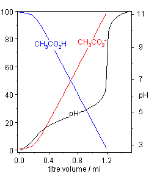

</article>

### 21.5 Salt Solutions

<article>

Worksheet
---------

**Name \_\_\_\_\_\_\_\_\_\_\_\_\_\_\_\_\_\_\_\_\_ Class \_\_\_\_\_\_\_\_\_\_\_\_\_\_\_\_\_\_\_\_\_\_ Date \_\_\_\_\_\_\_\_\_\_\_\_\_\_\_\_**

_Answer each of the questions below to show your achievement of the lesson objectives_

**Lesson Objective: Predict whether a certain salt solution is acidic, basic, or neutral.**

1.  When LiNO3 is dissolved in water, the resulting solution will be
    1.  strongly basic
    2.  slightly basic
    3.  neutral
    4.  slightly acidic
2.  A solution of NaF in water will have a pH that is
    1.  strongly basic
    2.  slightly basic
    3.  neutral
    4.  slightly acidic
3.  A solution of a salt from a strong acid and a weak base will be
    1.  acidic
    2.  basic
    3.  neutral
    4.  depends on the base
4.  A solution of a salt from a weak acid and weak base will be
    1.  acidic
    2.  basic
    3.  too difficult to analyze
    4.  neutral
5.  The ammonium ion can react with water by
    1.  being a proton donor
    2.  being a proton acceptor
    3.  forming ammonium hydroxide
    4.  neutralizing the hydroxide ion
6.  True/False: All ions can react with water and change the pH of the solution.
7.  True/False: Anions of weak acids will contribute to OH_\-_ formation.
8.  True/False: The fluoride ion acts as a Brønsted-Lowry base.
9.  True/False: The chloride ion is the conjugate base of HCl.
10. True/False: Ammonium chloride acts as a base in water.
11. Define salt hydrolysis.
12. Predict whether the solutions made from the following salts will be neutral, acidic, or basic:
    1.  NaCN
    2.  K3PO4
    3.  methylamine chloride
13. The ions produced from the \_\_\_\_\_\_\_ of a salt are sometimes capable of undergoing reactions with \_\_\_\_\_\_ that change the \_\_\_\_\_ of the solution.
14. Salts that are derived from the \_\_\_\_\_\_\_\_ of a weak acid (HF) by a \_\_\_\_\_\_ base (NaOH) will always produce salt solutions that are \_\_\_\_\_\_.

**Lesson Objective: Write balanced equations for hydrolysis reactions.**

15. The ammonium ion can react with water by acting as all of the following except
    1.  Arrhenius acid
    2.  proton donor
    3.  Brønsted-Lowry acid
    4.  Brønsted-Lowry base
16. Fluoride in water acts as a
    1.  proton donor
    2.  Brønsted-Lowry acid
    3.  Brønsted-Lowry base
    4.  Arrhenius acid
17. The ClO_\-_ anion will produce a salt solution that is
    1.  slightly basic
    2.  slightly acid
    3.  neutral
    4.  unable to predict
18. True/False: The production of hydronium ions causes the resulting solution to be acidic.
19. True/False: A solution of sodium acetate will be slightly acidic.
20. True/False: Knowledge of $K_a$ or $K_b$ is necessary to calculate the pH of a salt solution.
21. Write balanced equations for the following ions in water solution:
    1.  CH3NH3_+_
    2.  CH3COO_\-_ (acetate anion)
    3.  ClO_\-_

**Lesson Objective: Calculate the pH of a salt solution when the $K_a$ or the $K_b$ of the hydrolyzing ion is known.**

22. Calculations of pH from salt concentrations involves all of the following except
    1.  ICE table
    2.  knowledge of $K_a$ or $K_b$
    3.  complete equation for process
    4.  temperature of system
23. True/False: The chloride ion can accept a proton from water.
24. The $K_b$ of the acetate ion (HCOO_\-_) is $5.56 \times 10^{-11}$. What is the pH of 0.35 M solution of sodium formate (NaHCOO)?
25. What is the pH of a 0.0510 molar solution of salt NaCN (the $K_b$ for CN_\-_ is $1.62 \times 10^{-5}$)?

**Lesson Objective: Use equations to show how buffers resist changes in pH by using up additional hydrogen or hydroxide ions.**

26. A buffer can consist of any of the following except
    1.  weak acid and salt of its conjugate base
    2.  weak acid and salt of its conjugate base
    3.  strong acid and salt of its conjugate base
    4.  acetic acid and the acetate anion
27. True/False: The most important blood buffer is carbonic acid/hydrogen carbonate.
28. Define the following terms
    1.  buffer
    2.  buffer capacity
29. Write equations to show how the carbonic acid/hydrogen carbonate buffer system neutralizes an increase in \[H_+_\].
30. Buffers are especially critical in biological systems. For example, the pH of blood must be maintained within a fairly narrow range of about 7.35 to 7.45. There are several buffers at work in blood, but the most important one involves carbonic acid (H2CO3) and the hydrogen carbonate ion (HCO3_\-_). The ratio between the two is carefully maintained through metabolic processes so that the pH of blood is nearly constant.
31. What would be the effect on the buffer system of a decrease in hydrogen ion concentration?
32. H2CO3 is an unstable compound when dissolved in water, and readily forms H2O and CO2. How would the amount of dissolved carbon dioxide help balance an increase in hydrogen ion concentration?

| Concentration | HCOO_\-_ | HCOOH | OH_\-_ |
| --- | --- | --- | --- |
| I   | $0.35 \ M$ | $0$ | $0$ |
| C   | $-x$ | $+x$ | $+x$ |
| E   | $0.35 - x$ | $x$ | $x$ |

| Concentration | CN_\-_ | HCN | OH_\-_ |
| --- | --- | --- | --- |
| I   | $0.051 \ M$ | $0$ | $0$ |
| C   | $-x$ | $+x$ | $+x$ |
| E   | $0.051 - x$ | $x$ | $x$ |

</article>

## 22.0 Oxidation Reduction Reactions Worksheets

<article>

</article>

### 22.1 The Nature of Oxidation and Reduction

<article>

Worksheet
---------

**Name \_\_\_\_\_\_\_\_\_\_\_\_\_\_\_\_\_\_\_\_\_ Class \_\_\_\_\_\_\_\_\_\_\_\_\_\_\_\_\_\_\_\_\_\_ Date \_\_\_\_\_\_\_\_\_\_\_\_\_\_\_\_**

_Answer each of the questions below to show your achievement of the lesson objectives_

**Lesson Objective: Define oxidation and reduction in terms of a gain or loss of oxygen atoms.**

1.  All of the following statements about oxidation are true except
    1.  combustion is an oxidation process
    2.  oxidation involves the addition of oxygen
    3.  rusting of iron is an oxidation process
    4.  treating iron ore with carbon is an oxidative process
2.  All of the following statements about reduction are true except
    1.  bleaches reduce stains by removal of oxygen atoms
    2.  reduction is the removal of oxygen from a substance
    3.  iron oxide can be reduced to pure iron
    4.  every reduction process requires a simultaneous oxidation process
3.  True/False: Sodium hypochlorite oxidizes stains to make their removal easier.
4.  True/False: Reduction involves oxygen transfer to a metal.
5.  Since oxidation was originally defined as the \_\_\_\_\_\_\_\_\_of oxygen, \_\_\_\_\_\_\_\_was therefore the removal of oxygen from a substance.
6.  Many elements simply \_\_\_\_\_\_\_with oxygen to form the \_\_\_\_\_\_\_ of that element.

**Lesson Objective: Define oxidation and reduction in terms of a gain or loss of electrons.**

7.  Oxidation involves
    1.  a shift of protons
    2.  a loss of electrons
    3.  shifting electrons from oxygen to another atom
    4.  shifting electrons from another atom to oxygen
8.  True/False: Some oxidation reactions do not involve oxygen.
9.  Define the following terms
    1.  oxidation
    2.  reduction
    3.  oxidation-reduction reaction

**Lesson Objective: Describe oxidation and reduction as it occurs in both ionic and molecular reactions.**

10. The production of ZnS involves
    1.  transfer of one electron from Zn to S
    2.  transfer of two electrons from Zn to S
    3.  transfer of one electron from S to Zn
    4.  transfer of two electrons from S to Zn
11. All of the following are true about redox reactions except
    1.  electron loss is oxidation
    2.  electron gain is reduction
    3.  electron loss is reduction
    4.  electrons that are lost must be gained by another particle
12. In the formation of water from O2 and H2 all of the following are true except
    1.  hydrogen atoms are oxidized
    2.  oxygen atoms are reduced
    3.  in the -O-H bond, the electrons are more attracted to O
    4.  H atoms in water have a greater electron density than they did in H2
13. True/False: H in the water molecule is more electron-rich than O is.
14. True/False: S is the oxidizing agent in the formation of ZnS from Zn and S.
15. True/False: Net ionic equations help identify oxidation and reduction processes.
16. Define the following terms
    1.  half-reaction
    2.  oxidizing agent
    3.  reducing agent

**Lesson Objective: Identify the oxidizing and reducing agents in a redox reaction.**

17. An oxidizing agent
    1.  reduces another atom
    2.  oxidizes another atom
    3.  is oxidized by another atom
    4.  transfers oxygen from one atom to another
18. A reducing agent
    1.  reduces another atom
    2.  oxidizes another atom
    3.  is reduced by another atom
    4.  transfers hydrogen from one atom to another
19. True/False: The half reaction $Mg \rightarrow Mg^{2+}$ represents a reduction process
20. True/False: Addition of H to the $O=O$ double bond is a reduction process
21. In the course of a chemical reaction between a metal and a \_\_\_\_\_\_\_\_\_, \_\_\_\_\_\_\_\_\_are transferred from the metal atoms to the nonmetal atoms
22. For each of the following reactions, indicate which component is oxidized and which is reduced, then identify the oxidizing agent and the reducing agent:
    1.  $Zn + 2HCl \rightarrow Zn^{2+} + H_2 +2Cl^-$
    2.  $3CuS + 8HNO_3 \rightarrow 3 CuSO_4 + 8NO + 4H_2O$
    3.  $4 Ag(s) + 2 H_2S(g) + O_2(g) \rightarrow 2 Ag_2S(s) + 2 H_2O(g)$
    4.  $SF_4(g) + F_2(g)\rightarrow SF_6(g)$

**Lesson Objective: Describe corrosion and some of the ways to prevent it or slow it down**

23. All of the following are iron oxidation states that are components of rust except
    1.  Fe°
    2.  Fe_+_
    3.  Fe_2+_
    4.  Fe_3+_
24. The green color on the Statue of Liberty is due to
    1.  CuO
    2.  Cu2O
    3.  CuCO3
    4.  CuCl2
25. True/False: Corrosion costs the U.S economy over $100 billion per year.
26. True/False: Covering a metal surface with oil or paint is the best way to prevent corrosion.
27. The following reaction illustrates the process of corrosion of zinc metal to form “white rust”
28. $2Zn + 2H_2O + O_2 \rightarrow Zn(OH)_2$
29. Which material is oxidized and which is reduced?
30. Oxygen is an element that has been known for centuries. In its pure elemental form, oxygen is highly reactive, and it readily makes compounds with most other elements. It is also the most abundant element by mass in the Earth’s crust. The class of reactions called oxidation and reduction were originally defined with respect to the element oxygen.
31. Why would the first definitions of oxidation and reduction be related to oxygen?
32. Other definitions of reduction include the addition of hydrogen and the gain of electrons. Give one example of each of these examples of reduction.

| Reaction | Oxidized | Reduced | Oxidizing Agent | Reducing Agent |
| --- | --- | --- | --- | --- |
| a   | Zn to Zn_2+_ | H_+_ to H | H_+_ | Zn  |
| b   | S_2-_ to S_+6_ | N_+5_ to N_+2_ | N_+5_ | S_\-2_ |
| c   | Ag to Ag_+_ | O to O_2-_ | O   | Ag  |
| d   | S_+4_ to S_+6_ | F to F_2-_ | F   | S_+4_ |

</article>

### 22.2 Oxidation Numbers

<article>

Worksheet
---------

**Name \_\_\_\_\_\_\_\_\_\_\_\_\_\_\_\_\_\_\_\_\_ Class \_\_\_\_\_\_\_\_\_\_\_\_\_\_\_\_\_\_\_\_\_\_ Date \_\_\_\_\_\_\_\_\_\_\_\_\_\_\_\_**

_Answer each of the questions below to show your achievement of the lesson objectives_

**Lesson Objective: Use the oxidation number rules to determine the oxidation number of an atom of any element in a pure substance.**

1.  Oxygen can have all of the following oxidations numbers except
    1.  +1
    2.  +2
    3.  \-3
    4.  \-2
2.  The only halogen that does not have a variable oxidation number is
    1.  Cl
    2.  F
    3.  I
    4.  Br
3.  The oxidation number for H in NaBH4 is
    1.  +1
    2.  +2
    3.  \-1
    4.  \-2
4.  True/False: The oxidation number of an atom in an element is zero.
5.  True/False: The oxidation number for S in compounds depends on the structure of the compound.
6.  True/False: In a polyatomic ion, the sum of oxidation numbers of the atoms equals zero.
7.  Define oxidation number.
8.  Indicate the oxidation numbers of the following atoms in compounds:

| Atom | Compound | Oxidation Number |
| --- | --- | --- |
| Cl  | Fe(ClO2)3 |     |
| Mn  | KMnO4 |     |
| N   | N2O3 |     |
| S   | Al2S3 |     |

**Lesson Objective: Define oxidation and reduction in terms of a change in oxidation number.**

9.  The oxidation process involves
    1.  loss of oxygen
    2.  gain of hydrogen
    3.  complete loss of electrons
    4.  decrease in oxidation number
10. The reduction process involves
    1.  loss of oxygen
    2.  increase in oxidation number
    3.  complete loss of electrons
    4.  gain of hydrogen
11. In a reaction, KNO2 is converted to KNO3. The oxidation-reduction change was
    1.  $K^+ \rightarrow K^{2+}$
    2.  $O^- \rightarrow O^{2-}$
    3.  $N^{+3} \rightarrow N^{+4}$
    4.  $N^{+3} \rightarrow N^{+5}$
12. True/False: A shift of electrons towards an atom in a covalent bond is an oxidation of that atom.
13. True/False: The change in Cl from KClO3 to KCl represents a reduction of Cl.
14. True/False: The change in N from HNO3 to NaNO3 represents an oxidation of N.
15. State whether the indicated atom is oxidized or reduced as a result of the reaction.

| Atom | Reactant | Product | Oxidized or Reduced? |
| --- | --- | --- | --- |
| S   | S   | SO2 |     |
| Mn  | KMnO4 | Mn2O3 |     |
| V   | V2O3 | VO  |     |
| Sn  | SnCl2 | SnCl4 |     |

**Lesson Objective: Identify which atoms are being oxidized and which atoms are being reduced in a redox reaction.**

16. For the reaction below, all of the following statements are correct except one
17. $Mn(NO_3)_2 + NaBiO_3 + HNO_3 \rightarrow HMnO_4 + Bi(NO_3)_3 + NaNO_3 + H_2O$
    1.  Mn is oxidized
    2.  Na is reduced
    3.  Bi is reduced
    4.  N is unchanged
18. True/False: In the reaction $Mg + HCl \rightarrow MgCl_2 + H_2$, Mg is oxidized
19. For each of the following reactions, list the atom(s) oxidized and the atom(s) reduced:
    1.  $KMnO_4 + KNO_2 + H_2SO_4 \rightarrow MnSO_4 + H_2O + KNO_3 + K_2SO_4$
    2.  $4NH_3 + 5O_2 \rightarrow 4NO + 6H_2O$
    3.  $4NaOH + Ca(OH)_2 + C + 4ClO_2 \rightarrow 4NaClO_2 + CaCO_3 + 3H_2O$

**Lesson Objective: Know which types of reactions are usually redox reactions and which types are usually not. Use oxidation number changes to decide whether a given reaction involves oxidation and reduction.**

19. A redox reaction must involve a change in oxidation number for at least \_\_\_\_ of the atoms in the reaction
    1.  one
    2.  two
    3.  three
    4.  four
20. Single replacement reactions are redox reactions because of all of the following except
    1.  a free element is transformed to an ionized material
    2.  an ionized material is transformed to a free element
    3.  a cation becomes an anion
    4.  a material with an oxidation number of zero experiences a change in oxidation number
21. Combustion reactions are redox reactions for all of the following reasons except
    1.  oxygen acts as a reducing agent
    2.  oxygen is reduced
    3.  carbon has oxygen added to form CO2
    4.  elemental oxygen is incorporated into a compound
22. True/False: Double-displacement reactions are not redox reactions.
23. True/False: The reaction of sodium metal with water to form NaOH and hydrogen gas is a redox reaction.
24. True/False: The neutralization of HCl by NaOH is a redox reaction.
25. Indicate which reactions shown below are redox reactions:
    1.  $Pb + FeSO_4 \rightarrow PbSO_4 + Fe$
    2.  $Na_3PO_4 + 3 KOH \rightarrow 3 NaOH + K_3PO_4$
    3.  $MgCl_2 + Li_2CO_3 \rightarrow MgCO_3 + 2 LiCl$
    4.  $4 C_5H_9O + 27 O_2 \rightarrow 20 CO_2 + 18 H_2O$
    5.  $CaCO_3 \rightarrow CaO + CO_2$
26. Overall, the oxidation number of an atom in a molecule is the charge that the atom would have if all polar covalent and ionic bonds resulted in a complete transfer of electrons from the less electronegative atom to the more electronegative one.
27. Whys is this explanation necessary?
28. Since redox reactions involve the transfer of electrons, could this phenomenon be used in electrical circuits?

| Atom | Compound | Oxidation Number |
| --- | --- | --- |
| Cl  | Fe(ClO2)3 | +3  |
| Mn  | KMnO4 | +7  |
| N   | N2O3 | +3  |
| S   | Al2S3 | \-2 |

| Atom | Reactant | Product | Oxidized or Reduced? |
| --- | --- | --- | --- |
| S   | S   | SO2 | oxidized |
| Mn  | KMnO4 | Mn2O3 | reduced |
| V   | V2O3 | VO  | reduced |
| Sn  | SnCl2 | SnCl4 | oxidized |

</article>

### 22.3 Balancing Redox Reactions

<article>

Worksheet
---------

**Name \_\_\_\_\_\_\_\_\_\_\_\_\_\_\_\_\_\_\_\_\_ Class \_\_\_\_\_\_\_\_\_\_\_\_\_\_\_\_\_\_\_\_\_\_ Date \_\_\_\_\_\_\_\_\_\_\_\_\_\_\_\_**

_Answer each of the questions below to show your achievement of the lesson objectives_

**Lesson Objective: Balance a redox equation using the oxidation-number-change method.**

1.  One approach to balancing redox equations is called the
    1.  oxidation number method
    2.  oxidation number change method
    3.  oxidation change method
    4.  oxidation valance method
2.  The first step in this approach is to
    1.  balance the equation
    2.  identify what is oxidized and what is reduced
    3.  assign oxidation numbers
    4.  check to see if the equation is balance in terms of both atoms and charges
3.  The second step is to
    1.  balance the equation
    2.  identify what is oxidized and what is reduced
    3.  assign oxidation numbers
    4.  check to see if the equation is balance in terms of both atoms and charges
4.  Step three in the process is to
    1.  write half-reactions for the changes
    2.  use coefficients to balance the equation
    3.  use lines to connect atoms undergoing oxidation or reduction
    4.  check to see if the equation is balanced
5.  Step five is to
    1.  balance the equation
    2.  identify what is oxidized and what is reduced
    3.  assign oxidation numbers
    4.  check to see if the equation is balanced in terms of both atoms and charges
6.  True/False: Balancing solely by inspection is always an easy way to balance redox equations.
7.  True/False: Monitoring how the oxidation numbers change is good practice.
8.  True/False: Oxidation numbers are assigned to each atom in the equation.
9.  True/False: Coefficients are needed only for those materials directly involved in the redox process.
10. True/False: The total increase in oxidation number must equal the total decrease in oxidation number.
11. Balance the following equations using the oxidation number change method:
    1.  $HNO_3 + H_3AsO_3 \rightarrow NO + H_3AsO_4 + H_2O$
    2.  $HNO_3 + H_3AsO_3 \rightarrow NO + H_3AsO_4 + H_2O$
    3.  $Cu + HNO_3 \rightarrow Cu(NO_3)_2 + NO + H_2O$
    4.  $NO_2 + H_2 \rightarrow NH_3 + H_2O$
    5.  $Al + MnO_2 \rightarrow Al_2O_3 + Mn$

**Lesson Objective: Balance a redox equation by breaking it down into oxidation and reduction half-reactions and using the half-reaction method.**

12. The first step in balancing equations using the half-reaction method is to
    1.  write the balanced ionic equation
    2.  write the half-reactions
    3.  write the unbalanced ionic equation
    4.  add electrons to each half
13. The second step is to
    1.  write the half-reactions
    2.  add water where needed
    3.  add acid where needed
    4.  add electrons
14. The third step is to
    1.  add water molecules where needed
    2.  balance each half-reaction
    3.  add acid where needed
    4.  add water where needed
15. The fifth step is to
    1.  add electrons where needed
    2.  add water where needed
    3.  multiply by a coefficient
    4.  add the two half-reactions together
16. The sixth step is to
    1.  add electrons where needed
    2.  add water where needed
    3.  multiply by a coefficient
    4.  add the two half-reactions together
17. True/False: Reactions in a basic medium require addition of hydroxide ions.
18. True/False: Oxidation of Fe_2+_ by Cr2O7_2-_ readily occurs in basic solution.
19. True/False: The half-reaction method is more useful for reactions involving ions in water.
20. True/False: Half-reactions treat oxidation and reduction as two sequential processes.
21. True/False: Electrons are added to each half-reaction to balance the charges.
22. Write half-reactions for the following redox processes:
    1.  $Fe^{2+} + MnO_{4^-} \rightarrow Fe^{3+} + Mn^{2+}$
    2.  $3CuS + 8HNO_3 \rightarrow 3 CuSO_4 + 8NO + 4H_2O$
    3.  $4 Ag + 2 H_2S + O_2 \rightarrow 2 Ag_2S + 2 H_2O$
23. Balance the following equations using the half-reaction method:
    1.  $Cu + HNO_3 \rightarrow Cu^{2+} + NO$
    2.  $ClO_3^- + SO_2 \rightarrow SO_4^{2-} + Cl^-$
    3.  $MnO_4^- + H_2S \rightarrow Mn^{2+} + S_8$

</article>

## 23.0 Electrochemistry Worksheets

<article>

</article>

### 23.1 Electrochemical Cells

<article>

Worksheet
---------

**Name \_\_\_\_\_\_\_\_\_\_\_\_\_\_\_\_\_\_\_\_\_ Class \_\_\_\_\_\_\_\_\_\_\_\_\_\_\_\_\_\_\_\_\_\_ Date \_\_\_\_\_\_\_\_\_\_\_\_\_\_\_\_**

_Answer each of the questions below to show your achievement of the lesson objectives_

**Lesson Objective: Use the activity series to identify elements that are more easily oxidized than others, and write oxidation and reduction half-reactions.**

1.  All of the following are applications of electrochemistry except
    1.  providing power to devices
    2.  removing electrons for storage
    3.  plate metals
    4.  nerve transmission
2.  Nickel metal will oxidize when in a solution with \_\_\_\_\_\_ cations
    1.  magnesium
    2.  barium
    3.  copper
    4.  potassium
3.  Aluminum metal will not oxidize when in a solution of \_\_\_\_\_\_ cations.
    1.  magnesium
    2.  mercury
    3.  iron
    4.  lead
4.  The reaction involving zinc metal immersed in a solution of copper ions is called a \_\_\_\_ reaction.
    1.  indirect
    2.  oscillating
    3.  direct
    4.  solution
5.  True/False: Some chemical reactions can involve production of electricity.
6.  True/False: Oxidation and reduction reactions occur sequentially.
7.  True/False: Lithium will spontaneously oxidize in a solution of silver nitrate.
8.  True/False: Iron will spontaneously oxidize in a solution of sodium chloride.
9.  Define the following terms:
    1.  electrochemistry
    2.  electrochemical cell
10. The electrons that are transferred in the reaction go \_\_\_\_\_\_\_ from the Zn atoms on the \_\_\_\_\_\_of the strip to the Cu_2+_ ions that are in the \_\_\_\_\_\_\_\_ adjacent to the zinc strip.
11. In each of the following combinations, indicate whether or not a reaction will occur.
    1.  $NaCl (aq) + Ni(s)$
    2.  $Ca(s) + ZnCl_2(aq)$
    3.  $CuCl_2(aq) + Ag(s)$
    4.  $K(s) + CaCl_2 (aq)$

**Lesson Objective: Describe the parts of a voltaic cell and explain how redox reactions are used to generate an electric current.**

12. Volta constructed a cell that generated
    1.  alternating current
    2.  fluctuating current
    3.  intermittent current
    4.  direct current
13. The cell notation for the zinc-copper cell is
    1.  $Cu(s) \big| Cu^{2+} (1M) \big\| Zn^{2+} (1M) \big| Zn(s)$
    2.  $Zn(s) \big| Zn^{2+} (1 M) \big\| Cu^{2+} (1 M) \big| Cu(s)$
    3.  $Cu^{2+} (1M) \big| Cu(s) \big\| Zn^{2+} (1M) \big| Zn(s)$
    4.  $Zn^{2+} (1M) \big| Zn(s) \big\| Cu^{2+} (1 M) \big| Cu(s)$
14. All of the following are indicated in a voltaic cell except
    1.  salt bridge
    2.  anode
    3.  phase boundaries
    4.  salt bridge composition
15. True/False: A non-porous plug is used in the salt bridge.
16. True/False: A metal wire connects the two electrodes.
17. True/False: The anode is conventionally written on the right side of the notation.
18. Define the following terms
    1.  voltaic cell
    2.  half-cell
    3.  electrode
    4.  salt bridge
19. Write the shorthand notation for a galvanic cell that uses the reaction
20. $Fe(s) + Sn^{2+} (aq) \rightarrow Fe^{2+} (aq) + Sn(s)$
21. Assume any solutions to be 1.0 M

**Lesson Objective: Describe the general features of a dry cell, a lead storage battery, and a fuel cell.**

20. One of the following is not an example of a voltaic cell
    1.  dry cell
    2.  fuel cell
    3.  solar cell
    4.  lead storage battery
21. One of the following is not a component of the dry cell paste
    1.  MnO2
    2.  ZnO2
    3.  NH4Cl
    4.  ZnCl2
22. The cathode in a lead storage battery is
    1.  PbO2
    2.  PbO
    3.  Pb
    4.  PbSO4
23. True/False: The anode for a dry cell battery is the Zn container.
24. True/False: The dry cell battery uses a salt bridge.
25. True/False: In a fuel cell, hydrogen gas is oxidized to water.
26. Define the following terms
    1.  battery
    2.  fuel cell
27. Write the overall reactions for
    1.  a zinc dry cell battery
    2.  an alkaline battery
28. Write half-reactions for the recharging of a lead storage battery.
29. The inert electrolyte in the salt bridge is often potassium chloride (KCl) or sodium nitrate (NaNO3).
30. Why would these two salts be considered to be inert electrolytes?
31. Alessandro Volta tested the strength of the early electrochemical cells he developed by measuring the amount of shock they produced. Discuss the pros and cons of this experimental approach.

</article>

### 23.2 Cell Potentials

<article>

Worksheet
---------

**Name \_\_\_\_\_\_\_\_\_\_\_\_\_\_\_\_\_\_\_\_\_ Class \_\_\_\_\_\_\_\_\_\_\_\_\_\_\_\_\_\_\_\_\_\_ Date \_\_\_\_\_\_\_\_\_\_\_\_\_\_\_\_**

_Answer each of the questions below to show your achievement of the lesson objectives_

**Lesson Objective: Describe how an electrical potential is generated in an electrochemical cell.**

1.  The electrical potential for a cell comes about as a result of competition for
    1.  protons
    2.  electrons
    3.  hydrogen ions
    4.  ions
2.  Difference in electrical potential between two \_\_\_\_\_\_ produces voltage.
    1.  ions
    2.  electrodes
    3.  half-cells
    4.  anodes
3.  True/False: The electrical potential of an isolated half-cell can be measured.
4.  True/False: Spontaneous redox reactions produce electrical energy.
5.  Define the following terms:
    1.  electrical potential
    2.  reduction potential
    3.  cell potential

**Lesson Objective: Describe the standard hydrogen electrode and how it is used to determine the standard cell potentials of other half-cells.**

6.  Determination of standard cell potential requires an electrochemical cell with aqueous components present at \_\_\_\_ concentration.
    1.  0.1 M
    2.  0.5 M
    3.  2.0 M
    4.  1.0 M
7.  The standard potential for the hydrogen electrode is
    1.  0.00 V
    2.  0.10 V
    3.  0.01 mv
    4.  0.10 mv
8.  A negative standard reduction potential means
    1.  it is easier to reduce the species
    2.  it is easier to reduce hydrogen
    3.  it is easier to oxidize the species
    4.  hydrogen oxidizes less readily than the species
9.  True/False: The standard hydrogen electrode is immersed in 1.0 M H_+_.
10. True/False: The metal for the electrode is made of gold.
11. True/False: Hydrogen gas is formed in all applications of the hydrogen electrode.
12. Define the following terms:
    1.  standard cell potential
    2.  standard hydrogen electrode
13. Why is Pt used as the metal for the standard hydrogen electrode?
14. How can the SHE serve both as a cathode and an anode?

**Lesson Objective: Calculate the standard cell potentials from a table of standard reduction potentials.**

15. The half-cell with the higher reduction potential will
    1.  undergo reduction
    2.  undergo oxidation
    3.  cause the other cell to reduce
    4.  lose electrons
16. Co_2+_ will undergo reduction when paired with half-cells made of all of the following except
    1.  Cd_2+_
    2.  Sn_2+_
    3.  Ca_2+_
    4.  Cs_+_
17. The cell potential can be calculated using the formula
    1.  $E_{ox} - E_{red}$
    2.  $E_{ox} \div E_{red}$
    3.  $E_{red} - E_{ox}$
    4.  $E_{red} \div E_{ox}$
18. True/False: The cell potential must be negative for the redox reaction to be spontaneous.
19. True/False: In the voltaic cell using $Zn \big| Zn^{2+}$ and $Fe \big| Fe^{2+}$, $Fe^{2+}$ will be reduced.
20. True/False: Lithium ions reduce easily.
21. For the following cell combinations calculate the standard cell potential and write the overall cell reaction:
    1.  $Co \big| Co^{2+}$ and $Pb \big| Pb^{2+}$
    2.  $Cu \big| Cu^+$ and $Be \big| Be^{2+}$
    3.  $Mg \big| Mg^{2+}$ and $Sn \big| Sn^{4+}$

**Lesson Objective: Predict the behavior of oxidizing and reducing agents based on their position in the table of standard reduction potentials.**

22. A strong oxidizing agent is one that can
    1.  pull electrons away from other species
    2.  donate electrons to other species
    3.  transfer electrons to other species
    4.  convert metallic ions to metals
23. Cr will reduce all of the following except
    1.  Ag_+_
    2.  Br2
    3.  Mn_2+_
    4.  Pb_2+_
24. True/False: Fluorine is the strongest oxidizing agent.
25. True/False: Metals will reduce metals listed below them in the standard reduction potential table.
26. Which of the following metals will react with HCl? Hg, Sn, Cr, Mg
27. Rank the following oxidizing agents with 1 as strongest and 4 as weakest: Cd_2+_, Al_3+_, Au_3+_, Ni_2+_.
28. The electrical potential of a cell results from a competition for electrons. In the zinc-copper voltaic cell described in the previous lesson, the copper(II) ions were reduced to copper metal. That is because the Cu_2+_ ions have a greater attraction for electrons than the Zn_2+_ ions in the other half-cell. Instead, the zinc metal is oxidized. A **reduction potential** _measures the tendency of a given half-reaction to occur as a reduction in an electrochemical cell_. In a given voltaic cell, the half-cell that has the greater reduction potential is the one in which reduction will occur.
29. Is there any advantage to using the term reduction potential or would oxidation potential be just as useful?
30. Lead in water supplies is a serious problem in many parts of the world. Your local chemistry genius is proposing to bubble fluorine gas into water supplies to precipitate the lead. Do you think this is a good idea. Explain your answer.

</article>

### 23.3 Electrolysis

<article>

Worksheet
---------

**Name \_\_\_\_\_\_\_\_\_\_\_\_\_\_\_\_\_\_\_\_\_ Class \_\_\_\_\_\_\_\_\_\_\_\_\_\_\_\_\_\_\_\_\_\_ Date \_\_\_\_\_\_\_\_\_\_\_\_\_\_\_\_**

_Answer each of the questions below to show your achievement of the lesson objectives_

**Lesson Objective: Distinguish between voltaic and electrolytic cells.**

1.  All of the following are true statements except
    1.  voltaic cells use spontaneous reactions to generate electric current
    2.  nonspontaneous reactions are driven by an external electrical current
    3.  products are favored over reactants in a nonspontaneous reaction
    4.  half cells are involved in both voltaic and electrolytic processes
2.  In an electrolytic process involving Zn and Cu
    1.  the Zn electrode is the anode
    2.  the Cu electrode is the anode
    3.  Zn is oxidized
    4.  Cu is reduced
3.  True/False: Electrolysis is used to plate silver on jewelry.
4.  True/False: A voltaic cell uses an electric current to initiate a spontaneous reaction.
5.  Define the following terms:
    1.  electrolysis
    2.  electrolytic cell

**Lesson Objective: Describe a Down’s cell, and identify the products of the electrolysis of molten sodium chloride.**

6.  In the Down’s cell
    1.  molten NaCl reacts at the cathode to form metallic sodium
    2.  molten NaCl reacts at the anode to form metallic sodium
    3.  chlorine ions are reduced to form chlorine gas
    4.  chlorine ions are converted to chlorine gas at the cathode
7.  The overall Down’s cell requires over\_\_\_\_\_ volts for the reaction to occur
    1.  2.5
    2.  3.4
    3.  1.8
    4.  4.1
8.  True/False: The Down’s cell is a minor producer of sodium metal.
9.  True/False: Chlorine is used as a disinfectant.
10. Write the half-reactions and the overall reaction for the Down’s process.
11. Would you expect the melted Na to be more or less dense than melted NaCl? Explain your answer.
12. Solid NaCl is a poor conductor of electricity. Why would melted NaCl conduct electricity well?

**Lesson Objective: Describe the reactions that occur during the electrolysis of water.**

13. All of the following are components of the apparatus for electrolysis of water except
    1.  sulfuric acid
    2.  platinum electrode
    3.  power supply
    4.  gold electrode
14. Oxygen is formed at the
    1.  anode
    2.  cathode
    3.  electrode
    4.  electrical interface
15. True/False: Pure water will effectively conduct an electric current
16. True/False: Water is simultaneously oxidized and reduced.
17. Write the half-reactions and the overall reaction for the electrolysis of water.
18. Describe the Hoffman apparatus for the electrolysis of water. Include a diagram.

**Lesson Objective: Identify the products that would be generated during the electrolysis of an aqueous solution of sodium chloride.**

19. One of the following is not a product of brine electrolysis
    1.  Cl2
    2.  Na
    3.  H2
    4.  O2
20. The reduction potential for water is
    1.  \-0.70 V
    2.  \-0.80 V
    3.  \-0.83 V
    4.  \-0.89 V
21. True/False: Chlorine gas is produced at the cathode
22. True/False: NaOH can be obtained by evaporating the water.
23. Write the half-reactions and the overall reaction for the electrolysis of brine.
24. Could you use a standard apparatus for electrolysis of water to carry out the electrolysis of brine? Explain your answer.

**Lesson Objective: Describe the process of electroplating.**

25. All of the following are true statements about electroplating except
    1.  silver is both oxidized and reduced
    2.  a silver strip serves as the anode
    3.  silver nitrate solution is used in the process
    4.  silver metal is oxidized to provide Ag+ for plating
26. In electroplating, silver metal is deposited on a
    1.  stainless steel spoon
    2.  silver fork
    3.  platinum rod
    4.  aluminum foil
27. True/False: The spoon serves as the cathode in the process.
28. True/False: The Ag_+_ concentration gradually changes.
29. Define electroplating.
30. If the silver nitrate solution provides the ions for electroplating, why is the silver strip needed?
31. A nonspontaneous reaction is one in which the reactants are favored over the products under a given set of reaction conditions. However, if a chemical system is supplied with energy from an external source, it is possible to drive a reaction in the nonspontaneous direction.
32. Why would a nonspontaneous reaction be needed?
33. How would you electroplate copper (hint: look at the table in lesson 23-2)?

</article>

## 24.0 Nuclear Chemistry Worksheets

<article>

</article>

### 24.1 Nuclear Radiation

<article>

Worksheet
---------

**Name \_\_\_\_\_\_\_\_\_\_\_\_\_\_\_\_\_\_\_\_\_ Class \_\_\_\_\_\_\_\_\_\_\_\_\_\_\_\_\_\_\_\_\_\_ Date \_\_\_\_\_\_\_\_\_\_\_\_\_\_\_\_**

_Answer each of the questions below to show your achievement of the lesson objectives_

**Lesson Objective: Explain how radioactivity involves a change in the nucleus of a radioisotope.**

_Multiple Choice_

1.  All of the following statements about nuclear reactions are true except
    1.  the nucleus gains stability by undergoing a reaction
    2.  pressure affects nuclear reactions
    3.  temperature does not affect a nuclear reaction
    4.  energies released in nuclear reactions are much larger than energies in chemical reactions.

2.  Nuclear reactions
    1.  require energy input to take place
    2.  are non-spontaneous
    3.  cause one nuclide to change into another nuclide
    4.  occur with all isotopes

_True/False_

3.  \_\_\_\_\_ Nuclear reactions are strongly influenced by environmental factors.
4.  \_\_\_\_\_ Some elements have no stable isotopes.

_Fill in the Blank_

5.  Define the following terms
    1.  radioactivity
    2.  radioisotope
    3.  nuclide

6.  What is the primary difference between a chemical reaction and a nuclear reaction?

**Lesson Objective: Describe mass defect, and calculate the conversion of mass to energy according to Einstein’s equation.**

_Multiple Choice_

7.  The mass of the helium atom equals
    1.  the mass of two protons and two neutrons
    2.  the mass of two protons, two neutrons and two electrons
    3.  more than the mass of two protons, two neutrons, and two electrons
    4.  less than the mass of two protons, two neutrons, and two electrons

8.  Einstein’s equation states
    1.  E = mc
    2.  E = mc_2_
    3.  E = m/c
    4.  E = m/c_2_

9.  The nuclear binding energy is measured in
    1.  J
    2.  J/K
    3.  J-mol
    4.  J/sec

_True/False_

10. \_\_\_\_\_ In Einstein’s equation, c stands for the speed of light.
11. \_\_\_\_\_ The mass of particles is measured in micrograms.
12. \_\_\_\_\_ Avogadro’s number is used in nuclear binding energy calculations.

_Fill in the Blank_

13. Define the following terms:
    1.  nuclear binding energy
    2.  nucleon

14. Copper has 29 protons and copper-63 also has (63 - 29) 34 neutrons. The mass of a proton is 1.00728 amu and a neutron is 1.00867 amu. Find the mass defect of a copper-63 nucleus if the actual mass of a copper-63 nucleus is 62.91367 amu.
15. If the mass defect for carbon-12 is 0.098938 amu, calculate the binding energy for the atom.

**Lesson Objective: Describe the band of stability, the odd-even effect, and magic numbers in terms of their influence on the stability of nuclei.**

_Multiple Choice_

16. No stable nuclides exist beyond the element
    1.  79 – Au
    2.  63 – Eu
    3.  82 – Pb
    4.  86 – Rn

17. The \_\_\_\_\_\_\_\_ holds the nuclei of atoms together
    1.  electrostatic force
    2.  nuclear force
    3.  strong nuclear force
    4.  strong electrostatic force

_True/False_

18. \_\_\_\_\_ Unstable nuclei decay rapidly.
19. \_\_\_\_\_ Neutrons help provide stability to nuclei.

_Fill in the Blank_

20. Define band of stability.
21. How does an increase in protons affect the electrostatic force in the nucleus.
22. Stable nuclei containing \_\_\_\_\_\_ numbers of both protons and neutrons are much more common than stable nuclei with other combinations.

**Lesson Objective: Describe and write equations for the primary types of radioactive decay.**

_Multiple Choice_

23. An alpha particle is a
    1.  He nucleus with one neutron and two protons
    2.  H nucleus with one proton and one neutron
    3.  H nucleus with one proton and two neutrons
    4.  He nucleus with two protons and two neutrons

24. In beta decay the following occurs:
    1.  atomic number increases by one
    2.  mass number increases by one
    3.  atomic number decreases by one
    4.  mass number decreases by one

25. A positron has the same mass as
    1.  a proton
    2.  an electron
    3.  a neutron
    4.  an alpha particle

_True/False_

26. \_\_\_\_\_ A proton can form a neutron by combining with a positron.
27. \_\_\_\_\_ Gamma radiation does not affect the atomic number of a product.
28. \_\_\_\_\_ A neutron becomes a proton in beta emission.

_Fill in the Blank_

29. Define the following terms:
    1.  nuclear reaction
    2.  radioactive decay
30. Complete the table:
    
    | Type | Mass | Charge | Penetration Power | Shielding |
    | --- | --- | --- | --- | --- |
    | Alpha particle |     |     | Low | Paper, skin |
    | Beta particle | ~0  |     | Moderate |     |
    |     | ~0  | 1+  | Moderate | Metal foil |
    | Gamma ray | 0   | 0   |     | Lead, concrete (incomplete) |
    
31. Complete the following decay reactions:
    1.  $^{222}_{88} Ra \rightarrow ^4_2 He + ?$
    2.  $? \rightarrow ^{40}_{20} Ca + ^0_{-1} e$
    3.  $^{23}_{12} Mg \rightarrow ? + ^0_{-1} e$

_Critical Reading_

32. In 1896, Henri Becquerel was studying the effect of certain uranium salts on photographic film plates. He believed that the salts had an effect on the film only when they had been exposed to sunlight. He accidentally found that uranium salts that had not been exposed to sunlight still had an effect on the photographic plates. The Curies, associates of Becquerel at the time, showed that the uranium was emitting a type of ray that interacted with the film.
    
    What experiment could Becquerel perform to see that uranium salts affected the film in the absence of sunlight?
    

_Critical Writing_

33. What part of Dalton’s atomic theory had to be changed as a result of the discovery of radioactivity?

&nbsp;

</article>

### 24.2 Half Life

<article>

Worksheet
---------

**Name \_\_\_\_\_\_\_\_\_\_\_\_\_\_\_\_\_\_\_\_\_ Class \_\_\_\_\_\_\_\_\_\_\_\_\_\_\_\_\_\_\_\_\_\_ Date \_\_\_\_\_\_\_\_\_\_\_\_\_\_\_\_**

_Answer each of the questions below to show your achievement of the lesson objectives_

**Lesson Objective: Define half-life as it relates to radioactive nuclides and solve half-life problems.**

_Multiple Choice_

1.  Radioactive decay takes place more rapidly for
    1.  more stable nuclei
    2.  larger nuclei
    3.  less stable nuclei
    4.  smaller nuclei

2.  The rate of decay for an isotope depends on
    1.  temperature
    2.  pressure
    3.  size of sample
    4.  identity of isotope

3.  After four half-lives, \_\_\_\_\_ of the radioisotope remains
    1.  25%
    2.  6.25%
    3.  3.125%
    4.  12.5%

4.  The decay curve for a radioisotope plots
    1.  percent remaining vs. elapsed time
    2.  change in mass vs. elapsed time
    3.  percent remaining vs. half-life
    4.  percent time change vs. percent remaining

_True/False_

5.  \_\_\_\_\_ Fr-220 has a half-life of 27.5 seconds.
6.  \_\_\_\_\_ The abbreviation for half-life is t0.5
7.  \_\_\_\_\_ Carbon-14 decays by beta emission.
8.  \_\_\_\_\_ In two half-lives, 50% of the mass of the nuclide is lost.

_Fill in the Blank_

9.  Define half-life.
10. Iodine-131 has a half-life of 8 days. What fraction of the original sample would remain at the end of 32 days?
11. The half-life of chromium-51 is 28 days. If the sample contained 510 grams, how much chromium would remain after 56 days?
12. If 20.0 g of a radioactive isotope are present at 1:00 PM and 5.0 g remain at 2:00 PM, what is the half-life of the isotope?

**Lesson Objective: Describe the general process by which radioactive dating is used to determine the age of various objects.**

_Multiple Choice_

13. The isotope that is used to measure the age of organic material is
    1.  C-12
    2.  C-14
    3.  C-13
    4.  C-11

14. This isotope can be used to measure the ages of
    1.  organisms
    2.  rocks
    3.  water
    4.  air

_True/False_

15. \_\_\_\_\_ The ratio of radioactive carbon to stable carbon does not change.
16. \_\_\_\_\_ Uranium isotopes have been used to date the age of rocks.

_Fill in the Blank_

17. Define radioactive dating.
18. Carbon dating has a limit of above 50,000 years. How many half-lives does that represent? How much of the original activity would remain after those half-lives?

**Lesson Objective: Explain the mechanism of a decay series.**

_Multiple Choice_

19. The product of a decay event is referred to as
    1.  parent nuclide
    2.  mother nuclide
    3.  product nuclide
    4.  daughter nuclide

20. The final nuclide in the decay series for U-238 is
    1.  Pb-205
    2.  Bi-210
    3.  Pb-206
    4.  Pb-210

_True/False_

21. \_\_\_\_\_ U\_238 decays by alpha emission to form Th-234.
22. \_\_\_\_\_ Pb-214 is formed by beta-emission of Po-218.

_Fill in the Blank_

23. Define decay series.
24. Use the decay chart for U-238 to complete the following:
    1.  Th-230 → ?
    2.  ? → Po-214
    3.  ? → Rn-226 → ?

**Lesson Objective: Define and write equations for artificial transmutation processes.**

_Multiple Choice_

25. One of the following does not serve as a particle for carrying out artificial transmutation
    1.  electrons
    2.  protons
    3.  neutrons
    4.  alpha particles

26. An example of a transuranium element is
    1.  protactinium
    2.  uranium
    3.  curium
    4.  dysprosium

_True/False_

27. \_\_\_\_\_ Mendelevium has been found in nature.
28. \_\_\_\_\_ Formation of transuranium elements is accompanied by emission of a particle.

_Fill in the Blank_

29. Define the following terms:
    1.  artificial transmutation
    2.  transuranium elements

30. Complete the following reactions:
    1.  $^9_4 Be + ^4_2 He \rightarrow ? + ^1_0 n$
    2.  $^{45}_{21} Sc + ^1_0 n \rightarrow ? + ^4_2 He$
    3.  $^{27}_{13} Al + ^1_1 p \rightarrow ? + ^2_1 H$

31. Write the shorthand notation for the following reactions:
    1.  $^{23}_{11} Na + ^1_0 n \rightarrow ^{24}_{11} Na + \gamma$
    2.  $^{27}_{13} Al + \alpha \rightarrow ^{30}_{15} P + ^1_0 n$

_Critical Read_

32. The ages of many rocks and minerals are far greater than the ages of fossils. Uranium-containing minerals that have been analyzed in a similar way have allowed scientists to determine that the Earth is over 4 billion years old.
    
    What assumptions are made in using this approach to dating of materials?
    

_Critical Writing_

33. Francium has a half-life of 27.5 seconds. Why can francium still be found today in natural deposits?

</article>

### 24.3 Fission and Fusion

<article>

Worksheet
---------

**Name \_\_\_\_\_\_\_\_\_\_\_\_\_\_\_\_\_\_\_\_\_ Class \_\_\_\_\_\_\_\_\_\_\_\_\_\_\_\_\_\_\_\_\_\_ Date \_\_\_\_\_\_\_\_\_\_\_\_\_\_\_\_**

_Answer each of the questions below to show your achievement of the lesson objectives_

**Lesson Objective: Define fission and explain why energy is released during the fission process.**

_Multiple Choice_

1.  U-235 can form U-236 when hit with a
    1.  slow-moving electron
    2.  slow-moving neutron
    3.  slow-moving proton
    4.  fast-moving neutron

2.  The most stable nuclei are those of
    1.  large mass
    2.  small mass
    3.  mass > 200
    4.  intermediate mass

_True/False_

3.  \_\_\_\_\_ The burning of fossil fuels is a method of energy production.
4.  \_\_\_\_\_ The fission process produces a large amount of energy.

_Fill in the Blank_

5.  Define nuclear fission.
6.  What are the two ways nuclear fission can occur?

**Lesson Objective: Describe a nuclear chain reaction and how it is applied in both a fission bomb and in a nuclear power plant.**

_Multiple Choice_

7.  The fission process produces
    1.  neutrons
    2.  protons
    3.  electrons
    4.  positrons

8.  The radionuclide used in atomic bombs is
    1.  uranium
    2.  plutonium
    3.  polonium
    4.  beryllium

_True/False_

9.  \_\_\_\_\_ U-235 splits into Kr and Ba.
10. \_\_\_\_\_ Power plant control rods are often made of sodium.

_Fill in the Blank_

11. Define the following terms:
    1.  chain reaction
    2.  critical mass
    3.  moderator
12. How does a fission reaction generate power in a nuclear power plant?

**Lesson Objective: Define fusion and explain the difficulty in using fusion as a controlled energy source.**

_Multiple Choice_

13. A fusion process that takes place in the sun involves:
    1.  hydrogen forming lithium
    2.  hydrogen forming helium
    3.  hydrogen forming carbon + energy
    4.  hydrogen forming helium + energy

14. One disadvantage of using fusion reactions for energy is
    1.  need for pure hydrogen
    2.  combustibility of hydrogen
    3.  high temperatures needed for fusion reactions
    4.  reactivity of hydrogen as high temperatures

_True/False_

15. \_\_\_\_\_ The energy produced by a fusion reaction is a result of E = mc_2_.
16. \_\_\_\_\_ Fusion can take place at room temperature and normal pressures.

_Fill in the Blank_

17. Define nuclear fusion.
18. What are advantages and disadvantages to using fusion as an energy source?

**Lesson Objective: Explain how ionizing radiation is measured and how it is detected.**

_Multiple Choice_

19. Average exposure to background radiation is
    1.  0.1 rem/yr
    2.  0.5 rem/yr
    3.  0.2 rem/yr
    4.  0.8 rem/yr

20. Tissue damage from radiation can result in all of the following except
    1.  DNA mutations
    2.  damage to living tissue
    3.  cancer
    4.  depression

_True/False_

21. \_\_\_\_\_ A Geiger counter detects tissue damage due to radiation.
22. \_\_\_\_\_ Film badges are checked frequently to detect radiation exposure.

_Fill in the Blank_

23. Define the following terms:
    1.  ionizing radiation
    2.  Geiger counter
    3.  scintillation counter
24. How does a film badge detect radiation?

**Lesson Objective: Describe some uses of radiation in medicine and agriculture.**

_Multiple Choice_

25. All of the following are problems associated with the use of radiation for cancer treatment except
    1.  healthy tissue might be destroyed
    2.  some cancer cells can become resistant
    3.  there are no good radionuclides to use
    4.  not all the cancer cells may be killed

26. Nuclear radiation provides all the following benefits except
    1.  killing food bacteria
    2.  protecting crops from pesticide damage
    3.  killing insects in food
    4.  measuring fertilizer usage by plants

_True/False_

27. \_\_\_\_\_Technetium-99 is used to detect skin cancer.
28. \_\_\_\_\_ I-131 can be used to study thyroid problems.

_Fill in the Blank_

29. Define radioactive tracer.
30. What might be a concern in using radiation to sterilize food?

_Critical Reading_

31. Spent fuel rods are typically stored temporarily on site in large pools of water to cool them before being transported to permanent storage facilities where the waste will be kept forever.
    
    Why do these rods need to cool?
    

_Critical Writing_

32. In a pressurized water nuclear reactor, hot water is generated by contact with the fuel rod. This hot water is then used to generate steam in another part of the reactor. Why can’t the hot water be used directly to make steam?

</article>

## 25.0 Organic Chemistry Worksheets

<article>

</article>

### 25.1 Hydrocarbons

<article>

Worksheet
---------

**Name \_\_\_\_\_\_\_\_\_\_\_\_\_\_\_\_\_\_\_\_\_ Class \_\_\_\_\_\_\_\_\_\_\_\_\_\_\_\_\_\_\_\_\_\_ Date \_\_\_\_\_\_\_\_\_\_\_\_\_\_\_\_**

_Answer each of the questions below to show your achievement of the lesson objectives_

**Lesson Objective: Describe the bonding characteristics of carbon that lead to such a large number of organic compounds.**

_Multiple Choice_

1.  Carbon has \_\_\_\_\_ valence electrons
    1.  two
    2.  four
    3.  three
    4.  five

2.  Carbon can form covalent bonds with all of the following except
    1.  Li
    2.  Cl
    3.  H
    4.  N

_True/False_

3.  \_\_\_\_\_ Methionine contains sulfur covalently bonded to carbon.
4.  \_\_\_\_\_ Only living things can synthesize organic compounds.

_Fill in the Blank_

5.  Why are CO2 and CO3_2-_ not considered to be organic compounds?
6.  Which of the following would be considered as organic compounds?
    1.  CH4
    2.  NaHCO3
    3.  CaC2
    4.  CH3CH2CH2Cl
    5.  H2CO3

**Lesson Objective: Differentiate between aliphatic and aromatic hydrocarbons.**

_Multiple Choice_

7.  A hydrocarbon contains
    1.  C, H, and O
    2.  C, H, and N
    3.  C and H
    4.  C and O

_True/False_

8.  \_\_\_\_\_ Hydrocarbons can be divided into three major classes.

_Fill in the Blank_

9.  Identify the aliphatic hydrocarbons:
    1.   
        
        
        
        \[Figure 1\]
        
    2.  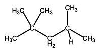
        
        \[Figure 2\]
        
    3.  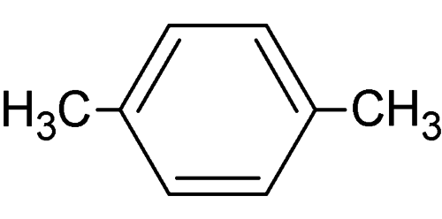
        
        \[Figure 3\]
        
    4.  
        
        \[Figure 4\]
        

**Lesson Objective: Describe, name, and draw structures for straight-chain and branched alkanes.**

_Multiple Choice_

10. All of the following except one are ways to depict organic molecules
    1.  ball-and-stick
    2.  orbital-filling
    3.  structural
    4.  space-filling

11. The molecule with the structure CH3CH2CH2CH2CH3 is named
    1.  ethane
    2.  heptane
    3.  butane
    4.  pentane

12. In naming branched-chain hydrocarbons, the first step is to
    1.  identify the substituents
    2.  find the longest chain
    3.  number the carbon atoms
    4.  list substituents in alphabetical order

_True/False_

13. \_\_\_\_\_ A chain with nine carbons is named nonane.
14. \_\_\_\_\_ The name 6-methyl-5-chloro-3-ethyldecane follows the IUPAC nomenclature rules.
15. \_\_\_\_\_ The –ethyl substituent in the compound above is called an alkyl group.

_Fill in the Blank_

16. Name the following compounds:
    1.  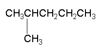
        
        \[Figure 5\]
        
    2.  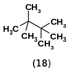
        
        \[Figure 6\]
        
    3.  CH3CH2CH2CH2CH2CH2CH2CH2CH2CH3
17. Draw the structures for the following compounds:
    1.  heptane
    2.  2,2-dimethylhexane
    3.  2,3,3-trimethylpentane

**Lesson Objective: Differentiate between saturated and unsaturated hydrocarbons.**

_Multiple Choice_

18. An unsaturated hydrocarbon contains less than the maximum number of
    1.  carbon atoms
    2.  hydrogen atoms
    3.  halogen atoms
    4.  oxygen atoms

_True/False_

19. \_\_\_\_\_ Carbon atoms in double bonds display trigonal planar geometry.

_Fill in the Blank_

20. Identify the unsaturated compounds below:
    1.  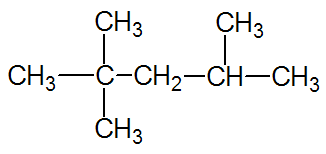
        
        \[Figure 7\]
        
    2.  
        
        \[Figure 8\]
        
    3.  
        
        \[Figure 9\]
        

**Lesson Objective: Describe alkenes and alkynes.**

_Multiple Choice_

21. Alkynes with one triple bond have the general formula
    1.  CnH2n-2
    2.  CnH2n+2
    3.  CnH2n
    4.  CnH2n-1

_True/False_

22. \_\_\_\_\_ Carbon atoms in triple bonds are sp_2_ hybridized.

_Fill in the Blank_

23. Draw the structure of 4-methyl-1-pentene
24. Draw the structure of 2-butyne

**Lesson Objective: Describe the characteristics of structural isomers, geometric isomers, and optical isomers.**

_Multiple Choice_

25. Geometric isomers have
    1.  different molecular formulas
    2.  different structural formulas
    3.  different three-dimensional configurations
    4.  numbers of carbons

26. Optical isomers are
    1.  mirror images
    2.  non-superimposable images
    3.  non-superimposable mirror images
    4.  superimposable mirror images

_True/False_

27. \_\_\_\_\_ Simple alkynes have geometric isomers.
28. \_\_\_\_\_ The physical and chemical properties of geometric isomers are usually different.

_Fill in the Blank_

29. Identify the isomers as cis or trans for the structures below:
    1.  
        
        \[Figure 10\]
        
    2.  
        
        \[Figure 11\]
        
    3.  
        
        \[Figure 12\]
        
    4.  
        
        \[Figure 13\]
        
30. Would the following structure be classified as cis or trans? Explain your answer.

31. At one time in history, it was thought that only living things were capable of synthesizing the carbon-containing compounds present in cells. For that reason, the term organic was applied to those compounds. Eventually, it was proven that carbon-containing compounds could be synthesized from inorganic substances, but the term organic has remained.
    
    Is the category of organic chemistry a useful one?
    

_Critical Writing_

32. Silicon is directly below carbon on the periodic table and has a similar outer-shell electron configuration. Science-fiction writers have sometimes speculated about silicon-based life forms where silicon replaces carbon. Comment on this idea.

</article>

### 25.2 Hydrocarbon Rings

<article>

Worksheet
---------

**Name \_\_\_\_\_\_\_\_\_\_\_\_\_\_\_\_\_\_\_\_\_ Class \_\_\_\_\_\_\_\_\_\_\_\_\_\_\_\_\_\_\_\_\_\_ Date \_\_\_\_\_\_\_\_\_\_\_\_\_\_\_\_**

**Lesson Objective: Describe and name cyclic hydrocarbons.**

_Multiple Choice_

1.  The smallest cyclic hydrocarbon is
    1.  cyclohexane
    2.  cyclopropane
    3.  cycloethane
    4.  cyclobutane

2.  The bond angles for cyclobutane are
    1.  60°
    2.  108°
    3.  109.5°
    4.  90°

3.  The carbon atoms in cycloalkanes are \_\_\_\_\_ hybridized
    1.  sp
    2.  sp_2_
    3.  sp_3_
    4.  sp_4_

_True/False_

4.  \_\_\_\_\_ Cyclic hydrocarbons can be represented by shape.
5.  \_\_\_\_\_ Cycloalkanes have the general formula CnH2n+2
6.  \_\_\_\_\_ The most common cycloalkanes have five or six carbons.

_Fill in the Blank_

7.  Define the following terms:
    1.  cyclic hydrocarbon
    2.  cycloalkene

8.  Which of the following are cycloalkanes?
    1.  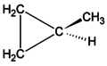
        
        \[Figure 1\]
        
    2.  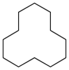
        
        \[Figure 2\]
        
    3.  
        
        \[Figure 3\]
        
    4.  
        
        \[Figure 4\]
        
9.  Name the following cycloalkanes:
    1.  
        
        \[Figure 5\]
        
    2.  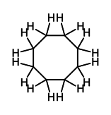
        
        \[Figure 6\]
        

**Explain how ring strain contributes to the shape of cyclic hydrocarbons. Describe the two primary conformations of cyclohexane.**

_Multiple Choice_

10. The ideal bond angle for carbon is
    1.  90°
    2.  108°
    3.  109.5°
    4.  108.5°

11. The most stable ring structure is
    1.  cyclohexane
    2.  cyclopentane
    3.  cycloheptane
    4.  cyclopropane

_True/False_

12. \_\_\_\_\_ The boat form of cyclohexane is the preferred conformation.
13. \_\_\_\_\_ The two cyclohexane conformations interconvert readily.

_Fill in the Blank_

14. In which cyclohexane conformations are there fewer repulsive interactions between hydrogen atoms? Why is this important?
15. Identify the cyclohexane conformation below:

_Multiple Choice_

16. Electrons in the benzene ring are
    1.  decoupled
    2.  debonded
    3.  delocalized
    4.  delocated

17. The true bonding between carbons in benzene is
    1.  single bonds
    2.  intermediate between single and double bonds
    3.  double bonds
    4.  moveable bonds

_True/False_

18. \_\_\_\_\_ Pi bonding electrons in benzene are fixed in space.
19. \_\_\_\_\_ Benzene is less reactive than straight-chain hexenes.

_Fill in the Blank_

20. Draw two resonance structures for benzene.
21. Draw a structure showing the pi electrons in benzene and explain why this structure allows delocalization.

**Lesson Objective: Name and write structural formulas for substituted benzene compounds.**

_Multiple Choice_

22. Substituents in adjacent carbons in a benzene ring can be called
    1.  ortho
    2.  para
    3.  meta
    4.  dimet

23. All of the following are naming rules for benzene derivatives except
    1.  substituents in alphabetical order
    2.  number the ring counterclockwise
    3.  use the lowest number first
    4.  separate numbers with commas

24. The –NO2 group is called
    1.  amino
    2.  nitrous
    3.  nitro
    4.  nitrogen dioxide

_True/False_

25. \_\_\_\_\_ There are six carbons in a benzene ring.
26. \_\_\_\_\_ Halogens do not add to benzene rings.
27. \_\_\_\_\_ If there are two amino groups on a benzene ring, the terminology would be diamino.

_Fill in the Blank_

28. Name the following compounds:
    1.  
        
        \[Figure 8\]
        
    2.  
        
        \[Figure 9\]
        
    3.  
        
        \[Figure 10\]
        
29. Draw structures for the following compounds:
    1.  1-bromo-4-chlorobenzene
    2.  ethylbenzene
    3.  m-difluorobenzene

_Critical Reading_

30. Benzene is the parent compound of a large family of organic molecules known as aromatic compounds. Although benzene was discovered in 1826, it was many years before its structure was fully understood. In 1895, German chemist August Kekulé (1829-1896) realized that the benzene molecule could be best represented by a six-membered carbon ring with one hydrogen atom attached to each of the carbon atoms. Unlike cyclohexane, benzene is unsaturated; each carbon atom participates in one double bond.
    
    Why would it be difficult to deduce the structure of benzene?
    

_Critical Writing_

31. There are many tales in the scientific literature about how Kekulé developed his ideas about the benzene ring structure by having a dream in which a snake swallowed its own tail. How would this dream have helped Kekulé come up with his proposal?

</article>

### 25.3 Functional Groups

<article>

Worksheet
---------

**Name \_\_\_\_\_\_\_\_\_\_\_\_\_\_\_\_\_\_\_\_\_ Class \_\_\_\_\_\_\_\_\_\_\_\_\_\_\_\_\_\_\_\_\_\_ Date \_\_\_\_\_\_\_\_\_\_\_\_\_\_\_\_**

_Answer each of the questions below to show your achievement of the lesson objectives_

**Lesson Objective: Define a functional group and explain the importance of functional groups to organic chemistry.**

_Multiple Choice_

1.  Knowledge of functional groups is useful for all the following reasons except
    1.  same type of reaction for all members of the functional group
    2.  consistency in naming
    3.  all reactions run under same conditions
    4.  similar properties based on functional group

_True/False_

2.  \_\_\_\_\_ Knowing the functional group allows prediction of reaction behavior.

_Fill in the Blank_

3.  Define functional group.

**Lesson Objective: Be able to identify the following functional groups in an organic molecule: alkyl halide, alcohol, ether, aldehyde, ketone, carboxylic acid, ester, and amine.**

_Multiple Choice_

4.  The general formula for an alkyl halide is
    1.  R-Hal
    2.  R-X
    3.  R-Cl
    4.  R-Y

5.  The generic formula for an ether is
    1.  R-O-R
    2.  R-O-O-R
    3.  R-O-R’
    4.  R-R’-O

6.  Alcohols all have a
    1.  hydroxide group
    2.  hydroxyl group
    3.  hydroxide anion
    4.  hydroxyl anion

_True/False_

7.  \_\_\_\_\_ Aldehydes have a carboxyl group on the end of the carbon chain.
8.  \_\_\_\_\_ The carboxyl group can ionize to form a carboxylate anion.
9.  \_\_\_\_\_ Esters contain an ether structure.

_Fill in the Blank_

10. Indicate the type of functional group seen in each of the following compounds:
    1.  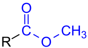
        
        \[Figure 1\]
        
    2.  
        
        \[Figure 2\]
        
    3.  
        
        \[Figure 3\]
        
    4.  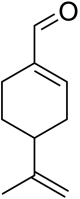
        
        \[Figure 4\]
        
11. Draw the following functional groups:
    1.  alcohol
    2.  ether
    3.  carboxylic acid
    4.  alkyl halide

**Lesson Objective: Know how to name simple molecules containing one of the basic functional groups listed above.**

_Multiple Choice_

12. A secondary alcohol has \_\_\_\_ R group(s) attached to the C-OH carbon
    1.  two
    2.  three
    3.  one
    4.  four

13. For alkyl halides containing more than one type of halogen, the substituents are listed by
    1.  lowest number first
    2.  order in periodic table
    3.  alphabetical order
    4.  increasing atomic mass

14. The ending for aldehyde names is
    1.  aldehyde
    2.  al
    3.  ol
    4.  carbonyl

_True/False_

15. \_\_\_\_\_ The ending for names of carboxylic acid is –oic.
16. \_\_\_\_\_ The carboxylic acid portion of an ester name comes first.
17. \_\_\_\_\_ A primary amine has two hydrogens attached to the N atom.

_Fill in the Blank_

18. Name the following compounds:
    1.  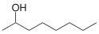
        
        \[Figure 5\]
        
    2.  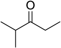
        
        \[Figure 6\]
        
    3.  
        
        \[Figure 7\]
        
19. Draw structures for the following compounds:
    1.  pentanoic acid
    2.  1-chloro-4-octanone
    3.  propyl hexanoate

**Lesson Objective: Relate the properties of organic compounds to their structures and the functional groups that they contain, and describe the uses of some of these compounds.**

_Multiple Choice_

20. Ethylene glycol is commonly used as
    1.  antifreeze
    2.  antiseptic
    3.  moistening agent
    4.  hand sanitizer

21. Aldehydes and ketones interact with water through
    1.  strong H bonds
    2.  dispersion forces
    3.  weak hydrogen bonds
    4.  ion-dipole interactions

22. Benzoic acid is used as
    1.  food flavoring
    2.  food preservative
    3.  paint manufacture
    4.  production of adhesives

_True/False_

23. \_\_\_\_\_Esters are responsible for many odors and flavors.
24. \_\_\_\_\_ Amines do not form hydrogen bonds with water.
25. \_\_\_\_\_ Ethers have much lower boiling points than the corresponding alcohols.

_Fill in the Blank_

26. Fill in the following table:
27. | **Class of Compound** | **Hydrogen Bonding** | **Principal Uses** |
    | --- | --- | --- |
    | alkyl halides |     |     |
    | alcohols |     |     |
    | esters |     |     |
    | carboxylic acids |     |     |
    

_Critical Reading_

27. A functional group is an atom or group of atoms that is primarily responsible for the properties and reactivity of a given organic compound. A given functional group undergoes the same type of reactions in every molecule in which it is found. In this lesson, we will give an overview of several major functional groups, concentrating on the structure, nomenclature, and general properties of compounds that contain each group.
    
    How do functional groups simplify organization of information in organic chemistry?
    

_Critical Writing_

28. Why is ozone depletion a significant problem?

</article>

### 25.4 Organic Reactions

<article>

Worksheet
---------

**Name \_\_\_\_\_\_\_\_\_\_\_\_\_\_\_\_\_\_\_\_\_ Class \_\_\_\_\_\_\_\_\_\_\_\_\_\_\_\_\_\_\_\_\_\_ Date \_\_\_\_\_\_\_\_\_\_\_\_\_\_\_\_**

**Describe and distinguish between substitution reactions and addition reactions, and give examples of each.**

_Multiple Choice_

1.  In a chlorine-containing hydrocarbon, the chlorine can be replaced by
    1.  H
    2.  F
    3.  Br
    4.  I

2.  Hydrogen replacement on benzene by a halogen requires
    1.  high temperatures
    2.  high pressures
    3.  iron catalyst
    4.  magnesium catalyst

3.  Addition reactions take place on
    1.  cyclic compounds
    2.  saturated compounds
    3.  amine compounds
    4.  unsaturated compounds

_True/False_

4.  \_\_\_\_\_ Water can be added to an alkene to form an aldehyde.
5.  \_\_\_\_\_ Addition of Br can be used to detect the presence of an unsaturated compound.
6.  \_\_\_\_\_ AlCl3 is a catalyst for adding alkyl groups to benzene rings.

_Fill in the Blank_

7.  Define the following terms
    1.  substitution reaction
    2.  addition reaction
    3.  hydrogenation
    4.  hydration reaction

8.  Complete the following reactions:
    1.  $CH_3CH_2CH=CH + HBr \rightarrow ?$
    2.  $CH_3CH_2CH_2Cl + \text{benzene} \overset{AlCl_3}{\rightarrow} ?$
    3.  $? + \text{water} \rightarrow CH_3CH_2CH_2OH$

**Lesson Objective: Relate the concepts of oxidation and reduction to organic reactions.**

_Multiple Choice_

9.  When heated in the presence of an appropriate catalyst, an alkane is
    1.  reduced to form an alkene
    2.  oxidized to form an alkene
    3.  reduced to form an alkyne
    4.  oxidize to form an alkyne

10. The oxidation of a tertiary alcohol yields
    1.  a ketone
    2.  no reaction
    3.  an aldehyde
    4.  a secondary alcohol

_True/False_

11. \_\_\_\_\_ Oxidation involves the addition of oxygen or the removal of hydrogen.
12. \_\_\_\_\_ Oxidation of a primary alcohol produces a ketone.

_Fill in the Blank_

13. Oxidation of ethanol will produce \_\_\_\_\_\_\_.
14. Complete the following reactions:
    1.  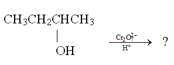
        
        \[Figure 1\]
        
    2.  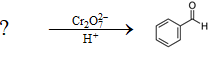
        
        \[Figure 2\]
        
    3.  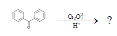
        
        \[Figure 3\]
        

**Lesson Objective: Describe and give examples of condensation reactions, including esterification.**

_Multiple Choice_

15. One of the molecules often removed in a condensation reaction is
    1.  CO2
    2.  NH3
    3.  H2O
    4.  O2

16. The reaction between two amino acids forms a compound known as a
    1.  monopeptide
    2.  dipeptide
    3.  tripeptide
    4.  protein

_True/False_

17. \_\_\_\_\_ An ester is formed from a reaction between an alcohol and an acid.
18. \_\_\_\_\_ When heated with a strong acid, the ester breaks down.

_Fill in the Blank_

19. Define saponification.
20. Draw the structure of the compound formed when propanol and acetic acid react.
21. What compounds react to form butyl decanoate?

**Lesson Objective: Define “polymer,” and describe how polymers are formed by an addition reaction or by a condensation reaction.**

_Multiple Choice_

22. The small units that make up a polymer are called
    1.  monoamines
    2.  monomols
    3.  monomers
    4.  monopols

23. Which one of the following is not a synthetic polymer?
    1.  polypropylene
    2.  polystyrene
    3.  polyisoprene
    4.  polymonamine

24. Nylon-66 is made up of hexanediamine and
    1.  adipic acid
    2.  adoipic acid
    3.  edipic acid
    4.  aminic acid

_True/False_

25. \_\_\_\_\_ Monomers of addition polymers contain double bonds.
26. \_\_\_\_\_ Polyisoprene is a polymer of isoprenoic acid.
27. \_\_\_\_\_ Monomers of condensation polymers need two functional groups.

_Fill in the Blank_

28. Define the following:
    1.  addition polymer
    2.  condensation polymer

29. List one use of each of the following polymers:
    1.  polyethylene
    2.  polyvinyl chloride
    3.  polyethylene terephthalate

_Critical Reading_

30. Vegetable oils consist of long carbon chains with carboxyl groups on the end; these molecules are referred to as fatty acids. The carbon chains of the fatty acids in vegetable oils are unsaturated, usually containing multiple double bonds. When hydrogen gas is blown through a sample of the oil, hydrogen atoms add across the double bonds. This conversion changes the substance from a liquid oil into a solid fat. The word “hydrogenated” on a food product is an indication that oil has been converted into fat by this process. Margarine is manufactured from unsaturated vegetable oil in this way.
    
    Why would hydrogenation of vegetable oils be useful?
    

_Critical Writing_

31. An amino acid has both an amine end and a carboxylic acid end. If reacted in the lab, both ends can form polymers in random fashion. How does the cell form an orderly protein with the amino acids in proper sequence?

</article>

## 26.0 Biochemistry Worksheets

<article>

</article>

### 26.1 Carbohydrates

<article>

Worksheet
---------

**Name \_\_\_\_\_\_\_\_\_\_\_\_\_\_\_\_\_\_\_\_\_ Class \_\_\_\_\_\_\_\_\_\_\_\_\_\_\_\_\_\_\_\_\_\_ Date \_\_\_\_\_\_\_\_\_\_\_\_\_\_\_\_**

_Answer each of the questions below to show your achievement of the lesson objectives_

_Multiple Choice_

1.  The empirical formula for most carbohydrates is
    1.  CHO
    2.  C2HO
    3.  CH2O
    4.  CHO2
2.  Glucose and fructose are known as
    1.  simple saccharides
    2.  monosaccharides
    3.  minisaccharides
    4.  minor saccharides
3.  When glucose forms a cyclic compound the \_\_\_\_\_\_\_ group is no longer present.
    1.  hydroxyl
    2.  alcohol
    3.  ketone
    4.  aldehyde

_True/False_

4.  \_\_\_\_\_ Glucose and fructose are hydrates of carbon.
5.  \_\_\_\_\_ Fructose is found in fruits and honey.
6.  \_\_\_\_\_ The straight-chain form of fructose is a ketone.

_Fill in the Blank_

7.  Define the following terms:
    1.  carbohydrate
    2.  monosaccharide
8.  Describe the orientation of the –OH groups in the ring structures of glucose and fructose.

**Lesson Objective: Describe how two simple sugars can be linked to form a disaccharide.**

_Multiple Choice_

9.  Two monosaccharides can form a disaccharide by way of a
    1.  addition reaction
    2.  oxidation reaction
    3.  condensation reaction
    4.  substitution reaction
10. When glucose and fructose combine, \_\_\_\_\_ is eliminated.
    1.  CO2
    2.  H2O
    3.  H2
    4.  O2

_True/False_

11. \_\_\_\_\_ Glucose and fructose combine to form sucrose.
12. \_\_\_\_\_ The open-chain structures combine in the formation of a disaccharide.

_Fill in the Blank_

13. Sucrose is commonly known as \_\_\_\_\_\_ \_\_\_\_\_\_\_\_ .
14. Which carbons of glucose and fructose are connected to form the disaccharide?

**Lesson Objective: Compare the simple sugar components of sucrose, lactose, and maltose.**

_Multiple Choice_

15. Sucrose is made up of the monosaccharides
    1.  glucose + galactose
    2.  glucose + maltose
    3.  glucose + fructose
    4.  glucose + ribose
16. Lactose is made up of the monosaccharides
    1.  glucose + galactose
    2.  glucose + maltose
    3.  glucose + fructose
    4.  glucose + ribose

_True/False_

17. \_\_\_\_\_ Maltose is composed of two fructose monomers.
18. \_\_\_\_\_ Lactose is often referred to as milk sugar.

_Fill in the Blank_

19. Define disaccharide.
20. What do all three disaccharides have in common?

**Lesson Objective: Identify the structure and function of the polysaccharides starch, glycogen, and cellulose.**

_Multiple Choice_

21. Amylopectin is the branched form of
    1.  starch
    2.  cellulose
    3.  glycogen
    4.  amylose
22. Glycogen is a highly branched polysaccharide made of \_\_\_\_\_\_\_ monomers.
    1.  fructose
    2.  glucose
    3.  galactose
    4.  lactose
23. Cellulose is only digestible by
    1.  humans
    2.  animals
    3.  microorganisms
    4.  cattle

_True/False_

24. \_\_\_\_\_ Starch is found in corn and wheat.
25. \_\_\_\_\_ Starch is composed of galactose monomers.
26. \_\_\_\_\_ Termites digest cellulose.

_Fill in the Blank_

27. Define polysaccharide.
28. Identify each of the following structures:
    1.  
        
        \[Figure 1\]
        
    2.  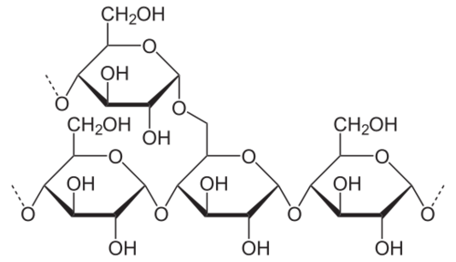
        
        \[Figure 2\]
        
    3.  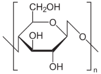
        
        \[Figure 3\]
        

_Critical Reading_

29. Carbohydrates constitute a class of compounds that serves many functions in living organisms. Among the most important is the storage of energy in the form of starch and glycogen.
    
    Why is it important for the body to store energy?
    

_Critical Writing_

30. The term “glucose” comes from a Latin word meaning “sweet wine”. Fructose is named after a Latin word meaning “fruit”. Lactose derives from the Latin for “milk”. Why do these names accurately describe each carbohydrate?

</article>

### 26.2 Amino Acids and Proteins

<article>

Worksheet
---------

**Name \_\_\_\_\_\_\_\_\_\_\_\_\_\_\_\_\_\_\_\_\_ Class \_\_\_\_\_\_\_\_\_\_\_\_\_\_\_\_\_\_\_\_\_\_ Date \_\_\_\_\_\_\_\_\_\_\_\_\_\_\_\_**

_Answer each of the questions below to show your achievement of the lesson objectives_

**Lesson Objective: Describe the general structure of an amino acid.**

_Multiple Choice_

1.  Amino acids contain all of the following except
    1.  amino group
    2.  halogen
    3.  carboxyl group
    4.  hydrogen
2.  All of the following statements about the amino acid R group are true except
    1.  has the same structure for all amino acids
    2.  varies from one amino acid to another
    3.  some contain aliphatic structures
    4.  some contain aromatic structures

_True/False_

3.  \_\_\_\_\_ The R group is referred to as a side chain.
4.  \_\_\_\_\_ There are 15 amino acids associated with living organisms.

_Fill in the Blank_

5.  Define amino acid.
6.  Draw the structure of the generic amino acid molecule.

_Multiple Choice_

7.  The abbreviation for the amino acids asparagine is
    1.  Ala
    2.  Asp
    3.  Asn
    4.  Arg
8.  The R group for lysine is
    1.  basic
    2.  acidic
    3.  non-polar
    4.  aromatic

_True/False_

9.  \_\_\_\_\_ The side chain for aspartic acid is a carboxyl group.
10. \_\_\_\_\_ The side chain for alanine is a propyl group.

_Fill in the Blank_

11. List the names and abbreviations for the twenty amino acids in this chapter.

**Lesson Objective: Describe how a peptide bond forms.**

_Multiple Choice_

12. A peptide bond is another name for
    1.  amine bond
    2.  amide bond
    3.  amino bond
    4.  amido bond
13. Amino acid sequences are written using all the following rules except
    1.  free amino group on the left
    2.  free carboxyl group on the right
    3.  free amino group on the right
    4.  amino acids listed in order

_True/False_

14. \_\_\_\_\_ Peptide bond formation is independent of R groups.
15. \_\_\_\_\_ His-Tyr indicates a dipeptide of histidine and tryptophan.

_Fill in the Blank_

16. Use the structures for cysteine and glycine below, draw the structure for cys-gly:

Cysteine:

17. Indicate the peptide bond in the following compound

**Lesson Objective: Define a protein and differentiate between the four levels of structure of a protein.**

_Multiple Choice_

19. A polypeptide is
    1.  an amino acid sequence with five components or less
    2.  any amino chain greater than four amino acids in length
    3.  a sequence of ten or more amino acids
    4.  a sequence of five or more amino acids
20. One of the following is an example of secondary structure.
    1.  alpha sheet
    2.  beta helix
    3.  gamma fold
    4.  alpha helix

_True/False_

21. \_\_\_\_\_ Hydrogen bonding plays an important role in protein secondary structure.
22. \_\_\_\_\_ Hemoglobin is composed of four subunits.

_Fill in the Blank_

23. Define
    1.  primary structure
    2.  secondary structure
    3.  tertiary structure
    4.  quaternary structure
24. Name the level of protein structure illustrated by the following:
    1.  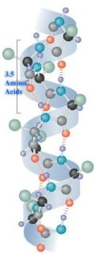
    2.  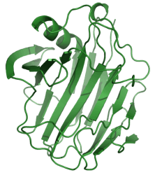
    3.  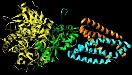

**Lesson Objective: Describe the effect of an enzyme on a biochemical reaction and the general features of its reaction with a substrate.**

_Multiple Choice_

25. All of the following can function as cofactors for enzymes except
    1.  iron
    2.  vitamin B
    3.  cyanide
    4.  magnesium
26. The first enzyme to be discovered was
    1.  urease
    2.  uricase
    3.  urase
    4.  uramase

_True/False_

27. \_\_\_\_\_ Chemical reactions in cells are catalyzed by enzymes.
28. \_\_\_\_\_ The shape of the substrate does not affect active site binding.

_Fill in the Blank_

29. Define the following:
    1.  enzyme
    2.  substrate
    3.  active site
    4.  inhibitor
30. Describe the sequence of events that occur in an enzyme-catalyzed reaction.
31. Ethylene glycol is the major ingredient in antifreeze. Ingestion of ethylene glycol can be hazardous due to its conversion to toxic products by a specific enzyme in the liver. One of the common antidotes is administration of ethanol. Given the structure of the two compounds below, explain why ethanol is used to treat ethylene glycol poisoning.

Ethylene glycol:

32. The wide array of chemical, physiological, and structural properties exhibited by different proteins is a function of their amino acid sequences. Because proteins are so large, the number of possible amino acid sequences is virtually limitless. For example, even a "small" protein that is only 90 amino acids long could have 20_90_ = 1.24\*10_117_ possible sequences. To put this number in perspective, the entire universe is estimated to contain about 10_80_\-10_82_atoms.
    
    What might happen if the amino acids for a specific protein are assembled in the wrong order?
    

_Critical Writing_

33. In the test tube, a reaction between two amino acids can form two different products: (a) amino group of acid one combines with carboxyl group of acid two and (b) carboxyl group of acid one combines with amino group of acid two. In addition, some of the amino acid side chains are either amino groups or carboxyl groups. What guarantees that only the proper reaction occurs

&nbsp;

</article>

### 26.3 Lipids

<article>

Worksheet
---------

**Name \_\_\_\_\_\_\_\_\_\_\_\_\_\_\_\_\_\_\_\_\_ Class \_\_\_\_\_\_\_\_\_\_\_\_\_\_\_\_\_\_\_\_\_\_ Date \_\_\_\_\_\_\_\_\_\_\_\_\_\_\_\_**

_Answer each of the questions below to show your achievement of the lesson objectives_

**Lesson Objective: Describe the structure of a triglyceride.**

_Multiple Choice_

1.  Which one of the following is not a lipid?
    1.  oil
    2.  fat
    3.  starch
    4.  wax
2.  Glycerol is a
    1.  triol
    2.  trialcohol
    3.  trione
    4.  trialdehyde
3.  A fatty acid is \_\_\_\_\_\_\_ carbons in length
    1.  5-8
    2.  12-24
    3.  15-30
    4.  9-15

_True/False_

4.  \_\_\_\_\_ Fatty acids are very water-soluble.
5.  \_\_\_\_\_ Canola oil is obtained from plants.
6.  \_\_\_\_\_ Triglycerides contain three fatty acids.

_Fill in the Blank_

7.  Define the following terms:
    1.  lipid
    2.  triglyceride
8.  Why are triglycerides not water-soluble?
9.  What type of intermolecular interactions make it possible for triglycerides to dissolve in hexane?

**Lesson Objective: Distinguish between saturated and unsaturated fats.**

_Multiple Choice_

10. A fat with one double bond is called
    1.  saturated
    2.  monosaturated
    3.  monounsaturated
    4.  polyunsaturated
11. Food containing high amounts of saturated fats include
    1.  nuts
    2.  avocado
    3.  olive oil
    4.  cheese

_True/False_

12. \_\_\_\_\_ A saturated fat has no carbon-carbon double bonds.
13. \_\_\_\_\_ Almonds contain over 60% polyunsaturated fat.

_Fill in the Blank_

14. Which of the foods and oils listed in the lesson has the highest amount of saturated fat?
15. Are the double bonds in the oleic and linoleic acids structures shown in the lesson cis or trans double bonds?

**Lesson Objective: Describe the structure of a phospholipid and a lipid bilayer.**

_Multiple Choice_

16. The phosphate group in a phospholipid
    1.  provides biochemical energy to the body
    2.  helps the phospholipid dissolve in water
    3.  helps repel water
    4.  interacts with the hydrophobic tail
17. The hydrophobic tail can be any of the following except
    1.  long chain saturated fatty acid
    2.  monounsaturated fatty acid
    3.  saturated fatty protein
    4.  polyunsaturated fatty acid.
18. The lipid bilayer allows all of the following except
    1.  repulsion of water
    2.  passage of cells
    3.  movement of ions
    4.  identification of type of cell

_True/False_

19. \_\_\_\_\_ Long hydrocarbon chains in a phospholipid are polar.
20. \_\_\_\_\_ Lipid bilayers have channels that allow passage of ions.
21. \_\_\_\_\_ Carbohydrates are attached to some membrane proteins.

_Fill in the Blank_

22. Define phospholipid.
23. What keeps the lipid bilayer intact?
24. Why are channels needed in a lipid bilayer?

**Lesson Objective: Describe the structure and properties of waxes.**

_Multiple Choice_

25. Waxes are insoluble in water due to the
    1.  long carbon chains
    2.  ester functional group
    3.  low melting point
    4.  presence of carbonyl group
26. Cetyl palmitate is found in
    1.  hair
    2.  plant leaves
    3.  sperm whale
    4.  feathers

_True/False_

27. \_\_\_\_\_ Waxes are soft solids.
28. \_\_\_\_\_ Beeswax is a natural wax.

_Fill in the Blank_

29. Define wax.
30. The structure below is beeswax. What does this structure suggest about the composition of the wax?

31. One of the best-known natural waxes is beeswax, though many other animals and plants also synthesize waxes. Waxes can be found on the leaves of plants and on the skin, hair, or feathers of animals, where they function to keep these structures pliable and waterproof. Humans take advantage of the protective properties of natural and synthetic waxes in such applications as floor polish and car wax.
    
    Why would waxes be good for waxing floors and polishing cars?
    

_Critical Writing_

32. Is wax from sperm whales in wide use today? Explain your answer.

&nbsp;

</article>

### 26.4 Nucleic Acids

<article>

Worksheet
---------

**Name \_\_\_\_\_\_\_\_\_\_\_\_\_\_\_\_\_\_\_\_\_ Class \_\_\_\_\_\_\_\_\_\_\_\_\_\_\_\_\_\_\_\_\_\_ Date \_\_\_\_\_\_\_\_\_\_\_\_\_\_\_\_**

_Answer each of the questions below to show your achievement of the lesson objectives_

**Lesson Objective: Identify the functions of DNA and RNA.**

_Multiple Choice_

1.  The major role of DNA is to
    1.  provide structure to the cell
    2.  carry genetic information
    3.  synthesize proteins
    4.  store energy for the cell
2.  The major role for RNA is to
    1.  provide structure to the cell
    2.  carry genetic information
    3.  synthesize proteins
    4.  store energy for the cell

_True/False_

3.  \_\_\_\_\_ Friedrich Miescher discovered RNA and DNA in 1869.
4.  \_\_\_\_\_ DNA and RNA are found in the cytoplasm of the cell.

_Fill in the Blank_

5.  Define nucleic acid.
6.  Why are these compounds called nucleic acids?

**Lesson Objective: Describe the structure of a single nucleotide and how that structure leads to the overall structure of DNA and RNA.**

_Multiple Choice_

7.  The carbohydrate in DNA is
    1.  glucose
    2.  deoxyglucose
    3.  ribose
    4.  deeoxyribose
8.  The carbohydrate in RNA is
    1.  glucose
    2.  deoxyglucose
    3.  ribose
    4.  deeoxyribose
9.  The phosphate group in both DNA and RNA is attached to
    1.  the terminal carbon of the carbohydrate
    2.  the ring O of the carbohydrate
    3.  the free amino group on the base
    4.  a ring N on the base
10. The bases are held together in a chain by bonds between
    1.  nitrogens in the base ring
    2.  amine groups
    3.  phosphates and the carbohydrate
    4.  carbohydrate oxygen bridges
11. Guanine and cytosine form all of the following hydrogen bonds except
    1.  between O on guanine and N-H on cytosine
    2.  between N on cytosine and N-H on guanine
    3.  between N-H on cytosine and N on guanine
    4.  between N-H on guanine and O on cytosine

_True/False_

12. \_\_\_\_\_ Cytosine has three sites for H-bonding.
13. \_\_\_\_\_ In RNA, uracil is replaced by thymine
14. \_\_\_\_\_ The bases adenine, guanine, and cytosine are found in both DNA and RNA.
15. \_\_\_\_\_ The DNA molecules consists of two chains wrapped in a double helix.
16. \_\_\_\_\_ RNA has a double-helical structure.

_Fill in the Blank_

17. Draw the structure of uracil.
18. Draw the structures of the following base pairs and indicate the hydrogen bonds that form. The carbohydrate and phosphate portions can be omitted.
    1.  guanine and cytosine
    2.  adenine and thymine
19. There are no carboxylic acids in any of the nucleotides. Why are these compounds called nucleic acids?
20. There are no –OH groups in any of the bases. Why are they called bases?

**Lesson Objective: Describe how the base sequence of DNA codes for specific amino acids during protein synthesis.**

_Multiple Choice_

21. The genetic code is a series of
    1.  three-letter codes
    2.  four-letter codes
    3.  amino acid peptides
    4.  amino acid code
22. One stop code is
    1.  TAT
    2.  TAC
    3.  TGA
    4.  TGG
23. The triplet code AGC-GGT-TGC designates the following amino acid sequence
    1.  cys-gly-ser
    2.  glyc-cys-ser
    3.  ser-cys-gly
    4.  ser-gly-cys

_True/False_

24. \_\_\_\_\_ Each triplet corresponds to a single amino acid.
25. \_\_\_\_\_ Amino acids each have one triplet that designates that amino acid.
26. \_\_\_\_\_ There are three stop codes.

_Fill in the Blank_

27. What is a gene?
28. List all the base triplets that code for the following amino acids:
    1.  serine
    2.  leucine
    3.  stop code
29. Write the amino acid sequence indicated by each of the following base sequences:
    1.  GCA-TCT-CCG-AGA-GAG
    2.  CAG-GGA-TCC-GCA-GCA

_Critical Reading_

30. Genetic material that is passed on from generation to generation carries the instructions that allow the cells of every organism to produce the specific proteins that an organism needs.
    
    What has not yet been covered in the description of protein synthesis?
    

_Critical Writing_

31. The sulfur-containing amino acid methionine has only one triplet that codes for its incorporation into a protein. Almost all the other amino acids and the stop codes have two or more triplets. What might be the reason for methionine having only one triplet code?

</article>

## 27.0 CK-12 Chemistry - Intermediate Workbook Answers

<article>

_The answer key for this workbook can be found in the **resources tab** of the table of contents for this Flexbook® at https://www.ck12.org/workbook/ck-12-chemistry-intermediate-workbook/_

</article>

